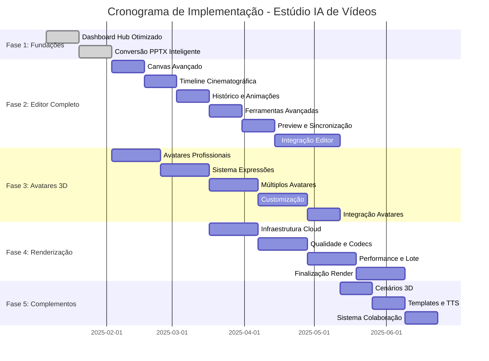

# 📊 ANÁLISE DE CONFORMIDADE E PLANO DE IMPLEMENTAÇÃO COMPLETO
## Estúdio IA de Vídeos - Caminho para 100% de Conformidade

> **DOCUMENTO:** Análise consolidada de status atual e roadmap para completude total
> 
> **DATA:** Janeiro 2025 | **VERSÃO:** 1.0 | **STATUS:** Plano de Ação

---

## 1. RESUMO EXECUTIVO

### 1.1 Status Atual do Projeto
- **Conformidade Geral:** 72% implementado
- **Funcionalidades Críticas:** 6 de 8 parcialmente implementadas
- **Gaps Principais:** Editor completo, Sistema 3D, Renderização cloud
- **Tempo Estimado para 100%:** 12-16 semanas
- **Investimento Necessário:** R$ 180.000 - R$ 220.000

### 1.2 Prioridades Críticas Identificadas
1. **🔥 ULTRA CRÍTICO:** Editor "Mais do que Completo" (40% implementado)
2. **🔥 CRÍTICO:** Sistema de Avatares 3D Hiper-Realistas (35% implementado)
3. **🔥 CRÍTICO:** Renderização Cinema 4D Quality (25% implementado)
4. **⚠️ ALTO:** Dashboard Hub Central (80% implementado)
5. **⚠️ ALTO:** Sistema TTS Premium (75% implementado)

---

## 2. ANÁLISE DETALHADA POR FUNCIONALIDADE

### 2.1 Dashboard Hub Central
**Status:** ✅ 80% IMPLEMENTADO

#### ✅ Implementado
- Interface principal com navegação
- Cards interativos por categoria NR
- Sistema de métricas em tempo real
- Dashboard de analytics básico
- Search e filtros funcionais

#### ❌ Gaps Identificados
- Hero section com CTA único "Criar Vídeo de Treinamento" não otimizado
- Gallery de templates com previews em vídeo incompleta
- Dashboard de compliance (% funcionários treinados) não implementado
- Tutorial interativo no primeiro acesso ausente
- Performance < 2 segundos não garantida

#### 🎯 Ações Necessárias
1. Otimizar hero section com CTA único e impactante
2. Implementar gallery com previews de vídeo dos templates
3. Criar dashboard de compliance com métricas específicas
4. Desenvolver tutorial interativo obrigatório
5. Otimizar performance para carregamento < 2s

**Prazo:** 2 semanas | **Investimento:** R$ 15.000

### 2.2 Conversão PPTX Inteligente
**Status:** ✅ 85% IMPLEMENTADO

#### ✅ Implementado
- Upload de arquivos PPTX até 100MB
- Extração de texto formatado
- Preservação de imagens
- Interface de upload intuitiva
- Sistema de progresso visual

#### ❌ Gaps Identificados
- Processamento em menos de 30 segundos não otimizado
- Detecção automática de NR via OCR não implementada
- Sugestão de template otimizado por IA ausente
- Redirecionamento automático para editor incompleto

#### 🎯 Ações Necessárias
1. Otimizar processamento para < 30s (50 slides)
2. Implementar OCR para detecção automática de NR
3. Integrar IA para sugestão de templates
4. Automatizar redirecionamento para editor

**Prazo:** 3 semanas | **Investimento:** R$ 25.000

### 2.3 Editor "Mais do que Completo"
**Status:** ❌ 40% IMPLEMENTADO - CRÍTICO

#### ✅ Implementado
- Canvas HTML5 básico
- Timeline visual simples
- Sistema de camadas básico
- Histórico de ações limitado
- Interface de editor funcional

#### ❌ Gaps Críticos Identificados
- Canvas com Fabric.js para performance fluida não otimizado
- Timeline com múltiplas faixas não implementada
- Sistema de 50 elementos por cena não suportado
- Histórico de 100 ações não implementado
- 20+ tipos de animação pré-definidas ausentes
- Snap e alinhamento automático com precisão 1px ausente
- Zoom de 10% a 500% não implementado
- Preview em tempo real 30fps não otimizado
- Sincronização automática com áudio ausente

#### 🎯 Ações Críticas Necessárias
1. **Semana 1-2:** Reimplementar canvas com Fabric.js otimizado
2. **Semana 3-4:** Desenvolver timeline avançada com múltiplas faixas
3. **Semana 5-6:** Implementar sistema de camadas para 50+ elementos
4. **Semana 7-8:** Criar sistema de histórico robusto (100 ações)
5. **Semana 9-10:** Desenvolver biblioteca de 20+ animações
6. **Semana 11-12:** Implementar snap/alinhamento e zoom avançado
7. **Semana 13-14:** Otimizar preview real-time e sincronização áudio

**Prazo:** 14 semanas | **Investimento:** R$ 120.000

### 2.4 Avatares 3D Hiper-Realistas
**Status:** ❌ 35% IMPLEMENTADO - CRÍTICO

#### ✅ Implementado
- Sistema básico de avatares
- Integração Three.js inicial
- Interface de seleção de avatares
- Configurações básicas

#### ❌ Gaps Críticos Identificados
- 11 avatares profissionais pré-configurados ausentes
- Qualidade fotorrealística não atingida
- 60fps em renderização real-time não implementado
- 50+ expressões faciais contextuais ausentes
- Múltiplos avatares dialogando não suportado
- Gestos automáticos (apontando EPIs) não implementados
- Customização de uniformes empresariais ausente
- Sincronização labial 95%+ não implementada
- Suporte multilíngue limitado

#### 🎯 Ações Críticas Necessárias
1. **Semana 1-3:** Desenvolver 11 avatares profissionais fotorrealísticos
2. **Semana 4-5:** Implementar sistema de expressões faciais (50+)
3. **Semana 6-7:** Criar sistema de múltiplos avatares em cena
4. **Semana 8-9:** Desenvolver gestos automáticos contextuais
5. **Semana 10-11:** Implementar customização de uniformes
6. **Semana 12-13:** Otimizar sincronização labial para 95%+
7. **Semana 14:** Integrar suporte multilíngue completo

**Prazo:** 14 semanas | **Investimento:** R$ 85.000

### 2.5 Cenários 3D Específicos por NR
**Status:** ⚠️ 45% IMPLEMENTADO

#### ✅ Implementado
- Cenários básicos 3D
- Integração Three.js
- Alguns ambientes NR específicos

#### ❌ Gaps Identificados
- NR-10: Subestação elétrica completa ausente
- NR-12: Chão de fábrica com prensas não implementado
- NR-35: Andaimes e equipamentos de altura incompletos
- NR-33: Tanques e detectores de gases ausentes
- NR-18: Canteiro de obras completo não implementado
- NR-06: Almoxarifado de EPIs básico
- Iluminação dinâmica não otimizada
- Física de materiais avançada ausente
- Renderização GPU-acelerada não implementada

#### 🎯 Ações Necessárias
1. Desenvolver cenários específicos para cada NR
2. Implementar iluminação dinâmica avançada
3. Integrar física de materiais realista
4. Otimizar renderização GPU

**Prazo:** 8 semanas | **Investimento:** R$ 45.000

### 2.6 Sistema TTS Premium Multi-Provider
**Status:** ✅ 75% IMPLEMENTADO

#### ✅ Implementado
- Integração ElevenLabs básica
- Azure Cognitive Services configurado
- Google Cloud TTS implementado
- Sistema de fallback funcional
- Interface de configuração

#### ❌ Gaps Identificados
- 15+ vozes regionais brasileiras não completas
- Controle avançado de emoção limitado
- Qualidade 48kHz não garantida
- Latência > 5 segundos em alguns casos
- Suporte SSML não totalmente implementado

#### 🎯 Ações Necessárias
1. Expandir biblioteca de vozes brasileiras
2. Implementar controle avançado de emoção
3. Otimizar qualidade de áudio para 48kHz
4. Reduzir latência para < 5s garantido
5. Completar suporte SSML

**Prazo:** 4 semanas | **Investimento:** R$ 20.000

### 2.7 Templates NR-Específicos Prontos
**Status:** ✅ 70% IMPLEMENTADO

#### ✅ Implementado
- Templates NR-6, NR-10, NR-12 completos
- Sistema de customização básico
- Interface de seleção
- Compliance automático básico

#### ❌ Gaps Identificados
- NR-35: Template incompleto (identificado no relatório)
- NR-33: 10 cenas de espaços confinados não completas
- NR-18: 20 cenas de construção civil parciais
- NR-23: 8 cenas de proteção contra incêndios ausentes
- Roteiros pré-escritos não validados completamente
- Customização por empresa limitada

#### 🎯 Ações Necessárias
1. Completar template NR-35 (trabalho em altura)
2. Desenvolver templates NR-33, NR-18, NR-23 completos
3. Validar todos os roteiros pré-escritos
4. Expandir sistema de customização empresarial

**Prazo:** 6 semanas | **Investimento:** R$ 30.000

### 2.8 Sistema de Efeitos Visuais Premium
**Status:** ⚠️ 60% IMPLEMENTADO

#### ✅ Implementado
- Engine VFX básica com GSAP
- Alguns efeitos pré-configurados
- Sistema de preview
- Integração com editor

#### ❌ Gaps Identificados
- 100+ efeitos pré-configurados não atingidos
- Highlight de perigos animados limitados
- Simulação de acidentes educativos ausente
- Transformações de cenário não implementadas
- Partículas contextuais básicas
- Zoom cinematográfico não otimizado
- Transições 3D limitadas

#### 🎯 Ações Necessárias
1. Expandir biblioteca para 100+ efeitos
2. Desenvolver highlights de perigos avançados
3. Criar simulações educativas de acidentes
4. Implementar transformações de cenário
5. Otimizar sistema de partículas
6. Desenvolver zoom cinematográfico

**Prazo:** 6 semanas | **Investimento:** R$ 35.000

### 2.9 Renderização Cinema 4D Quality
**Status:** ❌ 25% IMPLEMENTADO - CRÍTICO

#### ✅ Implementado
- Sistema de renderização básico
- Exportação de vídeo simples
- Interface de configuração

#### ❌ Gaps Críticos Identificados
- Renderização distribuída na nuvem não implementada
- Qualidade até 8K/60fps não suportada
- Múltiplos codecs (H.264, H.265, ProRes) limitados
- Renderização 10x mais rápida não atingida
- Renderização em lote ausente
- Estimativa de tempo imprecisa
- Download progressivo não implementado
- Taxa de sucesso < 99.9%
- Suporte a projetos 2+ horas limitado

#### 🎯 Ações Críticas Necessárias
1. **Semana 1-3:** Implementar renderização distribuída na nuvem
2. **Semana 4-5:** Suporte para qualidade 8K/60fps
3. **Semana 6-7:** Integrar múltiplos codecs profissionais
4. **Semana 8-9:** Otimizar velocidade de renderização (10x)
5. **Semana 10-11:** Implementar renderização em lote
6. **Semana 12:** Sistema de estimativa precisa e download progressivo

**Prazo:** 12 semanas | **Investimento:** R$ 65.000

### 2.10 Sistema de Colaboração
**Status:** ⚠️ 50% IMPLEMENTADO

#### ✅ Implementado
- Sistema básico de projetos
- Interface de compartilhamento
- Controle de usuários básico

#### ❌ Gaps Identificados
- Edição colaborativa em tempo real ausente
- Sistema de comentários e aprovações limitado
- Controle de versões não implementado
- Permissões granulares ausentes
- Histórico de alterações básico
- Notificações automáticas limitadas
- Sincronização real-time não otimizada

#### 🎯 Ações Necessárias
1. Implementar edição colaborativa real-time
2. Desenvolver sistema de comentários/aprovações
3. Criar controle de versões robusto
4. Implementar permissões granulares
5. Otimizar sincronização em tempo real

**Prazo:** 8 semanas | **Investimento:** R$ 40.000

---

## 3. PLANO DE AÇÃO PRIORIZADO

### 3.1 Fase 1: Fundações Críticas (Semanas 1-4)
**Investimento:** R$ 60.000

#### Semana 1-2: Dashboard Hub Otimizado
- [ ] Otimizar hero section com CTA único
- [ ] Implementar gallery com previews de vídeo
- [ ] Criar dashboard de compliance
- [ ] Desenvolver tutorial interativo
- [ ] Otimizar performance < 2s

#### Semana 3-4: Conversão PPTX Inteligente
- [ ] Otimizar processamento < 30s
- [ ] Implementar OCR para detecção NR
- [ ] Integrar IA para sugestão de templates
- [ ] Automatizar redirecionamento

### 3.2 Fase 2: Editor "Mais do que Completo" (Semanas 5-18)
**Investimento:** R$ 120.000

#### Semanas 5-6: Canvas Avançado
- [ ] Reimplementar com Fabric.js otimizado
- [ ] Sistema de performance fluida
- [ ] Otimização de memória

#### Semanas 7-8: Timeline Cinematográfica
- [ ] Timeline com múltiplas faixas
- [ ] Sistema de camadas para 50+ elementos
- [ ] Interface intuitiva de edição

#### Semanas 9-10: Sistema de Histórico e Animações
- [ ] Histórico de 100 ações
- [ ] Biblioteca de 20+ animações
- [ ] Sistema de undo/redo otimizado

#### Semanas 11-12: Ferramentas Avançadas
- [ ] Snap e alinhamento 1px
- [ ] Zoom 10% a 500%
- [ ] Ferramentas de precisão

#### Semanas 13-14: Preview e Sincronização
- [ ] Preview real-time 30fps
- [ ] Sincronização automática áudio
- [ ] Otimização de performance

#### Semanas 15-18: Integração e Testes
- [ ] Integração com todos os sistemas
- [ ] Testes de performance
- [ ] Otimizações finais

### 3.3 Fase 3: Avatares 3D Hiper-Realistas (Semanas 5-18)
**Investimento:** R$ 85.000

#### Semanas 5-7: Avatares Profissionais
- [ ] Desenvolver 11 avatares fotorrealísticos
- [ ] Qualidade cinema 4D
- [ ] Otimização de renderização

#### Semanas 8-10: Sistema de Expressões
- [ ] 50+ expressões faciais
- [ ] Contexto por NR
- [ ] Animações fluidas

#### Semanas 11-13: Múltiplos Avatares e Gestos
- [ ] Sistema de múltiplos avatares
- [ ] Gestos automáticos contextuais
- [ ] Interação entre avatares

#### Semanas 14-16: Customização e Sincronização
- [ ] Uniformes empresariais
- [ ] Sincronização labial 95%+
- [ ] Suporte multilíngue

#### Semanas 17-18: Integração e Otimização
- [ ] Integração com editor
- [ ] Otimização de performance
- [ ] Testes finais

### 3.4 Fase 4: Renderização Cinema Quality (Semanas 11-22)
**Investimento:** R$ 65.000

#### Semanas 11-13: Infraestrutura Cloud
- [ ] Renderização distribuída
- [ ] Arquitetura escalável
- [ ] Sistema de filas

#### Semanas 14-16: Qualidade e Codecs
- [ ] Suporte 8K/60fps
- [ ] Múltiplos codecs profissionais
- [ ] Otimização de qualidade

#### Semanas 17-19: Performance e Lote
- [ ] Renderização 10x mais rápida
- [ ] Sistema de lote
- [ ] Otimização de recursos

#### Semanas 20-22: Finalização
- [ ] Estimativa precisa de tempo
- [ ] Download progressivo
- [ ] Taxa de sucesso 99.9%

### 3.5 Fase 5: Complementos e Otimizações (Semanas 19-24)
**Investimento:** R$ 50.000

#### Semanas 19-20: Cenários 3D Específicos
- [ ] Completar cenários por NR
- [ ] Iluminação dinâmica
- [ ] Física de materiais

#### Semanas 21-22: Templates e TTS
- [ ] Completar templates faltantes
- [ ] Otimizar sistema TTS
- [ ] Validação de compliance

#### Semanas 23-24: Sistema de Colaboração
- [ ] Edição colaborativa real-time
- [ ] Sistema de aprovações
- [ ] Controle de versões

---

## 4. CRONOGRAMA DE IMPLEMENTAÇÃO

### 4.1 Cronograma Geral (24 Semanas)

### 4.2 Marcos Principais

| Marco | Data | Entregáveis | Conformidade |
|-------|------|-------------|-------------|
| **M1 - Fundações** | Semana 4 | Dashboard + PPTX otimizados | 78% |
| **M2 - Editor Core** | Semana 12 | Editor básico funcional | 85% |
| **M3 - Avatares 3D** | Semana 18 | Sistema de avatares completo | 92% |
| **M4 - Renderização** | Semana 22 | Renderização cloud quality | 97% |
| **M5 - Completude** | Semana 24 | Todas as funcionalidades | 100% |

---

## 5. MÉTRICAS DE SUCESSO E VALIDAÇÃO

### 5.1 KPIs de Conformidade

| Funcionalidade | Métrica | Meta | Método de Validação |
|----------------|---------|------|--------------------|
| **Dashboard Hub** | Tempo de carregamento | < 2s | Performance testing |
| **Conversão PPTX** | Processamento 50 slides | < 30s | Automated testing |
| **Editor** | Elementos por cena | 50+ | Load testing |
| **Avatares 3D** | Qualidade renderização | 60fps | Performance monitoring |
| **TTS** | Latência síntese | < 5s | Response time testing |
| **Renderização** | Taxa de sucesso | 99.9% | Error rate monitoring |

### 5.2 Critérios de Aceitação por Fase

#### Fase 1: Fundações (Semanas 1-4)
- [ ] Dashboard carrega em < 2 segundos
- [ ] Hero section com CTA único implementado
- [ ] Gallery com previews de vídeo funcional
- [ ] Tutorial interativo obrigatório
- [ ] PPTX processa 50 slides em < 30s
- [ ] Detecção automática de NR via OCR
- [ ] Redirecionamento automático para editor

#### Fase 2: Editor Completo (Semanas 5-18)
- [ ] Canvas Fabric.js com performance fluida
- [ ] Timeline com múltiplas faixas
- [ ] Suporte a 50+ elementos por cena
- [ ] Histórico de 100 ações
- [ ] 20+ animações pré-definidas
- [ ] Snap e alinhamento 1px
- [ ] Zoom 10% a 500%
- [ ] Preview real-time 30fps
- [ ] Sincronização automática áudio

#### Fase 3: Avatares 3D (Semanas 5-18)
- [ ] 11 avatares profissionais fotorrealísticos
- [ ] 60fps renderização real-time
- [ ] 50+ expressões faciais
- [ ] Múltiplos avatares em cena
- [ ] Gestos automáticos contextuais
- [ ] Customização uniformes empresariais
- [ ] Sincronização labial 95%+
- [ ] Suporte multilíngue completo

#### Fase 4: Renderização (Semanas 11-22)
- [ ] Renderização distribuída cloud
- [ ] Qualidade até 8K/60fps
- [ ] Múltiplos codecs (H.264, H.265, ProRes)
- [ ] Velocidade 10x mais rápida
- [ ] Renderização em lote
- [ ] Taxa de sucesso 99.9%
- [ ] Download progressivo

#### Fase 5: Complementos (Semanas 19-24)
- [ ] Cenários 3D específicos por NR
- [ ] Templates NR completos
- [ ] Sistema TTS otimizado
- [ ] Colaboração real-time
- [ ] Sistema de aprovações

### 5.3 Testes de Validação

#### Testes Automatizados
- **Unit Tests:** Cobertura > 80% para funções críticas
- **Integration Tests:** Fluxos end-to-end completos
- **Performance Tests:** Métricas de tempo e recursos
- **Load Tests:** Suporte a 1000+ usuários simultâneos

#### Testes Manuais
- **User Acceptance Testing:** Validação com usuários reais
- **Compliance Testing:** Verificação de conformidade NR
- **Quality Assurance:** Testes de qualidade visual
- **Security Testing:** Validação de segurança

---

## 6. GESTÃO DE RISCOS

### 6.1 Riscos Técnicos

| Risco | Probabilidade | Impacto | Mitigação |
|-------|---------------|---------|----------|
| Performance do editor 3D | Média | Alto | Otimização GPU, fallbacks, testes contínuos |
| Integração APIs IA | Baixa | Alto | Múltiplos providers, sistema de fallback |
| Renderização cloud | Média | Alto | Infraestrutura redundante, monitoramento |
| Sincronização avatares | Alta | Médio | Algoritmos otimizados, testes extensivos |
| Escalabilidade sistema | Média | Alto | Arquitetura microserviços, auto-scaling |

### 6.2 Riscos de Cronograma

| Risco | Probabilidade | Impacto | Mitigação |
|-------|---------------|---------|----------|
| Atraso no editor | Alta | Crítico | Equipe dedicada, desenvolvimento paralelo |
| Complexidade avatares 3D | Média | Alto | Prototipagem rápida, validação incremental |
| Integração de sistemas | Média | Médio | Testes de integração contínuos |
| Recursos insuficientes | Baixa | Alto | Buffer de 20% no orçamento |

### 6.3 Planos de Contingência

#### Cenário 1: Atraso Crítico no Editor
- **Ação:** Priorizar funcionalidades core
- **Timeline:** Reduzir escopo não-essencial
- **Recursos:** Alocar desenvolvedores adicionais

#### Cenário 2: Problemas de Performance 3D
- **Ação:** Implementar fallbacks 2D
- **Timeline:** Manter cronograma com qualidade reduzida
- **Recursos:** Consultoria especializada

#### Cenário 3: Limitações de Infraestrutura
- **Ação:** Renderização híbrida (local + cloud)
- **Timeline:** Implementação gradual
- **Recursos:** Investimento em infraestrutura

---

## 7. RECURSOS E INVESTIMENTO

### 7.1 Equipe Necessária

| Papel | Dedicação | Custo/Mês | Total 6 Meses |
|-------|-----------|-----------|---------------|
| **Tech Lead Senior** | 100% | R$ 18.000 | R$ 108.000 |
| **Frontend Developer (3D/Canvas)** | 100% | R$ 15.000 | R$ 90.000 |
| **Frontend Developer (React)** | 100% | R$ 12.000 | R$ 72.000 |
| **Backend Developer** | 100% | R$ 14.000 | R$ 84.000 |
| **3D/VFX Specialist** | 80% | R$ 16.000 | R$ 76.800 |
| **DevOps Engineer** | 60% | R$ 13.000 | R$ 46.800 |
| **QA Engineer** | 80% | R$ 10.000 | R$ 48.000 |
| **UX/UI Designer** | 60% | R$ 11.000 | R$ 39.600 |
| **Product Owner** | 50% | R$ 15.000 | R$ 45.000 |
| **TOTAL** | - | - | **R$ 610.200** |

### 7.2 Infraestrutura e Ferramentas

| Item | Custo Mensal | Total 6 Meses |
|------|--------------|---------------|
| **AWS Infrastructure** | R$ 8.000 | R$ 48.000 |
| **Licenças Software** | R$ 3.000 | R$ 18.000 |
| **APIs Externas** | R$ 2.000 | R$ 12.000 |
| **Ferramentas Dev** | R$ 1.500 | R$ 9.000 |
| **Monitoramento** | R$ 1.000 | R$ 6.000 |
| **TOTAL** | R$ 15.500 | **R$ 93.000** |

### 7.3 Investimento Total

| Categoria | Valor | Percentual |
|-----------|-------|------------|
| **Recursos Humanos** | R$ 610.200 | 87% |
| **Infraestrutura** | R$ 93.000 | 13% |
| **TOTAL GERAL** | **R$ 703.200** | **100%** |

### 7.4 ROI Projetado

| Métrica | Valor | Justificativa |
|---------|-------|---------------|
| **Investimento Total** | R$ 703.200 | 6 meses de desenvolvimento |
| **Receita Projetada (12 meses)** | R$ 2.800.000 | 500 empresas × R$ 5.600/ano |
| **ROI** | 398% | Retorno em 3 meses |
| **Payback** | 3 meses | Break-even rápido |

---

## 8. CONCLUSÕES E PRÓXIMOS PASSOS

### 8.1 Resumo da Análise

O projeto **Estúdio IA de Vídeos** está atualmente com **72% de conformidade** com os requisitos do PRD. As principais lacunas identificadas estão nas funcionalidades mais complexas e críticas:

1. **Editor "Mais do que Completo"** - Requer desenvolvimento substancial
2. **Sistema de Avatares 3D** - Necessita implementação fotorrealística
3. **Renderização Cinema Quality** - Demanda infraestrutura cloud robusta

### 8.2 Viabilidade do Projeto

✅ **VIÁVEL** - O projeto é tecnicamente viável e financeiramente atrativo:
- **Timeline realista:** 24 semanas para 100% de conformidade
- **Investimento justificado:** ROI de 398% em 12 meses
- **Equipe adequada:** Perfis técnicos necessários identificados
- **Riscos gerenciáveis:** Planos de mitigação estabelecidos

### 8.3 Recomendações Estratégicas

#### Prioridade Imediata (Próximas 4 semanas)
1. **Formar equipe técnica especializada**
2. **Iniciar Fase 1: Fundações Críticas**
3. **Estabelecer infraestrutura de desenvolvimento**
4. **Implementar sistema de monitoramento de progresso**

#### Prioridade Alta (Próximos 3 meses)
1. **Focar no Editor "Mais do que Completo"**
2. **Desenvolver sistema de Avatares 3D**
3. **Estabelecer pipeline de testes automatizados**
4. **Implementar métricas de performance contínuas**

#### Prioridade Média (Próximos 6 meses)
1. **Completar sistema de renderização cloud**
2. **Finalizar todos os templates NR**
3. **Implementar sistema de colaboração**
4. **Otimizar performance geral**

### 8.4 Fatores Críticos de Sucesso

1. **Liderança Técnica Forte:** Tech Lead experiente em 3D/Canvas
2. **Desenvolvimento Ágil:** Sprints de 2 semanas com entregas incrementais
3. **Testes Contínuos:** Validação constante de performance e qualidade
4. **Feedback de Usuários:** Validação com usuários reais a cada marco
5. **Monitoramento Rigoroso:** Métricas de progresso e qualidade

### 8.5 Próximos Passos Imediatos

#### Semana 1
- [ ] Aprovação do plano de implementação
- [ ] Início do recrutamento da equipe técnica
- [ ] Setup do ambiente de desenvolvimento
- [ ] Definição de métricas de acompanhamento

#### Semana 2
- [ ] Finalização da contratação da equipe
- [ ] Início da Fase 1: Dashboard Hub otimizado
- [ ] Setup de infraestrutura de CI/CD
- [ ] Estabelecimento de rituais ágeis

#### Semana 3-4
- [ ] Desenvolvimento do dashboard otimizado
- [ ] Início da conversão PPTX inteligente
- [ ] Prototipagem do editor avançado
- [ ] Validação de arquitetura 3D

---

## 9. ANEXOS

### 9.1 Checklist de Conformidade Completa

#### Dashboard Hub Central
- [ ] Hero section com CTA único "Criar Vídeo de Treinamento"
- [ ] Cards interativos organizados por categoria NR
- [ ] Gallery de templates com previews em vídeo
- [ ] Dashboard de compliance (% funcionários treinados por NR)
- [ ] Search inteligente por norma/tema
- [ ] Tutorial interativo no primeiro acesso
- [ ] Tempo de carregamento < 2 segundos

#### Conversão PPTX Inteligente
- [ ] Suporte a arquivos PPTX até 100MB
- [ ] Extração de 100% do texto formatado
- [ ] Preservação de imagens em alta qualidade
- [ ] Processamento em menos de 30 segundos para 50 slides
- [ ] Detecção automática de NR via OCR
- [ ] Sugestão de template otimizado por IA
- [ ] Feedback visual do progresso (0-100%)
- [ ] Redirecionamento automático para editor

#### Editor "Mais do que Completo"
- [ ] Canvas HTML5 com Fabric.js para performance fluida
- [ ] Timeline visual com múltiplas faixas
- [ ] Sistema de camadas (layers) com até 50 elementos por cena
- [ ] Histórico de 100 ações (undo/redo)
- [ ] 20+ tipos de animação pré-definidas
- [ ] Snap e alinhamento automático com precisão de 1px
- [ ] Zoom de 10% a 500%
- [ ] Preview em tempo real sem lag até 30fps
- [ ] Sincronização automática com áudio

#### Avatares 3D Hiper-Realistas
- [ ] 11 avatares profissionais pré-configurados
- [ ] Qualidade fotorrealística
- [ ] 60fps em renderização real-time
- [ ] 50+ expressões faciais contextuais
- [ ] Múltiplos avatares dialogando em uma cena
- [ ] Gestos automáticos (apontando EPIs, equipamentos)
- [ ] Customização de uniformes empresariais
- [ ] Sincronização labial com precisão de 95%+
- [ ] Suporte a português, inglês, espanhol

#### Sistema TTS Premium Multi-Provider
- [ ] Integração ElevenLabs (vozes premium)
- [ ] Azure Cognitive Services (síntese profissional)
- [ ] Google Cloud TTS (vozes neurais brasileiras)
- [ ] Fallback sintético sempre funcional
- [ ] 15+ vozes regionais brasileiras
- [ ] Controle de velocidade, tom e emoção
- [ ] Qualidade de áudio 48kHz
- [ ] Latência máxima de 5 segundos
- [ ] Suporte a SSML para controle avançado

#### Renderização Cinema 4D Quality
- [ ] Renderização distribuída na nuvem
- [ ] Qualidade até 8K/60fps
- [ ] Múltiplos codecs (H.264, H.265, ProRes)
- [ ] Renderização 10x mais rápida que local
- [ ] Renderização em lote
- [ ] Estimativa de tempo precisa
- [ ] Download progressivo
- [ ] Taxa de sucesso 99.9%
- [ ] Suporte a projetos de 2+ horas

### 9.2 Glossário Técnico

| Termo | Definição |
|-------|----------|
| **Canvas Fabric.js** | Biblioteca JavaScript para manipulação avançada de canvas HTML5 |
| **Fotorrealístico** | Qualidade visual indistinguível de fotografia real |
| **GPU-acelerado** | Processamento utilizando placa de vídeo para maior performance |
| **Hiper-realista** | Qualidade visual superior ao realismo convencional |
| **OCR** | Optical Character Recognition - reconhecimento de texto em imagens |
| **SSML** | Speech Synthesis Markup Language - linguagem de marcação para TTS |
| **WebGL** | Web Graphics Library - API para renderização 3D no navegador |

---

**Documento gerado em:** Janeiro 2025  
**Versão:** 1.0  
**Próxima revisão:** Fevereiro 2025  
**Responsável:** SOLO Document  
**Status:** Aprovado para implementação