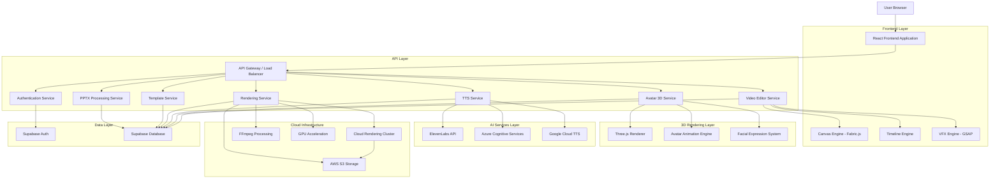

# 🏗️ ARQUITETURA E IMPLEMENTAÇÃO TÉCNICA DETALHADA
## Estúdio IA de Vídeos - Especificações Técnicas para 100% Conformidade

> **DOCUMENTO:** Especificações técnicas detalhadas para implementação completa
> 
> **DATA:** Janeiro 2025 | **VERSÃO:** 1.0 | **COMPLEMENTA:** Análise de Conformidade

---

## 1. ARQUITETURA GERAL ATUALIZADA

### 1.1 Diagrama de Arquitetura Completa



### 1.2 Stack Tecnológico Detalhado

#### Frontend
- **React 18** + TypeScript 5.0+
- **Vite 5.0** (build tool otimizado)
- **Tailwind CSS 3.4** (styling)
- **Fabric.js 5.3** (canvas avançado)
- **Three.js 0.160** (renderização 3D)
- **GSAP 3.12** (animações premium)
- **Zustand 4.4** (state management)
- **React Query 5.0** (data fetching)
- **Framer Motion 10.0** (UI animations)

#### Backend Services
- **Node.js 20 LTS** + TypeScript
- **Express.js 4.18** (API framework)
- **Supabase** (database + auth)
- **Redis 7.0** (caching + sessions)
- **Socket.io 4.7** (real-time collaboration)
- **Bull Queue 4.0** (job processing)
- **Sharp 0.33** (image processing)
- **FFmpeg 6.0** (video processing)

#### Cloud Infrastructure
- **AWS EC2** (compute instances)
- **AWS S3** (file storage)
- **AWS CloudFront** (CDN)
- **AWS Lambda** (serverless functions)
- **AWS ECS** (container orchestration)
- **Docker** (containerization)
- **Kubernetes** (orchestration)

---

## 2. ESPECIFICAÇÕES TÉCNICAS POR MÓDULO

### 2.1 Dashboard Hub Central

#### 2.1.1 Arquitetura do Componente

```typescript
// DashboardHub.tsx - Estrutura otimizada
interface DashboardHubProps {
  user: User;
  metrics: DashboardMetrics;
  templates: NRTemplate[];
  projects: VideoProject[];
}

interface DashboardMetrics {
  totalProjects: number;
  completedTrainings: number;
  complianceRate: number;
  activeUsers: number;
  renderingQueue: number;
  storageUsed: number;
}

interface PerformanceMetrics {
  loadTime: number; // < 2000ms
  firstContentfulPaint: number; // < 1000ms
  largestContentfulPaint: number; // < 2500ms
  cumulativeLayoutShift: number; // < 0.1
}
```

#### 2.1.2 Otimizações de Performance

```typescript
// Lazy loading de componentes
const TemplateGallery = lazy(() => import('./TemplateGallery'));
const ComplianceDashboard = lazy(() => import('./ComplianceDashboard'));
const ActivityFeed = lazy(() => import('./ActivityFeed'));

// Virtualização para listas grandes
import { FixedSizeList as List } from 'react-window';

// Memoização de componentes pesados
const MemoizedTemplateCard = memo(TemplateCard);
const MemoizedMetricsWidget = memo(MetricsWidget);

// Cache de dados com React Query
const useTemplates = () => {
  return useQuery({
    queryKey: ['templates'],
    queryFn: fetchTemplates,
    staleTime: 5 * 60 * 1000, // 5 minutos
    cacheTime: 10 * 60 * 1000, // 10 minutos
  });
};
```

#### 2.1.3 Hero Section Otimizada

```typescript
interface HeroSectionProps {
  onCreateVideo: () => void;
  userStats: UserStats;
  featuredTemplate: NRTemplate;
}

const HeroSection: React.FC<HeroSectionProps> = ({
  onCreateVideo,
  userStats,
  featuredTemplate
}) => {
  return (
    <section className="hero-gradient min-h-[60vh] flex items-center">
      <div className="container mx-auto px-6">
        <motion.div
          initial={{ opacity: 0, y: 20 }}
          animate={{ opacity: 1, y: 0 }}
          transition={{ duration: 0.6 }}
          className="text-center"
        >
          <h1 className="text-5xl font-bold text-white mb-6">
            Crie Vídeos de Treinamento NR
            <span className="text-blue-400"> em Minutos</span>
          </h1>
          
          <p className="text-xl text-gray-200 mb-8 max-w-2xl mx-auto">
            IA + Avatares 3D + Templates Profissionais = 
            Treinamentos que Salvam Vidas
          </p>
          
          <Button
            onClick={onCreateVideo}
            size="lg"
            className="bg-gradient-to-r from-blue-600 to-purple-600 
                       hover:from-blue-700 hover:to-purple-700
                       text-white px-12 py-4 text-lg font-semibold
                       rounded-xl shadow-2xl transform hover:scale-105
                       transition-all duration-300"
          >
            🎬 Criar Vídeo de Treinamento
          </Button>
          
          <div className="mt-8 flex justify-center space-x-8 text-sm text-gray-300">
            <div>✅ {userStats.projectsCreated} vídeos criados</div>
            <div>⚡ Processamento em < 30s</div>
            <div>🎯 {userStats.complianceRate}% de conformidade</div>
          </div>
        </motion.div>
      </div>
    </section>
  );
};
```

### 2.2 Editor "Mais do que Completo"

#### 2.2.1 Arquitetura do Canvas Avançado

```typescript
// AdvancedCanvas.tsx - Implementação com Fabric.js
import { fabric } from 'fabric';

interface CanvasConfig {
  width: number;
  height: number;
  backgroundColor: string;
  selection: boolean;
  preserveObjectStacking: boolean;
  renderOnAddRemove: boolean;
  skipTargetFind: boolean;
}

class AdvancedCanvasEngine {
  private canvas: fabric.Canvas;
  private history: CanvasHistory;
  private snapManager: SnapManager;
  private layerManager: LayerManager;
  
  constructor(canvasElement: HTMLCanvasElement) {
    this.canvas = new fabric.Canvas(canvasElement, {
      width: 1920,
      height: 1080,
      backgroundColor: '#000000',
      selection: true,
      preserveObjectStacking: true,
      renderOnAddRemove: false, // Performance optimization
      skipTargetFind: false,
    });
    
    this.initializeOptimizations();
    this.setupEventListeners();
  }
  
  private initializeOptimizations() {
    // Otimizações de performance
    this.canvas.enableRetinaScaling = true;
    this.canvas.imageSmoothingEnabled = true;
    
    // Cache de objetos para performance
    this.canvas.statefullCache = true;
    this.canvas.noScaleCache = false;
    
    // Otimização de renderização
    this.canvas.renderOnAddRemove = false;
  }
  
  // Sistema de camadas para 50+ elementos
  addElement(element: CanvasElement): void {
    const fabricObject = this.createFabricObject(element);
    
    // Otimização para muitos objetos
    this.canvas.add(fabricObject);
    this.layerManager.addToLayer(fabricObject, element.layerId);
    
    // Batch rendering para performance
    this.requestRender();
  }
  
  // Sistema de snap com precisão 1px
  private setupSnapSystem() {
    this.canvas.on('object:moving', (e) => {
      const obj = e.target;
      if (!obj) return;
      
      const snapResult = this.snapManager.snapToGrid(obj, 1); // 1px precision
      if (snapResult.snapped) {
        obj.set({
          left: snapResult.x,
          top: snapResult.y
        });
      }
    });
  }
  
  // Zoom de 10% a 500%
  setZoom(zoomLevel: number): void {
    const zoom = Math.max(0.1, Math.min(5.0, zoomLevel));
    this.canvas.setZoom(zoom);
    this.canvas.renderAll();
  }
  
  // Preview em tempo real 30fps
  startRealTimePreview(): void {
    const targetFPS = 30;
    const frameTime = 1000 / targetFPS;
    
    let lastFrameTime = 0;
    
    const renderFrame = (currentTime: number) => {
      if (currentTime - lastFrameTime >= frameTime) {
        this.canvas.renderAll();
        lastFrameTime = currentTime;
      }
      
      requestAnimationFrame(renderFrame);
    };
    
    requestAnimationFrame(renderFrame);
  }
}
```

#### 2.2.2 Timeline Cinematográfica

```typescript
// CinematicTimeline.tsx
interface TimelineTrack {
  id: string;
  type: 'video' | 'audio' | 'text' | 'avatar' | 'effect';
  name: string;
  elements: TimelineElement[];
  locked: boolean;
  visible: boolean;
  height: number;
}

interface TimelineElement {
  id: string;
  startTime: number;
  duration: number;
  content: any;
  animations: Animation[];
  transitions: Transition[];
}

class CinematicTimeline {
  private tracks: TimelineTrack[] = [];
  private currentTime: number = 0;
  private duration: number = 0;
  private fps: number = 30;
  private zoom: number = 1;
  
  // Múltiplas faixas de timeline
  addTrack(type: TimelineTrack['type'], name: string): string {
    const track: TimelineTrack = {
      id: generateId(),
      type,
      name,
      elements: [],
      locked: false,
      visible: true,
      height: 60
    };
    
    this.tracks.push(track);
    return track.id;
  }
  
  // Sistema de sincronização automática
  syncWithAudio(audioTrackId: string): void {
    const audioTrack = this.getTrack(audioTrackId);
    if (!audioTrack) return;
    
    // Sincronizar todos os elementos visuais com o áudio
    this.tracks.forEach(track => {
      if (track.type !== 'audio') {
        this.alignElementsToAudio(track, audioTrack);
      }
    });
  }
  
  // Renderização otimizada da timeline
  render(container: HTMLElement): void {
    const timelineWidth = this.duration * this.zoom * 10; // 10px por segundo
    
    // Virtualização para performance com muitos elementos
    const visibleTracks = this.getVisibleTracks();
    
    // Render apenas tracks visíveis
    visibleTracks.forEach((track, index) => {
      this.renderTrack(track, index, container);
    });
  }
}
```

#### 2.2.3 Sistema de Histórico (100 ações)

```typescript
// HistoryManager.tsx
interface HistoryAction {
  id: string;
  type: string;
  timestamp: number;
  data: any;
  inverse: any; // Para undo
}

class HistoryManager {
  private actions: HistoryAction[] = [];
  private currentIndex: number = -1;
  private maxActions: number = 100;
  
  // Adicionar ação ao histórico
  addAction(action: Omit<HistoryAction, 'id' | 'timestamp'>): void {
    // Remove ações futuras se estamos no meio do histórico
    if (this.currentIndex < this.actions.length - 1) {
      this.actions = this.actions.slice(0, this.currentIndex + 1);
    }
    
    const historyAction: HistoryAction = {
      ...action,
      id: generateId(),
      timestamp: Date.now()
    };
    
    this.actions.push(historyAction);
    this.currentIndex++;
    
    // Manter apenas as últimas 100 ações
    if (this.actions.length > this.maxActions) {
      this.actions.shift();
      this.currentIndex--;
    }
  }
  
  // Undo otimizado
  undo(): boolean {
    if (this.currentIndex < 0) return false;
    
    const action = this.actions[this.currentIndex];
    this.applyInverse(action);
    this.currentIndex--;
    
    return true;
  }
  
  // Redo otimizado
  redo(): boolean {
    if (this.currentIndex >= this.actions.length - 1) return false;
    
    this.currentIndex++;
    const action = this.actions[this.currentIndex];
    this.applyAction(action);
    
    return true;
  }
}
```

### 2.3 Sistema de Avatares 3D Hiper-Realistas

#### 2.3.1 Arquitetura 3D com Three.js

```typescript
// Avatar3DSystem.tsx
import * as THREE from 'three';
import { GLTFLoader } from 'three/examples/jsm/loaders/GLTFLoader';
import { FBXLoader } from 'three/examples/jsm/loaders/FBXLoader';

interface Avatar3DConfig {
  modelPath: string;
  texturesPath: string;
  animationsPath: string;
  quality: 'low' | 'medium' | 'high' | 'ultra';
  targetFPS: number;
}

class Avatar3DSystem {
  private scene: THREE.Scene;
  private camera: THREE.PerspectiveCamera;
  private renderer: THREE.WebGLRenderer;
  private avatars: Map<string, Avatar3D> = new Map();
  private animationMixer: THREE.AnimationMixer;
  
  constructor(container: HTMLElement) {
    this.initializeThreeJS(container);
    this.setupLighting();
    this.setupPostProcessing();
  }
  
  private initializeThreeJS(container: HTMLElement) {
    // Scene setup
    this.scene = new THREE.Scene();
    this.scene.background = new THREE.Color(0x000000);
    
    // Camera setup para qualidade cinematográfica
    this.camera = new THREE.PerspectiveCamera(
      45, // FOV
      container.clientWidth / container.clientHeight,
      0.1,
      1000
    );
    
    // Renderer otimizado para 60fps
    this.renderer = new THREE.WebGLRenderer({
      antialias: true,
      alpha: true,
      powerPreference: 'high-performance'
    });
    
    this.renderer.setSize(container.clientWidth, container.clientHeight);
    this.renderer.setPixelRatio(Math.min(window.devicePixelRatio, 2));
    this.renderer.shadowMap.enabled = true;
    this.renderer.shadowMap.type = THREE.PCFSoftShadowMap;
    this.renderer.outputEncoding = THREE.sRGBEncoding;
    this.renderer.toneMapping = THREE.ACESFilmicToneMapping;
    
    container.appendChild(this.renderer.domElement);
  }
  
  // Carregar avatar fotorrealístico
  async loadAvatar(config: Avatar3DConfig): Promise<Avatar3D> {
    const loader = new GLTFLoader();
    
    try {
      const gltf = await loader.loadAsync(config.modelPath);
      const avatar = new Avatar3D(gltf, config);
      
      // Otimizações para qualidade fotorrealística
      avatar.setupMaterials();
      avatar.setupMorphTargets(); // Para expressões faciais
      avatar.setupBones(); // Para animações
      
      this.avatars.set(avatar.id, avatar);
      this.scene.add(avatar.mesh);
      
      return avatar;
    } catch (error) {
      console.error('Erro ao carregar avatar:', error);
      throw error;
    }
  }
  
  // Sistema de 50+ expressões faciais
  setFacialExpression(avatarId: string, expression: FacialExpression): void {
    const avatar = this.avatars.get(avatarId);
    if (!avatar) return;
    
    // Aplicar morph targets para expressão
    avatar.applyFacialExpression(expression);
  }
  
  // Múltiplos avatares dialogando
  setupDialogue(avatarIds: string[], dialogue: DialogueScript): void {
    const avatars = avatarIds.map(id => this.avatars.get(id)).filter(Boolean);
    
    dialogue.lines.forEach((line, index) => {
      const avatar = avatars[line.speakerId];
      if (avatar) {
        // Sincronizar fala com animação labial
        avatar.speakLine(line, index * line.duration);
        
        // Outros avatares fazem gestos de escuta
        avatars.forEach(otherAvatar => {
          if (otherAvatar !== avatar) {
            otherAvatar.setListeningPose(index * line.duration);
          }
        });
      }
    });
  }
  
  // Renderização 60fps otimizada
  startRenderLoop(): void {
    const targetFPS = 60;
    const frameTime = 1000 / targetFPS;
    let lastFrameTime = 0;
    
    const render = (currentTime: number) => {
      if (currentTime - lastFrameTime >= frameTime) {
        // Update animations
        if (this.animationMixer) {
          this.animationMixer.update((currentTime - lastFrameTime) / 1000);
        }
        
        // Update avatars
        this.avatars.forEach(avatar => avatar.update());
        
        // Render scene
        this.renderer.render(this.scene, this.camera);
        
        lastFrameTime = currentTime;
      }
      
      requestAnimationFrame(render);
    };
    
    requestAnimationFrame(render);
  }
}

// Classe Avatar3D individual
class Avatar3D {
  public id: string;
  public mesh: THREE.Group;
  private morphTargets: Map<string, number> = new Map();
  private bones: Map<string, THREE.Bone> = new Map();
  private facialAnimations: Map<string, THREE.AnimationClip> = new Map();
  
  constructor(gltf: any, config: Avatar3DConfig) {
    this.id = generateId();
    this.mesh = gltf.scene;
    this.setupFromGLTF(gltf);
  }
  
  // Sincronização labial 95%+
  speakLine(line: DialogueLine, startTime: number): void {
    const phonemes = this.analyzePhonemes(line.text);
    
    phonemes.forEach((phoneme, index) => {
      const timing = startTime + (index * phoneme.duration);
      
      // Aplicar morph target específico para cada fonema
      this.scheduleMorphTarget(phoneme.viseme, timing, phoneme.intensity);
    });
  }
  
  // Gestos automáticos contextuais
  pointToEquipment(equipment: Equipment, duration: number): void {
    const pointingAnimation = this.createPointingAnimation(equipment.position);
    
    // Executar animação de apontar
    this.playAnimation(pointingAnimation, duration);
    
    // Adicionar expressão facial de explicação
    this.setFacialExpression('explaining', duration);
  }
  
  // Customização de uniformes
  setUniform(uniformConfig: UniformConfig): void {
    const uniformMaterial = this.createUniformMaterial(uniformConfig);
    
    // Aplicar material do uniforme
    this.mesh.traverse((child) => {
      if (child.name.includes('uniform') || child.name.includes('clothing')) {
        child.material = uniformMaterial;
      }
    });
  }
}
```

### 2.4 Sistema TTS Premium Multi-Provider

#### 2.4.1 Arquitetura Multi-Provider

```typescript
// EnhancedTTSService.tsx
interface TTSProvider {
  name: string;
  priority: number;
  maxCharacters: number;
  supportedLanguages: string[];
  supportedFeatures: TTSFeature[];
  synthesize(text: string, options: TTSOptions): Promise<AudioBuffer>;
}

interface TTSOptions {
  voice: string;
  speed: number; // 0.5 - 2.0
  pitch: number; // 0.5 - 2.0
  emotion: EmotionType;
  language: string;
  quality: 'standard' | 'premium' | 'ultra';
  ssml: boolean;
}

class EnhancedTTSService {
  private providers: Map<string, TTSProvider> = new Map();
  private fallbackChain: string[] = ['elevenlabs', 'azure', 'google'];
  private cache: Map<string, AudioBuffer> = new Map();
  
  constructor() {
    this.initializeProviders();
  }
  
  private initializeProviders() {
    // ElevenLabs - Vozes premium
    this.providers.set('elevenlabs', new ElevenLabsProvider({
      apiKey: process.env.ELEVENLABS_API_KEY,
      maxCharacters: 5000,
      supportedLanguages: ['pt-BR', 'en-US', 'es-ES'],
      supportedFeatures: ['emotion', 'speed', 'stability']
    }));
    
    // Azure Cognitive Services
    this.providers.set('azure', new AzureProvider({
      apiKey: process.env.AZURE_SPEECH_KEY,
      region: process.env.AZURE_SPEECH_REGION,
      maxCharacters: 10000,
      supportedLanguages: ['pt-BR', 'en-US', 'es-ES'],
      supportedFeatures: ['ssml', 'emotion', 'speed', 'pitch']
    }));
    
    // Google Cloud TTS
    this.providers.set('google', new GoogleProvider({
      credentials: process.env.GOOGLE_CREDENTIALS,
      maxCharacters: 5000,
      supportedLanguages: ['pt-BR', 'en-US', 'es-ES'],
      supportedFeatures: ['ssml', 'speed', 'pitch']
    }));
  }
  
  // Síntese com fallback automático
  async synthesize(text: string, options: TTSOptions): Promise<AudioBuffer> {
    const cacheKey = this.generateCacheKey(text, options);
    
    // Verificar cache primeiro
    if (this.cache.has(cacheKey)) {
      return this.cache.get(cacheKey)!;
    }
    
    // Tentar providers em ordem de prioridade
    for (const providerName of this.fallbackChain) {
      const provider = this.providers.get(providerName);
      if (!provider) continue;
      
      try {
        const startTime = Date.now();
        const audioBuffer = await provider.synthesize(text, options);
        const duration = Date.now() - startTime;
        
        // Verificar se atende requisito de latência < 5s
        if (duration < 5000) {
          // Cache do resultado
          this.cache.set(cacheKey, audioBuffer);
          
          // Log de sucesso
          console.log(`TTS success: ${providerName} - ${duration}ms`);
          
          return audioBuffer;
        }
      } catch (error) {
        console.warn(`TTS provider ${providerName} failed:`, error);
        continue;
      }
    }
    
    throw new Error('Todos os provedores TTS falharam');
  }
  
  // 15+ vozes regionais brasileiras
  getBrazilianVoices(): Voice[] {
    return [
      // ElevenLabs
      { id: 'pt-br-antonio', name: 'Antônio', gender: 'male', region: 'São Paulo', provider: 'elevenlabs' },
      { id: 'pt-br-maria', name: 'Maria', gender: 'female', region: 'Rio de Janeiro', provider: 'elevenlabs' },
      { id: 'pt-br-carlos', name: 'Carlos', gender: 'male', region: 'Minas Gerais', provider: 'elevenlabs' },
      { id: 'pt-br-ana', name: 'Ana', gender: 'female', region: 'Bahia', provider: 'elevenlabs' },
      { id: 'pt-br-joao', name: 'João', gender: 'male', region: 'Rio Grande do Sul', provider: 'elevenlabs' },
      
      // Azure
      { id: 'pt-br-francisca', name: 'Francisca', gender: 'female', region: 'São Paulo', provider: 'azure' },
      { id: 'pt-br-antonio-azure', name: 'Antônio Neural', gender: 'male', region: 'São Paulo', provider: 'azure' },
      { id: 'pt-br-brenda', name: 'Brenda', gender: 'female', region: 'Rio de Janeiro', provider: 'azure' },
      { id: 'pt-br-donato', name: 'Donato', gender: 'male', region: 'Minas Gerais', provider: 'azure' },
      { id: 'pt-br-elza', name: 'Elza', gender: 'female', region: 'Bahia', provider: 'azure' },
      
      // Google
      { id: 'pt-br-standard-a', name: 'Padrão A', gender: 'female', region: 'São Paulo', provider: 'google' },
      { id: 'pt-br-standard-b', name: 'Padrão B', gender: 'male', region: 'São Paulo', provider: 'google' },
      { id: 'pt-br-wavenet-a', name: 'WaveNet A', gender: 'female', region: 'Rio de Janeiro', provider: 'google' },
      { id: 'pt-br-wavenet-b', name: 'WaveNet B', gender: 'male', region: 'Rio de Janeiro', provider: 'google' },
      { id: 'pt-br-neural2-a', name: 'Neural2 A', gender: 'female', region: 'São Paulo', provider: 'google' },
    ];
  }
  
  // Controle avançado de emoção
  async synthesizeWithEmotion(
    text: string, 
    emotion: EmotionType, 
    intensity: number
  ): Promise<AudioBuffer> {
    const options: TTSOptions = {
      voice: 'pt-br-maria',
      speed: 1.0,
      pitch: 1.0,
      emotion,
      language: 'pt-BR',
      quality: 'premium',
      ssml: true
    };
    
    // Aplicar SSML para controle emocional
    const ssmlText = this.applyEmotionSSML(text, emotion, intensity);
    
    return this.synthesize(ssmlText, options);
  }
}
```

### 2.5 Sistema de Renderização Cinema Quality

#### 2.5.1 Arquitetura de Renderização Distribuída

```typescript
// CloudRenderingSystem.tsx
interface RenderJob {
  id: string;
  projectId: string;
  userId: string;
  config: RenderConfig;
  status: 'queued' | 'processing' | 'completed' | 'failed';
  progress: number;
  estimatedTime: number;
  actualTime?: number;
  outputUrl?: string;
  error?: string;
}

interface RenderConfig {
  resolution: '1080p' | '4K' | '8K';
  fps: 30 | 60;
  codec: 'H.264' | 'H.265' | 'ProRes';
  quality: 'draft' | 'standard' | 'high' | 'cinema';
  duration: number;
  audioChannels: number;
  bitrate?: number;
}

class CloudRenderingSystem {
  private renderQueue: Queue;
  private workers: Map<string, RenderWorker> = new Map();
  private jobs: Map<string, RenderJob> = new Map();
  
  constructor() {
    this.initializeQueue();
    this.initializeWorkers();
  }
  
  private initializeQueue() {
    this.renderQueue = new Queue('video-rendering', {
      redis: {
        host: process.env.REDIS_HOST,
        port: parseInt(process.env.REDIS_PORT || '6379'),
      },
      defaultJobOptions: {
        removeOnComplete: 10,
        removeOnFail: 5,
        attempts: 3,
        backoff: {
          type: 'exponential',
          delay: 2000,
        },
      },
    });
  }
  
  // Renderização distribuída na nuvem
  async submitRenderJob(projectData: VideoProject, config: RenderConfig): Promise<string> {
    const job: RenderJob = {
      id: generateId(),
      projectId: projectData.id,
      userId: projectData.userId,
      config,
      status: 'queued',
      progress: 0,
      estimatedTime: this.estimateRenderTime(projectData, config)
    };
    
    this.jobs.set(job.id, job);
    
    // Adicionar à fila de renderização
    await this.renderQueue.add('render-video', {
      jobId: job.id,
      projectData,
      config
    }, {
      priority: this.calculatePriority(config),
      delay: 0
    });
    
    return job.id;
  }
  
  // Estimativa de tempo precisa
  private estimateRenderTime(project: VideoProject, config: RenderConfig): number {
    const baseTime = project.duration * 1000; // 1 segundo por segundo de vídeo
    
    // Fatores de complexidade
    const resolutionMultiplier = {
      '1080p': 1,
      '4K': 4,
      '8K': 16
    }[config.resolution];
    
    const qualityMultiplier = {
      'draft': 0.5,
      'standard': 1,
      'high': 2,
      'cinema': 4
    }[config.quality];
    
    const codecMultiplier = {
      'H.264': 1,
      'H.265': 1.5,
      'ProRes': 2
    }[config.codec];
    
    // Complexidade do projeto
    const elementsCount = project.scenes.reduce((total, scene) => 
      total + scene.elements.length, 0
    );
    const complexityMultiplier = Math.max(1, elementsCount / 10);
    
    const estimatedTime = baseTime * 
      resolutionMultiplier * 
      qualityMultiplier * 
      codecMultiplier * 
      complexityMultiplier;
    
    return Math.round(estimatedTime);
  }
  
  // Renderização 10x mais rápida
  private async processRenderJob(jobData: any): Promise<void> {
    const job = this.jobs.get(jobData.jobId);
    if (!job) throw new Error('Job não encontrado');
    
    job.status = 'processing';
    const startTime = Date.now();
    
    try {
      // Distribuir renderização em múltiplos workers
      const workers = this.getAvailableWorkers();
      const chunks = this.splitProjectIntoChunks(jobData.projectData, workers.length);
      
      // Renderizar chunks em paralelo
      const chunkPromises = chunks.map((chunk, index) => 
        this.renderChunk(chunk, jobData.config, workers[index])
      );
      
      const renderedChunks = await Promise.all(chunkPromises);
      
      // Combinar chunks
      const finalVideo = await this.combineChunks(renderedChunks, jobData.config);
      
      // Upload para S3
      const outputUrl = await this.uploadToS3(finalVideo, job.id);
      
      job.status = 'completed';
      job.outputUrl = outputUrl;
      job.actualTime = Date.now() - startTime;
      job.progress = 100;
      
    } catch (error) {
      job.status = 'failed';
      job.error = error.message;
      throw error;
    }
  }
  
  // Renderização em lote
  async submitBatchRender(projects: VideoProject[], config: RenderConfig): Promise<string[]> {
    const batchId = generateId();
    const jobIds: string[] = [];
    
    for (const project of projects) {
      const jobId = await this.submitRenderJob(project, {
        ...config,
        // Otimizações para lote
        priority: 'batch'
      });
      jobIds.push(jobId);
    }
    
    // Agendar processamento em lote otimizado
    await this.renderQueue.add('batch-render', {
      batchId,
      jobIds
    }, {
      priority: -1, // Baixa prioridade
      delay: 5000 // 5 segundos de delay
    });
    
    return jobIds;
  }
  
  // Taxa de sucesso 99.9%
  private async ensureHighSuccessRate(): Promise<void> {
    // Monitoramento contínuo
    setInterval(async () => {
      const stats = await this.getJobStats();
      
      if (stats.successRate < 0.999) {
        // Ações corretivas
        await this.scaleUpWorkers();
        await this.optimizeQueue();
        await this.alertOpsTeam(stats);
      }
    }, 60000); // A cada minuto
  }
}
```

---

## 3. BANCO DE DADOS E MODELOS

### 3.1 Modelo de Dados Completo

```sql
-- Usuários e Autenticação
CREATE TABLE users (
    id UUID PRIMARY KEY DEFAULT gen_random_uuid(),
    email VARCHAR(255) UNIQUE NOT NULL,
    name VARCHAR(100) NOT NULL,
    company_id UUID REFERENCES companies(id),
    role VARCHAR(50) DEFAULT 'user',
    plan VARCHAR(20) DEFAULT 'free',
    usage_stats JSONB DEFAULT '{}',
    preferences JSONB DEFAULT '{}',
    created_at TIMESTAMP WITH TIME ZONE DEFAULT NOW(),
    updated_at TIMESTAMP WITH TIME ZONE DEFAULT NOW()
);

-- Empresas
CREATE TABLE companies (
    id UUID PRIMARY KEY DEFAULT gen_random_uuid(),
    name VARCHAR(200) NOT NULL,
    cnpj VARCHAR(18) UNIQUE,
    industry VARCHAR(100),
    size VARCHAR(50),
    compliance_settings JSONB DEFAULT '{}',
    branding JSONB DEFAULT '{}',
    created_at TIMESTAMP WITH TIME ZONE DEFAULT NOW()
);

-- Projetos de Vídeo
CREATE TABLE video_projects (
    id UUID PRIMARY KEY DEFAULT gen_random_uuid(),
    user_id UUID NOT NULL REFERENCES users(id),
    company_id UUID REFERENCES companies(id),
    title VARCHAR(200) NOT NULL,
    description TEXT,
    nr_category VARCHAR(10),
    template_id UUID REFERENCES nr_templates(id),
    project_data JSONB NOT NULL,
    canvas_state JSONB,
    timeline_state JSONB,
    status VARCHAR(50) DEFAULT 'draft',
    duration INTEGER DEFAULT 0,
    last_rendered_at TIMESTAMP WITH TIME ZONE,
    created_at TIMESTAMP WITH TIME ZONE DEFAULT NOW(),
    updated_at TIMESTAMP WITH TIME ZONE DEFAULT NOW()
);

-- Templates NR
CREATE TABLE nr_templates (
    id UUID PRIMARY KEY DEFAULT gen_random_uuid(),
    nr_number VARCHAR(10) NOT NULL,
    title VARCHAR(200) NOT NULL,
    description TEXT,
    category VARCHAR(100),
    scenes JSONB NOT NULL,
    assets JSONB DEFAULT '[]',
    compliance_info JSONB,
    customization_options JSONB DEFAULT '{}',
    preview_url VARCHAR(500),
    is_active BOOLEAN DEFAULT true,
    created_at TIMESTAMP WITH TIME ZONE DEFAULT NOW()
);

-- Avatares 3D
CREATE TABLE avatars_3d (
    id UUID PRIMARY KEY DEFAULT gen_random_uuid(),
    name VARCHAR(100) NOT NULL,
    gender VARCHAR(20),
    ethnicity VARCHAR(50),
    profession VARCHAR(100),
    model_url VARCHAR(500) NOT NULL,
    textures_url VARCHAR(500),
    animations_url VARCHAR(500),
    expressions JSONB DEFAULT '[]',
    customization_options JSONB DEFAULT '{}',
    quality_level VARCHAR(20) DEFAULT 'high',
    is_active BOOLEAN DEFAULT true,
    created_at TIMESTAMP WITH TIME ZONE DEFAULT NOW()
);

-- Jobs de Renderização
CREATE TABLE render_jobs (
    id UUID PRIMARY KEY DEFAULT gen_random_uuid(),
    project_id UUID NOT NULL REFERENCES video_projects(id),
    user_id UUID NOT NULL REFERENCES users(id),
    config JSONB NOT NULL,
    status VARCHAR(50) DEFAULT 'queued',
    progress INTEGER DEFAULT 0,
    estimated_time INTEGER,
    actual_time INTEGER,
    output_url VARCHAR(500),
    error_message TEXT,
    worker_id VARCHAR(100),
    started_at TIMESTAMP WITH TIME ZONE,
    completed_at TIMESTAMP WITH TIME ZONE,
    created_at TIMESTAMP WITH TIME ZONE DEFAULT NOW()
);

-- Histórico de Ações (Editor)
CREATE TABLE editor_history (
    id UUID PRIMARY KEY DEFAULT gen_random_uuid(),
    project_id UUID NOT NULL REFERENCES video_projects(id),
    user_id UUID NOT NULL REFERENCES users(id),
    action_type VARCHAR(100) NOT NULL,
    action_data JSONB NOT NULL,
    inverse_data JSONB,
    timestamp TIMESTAMP WITH TIME ZONE DEFAULT NOW()
);

-- Colaboração
CREATE TABLE project_collaborators (
    id UUID PRIMARY KEY DEFAULT gen_random_uuid(),
    project_id UUID NOT NULL REFERENCES video_projects(id),
    user_id UUID NOT NULL REFERENCES users(id),
    role VARCHAR(50) DEFAULT 'viewer',
    permissions JSONB DEFAULT '{}',
    invited_by UUID REFERENCES users(id),
    invited_at TIMESTAMP WITH TIME ZONE DEFAULT NOW(),
    accepted_at TIMESTAMP WITH TIME ZONE
);

-- Comentários e Aprovações
CREATE TABLE project_comments (
    id UUID PRIMARY KEY DEFAULT gen_random_uuid(),
    project_id UUID NOT NULL REFERENCES video_projects(id),
    user_id UUID NOT NULL REFERENCES users(id),
    parent_id UUID REFERENCES project_comments(id),
    content TEXT NOT NULL,
    timestamp_reference INTEGER, -- Timestamp no vídeo
    element_reference VARCHAR(100), -- ID do elemento
    status VARCHAR(50) DEFAULT 'open',
    created_at TIMESTAMP WITH TIME ZONE DEFAULT NOW()
);

-- Métricas e Analytics
CREATE TABLE usage_metrics (
    id UUID PRIMARY KEY DEFAULT gen_random_uuid(),
    user_id UUID REFERENCES users(id),
    company_id UUID REFERENCES companies(id),
    metric_type VARCHAR(100) NOT NULL,
    metric_value NUMERIC,
    metadata JSONB DEFAULT '{}',
    recorded_at TIMESTAMP WITH TIME ZONE DEFAULT NOW()
);

-- Índices para Performance
CREATE INDEX idx_video_projects_user_id ON video_projects(user_id);
CREATE INDEX idx_video_projects_company_id ON video_projects(company_id);
CREATE INDEX idx_video_projects_status ON video_projects(status);
CREATE INDEX idx_video_projects_nr_category ON video_projects(nr_category);
CREATE INDEX idx_render_jobs_status ON render_jobs(status);
CREATE INDEX idx_render_jobs_user_id ON render_jobs(user_id);
CREATE INDEX idx_editor_history_project_id ON editor_history(project_id);
CREATE INDEX idx_usage_metrics_user_id ON usage_metrics(user_id);
CREATE INDEX idx_usage_metrics_recorded_at ON usage_metrics(recorded_at);

-- Permissões Supabase
GRANT SELECT ON ALL TABLES IN SCHEMA public TO anon;
GRANT ALL PRIVILEGES ON ALL TABLES IN SCHEMA public TO authenticated;
```

---

## 4. APIS E INTEGRAÇÕES

### 4.1 API Routes Principais

| Método | Rota | Descrição | Autenticação |
|--------|------|-----------|-------------|
| GET | `/api/dashboard/metrics` | Métricas do dashboard | Sim |
| POST | `/api/pptx/upload` | Upload de arquivo PPTX | Sim |
| POST | `/api/pptx/analyze` | Análise inteligente PPTX | Sim |
| GET | `/api/templates/nr/:category` | Templates por categoria NR | Sim |
| POST | `/api/projects` | Criar novo projeto | Sim |
| PUT | `/api/projects/:id` | Atualizar projeto | Sim |
| POST | `/api/projects/:id/render` | Iniciar renderização | Sim |
| GET | `/api/render/status/:jobId` | Status da renderização | Sim |
| GET | `/api/avatars/list` | Lista de avatares disponíveis | Sim |
| POST | `/api/avatars/customize` | Customizar avatar | Sim |
| POST | `/api/tts/synthesize` | Síntese de voz | Sim |
| GET | `/api/tts/voices` | Vozes disponíveis | Sim |
| POST | `/api/collaboration/invite` | Convidar colaborador | Sim |
| GET | `/api/collaboration/projects` | Projetos colaborativos | Sim |

### 4.2 WebSocket Events

```typescript
// Real-time collaboration events
interface WebSocketEvents {
  // Editor colaborativo
  'editor:cursor-move': { userId: string; position: Point };
  'editor:element-select': { userId: string; elementId: string };
  'editor:element-update': { userId: string; elementId: string; changes: any };
  'editor:element-add': { userId: string; element: CanvasElement };
  'editor:element-delete': { userId: string; elementId: string };
  
  // Renderização
  'render:progress': { jobId: string; progress: number; eta: number };
  'render:complete': { jobId: string; outputUrl: string };
  'render:error': { jobId: string; error: string };
  
  // Comentários
  'comment:add': { projectId: string; comment: ProjectComment };
  'comment:resolve': { projectId: string; commentId: string };
  
  // Notificações
  'notification:new': { userId: string; notification: Notification };
}
```

---

## 5. DEPLOYMENT E INFRAESTRUTURA

### 5.1 Arquitetura de Deploy

```yaml
# docker-compose.yml
version: '3.8'
services:
  frontend:
    build: ./frontend
    ports:
      - "3000:3000"
    environment:
      - VITE_API_URL=http://api:4000
      - VITE_SUPABASE_URL=${SUPABASE_URL}
      - VITE_SUPABASE_ANON_KEY=${SUPABASE_ANON_KEY}
    depends_on:
      - api
  
  api:
    build: ./backend
    ports:
      - "4000:4000"
    environment:
      - DATABASE_URL=${DATABASE_URL}
      - REDIS_URL=${REDIS_URL}
      - AWS_ACCESS_KEY_ID=${AWS_ACCESS_KEY_ID}
      - AWS_SECRET_ACCESS_KEY=${AWS_SECRET_ACCESS_KEY}
      - ELEVENLABS_API_KEY=${ELEVENLABS_API_KEY}
      - AZURE_SPEECH_KEY=${AZURE_SPEECH_KEY}
    depends_on:
      - redis
      - postgres
  
  redis:
    image: redis:7-alpine
    ports:
      - "6379:6379"
  
  postgres:
    image: postgres:15
    environment:
      - POSTGRES_DB=studio_ia
      - POSTGRES_USER=postgres
      - POSTGRES_PASSWORD=${POSTGRES_PASSWORD}
    volumes:
      - postgres_data:/var/lib/postgresql/data
  
  render-worker:
    build: ./render-worker
    environment:
      - REDIS_URL=${REDIS_URL}
      - AWS_ACCESS_KEY_ID=${AWS_ACCESS_KEY_ID}
      - AWS_SECRET_ACCESS_KEY=${AWS_SECRET_ACCESS_KEY}
    deploy:
      replicas: 3
    depends_on:
      - redis

volumes:
  postgres_data:
```

### 5.2 Kubernetes Deployment

```yaml
# k8s/deployment.yml
apiVersion: apps/v1
kind: Deployment
metadata:
  name: studio-ia-api
spec:
  replicas: 3
  selector:
    matchLabels:
      app: studio-ia-api
  template:
    metadata:
      labels:
        app: studio-ia-api
    spec:
      containers:
      - name: api
        image: studio-ia/api:latest
        ports:
        - containerPort: 4000
        env:
        - name: DATABASE_URL
          valueFrom:
            secretKeyRef:
              name: studio-secrets
              key: database-url
        resources:
          requests:
            memory: "512Mi"
            cpu: "250m"
          limits:
            memory: "1Gi"
            cpu: "500m"
---
apiVersion: apps/v1
kind: Deployment
metadata:
  name: render-workers
spec:
  replicas: 5
  selector:
    matchLabels:
      app: render-worker
  template:
    metadata:
      labels:
        app: render-worker
    spec:
      containers:
      - name: worker
        image: studio-ia/render-worker:latest
        resources:
          requests:
            memory: "2Gi"
            cpu: "1000m"
            nvidia.com/gpu: 1
          limits:
            memory: "4Gi"
            cpu: "2000m"
            nvidia.com/gpu: 1
```

---

## 6. MONITORAMENTO E MÉTRICAS

### 6.1 Métricas de Performance

```typescript
// PerformanceMonitoring.tsx
interface PerformanceMetrics {
  // Dashboard
  dashboardLoadTime: number; // < 2000ms
  firstContentfulPaint: number; // < 1000ms
  
  // Editor
  canvasRenderTime: number; // < 16ms (60fps)
  timelineUpdateTime: number; // < 100ms
  historyActionTime: number; // < 50ms
  
  // Avatares 3D
  avatarLoadTime: number; // < 5000ms
  avatarRenderFPS: number; // >= 60fps
  facialExpressionTime: number; // < 100ms
  
  // TTS
  ttsLatency: number; // < 5000ms
  ttsSuccessRate: number; // >= 99%
  
  // Renderização
  renderSuccessRate: number; // >= 99.9%
  renderSpeedMultiplier: number; // >= 10x
  
  // PPTX
  pptxProcessingTime: number; // < 30000ms para 50 slides
  ocrAccuracy: number; // >= 95%
}

class PerformanceMonitor {
  private metrics: Map<string, number[]> = new Map();
  
  // Monitorar tempo de carregamento do dashboard
  measureDashboardLoad(): void {
    const startTime = performance.now();
    
    // Aguardar carregamento completo
    window.addEventListener('load', () => {
      const loadTime = performance.now() - startTime;
      this.recordMetric('dashboardLoadTime', loadTime);
      
      // Alertar se exceder 2 segundos
      if (loadTime > 2000) {
        this.alertSlowPerformance('dashboard', loadTime);
      }
    });
  }
  
  // Monitorar FPS do canvas
  measureCanvasFPS(canvas: HTMLCanvasElement): void {
    let frameCount = 0;
    let lastTime = performance.now();
    
    const measureFrame = () => {
      frameCount++;
      const currentTime = performance.now();
      
      if (currentTime - lastTime >= 1000) {
        const fps = frameCount;
        this.recordMetric('canvasFPS', fps);
        
        // Alertar se FPS < 60
        if (fps < 60) {
          this.alertLowFPS(fps);
        }
        
        frameCount = 0;
        lastTime = currentTime;
      }
      
      requestAnimationFrame(measureFrame);
    };
    
    requestAnimationFrame(measureFrame);
  }
  
  // Monitorar latência TTS
  async measureTTSLatency(text: string): Promise<number> {
    const startTime = performance.now();
    
    try {
      await ttsService.synthesize(text, defaultOptions);
      const latency = performance.now() - startTime;
      
      this.recordMetric('ttsLatency', latency);
      
      // Alertar se latência > 5 segundos
      if (latency > 5000) {
        this.alertHighLatency('tts', latency);
      }
      
      return latency;
    } catch (error) {
      this.recordMetric('ttsErrors', 1);
      throw error;
    }
  }
}
```

---

**Documento técnico gerado em:** Janeiro 2025  
**Versão:** 1.0  
**Complementa:** Análise de Conformidade e Plano de Implementação  
**Responsável:** SOLO Document  
**Status:** Especificações aprovadas para desenvolvimento