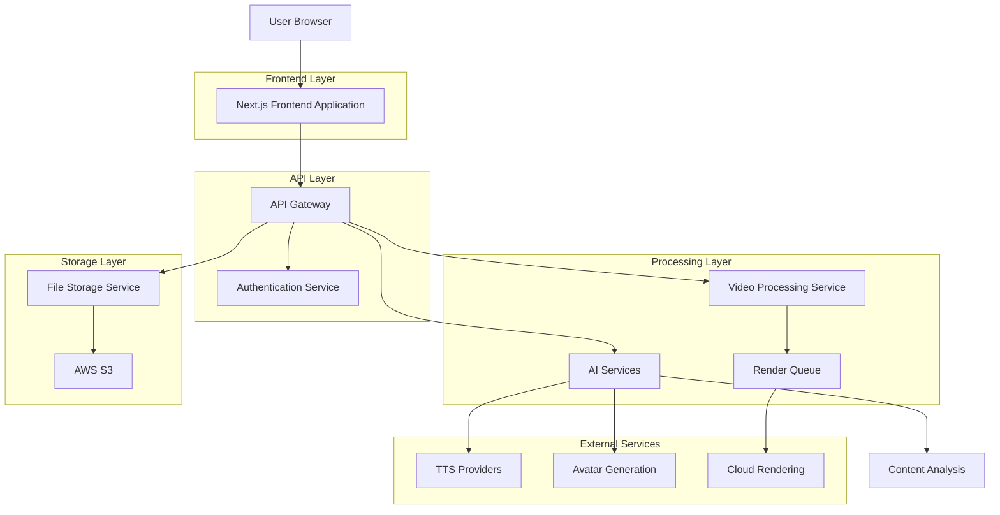
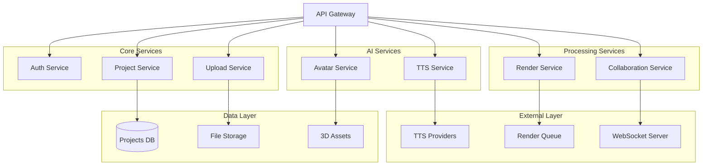
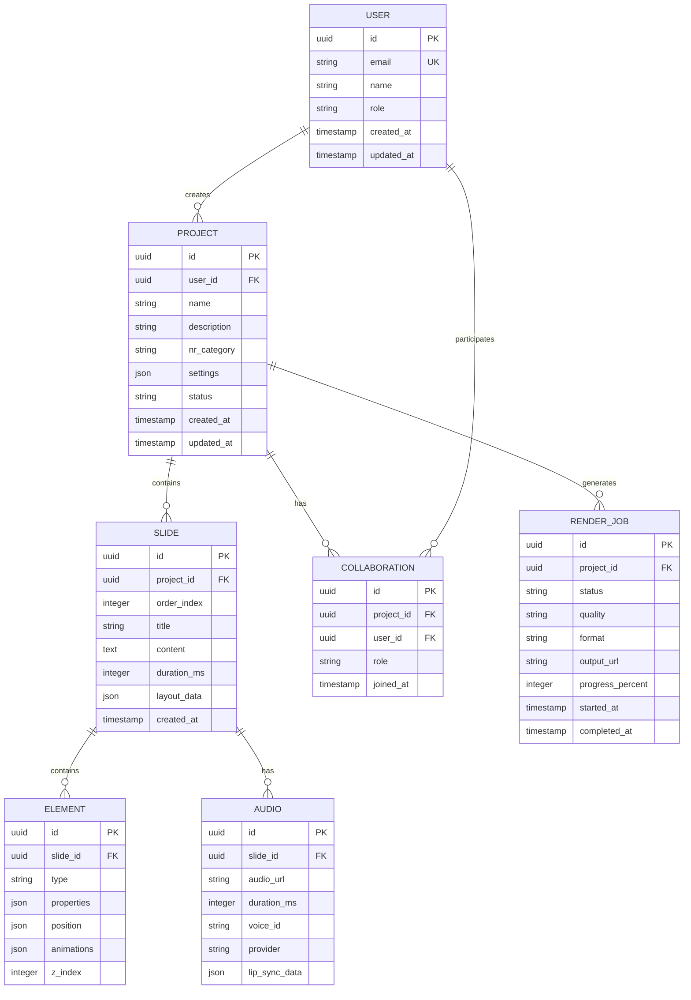

# 🏗️ Arquitetura Técnica - Estúdio IA de Vídeos
## Documento de Arquitetura Técnica - Versão 1.0

> **SISTEMA:** Plataforma de criação de vídeos com IA
> 
> **DATA:** Janeiro 2025 | **VERSÃO:** 1.0 | **STATUS:** Arquitetura Definida

---

## 1. Arquitetura Geral do Sistema



---

## 2. Stack Tecnológica

### Frontend
- **Framework:** Next.js 14 + React 18 + TypeScript
- **Styling:** TailwindCSS 3.4 + Shadcn/ui
- **Animações:** Framer Motion + GSAP
- **3D Graphics:** Three.js + React Three Fiber
- **Canvas:** Fabric.js para editor visual
- **State Management:** Zustand + React Query
- **Build Tool:** Vite (para componentes) + Next.js (para app)

### Backend
- **Runtime:** Node.js 20 + TypeScript
- **Framework:** Next.js API Routes + Express.js (microserviços)
- **Database:** Supabase (PostgreSQL) + Prisma ORM
- **Authentication:** NextAuth.js + Supabase Auth
- **File Processing:** Sharp + FFmpeg
- **Queue System:** Bull Queue + Redis

### Infraestrutura
- **Hosting:** Vercel (frontend) + AWS ECS (backend services)
- **Database:** Supabase (managed PostgreSQL)
- **Storage:** AWS S3 + CloudFront CDN
- **Cache:** Redis Cloud
- **Monitoring:** Vercel Analytics + Sentry
- **CI/CD:** GitHub Actions

---

## 3. Definições de Rotas

### Frontend Routes
| Rota | Propósito | Componente Principal |
|------|-----------|---------------------|
| `/` | Dashboard principal com overview de projetos | DashboardPage |
| `/login` | Página de autenticação | LoginPage |
| `/editor/[projectId]` | Editor visual de vídeos | VideoEditor |
| `/templates` | Galeria de templates NR | TemplatesGallery |
| `/projects` | Lista de projetos do usuário | ProjectsList |
| `/render/[jobId]` | Status de renderização | RenderStatus |
| `/admin/metrics` | Dashboard administrativo | AdminMetrics |
| `/profile` | Configurações do usuário | UserProfile |
| `/collaboration/[projectId]` | Edição colaborativa | CollaborationEditor |

### API Routes
| Rota | Método | Propósito |
|------|--------|----------|
| `/api/auth/[...nextauth]` | GET/POST | Autenticação NextAuth |
| `/api/projects` | GET/POST | CRUD de projetos |
| `/api/upload/pptx` | POST | Upload e processamento PPTX |
| `/api/tts/generate` | POST | Geração de áudio TTS |
| `/api/avatars/generate` | POST | Geração de avatares 3D |
| `/api/render/start` | POST | Iniciar renderização |
| `/api/render/status/[jobId]` | GET | Status da renderização |
| `/api/templates/[category]` | GET | Templates por categoria NR |
| `/api/collaboration/sync` | WebSocket | Sincronização em tempo real |

---

## 4. Definições de API

### 4.1 Autenticação

**POST /api/auth/signin**

Request:
| Param Name | Param Type | isRequired | Description |
|------------|------------|------------|-------------|
| email | string | true | Email do usuário |
| password | string | true | Senha do usuário |

Response:
| Param Name | Param Type | Description |
|------------|------------|-------------|
| user | User | Dados do usuário |
| token | string | JWT token |
| expires | string | Data de expiração |

Example:
```json
{
  "user": {
    "id": "user_123",
    "email": "usuario@empresa.com",
    "name": "João Silva",
    "role": "editor"
  },
  "token": "eyJhbGciOiJIUzI1NiIs...",
  "expires": "2025-02-01T10:00:00Z"
}
```

### 4.2 Upload e Processamento PPTX

**POST /api/upload/pptx**

Request (multipart/form-data):
| Param Name | Param Type | isRequired | Description |
|------------|------------|------------|-------------|
| file | File | true | Arquivo PPTX (max 100MB) |
| projectName | string | false | Nome do projeto |
| autoDetectNR | boolean | false | Detectar NR automaticamente |

Response:
| Param Name | Param Type | Description |
|------------|------------|-------------|
| projectId | string | ID do projeto criado |
| slides | Slide[] | Array de slides processados |
| detectedNR | string | NR detectada (se autoDetectNR=true) |
| processingTime | number | Tempo de processamento em ms |

Example:
```json
{
  "projectId": "proj_456",
  "slides": [
    {
      "id": "slide_1",
      "title": "Introdução à NR-12",
      "content": "Segurança em máquinas e equipamentos",
      "images": ["image_url_1"],
      "duration": 5000
    }
  ],
  "detectedNR": "NR-12",
  "processingTime": 2340
}
```

### 4.3 Geração de TTS

**POST /api/tts/generate**

Request:
| Param Name | Param Type | isRequired | Description |
|------------|------------|------------|-------------|
| text | string | true | Texto para conversão |
| voice | string | true | ID da voz selecionada |
| provider | string | false | Provider TTS (elevenlabs, azure, google) |
| speed | number | false | Velocidade (0.5-2.0) |
| emotion | string | false | Emoção (neutral, confident, concerned) |

Response:
| Param Name | Param Type | Description |
|------------|------------|-------------|
| audioUrl | string | URL do arquivo de áudio |
| duration | number | Duração em milissegundos |
| provider | string | Provider utilizado |
| lipSyncData | object | Dados para sincronização labial |

Example:
```json
{
  "audioUrl": "https://cdn.example.com/audio/tts_789.mp3",
  "duration": 12500,
  "provider": "elevenlabs",
  "lipSyncData": {
    "phonemes": [...],
    "timestamps": [...]
  }
}
```

### 4.4 Renderização de Vídeo

**POST /api/render/start**

Request:
| Param Name | Param Type | isRequired | Description |
|------------|------------|------------|-------------|
| projectId | string | true | ID do projeto |
| quality | string | false | Qualidade (360p, 720p, 1080p, 4k) |
| format | string | false | Formato (mp4, mov, webm) |
| priority | string | false | Prioridade (low, normal, high) |

Response:
| Param Name | Param Type | Description |
|------------|------------|-------------|
| jobId | string | ID do job de renderização |
| estimatedTime | number | Tempo estimado em segundos |
| queuePosition | number | Posição na fila |

Example:
```json
{
  "jobId": "render_job_101",
  "estimatedTime": 180,
  "queuePosition": 3
}
```

---

## 5. Arquitetura de Microserviços



---

## 6. Modelo de Dados

### 6.1 Diagrama ER



### 6.2 DDL (Data Definition Language)

```sql
-- Tabela de usuários
CREATE TABLE users (
    id UUID PRIMARY KEY DEFAULT gen_random_uuid(),
    email VARCHAR(255) UNIQUE NOT NULL,
    name VARCHAR(255) NOT NULL,
    role VARCHAR(50) DEFAULT 'editor' CHECK (role IN ('admin', 'editor', 'viewer')),
    avatar_url TEXT,
    preferences JSONB DEFAULT '{}',
    created_at TIMESTAMP WITH TIME ZONE DEFAULT NOW(),
    updated_at TIMESTAMP WITH TIME ZONE DEFAULT NOW()
);

-- Tabela de projetos
CREATE TABLE projects (
    id UUID PRIMARY KEY DEFAULT gen_random_uuid(),
    user_id UUID NOT NULL REFERENCES users(id) ON DELETE CASCADE,
    name VARCHAR(255) NOT NULL,
    description TEXT,
    nr_category VARCHAR(10) CHECK (nr_category IN ('NR-06', 'NR-10', 'NR-12', 'NR-18', 'NR-33', 'NR-35')),
    settings JSONB DEFAULT '{}',
    status VARCHAR(20) DEFAULT 'draft' CHECK (status IN ('draft', 'editing', 'rendering', 'completed')),
    thumbnail_url TEXT,
    created_at TIMESTAMP WITH TIME ZONE DEFAULT NOW(),
    updated_at TIMESTAMP WITH TIME ZONE DEFAULT NOW()
);

-- Tabela de slides
CREATE TABLE slides (
    id UUID PRIMARY KEY DEFAULT gen_random_uuid(),
    project_id UUID NOT NULL REFERENCES projects(id) ON DELETE CASCADE,
    order_index INTEGER NOT NULL,
    title VARCHAR(255),
    content TEXT,
    duration_ms INTEGER DEFAULT 5000,
    layout_data JSONB DEFAULT '{}',
    background_config JSONB DEFAULT '{}',
    created_at TIMESTAMP WITH TIME ZONE DEFAULT NOW()
);

-- Tabela de elementos (textos, imagens, avatares)
CREATE TABLE elements (
    id UUID PRIMARY KEY DEFAULT gen_random_uuid(),
    slide_id UUID NOT NULL REFERENCES slides(id) ON DELETE CASCADE,
    type VARCHAR(50) NOT NULL CHECK (type IN ('text', 'image', 'avatar', 'shape', 'video')),
    properties JSONB NOT NULL DEFAULT '{}',
    position JSONB NOT NULL DEFAULT '{}',
    animations JSONB DEFAULT '[]',
    z_index INTEGER DEFAULT 0,
    created_at TIMESTAMP WITH TIME ZONE DEFAULT NOW()
);

-- Tabela de áudios
CREATE TABLE audios (
    id UUID PRIMARY KEY DEFAULT gen_random_uuid(),
    slide_id UUID NOT NULL REFERENCES slides(id) ON DELETE CASCADE,
    audio_url TEXT NOT NULL,
    duration_ms INTEGER NOT NULL,
    voice_id VARCHAR(100),
    provider VARCHAR(50) CHECK (provider IN ('elevenlabs', 'azure', 'google', 'synthetic')),
    lip_sync_data JSONB,
    created_at TIMESTAMP WITH TIME ZONE DEFAULT NOW()
);

-- Tabela de jobs de renderização
CREATE TABLE render_jobs (
    id UUID PRIMARY KEY DEFAULT gen_random_uuid(),
    project_id UUID NOT NULL REFERENCES projects(id) ON DELETE CASCADE,
    status VARCHAR(20) DEFAULT 'queued' CHECK (status IN ('queued', 'processing', 'completed', 'failed')),
    quality VARCHAR(10) DEFAULT '1080p' CHECK (quality IN ('360p', '720p', '1080p', '4k')),
    format VARCHAR(10) DEFAULT 'mp4' CHECK (format IN ('mp4', 'mov', 'webm')),
    output_url TEXT,
    progress_percent INTEGER DEFAULT 0,
    error_message TEXT,
    started_at TIMESTAMP WITH TIME ZONE,
    completed_at TIMESTAMP WITH TIME ZONE,
    created_at TIMESTAMP WITH TIME ZONE DEFAULT NOW()
);

-- Tabela de colaboração
CREATE TABLE collaborations (
    id UUID PRIMARY KEY DEFAULT gen_random_uuid(),
    project_id UUID NOT NULL REFERENCES projects(id) ON DELETE CASCADE,
    user_id UUID NOT NULL REFERENCES users(id) ON DELETE CASCADE,
    role VARCHAR(20) DEFAULT 'editor' CHECK (role IN ('owner', 'editor', 'viewer')),
    permissions JSONB DEFAULT '{}',
    joined_at TIMESTAMP WITH TIME ZONE DEFAULT NOW(),
    UNIQUE(project_id, user_id)
);

-- Índices para performance
CREATE INDEX idx_projects_user_id ON projects(user_id);
CREATE INDEX idx_projects_status ON projects(status);
CREATE INDEX idx_slides_project_id ON slides(project_id);
CREATE INDEX idx_slides_order ON slides(project_id, order_index);
CREATE INDEX idx_elements_slide_id ON elements(slide_id);
CREATE INDEX idx_audios_slide_id ON audios(slide_id);
CREATE INDEX idx_render_jobs_project_id ON render_jobs(project_id);
CREATE INDEX idx_render_jobs_status ON render_jobs(status);
CREATE INDEX idx_collaborations_project_id ON collaborations(project_id);
CREATE INDEX idx_collaborations_user_id ON collaborations(user_id);

-- Triggers para updated_at
CREATE OR REPLACE FUNCTION update_updated_at_column()
RETURNS TRIGGER AS $$
BEGIN
    NEW.updated_at = NOW();
    RETURN NEW;
END;
$$ language 'plpgsql';

CREATE TRIGGER update_users_updated_at BEFORE UPDATE ON users
    FOR EACH ROW EXECUTE FUNCTION update_updated_at_column();

CREATE TRIGGER update_projects_updated_at BEFORE UPDATE ON projects
    FOR EACH ROW EXECUTE FUNCTION update_updated_at_column();

-- Dados iniciais
INSERT INTO users (email, name, role) VALUES 
('admin@estudio.ai', 'Administrador', 'admin'),
('demo@empresa.com', 'Usuário Demo', 'editor');

-- Templates de projetos NR
INSERT INTO projects (user_id, name, description, nr_category, status) 
SELECT 
    (SELECT id FROM users WHERE email = 'admin@estudio.ai'),
    'Template ' || nr,
    'Template padrão para treinamentos ' || nr,
    nr,
    'completed'
FROM (VALUES ('NR-06'), ('NR-10'), ('NR-12'), ('NR-18'), ('NR-33'), ('NR-35')) AS t(nr);
```

---

## 7. Segurança e Compliance

### 7.1 Autenticação e Autorização
- **NextAuth.js** com providers OAuth (Google, Microsoft)
- **JWT tokens** com refresh automático
- **RBAC** (Role-Based Access Control)
- **Session management** com Redis
- **Rate limiting** por IP e usuário

### 7.2 Proteção de Dados
- **HTTPS** obrigatório em produção
- **Criptografia AES-256** para dados sensíveis
- **Backup automático** a cada 6 horas
- **Retenção de dados** configurável por empresa
- **LGPD compliance** com consentimento explícito

### 7.3 Segurança de Upload
- **Validação de tipo MIME** rigorosa
- **Scan antivírus** automático
- **Quarentena** para arquivos suspeitos
- **Limite de tamanho** por tipo de arquivo
- **Sanitização** de metadados

---

## 8. Performance e Escalabilidade

### 8.1 Frontend Performance
- **Code splitting** automático com Next.js
- **Lazy loading** de componentes pesados
- **Service Worker** para cache offline
- **CDN** para assets estáticos
- **Compressão Gzip/Brotli**

### 8.2 Backend Scalability
- **Horizontal scaling** com containers
- **Load balancing** com NGINX
- **Database connection pooling**
- **Redis caching** para queries frequentes
- **Queue system** para processamento assíncrono

### 8.3 Monitoramento
- **Application Performance Monitoring** (Sentry)
- **Real User Monitoring** (Vercel Analytics)
- **Infrastructure monitoring** (AWS CloudWatch)
- **Custom metrics** para KPIs de negócio
- **Alerting** automático para incidentes

---

## 9. Deploy e DevOps

### 9.1 CI/CD Pipeline
```yaml
# .github/workflows/deploy.yml
name: Deploy to Production

on:
  push:
    branches: [main]

jobs:
  test:
    runs-on: ubuntu-latest
    steps:
      - uses: actions/checkout@v3
      - uses: actions/setup-node@v3
      - run: npm ci
      - run: npm run test
      - run: npm run build
  
  deploy:
    needs: test
    runs-on: ubuntu-latest
    steps:
      - uses: actions/checkout@v3
      - uses: vercel/action@v1
        with:
          vercel-token: ${{ secrets.VERCEL_TOKEN }}
```

### 9.2 Ambientes
- **Development:** Local + Supabase local
- **Staging:** Vercel Preview + Supabase staging
- **Production:** Vercel + Supabase production

### 9.3 Backup e Disaster Recovery
- **Database backup** diário automático
- **File storage replication** multi-região
- **RTO:** 4 horas
- **RPO:** 1 hora
- **Disaster recovery plan** documentado

---

## 10. Integrações Externas

### 10.1 Provedores TTS
- **ElevenLabs:** Vozes premium naturais
- **Azure Cognitive Services:** Síntese profissional
- **Google Cloud TTS:** Vozes neurais brasileiras
- **Fallback sintético:** Web Speech API

### 10.2 Serviços de IA
- **OpenAI GPT-4:** Análise de conteúdo PPTX
- **Anthropic Claude:** Compliance checking
- **Hugging Face:** Modelos open source
- **Ready Player Me:** Criação de avatares

### 10.3 Infraestrutura
- **AWS S3:** Armazenamento de arquivos
- **CloudFront:** CDN global
- **Vercel:** Hosting frontend
- **Supabase:** Database e auth
- **Redis Cloud:** Cache e sessions

---

**Documento aprovado por:** [Nome do Tech Lead]
**Data de aprovação:** [Data]
**Próxima revisão:** [Data + 30 dias]