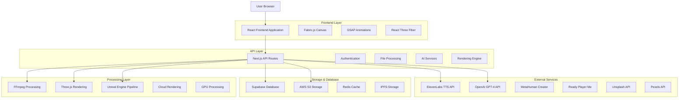
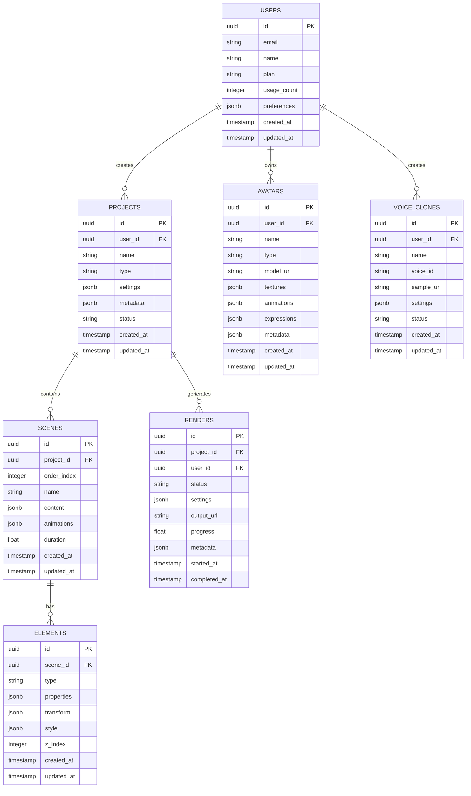

# 🏗️ ARQUITETURA TÉCNICA MASTER
## Estúdio IA de Vídeos - Especificações Técnicas Completas

> **DOCUMENTO TÉCNICO:** Arquitetura completa, stack tecnológico e especificações de implementação para todas as 7 fases do projeto.

---

## 1. Arquitetura Geral do Sistema



## 2. Stack Tecnológico Detalhado

### **Frontend Stack**
- **Framework:** Next.js 14 + React 18 + TypeScript
- **UI Library:** Shadcn/UI + Tailwind CSS
- **Canvas Editor:** Fabric.js + Konva.js
- **3D Graphics:** Three.js + React Three Fiber
- **Animations:** GSAP Professional + React Spring
- **State Management:** Zustand + React Query
- **Forms:** React Hook Form + Zod validation

### **Backend Stack**
- **Runtime:** Node.js 18+ + Next.js API Routes
- **Database:** Supabase (PostgreSQL)
- **Authentication:** Supabase Auth + NextAuth.js
- **File Storage:** AWS S3 + CloudFront CDN
- **Cache:** Redis + React Query
- **Processing:** FFmpeg + Sharp + Canvas API

### **AI & ML Services**
- **TTS:** ElevenLabs Premium + Azure Speech + Google TTS
- **LLM:** OpenAI GPT-4 Turbo + Claude 3.5 Sonnet
- **Computer Vision:** MediaPipe + TensorFlow.js
- **Image Generation:** DALL-E 3 + Stable Diffusion
- **3D Avatars:** Unreal Engine 5 + MetaHuman + Ready Player Me

### **DevOps & Infrastructure**
- **Deployment:** Vercel + AWS + Docker
- **Monitoring:** Sentry + DataDog + Prometheus
- **Testing:** Jest + Playwright + Storybook
- **CI/CD:** GitHub Actions + Vercel

## 3. Definições de Rotas Frontend

| Route | Purpose | Components |
|-------|---------|------------|
| `/` | Landing page | `LandingPage`, `HeroSection` |
| `/dashboard` | Main dashboard | `DashboardHome`, `ProjectGrid` |
| `/editor` | PPTX Editor | `PPTXCanvasEditor`, `TimelineEditor` |
| `/talking-photo` | Talking Photo Studio | `TalkingPhotoStudio`, `AvatarSelector` |
| `/avatars` | 3D Avatar Creator | `Avatar3DStudio`, `MetaHumanImporter` |
| `/templates` | Template Library | `TemplateGallery`, `NRTemplates` |
| `/render` | Render Queue | `RenderManager`, `QueueMonitor` |
| `/analytics` | Analytics Dashboard | `MetricsDashboard`, `UsageAnalytics` |
| `/settings` | User Settings | `ProfileSettings`, `APIConfiguration` |
| `/mobile` | Mobile App | `MobileStudio`, `PWAInterface` |

## 4. APIs e Microserviços

### **4.1 Core APIs**

#### **Authentication & Users**
```typescript
// User authentication
POST /api/auth/login
POST /api/auth/register
POST /api/auth/logout
GET /api/auth/session

// User management
GET /api/users/profile
PUT /api/users/profile
GET /api/users/usage
POST /api/users/upgrade
```

#### **PPTX Processing**
```typescript
// PPTX upload and processing
POST /api/v1/pptx/upload
GET /api/v1/pptx/process/{id}
POST /api/v1/pptx/extract-content
POST /api/v1/pptx/generate-scenes
GET /api/v1/pptx/validate
DELETE /api/v1/pptx/{id}

// Request/Response Types
interface PPTXUploadRequest {
  file: File
  projectName: string
  options: {
    extractImages: boolean
    generateScenes: boolean
    autoNarration: boolean
  }
}

interface PPTXUploadResponse {
  id: string
  status: 'processing' | 'completed' | 'error'
  progress: number
  scenes: Scene[]
  assets: Asset[]
  metadata: PPTXMetadata
}
```

#### **TTS & Voice Services**
```typescript
// ElevenLabs TTS
GET /api/v1/tts/elevenlabs/voices
POST /api/v1/tts/elevenlabs/generate
POST /api/v1/voice-cloning/elevenlabs
POST /api/v1/tts/batch-process
GET /api/v1/tts/streaming/{id}

// TTS Request/Response
interface TTSRequest {
  text: string
  voiceId: string
  settings: {
    stability: number
    similarityBoost: number
    style: number
    speakerBoost: boolean
  }
}

interface TTSResponse {
  audioUrl: string
  duration: number
  phonemes: Phoneme[]
  lipSyncData: LipSyncFrame[]
  metadata: AudioMetadata
}
```

#### **3D Avatar Services**
```typescript
// Avatar management
GET /api/v1/avatars/list
POST /api/v1/avatars/create
PUT /api/v1/avatars/{id}
DELETE /api/v1/avatars/{id}
POST /api/v1/avatars/import-metahuman
POST /api/v1/avatars/customize

// Avatar Types
interface Avatar3D {
  id: string
  name: string
  type: 'metahuman' | 'readyplayerme' | 'custom'
  modelUrl: string
  textureUrls: string[]
  animations: Animation[]
  expressions: Expression[]
  metadata: AvatarMetadata
}
```

#### **Rendering Services**
```typescript
// Video rendering
POST /api/v1/render/start
GET /api/v1/render/status/{id}
GET /api/v1/render/download/{id}
DELETE /api/v1/render/{id}
POST /api/v1/render/batch

// Render Request
interface RenderRequest {
  projectId: string
  settings: {
    resolution: '720p' | '1080p' | '4K' | '8K'
    fps: 24 | 30 | 60
    codec: 'h264' | 'h265' | 'prores'
    quality: 'draft' | 'standard' | 'high' | 'ultra'
  }
  scenes: Scene[]
  audio: AudioTrack[]
  effects: Effect[]
}
```

#### **AI Content Generation**
```typescript
// AI services
POST /api/v1/ai/generate-script
POST /api/v1/ai/optimize-content
POST /api/v1/ai/generate-images
POST /api/v1/ai/analyze-video
POST /api/v1/ai/translate

// AI Request Types
interface ScriptGenerationRequest {
  topic: string
  audience: string
  duration: number
  tone: 'professional' | 'casual' | 'educational'
  language: string
  nrCompliance?: boolean
}
```

### **4.2 External API Integrations**

#### **Stock Media APIs**
```typescript
// Unsplash Integration
GET /api/v1/stock/unsplash/search
GET /api/v1/stock/unsplash/download/{id}

// Pexels Integration
GET /api/v1/stock/pexels/search
GET /api/v1/stock/pexels/download/{id}

// Freepik Integration
GET /api/v1/stock/freepik/search
GET /api/v1/stock/freepik/download/{id}
```

## 5. Arquitetura de Dados

### **5.1 Modelo de Dados Principal**



### **5.2 DDL (Data Definition Language)**

```sql
-- Users table
CREATE TABLE users (
    id UUID PRIMARY KEY DEFAULT gen_random_uuid(),
    email VARCHAR(255) UNIQUE NOT NULL,
    name VARCHAR(100) NOT NULL,
    plan VARCHAR(20) DEFAULT 'free' CHECK (plan IN ('free', 'pro', 'enterprise')),
    usage_count INTEGER DEFAULT 0,
    preferences JSONB DEFAULT '{}',
    created_at TIMESTAMP WITH TIME ZONE DEFAULT NOW(),
    updated_at TIMESTAMP WITH TIME ZONE DEFAULT NOW()
);

-- Projects table
CREATE TABLE projects (
    id UUID PRIMARY KEY DEFAULT gen_random_uuid(),
    user_id UUID NOT NULL REFERENCES users(id) ON DELETE CASCADE,
    name VARCHAR(255) NOT NULL,
    type VARCHAR(50) NOT NULL CHECK (type IN ('pptx', 'talking_photo', 'avatar_3d', 'custom')),
    settings JSONB DEFAULT '{}',
    metadata JSONB DEFAULT '{}',
    status VARCHAR(20) DEFAULT 'draft' CHECK (status IN ('draft', 'processing', 'completed', 'error')),
    created_at TIMESTAMP WITH TIME ZONE DEFAULT NOW(),
    updated_at TIMESTAMP WITH TIME ZONE DEFAULT NOW()
);

-- Scenes table
CREATE TABLE scenes (
    id UUID PRIMARY KEY DEFAULT gen_random_uuid(),
    project_id UUID NOT NULL REFERENCES projects(id) ON DELETE CASCADE,
    order_index INTEGER NOT NULL,
    name VARCHAR(255) NOT NULL,
    content JSONB DEFAULT '{}',
    animations JSONB DEFAULT '{}',
    duration FLOAT DEFAULT 0,
    created_at TIMESTAMP WITH TIME ZONE DEFAULT NOW(),
    updated_at TIMESTAMP WITH TIME ZONE DEFAULT NOW()
);

-- Elements table
CREATE TABLE elements (
    id UUID PRIMARY KEY DEFAULT gen_random_uuid(),
    scene_id UUID NOT NULL REFERENCES scenes(id) ON DELETE CASCADE,
    type VARCHAR(50) NOT NULL CHECK (type IN ('text', 'image', 'video', 'avatar', 'shape', 'effect')),
    properties JSONB DEFAULT '{}',
    transform JSONB DEFAULT '{}',
    style JSONB DEFAULT '{}',
    z_index INTEGER DEFAULT 0,
    created_at TIMESTAMP WITH TIME ZONE DEFAULT NOW(),
    updated_at TIMESTAMP WITH TIME ZONE DEFAULT NOW()
);

-- Avatars table
CREATE TABLE avatars (
    id UUID PRIMARY KEY DEFAULT gen_random_uuid(),
    user_id UUID NOT NULL REFERENCES users(id) ON DELETE CASCADE,
    name VARCHAR(255) NOT NULL,
    type VARCHAR(50) NOT NULL CHECK (type IN ('metahuman', 'readyplayerme', 'custom')),
    model_url TEXT NOT NULL,
    textures JSONB DEFAULT '{}',
    animations JSONB DEFAULT '{}',
    expressions JSONB DEFAULT '{}',
    metadata JSONB DEFAULT '{}',
    created_at TIMESTAMP WITH TIME ZONE DEFAULT NOW(),
    updated_at TIMESTAMP WITH TIME ZONE DEFAULT NOW()
);

-- Renders table
CREATE TABLE renders (
    id UUID PRIMARY KEY DEFAULT gen_random_uuid(),
    project_id UUID NOT NULL REFERENCES projects(id) ON DELETE CASCADE,
    user_id UUID NOT NULL REFERENCES users(id) ON DELETE CASCADE,
    status VARCHAR(20) DEFAULT 'queued' CHECK (status IN ('queued', 'processing', 'completed', 'error', 'cancelled')),
    settings JSONB DEFAULT '{}',
    output_url TEXT,
    progress FLOAT DEFAULT 0,
    metadata JSONB DEFAULT '{}',
    started_at TIMESTAMP WITH TIME ZONE,
    completed_at TIMESTAMP WITH TIME ZONE,
    created_at TIMESTAMP WITH TIME ZONE DEFAULT NOW()
);

-- Voice clones table
CREATE TABLE voice_clones (
    id UUID PRIMARY KEY DEFAULT gen_random_uuid(),
    user_id UUID NOT NULL REFERENCES users(id) ON DELETE CASCADE,
    name VARCHAR(255) NOT NULL,
    voice_id VARCHAR(255) NOT NULL,
    sample_url TEXT NOT NULL,
    settings JSONB DEFAULT '{}',
    status VARCHAR(20) DEFAULT 'processing' CHECK (status IN ('processing', 'completed', 'error')),
    created_at TIMESTAMP WITH TIME ZONE DEFAULT NOW(),
    updated_at TIMESTAMP WITH TIME ZONE DEFAULT NOW()
);

-- Indexes for performance
CREATE INDEX idx_projects_user_id ON projects(user_id);
CREATE INDEX idx_projects_status ON projects(status);
CREATE INDEX idx_scenes_project_id ON scenes(project_id);
CREATE INDEX idx_scenes_order ON scenes(project_id, order_index);
CREATE INDEX idx_elements_scene_id ON elements(scene_id);
CREATE INDEX idx_elements_type ON elements(type);
CREATE INDEX idx_avatars_user_id ON avatars(user_id);
CREATE INDEX idx_avatars_type ON avatars(type);
CREATE INDEX idx_renders_user_id ON renders(user_id);
CREATE INDEX idx_renders_status ON renders(status);
CREATE INDEX idx_voice_clones_user_id ON voice_clones(user_id);

-- Row Level Security (RLS)
ALTER TABLE projects ENABLE ROW LEVEL SECURITY;
ALTER TABLE scenes ENABLE ROW LEVEL SECURITY;
ALTER TABLE elements ENABLE ROW LEVEL SECURITY;
ALTER TABLE avatars ENABLE ROW LEVEL SECURITY;
ALTER TABLE renders ENABLE ROW LEVEL SECURITY;
ALTER TABLE voice_clones ENABLE ROW LEVEL SECURITY;

-- RLS Policies
CREATE POLICY "Users can only access their own projects" ON projects
    FOR ALL USING (auth.uid() = user_id);

CREATE POLICY "Users can only access scenes from their projects" ON scenes
    FOR ALL USING (auth.uid() IN (
        SELECT user_id FROM projects WHERE id = scenes.project_id
    ));

CREATE POLICY "Users can only access their own avatars" ON avatars
    FOR ALL USING (auth.uid() = user_id);

CREATE POLICY "Users can only access their own renders" ON renders
    FOR ALL USING (auth.uid() = user_id);

CREATE POLICY "Users can only access their own voice clones" ON voice_clones
    FOR ALL USING (auth.uid() = user_id);
```

## 6. Arquitetura de Componentes

### **6.1 Estrutura de Componentes Frontend**

```
app/components/
├── ui/                     # Componentes base (Shadcn/UI)
├── layout/                 # Layout components
├── auth/                   # Authentication components
├── dashboard/              # Dashboard components
├── pptx/                   # PPTX editor components
│   ├── PPTXUploadReal.tsx
│   ├── PPTXCanvasEditor.tsx
│   ├── PPTXTimelineEditor.tsx
│   ├── PPTXLayerManager.tsx
│   └── PPTXAnimationPanel.tsx
├── avatars/                # 3D Avatar components
│   ├── Avatar3DStudio.tsx
│   ├── MetaHumanImporter.tsx
│   ├── AvatarCustomizer.tsx
│   └── ExpressionLibrary.tsx
├── tts/                    # TTS components
│   ├── ElevenLabsProvider.tsx
│   ├── TTSVoiceSelector.tsx
│   ├── VoiceCloningStudio.tsx
│   └── NarrationTimeline.tsx
├── effects/                # VFX components
│   ├── TransitionEffectsPanel.tsx
│   ├── ParticleSystemEditor.tsx
│   ├── EffectPreviewCanvas.tsx
│   └── GSAPAnimationController.tsx
├── render/                 # Rendering components
│   ├── RenderManager.tsx
│   ├── QueueMonitor.tsx
│   ├── FFmpegProcessor.tsx
│   └── CloudRenderManager.tsx
├── ai/                     # AI components
│   ├── GPT4ContentGenerator.tsx
│   ├── ImageGenerationStudio.tsx
│   ├── VideoAnalysisEngine.tsx
│   └── ContentOptimizer.tsx
├── mobile/                 # Mobile components
│   ├── MobileStudio.tsx
│   ├── PWAInstallPrompt.tsx
│   └── TouchGestureHandler.tsx
└── blockchain/             # Blockchain components
    ├── CertificateMinter.tsx
    ├── BlockchainVerifier.tsx
    └── SmartContractManager.tsx
```

### **6.2 Hooks e Utilities**

```typescript
// Custom hooks
app/hooks/
├── useAuth.ts              # Authentication hook
├── useProject.ts           # Project management
├── usePPTXProcessor.ts     # PPTX processing
├── useAvatar3D.ts          # 3D avatar management
├── useTTS.ts               # TTS functionality
├── useRender.ts            # Rendering management
├── useAI.ts                # AI services
└── useBlockchain.ts        # Blockchain integration

// Utility functions
app/lib/
├── utils.ts                # General utilities
├── api.ts                  # API client
├── auth.ts                 # Auth utilities
├── canvas.ts               # Canvas utilities
├── ffmpeg.ts               # Video processing
├── three.ts                # 3D utilities
├── ai.ts                   # AI utilities
└── blockchain.ts           # Blockchain utilities
```

## 7. Configuração de Ambiente

### **7.1 Variáveis de Ambiente**

```env
# .env.local
# Database
NEXT_PUBLIC_SUPABASE_URL=your_supabase_url
NEXT_PUBLIC_SUPABASE_ANON_KEY=your_supabase_anon_key
SUPABASE_SERVICE_ROLE_KEY=your_service_role_key

# AWS Services
AWS_ACCESS_KEY_ID=your_aws_access_key
AWS_SECRET_ACCESS_KEY=your_aws_secret_key
AWS_REGION=us-east-1
AWS_S3_BUCKET=estudio-ia-assets
AWS_CLOUDFRONT_DOMAIN=your_cloudfront_domain

# AI Services
OPENAI_API_KEY=your_openai_key
ELEVENLABS_API_KEY=your_elevenlabs_key
ANTHROPIC_API_KEY=your_anthropic_key
GOOGLE_AI_API_KEY=your_google_ai_key

# Stock Media APIs
UNSPLASH_ACCESS_KEY=your_unsplash_key
PEXELS_API_KEY=your_pexels_key
FREEPIK_API_KEY=your_freepik_key

# 3D Services
METAHUMAN_API_KEY=your_metahuman_key
READYPLAYERME_APP_ID=your_rpm_app_id

# Monitoring
SENTRY_DSN=your_sentry_dsn
DATADOG_API_KEY=your_datadog_key

# Blockchain
ETHEREUM_RPC_URL=your_ethereum_rpc
PRIVATE_KEY=your_private_key
CONTRACT_ADDRESS=your_contract_address

# Redis
REDIS_URL=your_redis_url

# NextAuth
NEXTAUTH_SECRET=your_nextauth_secret
NEXTAUTH_URL=http://localhost:3000
```

### **7.2 Configuração de Dependências**

```json
{
  "dependencies": {
    "next": "^14.0.0",
    "react": "^18.0.0",
    "typescript": "^5.0.0",
    "@supabase/supabase-js": "^2.38.0",
    "@aws-sdk/client-s3": "^3.450.0",
    "fabric": "^5.3.0",
    "three": "^0.158.0",
    "@react-three/fiber": "^8.15.0",
    "gsap": "^3.12.0",
    "elevenlabs": "^0.4.0",
    "openai": "^4.20.0",
    "@ffmpeg/ffmpeg": "^0.12.0",
    "sharp": "^0.32.0",
    "pptxgenjs": "^3.12.0",
    "react-dropzone": "^14.2.0",
    "konva": "^9.2.0",
    "lottie-react": "^2.4.0",
    "web3": "^4.2.0",
    "ethers": "^6.8.0"
  },
  "devDependencies": {
    "@types/node": "^20.0.0",
    "@types/react": "^18.0.0",
    "@types/three": "^0.158.0",
    "@types/fabric": "^5.3.0",
    "jest": "^29.7.0",
    "@testing-library/react": "^13.4.0",
    "playwright": "^1.40.0",
    "eslint": "^8.0.0",
    "prettier": "^3.0.0"
  }
}
```

## 8. Padrões de Desenvolvimento

### **8.1 Estrutura de Arquivos**

```
app/
├── (auth)/                 # Auth group routes
├── (dashboard)/            # Dashboard group routes
├── api/                    # API routes
│   ├── v1/
│   │   ├── pptx/
│   │   ├── tts/
│   │   ├── avatars/
│   │   ├── render/
│   │   └── ai/
├── components/             # React components
├── hooks/                  # Custom hooks
├── lib/                    # Utilities and configs
├── types/                  # TypeScript types
├── styles/                 # Global styles
└── workers/                # Web workers
```

### **8.2 Convenções de Código**

```typescript
// Naming conventions
// Components: PascalCase
export const PPTXCanvasEditor = () => {}

// Hooks: camelCase with 'use' prefix
export const usePPTXProcessor = () => {}

// Types: PascalCase with descriptive names
interface PPTXProcessingOptions {
  extractImages: boolean
  generateScenes: boolean
}

// Constants: UPPER_SNAKE_CASE
const MAX_FILE_SIZE = 100 * 1024 * 1024 // 100MB

// API routes: kebab-case
// /api/v1/pptx/extract-content
```

### **8.3 Error Handling**

```typescript
// Error boundary pattern
export class ErrorBoundary extends Component {
  constructor(props: Props) {
    super(props)
    this.state = { hasError: false }
  }

  static getDerivedStateFromError(error: Error) {
    return { hasError: true }
  }

  componentDidCatch(error: Error, errorInfo: ErrorInfo) {
    console.error('Error caught by boundary:', error, errorInfo)
    // Send to monitoring service
  }
}

// API error handling
export const handleAPIError = (error: unknown) => {
  if (error instanceof Error) {
    console.error('API Error:', error.message)
    toast.error(error.message)
  } else {
    console.error('Unknown error:', error)
    toast.error('An unexpected error occurred')
  }
}
```

## 9. Performance e Otimização

### **9.1 Estratégias de Performance**

- **Code Splitting:** Lazy loading de componentes pesados
- **Image Optimization:** Next.js Image component + Sharp
- **Caching:** Redis para dados frequentes
- **CDN:** CloudFront para assets estáticos
- **Bundle Analysis:** Webpack Bundle Analyzer
- **Memory Management:** Cleanup de recursos 3D

### **9.2 Monitoramento**

```typescript
// Performance monitoring
import { getCLS, getFID, getFCP, getLCP, getTTFB } from 'web-vitals'

function sendToAnalytics(metric: any) {
  // Send to DataDog or similar
  console.log(metric)
}

getCLS(sendToAnalytics)
getFID(sendToAnalytics)
getFCP(sendToAnalytics)
getLCP(sendToAnalytics)
getTTFB(sendToAnalytics)
```

## 10. Segurança

### **10.1 Medidas de Segurança**

- **Authentication:** Supabase Auth + JWT
- **Authorization:** Row Level Security (RLS)
- **Input Validation:** Zod schemas
- **File Upload:** Tipo e tamanho validation
- **API Rate Limiting:** Redis-based
- **CORS:** Configuração restritiva
- **CSP:** Content Security Policy
- **HTTPS:** SSL/TLS obrigatório

### **10.2 Validação de Dados**

```typescript
import { z } from 'zod'

// Schema validation
const PPTXUploadSchema = z.object({
  file: z.instanceof(File),
  projectName: z.string().min(1).max(255),
  options: z.object({
    extractImages: z.boolean(),
    generateScenes: z.boolean(),
    autoNarration: z.boolean()
  })
})

// Usage
const validatePPTXUpload = (data: unknown) => {
  return PPTXUploadSchema.parse(data)
}
```

---

**Esta arquitetura técnica serve como base sólida para a implementação completa e escalável do Estúdio IA de Vídeos.**

**Autor:** SOLO Document  
**Data:** Janeiro 2025  
**Versão:** 1.0 - Master Technical Architecture  
**Status:** 🏗️ **READY FOR IMPLEMENTATION**