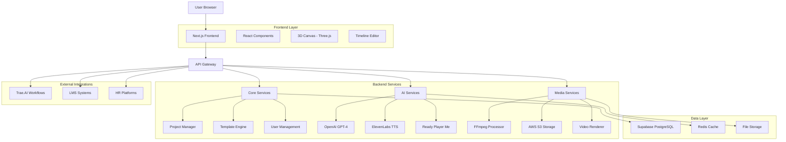
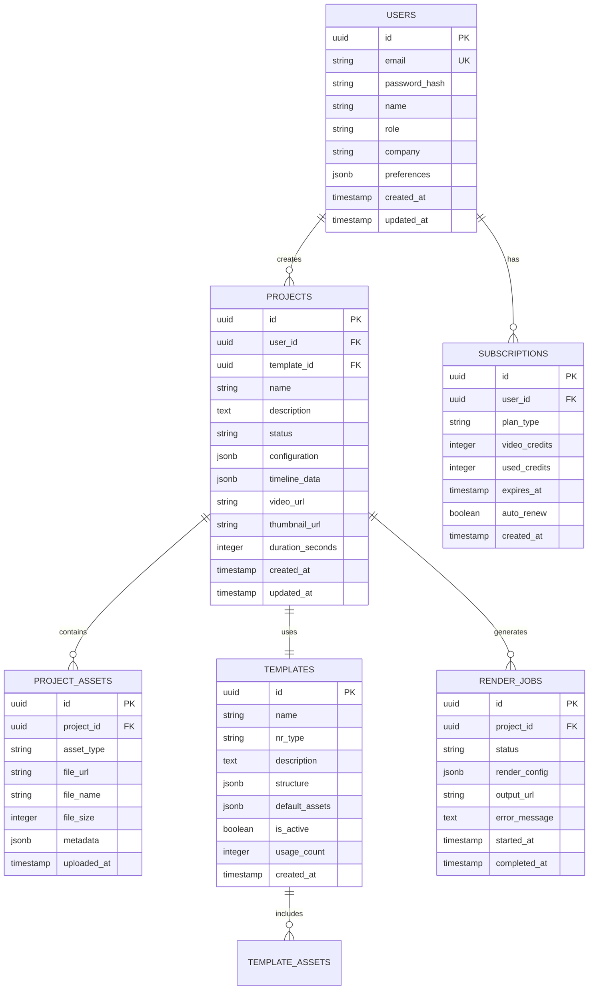
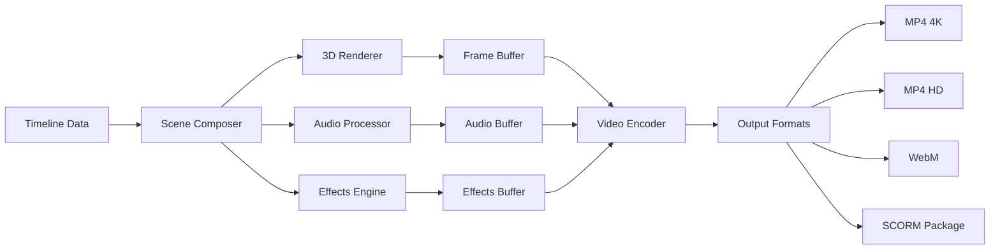

# 🏗️ ARQUITETURA TÉCNICA DETALHADA
## Estúdio IA de Vídeos - Sistema Low-Code/No-Code para Treinamentos NR

> **DOCUMENTO TÉCNICO | Versão 2.0 | Foco: Implementação e Escalabilidade**
> 
> **Complementa:** Análise Consolidada e Roadmap Estratégico

---

## 1. Arquitetura Geral do Sistema

### 1.1 Visão Arquitetural



### 1.2 Princípios Arquiteturais

#### **Microserviços Modulares**
- **Separação de responsabilidades** por domínio funcional
- **Escalabilidade independente** de cada serviço
- **Tolerância a falhas** com circuit breakers
- **Observabilidade completa** com logs e métricas

#### **API-First Design**
- **RESTful APIs** para operações CRUD
- **GraphQL** para queries complexas
- **WebSockets** para atualizações em tempo real
- **Webhooks** para integrações externas

#### **Cloud-Native**
- **Containerização** com Docker
- **Orquestração** com Kubernetes (futuro)
- **Auto-scaling** baseado em demanda
- **Multi-region deployment** para latência

---

## 2. Stack Tecnológico Detalhado

### 2.1 Frontend Stack

#### **Core Framework**
```json
{
  "framework": "Next.js 14",
  "language": "TypeScript 5.0+",
  "styling": "TailwindCSS 3.3+",
  "stateManagement": "Zustand + React Query",
  "routing": "Next.js App Router",
  "bundler": "Turbopack"
}
```

#### **UI/UX Libraries**
```json
{
  "components": "@radix-ui/react + shadcn/ui",
  "animations": "Framer Motion + GSAP Pro",
  "icons": "Lucide React + Heroicons",
  "forms": "React Hook Form + Zod",
  "charts": "Recharts + D3.js",
  "notifications": "React Hot Toast"
}
```

#### **3D e Multimedia**
```json
{
  "3d_engine": "Three.js + React Three Fiber",
  "3d_helpers": "@react-three/drei + @react-three/postprocessing",
  "video_processing": "FFmpeg.wasm",
  "audio_processing": "Web Audio API + Tone.js",
  "canvas_editing": "Fabric.js + Konva.js",
  "timeline": "Custom React Timeline Component"
}
```

### 2.2 Backend Stack

#### **Runtime e Framework**
```json
{
  "runtime": "Node.js 20 LTS",
  "framework": "Next.js API Routes + tRPC",
  "language": "TypeScript 5.0+",
  "validation": "Zod + Joi",
  "testing": "Jest + Supertest",
  "documentation": "OpenAPI 3.0 + Swagger"
}
```

#### **Database e Cache**
```json
{
  "primary_db": "Supabase (PostgreSQL 15)",
  "cache": "Redis 7.0+",
  "search": "PostgreSQL Full-Text Search",
  "file_storage": "AWS S3 + Supabase Storage",
  "cdn": "AWS CloudFront",
  "backup": "Automated Daily Snapshots"
}
```

#### **Processamento e IA**
```json
{
  "video_processing": "FFmpeg + AWS Elemental",
  "image_processing": "Sharp + ImageMagick",
  "ai_orchestration": "LangChain + Custom Agents",
  "queue_system": "Bull Queue + Redis",
  "background_jobs": "Node-cron + Agenda.js",
  "monitoring": "Sentry + DataDog"
}
```

### 2.3 Serviços Externos Premium

#### **IA e Machine Learning**
```json
{
  "llm_primary": "OpenAI GPT-4 Turbo",
  "llm_fallback": "Anthropic Claude 3",
  "tts_primary": "ElevenLabs Professional",
  "tts_fallback": "Azure Cognitive Services",
  "avatar_creation": "Ready Player Me Enterprise",
  "image_generation": "DALL-E 3 + Midjourney API"
}
```

#### **Infraestrutura Cloud**
```json
{
  "hosting": "Vercel Pro + AWS EC2",
  "database": "Supabase Pro",
  "storage": "AWS S3 + CloudFront",
  "media_processing": "AWS Elemental MediaConvert",
  "monitoring": "Vercel Analytics + Sentry",
  "security": "AWS WAF + Cloudflare"
}
```

---

## 3. Definições de Rotas

### 3.1 Rotas Frontend

| Rota | Propósito | Componente Principal |
|------|-----------|---------------------|
| `/` | Landing page pública | `HomePage` |
| `/dashboard` | Hub central do usuário | `DashboardHub` |
| `/create` | Assistente de criação IA | `AICreationWizard` |
| `/editor/[projectId]` | Editor completo de vídeo | `VideoEditor` |
| `/projects` | Galeria de projetos | `ProjectGallery` |
| `/templates` | Biblioteca de templates NR | `TemplateLibrary` |
| `/assets` | Gerenciador de assets | `AssetManager` |
| `/analytics` | Dashboard de métricas | `AnalyticsDashboard` |
| `/settings` | Configurações da conta | `UserSettings` |
| `/admin` | Painel administrativo | `AdminPanel` |

### 3.2 Rotas API Internas

#### **Autenticação e Usuários**
```typescript
// /api/auth/*
POST   /api/auth/login          // Login com email/senha
POST   /api/auth/register       // Registro de novo usuário
POST   /api/auth/logout         // Logout e invalidação de sessão
GET    /api/auth/me             // Dados do usuário atual
POST   /api/auth/refresh        // Renovação de token
POST   /api/auth/forgot         // Recuperação de senha

// /api/users/*
GET    /api/users/profile       // Perfil do usuário
PUT    /api/users/profile       // Atualização de perfil
GET    /api/users/subscription  // Status da assinatura
POST   /api/users/upgrade       // Upgrade de plano
```

#### **Projetos e Templates**
```typescript
// /api/projects/*
GET    /api/projects            // Lista projetos do usuário
POST   /api/projects            // Criar novo projeto
GET    /api/projects/[id]       // Detalhes do projeto
PUT    /api/projects/[id]       // Atualizar projeto
DELETE /api/projects/[id]       // Deletar projeto
POST   /api/projects/[id]/clone // Clonar projeto

// /api/templates/*
GET    /api/templates           // Lista templates disponíveis
GET    /api/templates/nr/[type] // Templates específicos por NR
POST   /api/templates/apply     // Aplicar template a projeto
```

#### **IA e Processamento**
```typescript
// /api/ai/*
POST   /api/ai/analyze-content  // Análise de conteúdo PPTX
POST   /api/ai/generate-script  // Geração de roteiro
POST   /api/ai/suggest-template // Sugestão de template
POST   /api/ai/chat             // Chat com assistente IA

// /api/media/*
POST   /api/media/upload        // Upload de arquivos
POST   /api/media/process       // Processamento de mídia
GET    /api/media/[id]/status   // Status do processamento
POST   /api/media/render        // Renderização de vídeo
```

---

## 4. APIs de Integração Externa

### 4.1 Integração Trae.AI

#### **Webhooks Bidirecionais**
```typescript
// Recebidos do Trae.AI
POST /api/webhooks/trae/project-create
POST /api/webhooks/trae/batch-process
POST /api/webhooks/trae/status-update

// Enviados para Trae.AI
POST https://api.trae.ai/webhooks/estudio/project-complete
POST https://api.trae.ai/webhooks/estudio/error-occurred
POST https://api.trae.ai/webhooks/estudio/batch-complete
```

#### **API Endpoints para Trae.AI**
```typescript
// Criação automatizada de projetos
POST /api/v1/trae/projects/create
{
  "employee_data": {
    "id": "string",
    "name": "string",
    "role": "string",
    "department": "string",
    "hire_date": "date"
  },
  "nr_requirements": ["NR-10", "NR-12"],
  "template_preferences": {
    "template_id": "string",
    "company_branding": {
      "logo_url": "string",
      "colors": {
        "primary": "#FF6B35",
        "secondary": "#004D40"
      }
    }
  },
  "delivery_options": {
    "format": "mp4",
    "quality": "hd",
    "include_scorm": true,
    "webhook_url": "string"
  }
}

// Resposta
{
  "success": true,
  "project_id": "uuid",
  "estimated_completion": "2024-01-15T14:30:00Z",
  "status_url": "/api/v1/trae/projects/{id}/status",
  "webhook_url": "/api/webhooks/trae/project-complete/{id}"
}
```

#### **Monitoramento de Status**
```typescript
// Status do projeto
GET /api/v1/trae/projects/{id}/status
{
  "project_id": "uuid",
  "status": "processing", // pending, processing, completed, failed
  "progress": 65, // 0-100
  "current_step": "rendering_video",
  "estimated_completion": "2024-01-15T14:30:00Z",
  "created_at": "2024-01-15T14:00:00Z",
  "updated_at": "2024-01-15T14:25:00Z",
  "results": {
    "video_url": "string", // disponível quando completed
    "scorm_package_url": "string",
    "compliance_report_url": "string",
    "thumbnail_url": "string"
  }
}
```

### 4.2 Integração com LMS

#### **SCORM 2004 Export**
```typescript
// Geração de pacote SCORM
POST /api/export/scorm
{
  "project_id": "uuid",
  "scorm_version": "2004",
  "tracking_options": {
    "completion": true,
    "score": true,
    "time_spent": true,
    "interactions": true
  },
  "passing_score": 70,
  "max_attempts": 3
}

// Resposta
{
  "success": true,
  "scorm_package_url": "https://cdn.example.com/scorm/package.zip",
  "manifest_url": "https://cdn.example.com/scorm/imsmanifest.xml",
  "size_bytes": 15728640,
  "expires_at": "2024-01-22T14:30:00Z"
}
```

#### **xAPI (Tin Can API) Support**
```typescript
// Configuração xAPI
POST /api/export/xapi
{
  "project_id": "uuid",
  "lrs_endpoint": "https://lms.company.com/xapi",
  "auth_token": "string",
  "activity_id": "http://company.com/training/nr-10",
  "tracking_events": [
    "video_started",
    "video_completed",
    "quiz_attempted",
    "quiz_passed",
    "certificate_earned"
  ]
}
```

---

## 5. Arquitetura de Dados

### 5.1 Modelo de Dados Principal



### 5.2 Esquemas de Dados Específicos

#### **Configuração de Projeto**
```typescript
interface ProjectConfiguration {
  // Configurações gerais
  title: string
  description: string
  duration: number // segundos
  resolution: '720p' | '1080p' | '4k'
  framerate: 24 | 30 | 60
  
  // Configurações de NR
  norma_regulamentadora: string
  compliance_requirements: string[]
  target_audience: string
  difficulty_level: 'basic' | 'intermediate' | 'advanced'
  
  // Branding da empresa
  company_branding: {
    logo_url?: string
    primary_color: string
    secondary_color: string
    font_family: string
  }
  
  // Configurações de áudio
  audio_settings: {
    voice_type: 'male' | 'female'
    voice_id: string
    language: string
    speed: number // 0.5 - 2.0
    pitch: number // -20 - 20
  }
  
  // Configurações de vídeo
  video_settings: {
    background_type: '3d_environment' | 'solid_color' | 'image'
    background_config: any
    avatar_count: number
    avatar_positions: Array<{x: number, y: number, z: number}>
  }
}
```

#### **Dados da Timeline**
```typescript
interface TimelineData {
  tracks: Track[]
  duration: number
  fps: number
  resolution: {width: number, height: number}
}

interface Track {
  id: string
  type: 'video' | 'audio' | 'text' | 'effects'
  name: string
  clips: Clip[]
  muted: boolean
  locked: boolean
}

interface Clip {
  id: string
  start: number // tempo em segundos
  duration: number
  asset_id?: string
  properties: {
    volume?: number
    opacity?: number
    position?: {x: number, y: number}
    scale?: {x: number, y: number}
    rotation?: number
    effects?: Effect[]
  }
}

interface Effect {
  id: string
  type: string
  parameters: Record<string, any>
  start: number
  duration: number
}
```

### 5.3 Estrutura de Templates NR

#### **Template NR-10 (Exemplo)**
```typescript
const NR10Template: Template = {
  id: 'nr-10-basic-electrical-safety',
  name: 'NR-10 - Segurança em Instalações Elétricas',
  nr_type: 'NR-10',
  description: 'Template completo para treinamento básico em segurança elétrica',
  
  structure: {
    scenes: [
      {
        id: 'intro',
        name: 'Introdução à NR-10',
        duration: 60,
        environment: '3d_electrical_training_room',
        avatars: [
          {
            id: 'instructor',
            model: 'safety_engineer_male',
            position: {x: 0, y: 0, z: 0},
            animations: ['greeting', 'explaining']
          }
        ],
        dialogue: {
          text: 'Bem-vindos ao treinamento de segurança elétrica conforme NR-10...',
          voice_settings: {
            voice_id: 'professional_instructor_br',
            speed: 1.0,
            emotion: 'confident'
          }
        },
        effects: [
          {type: 'fade_in', duration: 2},
          {type: 'title_overlay', text: 'NR-10 - Segurança Elétrica', duration: 5}
        ]
      },
      {
        id: 'electrical_risks',
        name: 'Principais Riscos Elétricos',
        duration: 120,
        environment: '3d_electrical_substation',
        avatars: [
          {
            id: 'instructor',
            model: 'safety_engineer_male',
            position: {x: -2, y: 0, z: 0}
          }
        ],
        interactive_elements: [
          {
            type: 'hotspot',
            position: {x: 100, y: 200},
            content: 'Painel de alta tensão - Risco de choque elétrico',
            trigger: 'click'
          }
        ],
        quiz: {
          question: 'Quais são os principais riscos elétricos?',
          type: 'multiple_choice',
          options: [
            'Choque elétrico e queimaduras',
            'Apenas choque elétrico',
            'Apenas incêndio',
            'Não há riscos significativos'
          ],
          correct_answer: 0,
          explanation: 'Os principais riscos incluem choque elétrico, queimaduras, arco elétrico e incêndio.'
        }
      }
      // ... mais cenas
    ]
  },
  
  default_assets: {
    environments: [
      {
        id: '3d_electrical_training_room',
        url: '/models/environments/electrical-training-room.glb',
        thumbnail: '/images/environments/electrical-training-room.jpg'
      }
    ],
    avatars: [
      {
        id: 'safety_engineer_male',
        url: '/models/avatars/safety-engineer-male.glb',
        thumbnail: '/images/avatars/safety-engineer-male.jpg'
      }
    ],
    audio: [
      {
        id: 'background_music_corporate',
        url: '/audio/background/corporate-safe.mp3'
      }
    ]
  },
  
  compliance_requirements: {
    minimum_duration: 600, // 10 minutos
    required_topics: [
      'riscos_eletricos',
      'medidas_protecao',
      'procedimentos_seguranca',
      'epi_especificos',
      'primeiros_socorros'
    ],
    certification_required: true,
    renewal_period_months: 24
  }
}
```

---

## 6. Sistema de Renderização

### 6.1 Pipeline de Renderização



### 6.2 Configurações de Renderização

#### **Presets de Qualidade**
```typescript
const RenderPresets = {
  '4k_premium': {
    resolution: {width: 3840, height: 2160},
    framerate: 30,
    bitrate: '20M',
    codec: 'h264',
    profile: 'high',
    audio_bitrate: '320k',
    estimated_time_multiplier: 3.0
  },
  
  'hd_standard': {
    resolution: {width: 1920, height: 1080},
    framerate: 30,
    bitrate: '8M',
    codec: 'h264',
    profile: 'main',
    audio_bitrate: '192k',
    estimated_time_multiplier: 1.5
  },
  
  'mobile_optimized': {
    resolution: {width: 1280, height: 720},
    framerate: 24,
    bitrate: '4M',
    codec: 'h264',
    profile: 'baseline',
    audio_bitrate: '128k',
    estimated_time_multiplier: 1.0
  }
}
```

#### **Sistema de Filas**
```typescript
// Configuração de filas de renderização
const RenderQueues = {
  high_priority: {
    concurrency: 2,
    timeout: 1800000, // 30 minutos
    retry_attempts: 3,
    priority_score: 100
  },
  
  standard: {
    concurrency: 4,
    timeout: 3600000, // 60 minutos
    retry_attempts: 2,
    priority_score: 50
  },
  
  batch: {
    concurrency: 8,
    timeout: 7200000, // 120 minutos
    retry_attempts: 1,
    priority_score: 10
  }
}
```

---

## 7. Segurança e Compliance

### 7.1 Autenticação e Autorização

#### **JWT Token Structure**
```typescript
interface JWTPayload {
  sub: string // user_id
  email: string
  role: 'user' | 'admin' | 'enterprise'
  plan: 'free' | 'pro' | 'enterprise'
  permissions: string[]
  company_id?: string
  iat: number
  exp: number
}
```

#### **Níveis de Permissão**
```typescript
const Permissions = {
  // Projetos
  'projects:create': 'Criar novos projetos',
  'projects:read': 'Visualizar projetos próprios',
  'projects:update': 'Editar projetos próprios',
  'projects:delete': 'Deletar projetos próprios',
  'projects:share': 'Compartilhar projetos',
  
  // Templates
  'templates:use': 'Usar templates públicos',
  'templates:create': 'Criar templates personalizados',
  'templates:manage': 'Gerenciar biblioteca de templates',
  
  // Renderização
  'render:hd': 'Renderizar em HD',
  'render:4k': 'Renderizar em 4K',
  'render:priority': 'Fila de renderização prioritária',
  
  // Analytics
  'analytics:view': 'Visualizar métricas próprias',
  'analytics:company': 'Visualizar métricas da empresa',
  'analytics:export': 'Exportar relatórios',
  
  // Administração
  'admin:users': 'Gerenciar usuários',
  'admin:billing': 'Gerenciar faturamento',
  'admin:system': 'Configurações do sistema'
}
```

### 7.2 Proteção de Dados

#### **Criptografia**
- **Em trânsito:** TLS 1.3 para todas as comunicações
- **Em repouso:** AES-256 para arquivos sensíveis
- **Senhas:** bcrypt com salt rounds 12
- **Tokens:** JWT com RS256 signing

#### **LGPD Compliance**
```typescript
interface DataProcessingLog {
  user_id: string
  action: 'create' | 'read' | 'update' | 'delete' | 'export'
  data_type: 'personal' | 'project' | 'media' | 'analytics'
  timestamp: Date
  ip_address: string
  user_agent: string
  legal_basis: string
  retention_period: number // dias
}
```

---

## 8. Monitoramento e Observabilidade

### 8.1 Métricas de Sistema

#### **Performance Metrics**
```typescript
const SystemMetrics = {
  // Performance da aplicação
  response_time: 'Tempo de resposta médio das APIs',
  throughput: 'Requisições por segundo',
  error_rate: 'Taxa de erro das requisições',
  
  // Renderização
  render_queue_size: 'Tamanho da fila de renderização',
  render_success_rate: 'Taxa de sucesso na renderização',
  average_render_time: 'Tempo médio de renderização',
  
  // Recursos
  cpu_usage: 'Uso de CPU dos serviços',
  memory_usage: 'Uso de memória',
  disk_usage: 'Uso de armazenamento',
  bandwidth_usage: 'Uso de largura de banda',
  
  // Negócio
  active_users: 'Usuários ativos',
  projects_created: 'Projetos criados por período',
  videos_rendered: 'Vídeos renderizados por período',
  revenue_metrics: 'Métricas de receita'
}
```

### 8.2 Alertas e Notificações

#### **Configuração de Alertas**
```typescript
const AlertRules = {
  critical: {
    response_time_p95: {threshold: 5000, unit: 'ms'},
    error_rate: {threshold: 5, unit: '%'},
    render_failure_rate: {threshold: 10, unit: '%'},
    disk_usage: {threshold: 90, unit: '%'}
  },
  
  warning: {
    response_time_p95: {threshold: 2000, unit: 'ms'},
    error_rate: {threshold: 2, unit: '%'},
    render_queue_size: {threshold: 50, unit: 'jobs'},
    memory_usage: {threshold: 80, unit: '%'}
  }
}
```

---

**📄 DOCUMENTO GERADO EM:** 15 de Janeiro de 2024
**📋 VERSÃO:** 2.0 - Arquitetura Técnica Completa
**👥 STAKEHOLDERS:** Equipe de Desenvolvimento, DevOps, Arquitetos
**🔄 PRÓXIMA REVISÃO:** Sprint Planning (a cada 2 semanas)