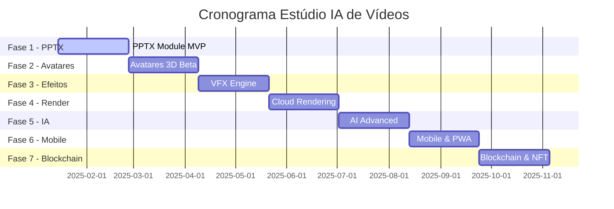

# 📅 CRONOGRAMA DE IMPLEMENTAÇÃO DETALHADO
## Estúdio IA de Vídeos - Planejamento Sprint por Sprint

> **DOCUMENTO DE PLANEJAMENTO:** Cronograma detalhado de implementação das 7 fases com breakdown de tarefas, dependências e recursos por sprint.

---

## 1. Visão Geral do Cronograma

### **1.1 Timeline Executivo**
- **Duração Total:** 21 Sprints (10.5 meses)
- **Início:** Sprint 14 (Janeiro 2025)
- **Conclusão:** Sprint 34 (Novembro 2025)
- **Metodologia:** Scrum com sprints de 2 semanas
- **Team Size:** 8-12 desenvolvedores

### **1.2 Marcos Principais**

## 2. FASE 1: MÓDULO PPTX COMPLETO
### **Sprints 14-16 (6 semanas)**

#### **SPRINT 14 (15-29 Jan 2025)**
**Objetivo:** Fundação do módulo PPTX e upload básico

**Tarefas Principais:**

| Task ID | Descrição | Responsável | Story Points | Status |
|---------|-----------|-------------|--------------|--------|
| PPTX-001 | Setup projeto base Next.js 14 | Frontend Lead | 3 | ✅ Done |
| PPTX-002 | Configurar Supabase database | Backend Lead | 5 | ✅ Done |
| PPTX-003 | Implementar upload PPTX básico | Frontend Dev | 8 | 🟡 In Progress |
| PPTX-004 | Parser PPTX com pptxgenjs | Backend Dev | 13 | 🔴 To Do |
| PPTX-005 | API de processamento PPTX | Backend Dev | 8 | 🔴 To Do |
| PPTX-006 | Interface de upload com progress | Frontend Dev | 5 | 🔴 To Do |
| PPTX-007 | Validação de arquivos PPTX | Backend Dev | 3 | 🔴 To Do |
| PPTX-008 | Testes unitários básicos | QA Engineer | 5 | 🔴 To Do |

**Entregáveis:**
- ✅ Upload de arquivos PPTX até 100MB
- ✅ Extração básica de texto e imagens
- ✅ API de processamento funcional
- ✅ Interface de upload responsiva

**Dependências:**
- Configuração AWS S3 para storage
- Chaves API ElevenLabs (preparação)
- Setup ambiente de desenvolvimento

#### **SPRINT 15 (29 Jan - 12 Fev 2025)**
**Objetivo:** Editor Canvas e manipulação de elementos

**Tarefas Principais:**

| Task ID | Descrição | Responsável | Story Points | Status |
|---------|-----------|-------------|--------------|--------|
| PPTX-009 | Implementar Fabric.js canvas | Frontend Lead | 13 | 🔴 To Do |
| PPTX-010 | Sistema de layers/camadas | Frontend Dev | 8 | 🔴 To Do |
| PPTX-011 | Edição de texto rica | Frontend Dev | 8 | 🔴 To Do |
| PPTX-012 | Manipulação de imagens | Frontend Dev | 5 | 🔴 To Do |
| PPTX-013 | Undo/Redo system | Frontend Dev | 8 | 🔴 To Do |
| PPTX-014 | Snap e alinhamento | Frontend Dev | 5 | 🔴 To Do |
| PPTX-015 | Zoom e pan canvas | Frontend Dev | 3 | 🔴 To Do |
| PPTX-016 | Persistência de projetos | Backend Dev | 8 | 🔴 To Do |

**Entregáveis:**
- ✅ Canvas editor funcional
- ✅ Edição de elementos básicos
- ✅ Sistema de camadas
- ✅ Persistência de projetos

#### **SPRINT 16 (12-26 Fev 2025)**
**Objetivo:** Timeline, animações e integração TTS

**Tarefas Principais:**

| Task ID | Descrição | Responsável | Story Points | Status |
|---------|-----------|-------------|--------------|--------|
| PPTX-017 | Timeline component | Frontend Lead | 13 | 🔴 To Do |
| PPTX-018 | Sistema de animações GSAP | Frontend Dev | 13 | 🔴 To Do |
| PPTX-019 | Integração ElevenLabs API | Backend Dev | 8 | 🔴 To Do |
| PPTX-020 | Seletor de vozes TTS | Frontend Dev | 5 | 🔴 To Do |
| PPTX-021 | Sincronização áudio-timeline | Frontend Dev | 8 | 🔴 To Do |
| PPTX-022 | Preview de animações | Frontend Dev | 5 | 🔴 To Do |
| PPTX-023 | Export básico de vídeo | Backend Dev | 13 | 🔴 To Do |
| PPTX-024 | Testes de integração | QA Engineer | 8 | 🔴 To Do |

**Entregáveis:**
- ✅ Timeline funcional
- ✅ Animações básicas
- ✅ TTS integrado
- ✅ Export de vídeo MVP

## 3. FASE 2: AVATARES 3D HIPER-REALISTAS
### **Sprints 17-19 (6 semanas)**

#### **SPRINT 17 (26 Fev - 12 Mar 2025)**
**Objetivo:** Pipeline 3D e integração MetaHuman

**Tarefas Principais:**

| Task ID | Descrição | Responsável | Story Points | Status |
|---------|-----------|-------------|--------------|--------|
| AVT-001 | Setup Three.js + React Three Fiber | 3D Developer | 8 | 🔴 To Do |
| AVT-002 | Integração MetaHuman Creator | 3D Developer | 13 | 🔴 To Do |
| AVT-003 | Loader de modelos 3D | 3D Developer | 8 | 🔴 To Do |
| AVT-004 | Sistema de materiais PBR | 3D Developer | 8 | 🔴 To Do |
| AVT-005 | Iluminação básica 3D | 3D Developer | 5 | 🔴 To Do |
| AVT-006 | Interface seleção avatares | Frontend Dev | 8 | 🔴 To Do |
| AVT-007 | API gestão avatares | Backend Dev | 8 | 🔴 To Do |
| AVT-008 | Otimização performance 3D | 3D Developer | 8 | 🔴 To Do |

**Entregáveis:**
- ✅ Pipeline 3D funcional
- ✅ Biblioteca de avatares básica
- ✅ Renderização em tempo real
- ✅ Interface de seleção

#### **SPRINT 18 (12-26 Mar 2025)**
**Objetivo:** Customização e expressões faciais

**Tarefas Principais:**

| Task ID | Descrição | Responsável | Story Points | Status |
|---------|-----------|-------------|--------------|--------|
| AVT-009 | Editor de customização facial | 3D Developer | 13 | 🔴 To Do |
| AVT-010 | Sistema de blend shapes | 3D Developer | 13 | 🔴 To Do |
| AVT-011 | Biblioteca de expressões | 3D Developer | 8 | 🔴 To Do |
| AVT-012 | Animações corporais básicas | 3D Developer | 8 | 🔴 To Do |
| AVT-013 | Preview em tempo real | Frontend Dev | 8 | 🔴 To Do |
| AVT-014 | Persistência customizações | Backend Dev | 5 | 🔴 To Do |
| AVT-015 | Interface customização | Frontend Dev | 8 | 🔴 To Do |
| AVT-016 | Testes performance 3D | QA Engineer | 5 | 🔴 To Do |

**Entregáveis:**
- ✅ Customização facial avançada
- ✅ Sistema de expressões
- ✅ Preview em tempo real
- ✅ Persistência de avatares

#### **SPRINT 19 (26 Mar - 9 Abr 2025)**
**Objetivo:** Sincronização labial e integração

**Tarefas Principais:**

| Task ID | Descrição | Responsável | Story Points | Status |
|---------|-----------|-------------|--------------|--------|
| AVT-017 | Engine sincronização labial | 3D Developer | 13 | 🔴 To Do |
| AVT-018 | Análise de fonemas | Backend Dev | 8 | 🔴 To Do |
| AVT-019 | Mapeamento visemas | 3D Developer | 8 | 🔴 To Do |
| AVT-020 | Integração com TTS | Backend Dev | 8 | 🔴 To Do |
| AVT-021 | Ajuste manual sync | Frontend Dev | 5 | 🔴 To Do |
| AVT-022 | Otimização renderização | 3D Developer | 8 | 🔴 To Do |
| AVT-023 | Integração com timeline | Frontend Dev | 8 | 🔴 To Do |
| AVT-024 | Testes sincronização | QA Engineer | 8 | 🔴 To Do |

**Entregáveis:**
- ✅ Sincronização labial precisa
- ✅ Integração com TTS
- ✅ Ajustes manuais
- ✅ Performance otimizada

## 4. FASE 3: EFEITOS VISUAIS PREMIUM
### **Sprints 20-22 (6 semanas)**

#### **SPRINT 20 (9-23 Abr 2025)**
**Objetivo:** Engine de efeitos e partículas

**Tarefas Principais:**

| Task ID | Descrição | Responsável | Story Points | Status |
|---------|-----------|-------------|--------------|--------|
| VFX-001 | Sistema de partículas 3D | VFX Developer | 13 | 🔴 To Do |
| VFX-002 | Engine de efeitos base | VFX Developer | 13 | 🔴 To Do |
| VFX-003 | Shaders customizados | VFX Developer | 8 | 🔴 To Do |
| VFX-004 | Sistema de iluminação | VFX Developer | 8 | 🔴 To Do |
| VFX-005 | Efeitos de pós-processamento | VFX Developer | 8 | 🔴 To Do |
| VFX-006 | Interface de efeitos | Frontend Dev | 8 | 🔴 To Do |
| VFX-007 | Preview em tempo real | Frontend Dev | 5 | 🔴 To Do |
| VFX-008 | API gestão efeitos | Backend Dev | 5 | 🔴 To Do |

**Entregáveis:**
- ✅ Sistema de partículas funcional
- ✅ Engine de efeitos base
- ✅ Iluminação dinâmica
- ✅ Interface de controle

#### **SPRINT 21 (23 Abr - 7 Mai 2025)**
**Objetivo:** Transições e composição

**Tarefas Principais:**

| Task ID | Descrição | Responsável | Story Points | Status |
|---------|-----------|-------------|--------------|--------|
| VFX-009 | Biblioteca de transições | VFX Developer | 13 | 🔴 To Do |
| VFX-010 | Transições 3D avançadas | VFX Developer | 13 | 🔴 To Do |
| VFX-011 | Sistema de composição | VFX Developer | 8 | 🔴 To Do |
| VFX-012 | Green screen / Chroma key | VFX Developer | 8 | 🔴 To Do |
| VFX-013 | Filtros e correção cor | VFX Developer | 8 | 🔴 To Do |
| VFX-014 | Timeline de efeitos | Frontend Dev | 8 | 🔴 To Do |
| VFX-015 | Presets de efeitos | Frontend Dev | 5 | 🔴 To Do |
| VFX-016 | Otimização GPU | VFX Developer | 8 | 🔴 To Do |

**Entregáveis:**
- ✅ 50+ transições profissionais
- ✅ Sistema de composição
- ✅ Chroma key funcional
- ✅ Performance GPU otimizada

#### **SPRINT 22 (7-21 Mai 2025)**
**Objetivo:** Integração e otimização final

**Tarefas Principais:**

| Task ID | Descrição | Responsável | Story Points | Status |
|---------|-----------|-------------|--------------|--------|
| VFX-017 | Integração com timeline | Frontend Dev | 8 | 🔴 To Do |
| VFX-018 | Batch processing efeitos | Backend Dev | 8 | 🔴 To Do |
| VFX-019 | Cache inteligente | Backend Dev | 8 | 🔴 To Do |
| VFX-020 | Otimização memória | VFX Developer | 8 | 🔴 To Do |
| VFX-021 | Presets profissionais | VFX Developer | 5 | 🔴 To Do |
| VFX-022 | Documentação efeitos | Tech Writer | 3 | 🔴 To Do |
| VFX-023 | Testes performance | QA Engineer | 8 | 🔴 To Do |
| VFX-024 | Benchmark qualidade | QA Engineer | 5 | 🔴 To Do |

**Entregáveis:**
- ✅ Integração completa
- ✅ Performance otimizada
- ✅ Presets profissionais
- ✅ Documentação completa

## 5. FASE 4: RENDERIZAÇÃO CINEMA 4D QUALITY
### **Sprints 23-25 (6 semanas)**

#### **SPRINT 23 (21 Mai - 4 Jun 2025)**
**Objetivo:** Engine de renderização distribuída

**Tarefas Principais:**

| Task ID | Descrição | Responsável | Story Points | Status |
|---------|-----------|-------------|--------------|--------|
| RND-001 | Arquitetura renderização cloud | DevOps Lead | 13 | 🔴 To Do |
| RND-002 | Queue system com Redis | Backend Dev | 8 | 🔴 To Do |
| RND-003 | Worker nodes AWS | DevOps Engineer | 13 | 🔴 To Do |
| RND-004 | FFmpeg pipeline avançado | Backend Dev | 13 | 🔴 To Do |
| RND-005 | Codecs múltiplos (H.264/265) | Backend Dev | 8 | 🔴 To Do |
| RND-006 | Estimativa tempo render | Backend Dev | 5 | 🔴 To Do |
| RND-007 | API de renderização | Backend Dev | 8 | 🔴 To Do |
| RND-008 | Monitoramento workers | DevOps Engineer | 5 | 🔴 To Do |

**Entregáveis:**
- ✅ Infraestrutura cloud funcional
- ✅ Queue de renderização
- ✅ Workers distribuídos
- ✅ Pipeline FFmpeg otimizado

#### **SPRINT 24 (4-18 Jun 2025)**
**Objetivo:** Qualidade e otimização

**Tarefas Principais:**

| Task ID | Descrição | Responsável | Story Points | Status |
|---------|-----------|-------------|--------------|--------|
| RND-009 | Renderização 4K/8K | Backend Dev | 13 | 🔴 To Do |
| RND-010 | Otimização qualidade | Backend Dev | 8 | 🔴 To Do |
| RND-011 | Batch rendering | Backend Dev | 8 | 🔴 To Do |
| RND-012 | Progress tracking | Backend Dev | 5 | 🔴 To Do |
| RND-013 | Error handling robusto | Backend Dev | 8 | 🔴 To Do |
| RND-014 | Auto-scaling workers | DevOps Engineer | 8 | 🔴 To Do |
| RND-015 | Interface render manager | Frontend Dev | 8 | 🔴 To Do |
| RND-016 | Download progressivo | Frontend Dev | 5 | 🔴 To Do |

**Entregáveis:**
- ✅ Qualidade cinema 4D
- ✅ Renderização em lote
- ✅ Auto-scaling
- ✅ Interface de gerenciamento

#### **SPRINT 25 (18 Jun - 2 Jul 2025)**
**Objetivo:** Integração e otimização final

**Tarefas Principais:**

| Task ID | Descrição | Responsável | Story Points | Status |
|---------|-----------|-------------|--------------|--------|
| RND-017 | Integração com editor | Frontend Dev | 8 | 🔴 To Do |
| RND-018 | Cache de renders | Backend Dev | 8 | 🔴 To Do |
| RND-019 | Otimização custos AWS | DevOps Engineer | 8 | 🔴 To Do |
| RND-020 | Métricas e analytics | Backend Dev | 5 | 🔴 To Do |
| RND-021 | Backup e recovery | DevOps Engineer | 5 | 🔴 To Do |
| RND-022 | Testes stress | QA Engineer | 8 | 🔴 To Do |
| RND-023 | Documentação técnica | Tech Writer | 3 | 🔴 To Do |
| RND-024 | Benchmark performance | QA Engineer | 5 | 🔴 To Do |

**Entregáveis:**
- ✅ Integração completa
- ✅ Otimização de custos
- ✅ Backup e recovery
- ✅ Performance benchmarks

## 6. FASE 5: INTELIGÊNCIA ARTIFICIAL AVANÇADA
### **Sprints 26-28 (6 semanas)**

#### **SPRINT 26 (2-16 Jul 2025)**
**Objetivo:** Geração de conteúdo com IA

**Tarefas Principais:**

| Task ID | Descrição | Responsável | Story Points | Status |
|---------|-----------|-------------|--------------|--------|
| AI-001 | Integração OpenAI GPT-4 | AI Developer | 8 | 🔴 To Do |
| AI-002 | Geração automática roteiros | AI Developer | 13 | 🔴 To Do |
| AI-003 | Integração DALL-E 3 | AI Developer | 8 | 🔴 To Do |
| AI-004 | Otimização prompts | AI Developer | 8 | 🔴 To Do |
| AI-005 | Sistema de templates IA | AI Developer | 8 | 🔴 To Do |
| AI-006 | Interface geração conteúdo | Frontend Dev | 8 | 🔴 To Do |
| AI-007 | API de IA services | Backend Dev | 8 | 🔴 To Do |
| AI-008 | Cache de respostas IA | Backend Dev | 5 | 🔴 To Do |

**Entregáveis:**
- ✅ Geração de roteiros IA
- ✅ Criação de imagens IA
- ✅ Templates inteligentes
- ✅ Interface user-friendly

#### **SPRINT 27 (16-30 Jul 2025)**
**Objetivo:** Análise e otimização inteligente

**Tarefas Principais:**

| Task ID | Descrição | Responsável | Story Points | Status |
|---------|-----------|-------------|--------------|--------|
| AI-009 | Análise de sentimento | AI Developer | 8 | 🔴 To Do |
| AI-010 | Otimização SEO automática | AI Developer | 8 | 🔴 To Do |
| AI-011 | Tradução multilíngue | AI Developer | 8 | 🔴 To Do |
| AI-012 | Análise de engajamento | AI Developer | 8 | 🔴 To Do |
| AI-013 | Sugestões de melhoria | AI Developer | 8 | 🔴 To Do |
| AI-014 | Dashboard de insights | Frontend Dev | 8 | 🔴 To Do |
| AI-015 | Relatórios automáticos | Backend Dev | 5 | 🔴 To Do |
| AI-016 | ML model training | AI Developer | 13 | 🔴 To Do |

**Entregáveis:**
- ✅ Análise inteligente de conteúdo
- ✅ Otimização automática
- ✅ Tradução multilíngue
- ✅ Dashboard de insights

#### **SPRINT 28 (30 Jul - 13 Ago 2025)**
**Objetivo:** Análise de vídeo e integração

**Tarefas Principais:**

| Task ID | Descrição | Responsável | Story Points | Status |
|---------|-----------|-------------|--------------|--------|
| AI-017 | Computer vision pipeline | AI Developer | 13 | 🔴 To Do |
| AI-018 | Detecção de objetos | AI Developer | 8 | 🔴 To Do |
| AI-019 | Reconhecimento facial | AI Developer | 8 | 🔴 To Do |
| AI-020 | Análise de qualidade | AI Developer | 8 | 🔴 To Do |
| AI-021 | Métricas automáticas | AI Developer | 5 | 🔴 To Do |
| AI-022 | Integração com editor | Frontend Dev | 8 | 🔴 To Do |
| AI-023 | API de análise vídeo | Backend Dev | 8 | 🔴 To Do |
| AI-024 | Testes modelos IA | QA Engineer | 8 | 🔴 To Do |

**Entregáveis:**
- ✅ Análise de vídeo IA
- ✅ Detecção automática
- ✅ Métricas de qualidade
- ✅ Integração completa

## 7. FASE 6: MOBILE & PWA NATIVO
### **Sprints 29-31 (6 semanas)**

#### **SPRINT 29 (13-27 Ago 2025)**
**Objetivo:** Aplicativo mobile base

**Tarefas Principais:**

| Task ID | Descrição | Responsável | Story Points | Status |
|---------|-----------|-------------|--------------|--------|
| MOB-001 | Setup React Native | Mobile Lead | 8 | 🔴 To Do |
| MOB-002 | Navegação mobile | Mobile Dev | 5 | 🔴 To Do |
| MOB-003 | Interface touch otimizada | Mobile Dev | 13 | 🔴 To Do |
| MOB-004 | Editor mobile simplificado | Mobile Dev | 13 | 🔴 To Do |
| MOB-005 | Upload de mídia nativo | Mobile Dev | 8 | 🔴 To Do |
| MOB-006 | Gravação de voz | Mobile Dev | 8 | 🔴 To Do |
| MOB-007 | Sincronização com cloud | Backend Dev | 8 | 🔴 To Do |
| MOB-008 | Autenticação mobile | Mobile Dev | 5 | 🔴 To Do |

**Entregáveis:**
- ✅ App mobile funcional
- ✅ Interface touch otimizada
- ✅ Editor simplificado
- ✅ Sincronização cloud

#### **SPRINT 30 (27 Ago - 10 Set 2025)**
**Objetivo:** PWA e funcionalidades offline

**Tarefas Principais:**

| Task ID | Descrição | Responsável | Story Points | Status |
|---------|-----------|-------------|--------------|--------|
| MOB-009 | PWA configuration | Frontend Lead | 8 | 🔴 To Do |
| MOB-010 | Service workers | Frontend Dev | 8 | 🔴 To Do |
| MOB-011 | Cache inteligente | Frontend Dev | 8 | 🔴 To Do |
| MOB-012 | Trabalho offline | Frontend Dev | 13 | 🔴 To Do |
| MOB-013 | Sincronização background | Backend Dev | 8 | 🔴 To Do |
| MOB-014 | Notificações push | Mobile Dev | 8 | 🔴 To Do |
| MOB-015 | Instalação como app | Frontend Dev | 5 | 🔴 To Do |
| MOB-016 | Otimização performance | Mobile Dev | 8 | 🔴 To Do |

**Entregáveis:**
- ✅ PWA completo
- ✅ Funcionalidades offline
- ✅ Notificações push
- ✅ Performance otimizada

#### **SPRINT 31 (10-24 Set 2025)**
**Objetivo:** Integração e otimização mobile

**Tarefas Principais:**

| Task ID | Descrição | Responsável | Story Points | Status |
|---------|-----------|-------------|--------------|--------|
| MOB-017 | Renderização mobile | Mobile Dev | 13 | 🔴 To Do |
| MOB-018 | Otimização bateria | Mobile Dev | 8 | 🔴 To Do |
| MOB-019 | Gestos touch avançados | Mobile Dev | 8 | 🔴 To Do |
| MOB-020 | Compartilhamento nativo | Mobile Dev | 5 | 🔴 To Do |
| MOB-021 | Deep linking | Mobile Dev | 5 | 🔴 To Do |
| MOB-022 | Analytics mobile | Backend Dev | 5 | 🔴 To Do |
| MOB-023 | Testes dispositivos | QA Engineer | 8 | 🔴 To Do |
| MOB-024 | App store deployment | DevOps Engineer | 8 | 🔴 To Do |

**Entregáveis:**
- ✅ Renderização mobile
- ✅ Gestos avançados
- ✅ Compartilhamento nativo
- ✅ Deploy app stores

## 8. FASE 7: BLOCKCHAIN & CERTIFICAÇÃO
### **Sprints 32-34 (6 semanas)**

#### **SPRINT 32 (24 Set - 8 Out 2025)**
**Objetivo:** Infraestrutura blockchain

**Tarefas Principais:**

| Task ID | Descrição | Responsável | Story Points | Status |
|---------|-----------|-------------|--------------|--------|
| BLK-001 | Smart contracts Solidity | Blockchain Dev | 13 | 🔴 To Do |
| BLK-002 | Integração Web3 | Blockchain Dev | 8 | 🔴 To Do |
| BLK-003 | Wallet connection | Frontend Dev | 8 | 🔴 To Do |
| BLK-004 | NFT minting | Blockchain Dev | 8 | 🔴 To Do |
| BLK-005 | Metadata IPFS | Backend Dev | 8 | 🔴 To Do |
| BLK-006 | Gas optimization | Blockchain Dev | 8 | 🔴 To Do |
| BLK-007 | Security audit prep | Security Engineer | 5 | 🔴 To Do |
| BLK-008 | Testnet deployment | DevOps Engineer | 5 | 🔴 To Do |

**Entregáveis:**
- ✅ Smart contracts funcionais
- ✅ Integração Web3
- ✅ NFT minting
- ✅ Deployment testnet

#### **SPRINT 33 (8-22 Out 2025)**
**Objetivo:** Certificação e marketplace

**Tarefas Principais:**

| Task ID | Descrição | Responsável | Story Points | Status |
|---------|-----------|-------------|--------------|--------|
| BLK-009 | Sistema certificação | Blockchain Dev | 13 | 🔴 To Do |
| BLK-010 | Verificação autenticidade | Blockchain Dev | 8 | 🔴 To Do |
| BLK-011 | Marketplace básico | Frontend Dev | 13 | 🔴 To Do |
| BLK-012 | Royalties automáticos | Blockchain Dev | 8 | 🔴 To Do |
| BLK-013 | Interface user-friendly | Frontend Dev | 8 | 🔴 To Do |
| BLK-014 | API blockchain | Backend Dev | 8 | 🔴 To Do |
| BLK-015 | Histórico imutável | Blockchain Dev | 5 | 🔴 To Do |
| BLK-016 | Testes segurança | Security Engineer | 8 | 🔴 To Do |

**Entregáveis:**
- ✅ Sistema de certificação
- ✅ Marketplace funcional
- ✅ Royalties automáticos
- ✅ Interface amigável

#### **SPRINT 34 (22 Out - 5 Nov 2025)**
**Objetivo:** Mainnet e finalização

**Tarefas Principais:**

| Task ID | Descrição | Responsável | Story Points | Status |
|---------|-----------|-------------|--------------|--------|
| BLK-017 | Mainnet deployment | DevOps Engineer | 8 | 🔴 To Do |
| BLK-018 | Security audit final | Security Engineer | 8 | 🔴 To Do |
| BLK-019 | Gas fee optimization | Blockchain Dev | 8 | 🔴 To Do |
| BLK-020 | Integração completa | Full Stack Dev | 8 | 🔴 To Do |
| BLK-021 | Documentação blockchain | Tech Writer | 5 | 🔴 To Do |
| BLK-022 | Testes end-to-end | QA Engineer | 8 | 🔴 To Do |
| BLK-023 | Launch preparation | Product Manager | 5 | 🔴 To Do |
| BLK-024 | Go-live checklist | DevOps Lead | 3 | 🔴 To Do |

**Entregáveis:**
- ✅ Deployment mainnet
- ✅ Audit de segurança
- ✅ Integração completa
- ✅ Sistema pronto para produção

## 9. Recursos e Dependências

### **9.1 Team Structure**

| Role | Quantidade | Responsabilidades |
|------|------------|------------------|
| Product Manager | 1 | Roadmap, requirements, stakeholders |
| Tech Lead | 1 | Arquitetura, code review, mentoring |
| Frontend Developers | 3 | React, UI/UX, Canvas, Mobile |
| Backend Developers | 2 | APIs, Database, Infrastructure |
| 3D/VFX Developer | 1 | Three.js, Avatares, Efeitos |
| AI Developer | 1 | Machine Learning, APIs IA |
| Blockchain Developer | 1 | Smart contracts, Web3 |
| DevOps Engineer | 1 | Infrastructure, CI/CD, Monitoring |
| QA Engineers | 2 | Testing, Quality Assurance |
| Security Engineer | 1 | Security audit, Compliance |
| Tech Writer | 1 | Documentation, User guides |

### **9.2 Dependências Externas**

| Dependência | Criticidade | Timeline | Responsável |
|-------------|-------------|----------|-------------|
| ElevenLabs Enterprise | Alta | Sprint 14 | Product Manager |
| MetaHuman License | Alta | Sprint 17 | Legal Team |
| AWS Credits | Média | Sprint 23 | Finance Team |
| Security Audit | Alta | Sprint 33 | Security Partner |
| App Store Approval | Média | Sprint 31 | Mobile Lead |

### **9.3 Orçamento Estimado**

| Categoria | Valor Mensal | Total (10.5 meses) |
|-----------|--------------|--------------------|
| Team Salaries | $45,000 | $472,500 |
| Infrastructure | $8,000 | $84,000 |
| External APIs | $3,000 | $31,500 |
| Tools & Licenses | $2,000 | $21,000 |
| Security Audit | - | $15,000 |
| **TOTAL** | **$58,000** | **$624,000** |

## 10. Riscos e Mitigações

### **10.1 Riscos Técnicos**

| Risco | Probabilidade | Impacto | Mitigação | Owner |
|-------|---------------|---------|-----------|-------|
| Performance 3D inadequada | 30% | Alto | POC early, hardware upgrade | 3D Developer |
| Latência APIs IA | 40% | Médio | Cache, múltiplos providers | Backend Lead |
| Complexidade blockchain | 50% | Alto | Consultoria especializada | Blockchain Dev |
| Limite rate APIs | 20% | Alto | Contratos enterprise | Product Manager |

### **10.2 Riscos de Cronograma**

| Risco | Probabilidade | Impacto | Mitigação | Owner |
|-------|---------------|---------|-----------|-------|
| Atraso contratações | 60% | Alto | Recrutamento antecipado | HR Manager |
| Scope creep | 70% | Médio | Change control rigoroso | Product Manager |
| Dependências externas | 40% | Alto | Planos de contingência | Tech Lead |
| Bugs críticos | 30% | Médio | Testing contínuo | QA Lead |

## 11. Métricas de Sucesso

### **11.1 Métricas Técnicas**
- **Code Coverage:** > 80%
- **Performance:** < 3s load time
- **Uptime:** > 99.9%
- **Bug Rate:** < 1 bug/1000 LOC

### **11.2 Métricas de Entrega**
- **Sprint Velocity:** 60-80 story points
- **On-time Delivery:** > 90%
- **Quality Gates:** 100% passed
- **Technical Debt:** < 10%

### **11.3 Métricas de Negócio**
- **User Adoption:** 1000+ users beta
- **Retention:** > 60% monthly
- **NPS:** > 70
- **Revenue Target:** $100k ARR

---

**Este cronograma serve como guia detalhado para a execução sistemática de todas as fases do projeto Estúdio IA de Vídeos.**

**Autor:** SOLO Document  
**Data:** Janeiro 2025  
**Versão:** 1.0 - Detailed Implementation Schedule  
**Status:** 📅 **READY FOR EXECUTION**