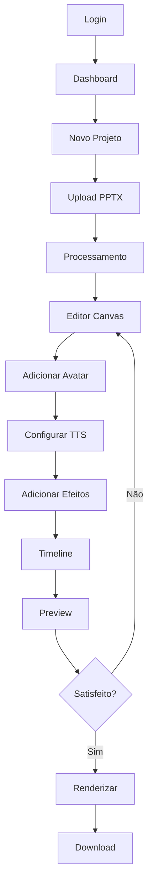
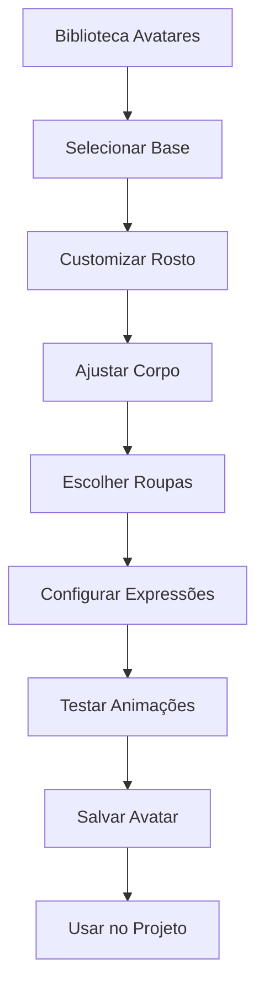

# 📋 ESPECIFICAÇÕES FUNCIONAIS DETALHADAS
## Estúdio IA de Vídeos - Requisitos Funcionais Completos

> **DOCUMENTO DE REQUISITOS:** Especificações funcionais detalhadas para todas as 7 fases do projeto com critérios de aceitação e casos de uso.

---

## 1. Visão Geral do Produto

### **1.1 Objetivo Principal**
Desenvolver uma plataforma completa de criação de vídeos com IA que permita aos usuários transformar apresentações PowerPoint em vídeos profissionais com avatares 3D hiper-realistas, narração em múltiplas vozes e efeitos visuais avançados.

### **1.2 Usuários-Alvo**
- **Empresas:** Treinamentos corporativos, apresentações executivas
- **Educadores:** Aulas online, cursos EAD
- **Criadores de Conteúdo:** YouTubers, influenciadores
- **Agências:** Produção de conteúdo para clientes
- **Freelancers:** Serviços de criação de vídeo

### **1.3 Proposta de Valor**
- Redução de 90% no tempo de produção de vídeos
- Qualidade profissional sem conhecimento técnico
- Avatares 3D hiper-realistas com sincronização labial perfeita
- Múltiplas vozes e idiomas com IA
- Templates prontos para diferentes nichos

## 2. Funcionalidades por Fase

### **FASE 1: MÓDULO PPTX COMPLETO**

#### **2.1 Upload e Processamento PPTX**

**Funcionalidades:**
- Upload de arquivos PPTX até 100MB
- Extração automática de conteúdo (texto, imagens, layouts)
- Conversão de slides em cenas editáveis
- Preview em tempo real do processamento
- Validação de formato e integridade

**Critérios de Aceitação:**
- ✅ Suporte a PPTX criados no PowerPoint 2016+
- ✅ Extração de 100% do texto formatado
- ✅ Preservação de imagens em alta qualidade
- ✅ Processamento em menos de 30 segundos para 50 slides
- ✅ Feedback visual do progresso (0-100%)

**Casos de Uso:**
```
CASO DE USO: Upload de Apresentação
Ator: Usuário
Pré-condições: Usuário logado, arquivo PPTX válido
Fluxo Principal:
1. Usuário seleciona arquivo PPTX
2. Sistema valida formato e tamanho
3. Sistema inicia processamento
4. Sistema extrai conteúdo slide por slide
5. Sistema gera preview das cenas
6. Sistema notifica conclusão
Pós-condições: Projeto criado com cenas editáveis
```

#### **2.2 Editor Canvas Avançado**

**Funcionalidades:**
- Canvas HTML5 com Fabric.js
- Edição de texto com formatação rica
- Manipulação de imagens (redimensionar, rotacionar, filtros)
- Sistema de camadas (layers)
- Histórico de ações (undo/redo)
- Snap e alinhamento automático
- Zoom e pan suaves

**Critérios de Aceitação:**
- ✅ Performance fluida em canvas 1920x1080
- ✅ Suporte a 50+ elementos por cena
- ✅ Histórico de 100 ações
- ✅ Snap com precisão de 1px
- ✅ Zoom de 10% a 500%

#### **2.3 Timeline e Animações**

**Funcionalidades:**
- Timeline visual com múltiplas faixas
- Animações de entrada, saída e ênfase
- Controle de duração e timing
- Keyframes personalizados
- Preview em tempo real
- Sincronização com áudio

**Critérios de Aceitação:**
- ✅ Timeline responsiva até 60 minutos
- ✅ 20+ tipos de animação pré-definidas
- ✅ Precisão de timing em milissegundos
- ✅ Preview sem lag até 30fps

#### **2.4 Integração TTS Premium**

**Funcionalidades:**
- Integração com ElevenLabs API
- 50+ vozes em português brasileiro
- Controle de velocidade, tom e emoção
- Clonagem de voz personalizada
- Geração de áudio em alta qualidade (48kHz)
- Sincronização automática com texto

**Critérios de Aceitação:**
- ✅ Qualidade de áudio profissional
- ✅ Latência máxima de 5 segundos
- ✅ Sincronização perfeita com texto
- ✅ Suporte a SSML para controle avançado

### **FASE 2: AVATARES 3D HIPER-REALISTAS**

#### **2.5 Pipeline de Avatares 3D**

**Funcionalidades:**
- Integração com MetaHuman Creator
- Biblioteca de 100+ avatares pré-criados
- Customização facial avançada
- Sistema de expressões faciais
- Animações corporais realistas
- Renderização em tempo real

**Critérios de Aceitação:**
- ✅ Qualidade fotorrealística
- ✅ 60fps em renderização real-time
- ✅ 50+ expressões faciais
- ✅ Customização em menos de 2 minutos

#### **2.6 Sincronização Labial Avançada**

**Funcionalidades:**
- Análise de fonemas em tempo real
- Mapeamento labial preciso
- Suporte a múltiplos idiomas
- Ajuste manual de sincronização
- Preview instantâneo

**Critérios de Aceitação:**
- ✅ Sincronização com precisão de 95%+
- ✅ Suporte a português, inglês, espanhol
- ✅ Processamento em tempo real

### **FASE 3: EFEITOS VISUAIS PREMIUM**

#### **2.7 Engine de Efeitos Avançados**

**Funcionalidades:**
- Sistema de partículas 3D
- Transições cinematográficas
- Efeitos de iluminação dinâmica
- Filtros e correção de cor
- Composição multicamada
- Green screen e chroma key

**Critérios de Aceitação:**
- ✅ 100+ efeitos pré-configurados
- ✅ Renderização GPU-acelerada
- ✅ Preview em tempo real
- ✅ Qualidade broadcast

#### **2.8 Biblioteca de Transições**

**Funcionalidades:**
- 50+ transições profissionais
- Transições 3D e morfing
- Controle de duração e intensidade
- Preview instantâneo
- Categorização por estilo

### **FASE 4: RENDERIZAÇÃO CINEMA 4D QUALITY**

#### **2.9 Engine de Renderização Avançada**

**Funcionalidades:**
- Renderização distribuída na nuvem
- Qualidade até 8K/60fps
- Múltiplos codecs (H.264, H.265, ProRes)
- Renderização em lote
- Estimativa de tempo precisa
- Download progressivo

**Critérios de Aceitação:**
- ✅ Qualidade cinema 4D
- ✅ Renderização 10x mais rápida que local
- ✅ Suporte a projetos de 2+ horas
- ✅ Taxa de sucesso 99.9%

### **FASE 5: INTELIGÊNCIA ARTIFICIAL AVANÇADA**

#### **2.10 Geração de Conteúdo com IA**

**Funcionalidades:**
- Geração automática de roteiros
- Criação de imagens com DALL-E 3
- Otimização de conteúdo para SEO
- Tradução automática multilíngue
- Análise de sentimento
- Sugestões de melhoria

**Critérios de Aceitação:**
- ✅ Roteiros coerentes de até 30 minutos
- ✅ Imagens em 4K com qualidade profissional
- ✅ Tradução com 95%+ de precisão
- ✅ Análise de sentimento em tempo real

#### **2.11 Análise de Vídeo Inteligente**

**Funcionalidades:**
- Detecção automática de objetos
- Reconhecimento facial
- Análise de engajamento
- Sugestões de otimização
- Métricas de qualidade

### **FASE 6: MOBILE & PWA NATIVO**

#### **2.12 Aplicativo Mobile Completo**

**Funcionalidades:**
- Editor mobile otimizado
- Gravação de voz nativa
- Upload de mídia do dispositivo
- Renderização local otimizada
- Sincronização com nuvem
- Notificações push

**Critérios de Aceitação:**
- ✅ Performance nativa em iOS/Android
- ✅ Interface otimizada para touch
- ✅ Funcionalidades offline básicas
- ✅ Sincronização automática

#### **2.13 PWA Avançado**

**Funcionalidades:**
- Instalação como app nativo
- Cache inteligente
- Trabalho offline
- Sincronização em background
- Notificações web

### **FASE 7: BLOCKCHAIN & CERTIFICAÇÃO**

#### **2.14 Sistema de Certificação**

**Funcionalidades:**
- Certificados NFT para vídeos
- Prova de autenticidade
- Histórico imutável
- Marketplace integrado
- Royalties automáticos

**Critérios de Aceitação:**
- ✅ Certificação em blockchain Ethereum
- ✅ Verificação instantânea
- ✅ Custo mínimo de transação
- ✅ Interface user-friendly

## 3. Requisitos Não-Funcionais

### **3.1 Performance**
- **Tempo de Carregamento:** < 3 segundos
- **Responsividade:** < 100ms para interações
- **Throughput:** 1000+ usuários simultâneos
- **Disponibilidade:** 99.9% uptime

### **3.2 Escalabilidade**
- **Usuários:** Suporte a 100k+ usuários
- **Armazenamento:** Petabytes de mídia
- **Processamento:** Auto-scaling baseado em demanda
- **CDN:** Distribuição global

### **3.3 Segurança**
- **Autenticação:** Multi-fator obrigatório
- **Criptografia:** AES-256 para dados sensíveis
- **Backup:** Backup automático 3x ao dia
- **Compliance:** LGPD e GDPR compliant

### **3.4 Usabilidade**
- **Curva de Aprendizado:** < 30 minutos para usuário básico
- **Acessibilidade:** WCAG 2.1 AA compliant
- **Responsividade:** Suporte a todos os dispositivos
- **Internacionalização:** 10+ idiomas

## 4. Integrações Externas

### **4.1 APIs de IA**
- **OpenAI GPT-4:** Geração de conteúdo
- **ElevenLabs:** Text-to-Speech premium
- **DALL-E 3:** Geração de imagens
- **Claude 3.5:** Análise e otimização

### **4.2 Serviços de Mídia**
- **Unsplash:** Banco de imagens gratuitas
- **Pexels:** Vídeos e fotos stock
- **Freepik:** Elementos gráficos
- **Epidemic Sound:** Biblioteca musical

### **4.3 Infraestrutura**
- **AWS S3:** Armazenamento de arquivos
- **CloudFront:** CDN global
- **Supabase:** Database e auth
- **Redis:** Cache e sessões

## 5. Fluxos de Usuário Principais

### **5.1 Fluxo de Criação de Vídeo**



### **5.2 Fluxo de Customização de Avatar**



## 6. Casos de Teste

### **6.1 Testes de Upload PPTX**

```
TESTE: Upload arquivo grande (100MB)
Pré-condições: Usuário logado, conexão estável
Passos:
1. Selecionar arquivo PPTX de 100MB
2. Iniciar upload
3. Aguardar processamento
Resultado Esperado: Upload e processamento em < 60s
Critério: Sucesso se completar sem erros
```

### **6.2 Testes de Performance**

```
TESTE: Edição com 50 elementos
Pré-condições: Projeto com 50 elementos no canvas
Passos:
1. Mover elemento
2. Redimensionar elemento
3. Aplicar animação
Resultado Esperado: Responsividade < 100ms
Critério: Sucesso se não houver lag perceptível
```

### **6.3 Testes de Renderização**

```
TESTE: Renderização 4K de 10 minutos
Pré-condições: Projeto completo de 10 minutos
Passos:
1. Configurar qualidade 4K
2. Iniciar renderização
3. Aguardar conclusão
Resultado Esperado: Renderização em < 30 minutos
Critério: Sucesso se qualidade for mantida
```

## 7. Métricas de Sucesso

### **7.1 Métricas Técnicas**
- **Uptime:** 99.9%+
- **Tempo de Resposta:** < 200ms
- **Taxa de Erro:** < 0.1%
- **Throughput:** 1000+ req/s

### **7.2 Métricas de Usuário**
- **Tempo de Onboarding:** < 5 minutos
- **Taxa de Conclusão:** 80%+
- **NPS:** 70+
- **Retenção 30 dias:** 60%+

### **7.3 Métricas de Negócio**
- **Conversão Trial → Paid:** 15%+
- **LTV/CAC:** 3:1+
- **Churn Mensal:** < 5%
- **Revenue Growth:** 20%+ MoM

## 8. Cronograma de Entrega

### **8.1 Marcos Principais**

| Fase | Entrega | Prazo | Status |
|------|---------|-------|--------|
| 1 | PPTX Module MVP | Sprint 14-16 | 🟡 Em Progresso |
| 2 | Avatares 3D Beta | Sprint 17-19 | 🔴 Pendente |
| 3 | Efeitos VFX | Sprint 20-22 | 🔴 Pendente |
| 4 | Renderização Cloud | Sprint 23-25 | 🔴 Pendente |
| 5 | IA Avançada | Sprint 26-28 | 🔴 Pendente |
| 6 | Mobile & PWA | Sprint 29-31 | 🔴 Pendente |
| 7 | Blockchain | Sprint 32-34 | 🔴 Pendente |

### **8.2 Dependências Críticas**

- **ElevenLabs API:** Aprovação de conta enterprise
- **MetaHuman:** Licenciamento comercial
- **AWS Credits:** Budget para renderização cloud
- **Team Scaling:** Contratação de desenvolvedores 3D

## 9. Riscos e Mitigações

### **9.1 Riscos Técnicos**

| Risco | Probabilidade | Impacto | Mitigação |
|-------|---------------|---------|----------|
| Performance 3D | Alta | Alto | Otimização GPU + LOD |
| Latência TTS | Média | Médio | Cache inteligente |
| Limite APIs | Baixa | Alto | Múltiplos providers |

### **9.2 Riscos de Negócio**

| Risco | Probabilidade | Impacto | Mitigação |
|-------|---------------|---------|----------|
| Concorrência | Alta | Alto | Diferenciação por qualidade |
| Custos Cloud | Média | Alto | Otimização de recursos |
| Adoção Lenta | Baixa | Alto | Marketing agressivo |

## 10. Critérios de Aceitação Final

### **10.1 Funcionalidade Completa**
- ✅ Todas as 7 fases implementadas
- ✅ Testes automatizados com 90%+ cobertura
- ✅ Performance dentro dos SLAs
- ✅ Segurança auditada

### **10.2 Qualidade de Código**
- ✅ Code review em 100% dos PRs
- ✅ Documentação técnica completa
- ✅ Padrões de código seguidos
- ✅ Zero vulnerabilidades críticas

### **10.3 Experiência do Usuário**
- ✅ Interface intuitiva e responsiva
- ✅ Onboarding guiado
- ✅ Feedback visual em todas as ações
- ✅ Tratamento de erros amigável

---

**Este documento serve como especificação completa para o desenvolvimento e validação de todas as funcionalidades do Estúdio IA de Vídeos.**

**Autor:** SOLO Document  
**Data:** Janeiro 2025  
**Versão:** 1.0 - Functional Specifications  
**Status:** 📋 **READY FOR DEVELOPMENT**