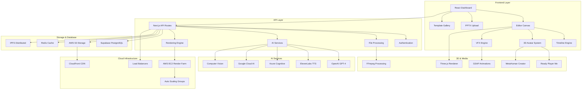
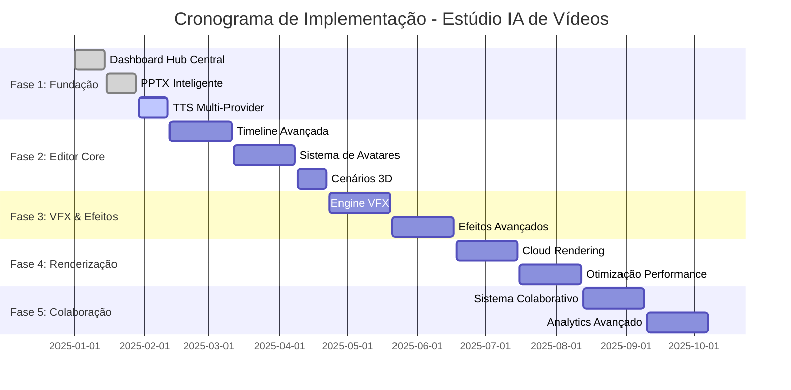

# 🚀 PLANO DE IMPLEMENTAÇÃO CONSOLIDADO 2025
## Estúdio IA de Vídeos - Roadmap Técnico Completo

> **DOCUMENTO ESTRATÉGICO:** Análise do estado atual, gaps identificados e plano de implementação estruturado para atingir os objetivos do PRD.

---

## 1. ANÁLISE DO ESTADO ATUAL VS PRD

### 1.1 Funcionalidades Implementadas ✅

| Módulo | Status | Completude | Observações |
|--------|--------|------------|-------------|
| **Dashboard Principal** | ✅ Implementado | 85% | Interface funcional, precisa otimização |
| **Sistema de Autenticação** | ✅ Implementado | 90% | Supabase Auth integrado |
| **Navegação e Roteamento** | ✅ Implementado | 95% | React Router configurado |
| **Upload PPTX Básico** | ✅ Implementado | 60% | Funcionalidade básica presente |
| **Editor Base** | ✅ Implementado | 40% | Estrutura criada, precisa expansão |
| **Templates Base** | ✅ Implementado | 30% | Estrutura inicial |
| **Sistema TTS Básico** | ✅ Implementado | 50% | Integração parcial |
| **Analytics Básico** | ✅ Implementado | 45% | Dashboard inicial |
| **VFX Engine Base** | ✅ Implementado | 35% | Estrutura inicial |

### 1.2 Gaps Críticos Identificados ❌

| Funcionalidade PRD | Status Atual | Gap | Prioridade |
|-------------------|--------------|-----|------------|
| **Dashboard Hub Central** | Parcial | Interface não otimizada para usuário leigo | 🔥 CRÍTICA |
| **Conversão PPTX Inteligente** | Básica | Falta IA para detecção automática de NR | 🔥 CRÍTICA |
| **Editor "Mais do que Completo"** | Inicial | Falta timeline avançada, 50+ elementos por cena | 🔥 ULTRA CRÍTICA |
| **Avatares 3D Hiper-Realistas** | Não implementado | Sistema completo ausente | 🔥 CRÍTICA |
| **Cenários 3D por NR** | Não implementado | Ambientes específicos ausentes | ⚠️ ALTA |
| **Sistema TTS Premium Multi-Provider** | Parcial | Falta integração ElevenLabs, Azure, Google | 🔥 CRÍTICA |
| **Templates NR-Específicos** | Básico | Falta biblioteca completa por norma | ⚠️ ALTA |
| **Sistema VFX Premium** | Inicial | Falta 100+ efeitos, GSAP integration | 🔧 MÉDIA |
| **Renderização Cinema 4D Quality** | Não implementado | Sistema de nuvem ausente | ⚠️ ALTA |
| **Sistema de Colaboração** | Não implementado | Funcionalidades de equipe ausentes | 🔧 MÉDIA |

---

## 2. ROADMAP TÉCNICO ESTRUTURADO

### 2.1 SPRINT 1-3: FUNDAÇÃO SÓLIDA (Semanas 1-6)
**Investimento:** R$ 60.000 | **Foco:** Dashboard Perfeito + Fluxo Usuário Leigo

#### **Sprint 1: Dashboard Hub Central Perfeito**
**Objetivos:**
- [ ] Redesign completo da interface principal
- [ ] Implementação de cards interativos por NR
- [ ] Sistema de busca inteligente
- [ ] Tutorial interativo obrigatório
- [ ] Dashboard de compliance
- [ ] Otimização de performance (<2s carregamento)

**Entregáveis Técnicos:**
```typescript
// Componentes a desenvolver
- DashboardHubCentral.tsx
- NRCategoryCards.tsx
- IntelligentSearch.tsx
- InteractiveTutorial.tsx
- ComplianceDashboard.tsx
- PerformanceOptimizer.tsx
```

#### **Sprint 2: Conversão PPTX Inteligente**
**Objetivos:**
- [ ] Upload inteligente com IA (GPT-4 Vision)
- [ ] Detecção automática de NR via OCR
- [ ] Processamento <30s para 50 slides
- [ ] Sugestão de template otimizado
- [ ] Redirecionamento automático para editor
- [ ] Taxa de sucesso >95%

**Entregáveis Técnicos:**
```typescript
// APIs a desenvolver
POST /api/v1/pptx/intelligent-upload
POST /api/v1/pptx/nr-detection
POST /api/v1/pptx/template-suggestion
GET /api/v1/pptx/processing-status

// Componentes
- PPTXIntelligentUpload.tsx
- NRDetectionEngine.tsx
- TemplateSuggestionAI.tsx
- ProcessingProgress.tsx
```

#### **Sprint 3: Sistema TTS Premium Multi-Provider**
**Objetivos:**
- [ ] Integração ElevenLabs Premium
- [ ] Integração Azure Cognitive Services
- [ ] Integração Google Cloud TTS
- [ ] Sistema de fallback automático
- [ ] 15+ vozes regionais brasileiras
- [ ] Controle avançado (velocidade, tom, emoção)
- [ ] Latência máxima 5 segundos

**Entregáveis Técnicos:**
```typescript
// Serviços a desenvolver
- ElevenLabsService.ts
- AzureTTSService.ts
- GoogleTTSService.ts
- TTSFallbackManager.ts
- VoiceCloneService.ts

// APIs
POST /api/v1/tts/elevenlabs/generate
POST /api/v1/tts/azure/synthesize
POST /api/v1/tts/google/neural
GET /api/v1/tts/voices/regional
```

### 2.2 SPRINT 4-8: EDITOR CINEMATOGRÁFICO (Semanas 7-16)
**Investimento:** R$ 150.000 | **Foco:** Editor "Mais do que Completo"

#### **Sprint 4-5: Timeline Cinematográfica Avançada**
**Objetivos:**
- [ ] Canvas HTML5 com Fabric.js otimizado
- [ ] Timeline visual com múltiplas faixas
- [ ] Sistema de camadas até 50 elementos
- [ ] Histórico de 100 ações (undo/redo)
- [ ] Snap e alinhamento automático (1px precisão)
- [ ] Zoom 10%-500%
- [ ] Preview tempo real 30fps

**Arquitetura Técnica:**
```typescript
// Core Editor Engine
class CinematicEditor {
  private canvas: fabric.Canvas
  private timeline: TimelineEngine
  private layerManager: LayerManager
  private historyManager: HistoryManager
  private snapEngine: SnapEngine
  
  // Métodos principais
  initializeCanvas(): void
  setupTimeline(): void
  manageElements(): void
  handleUndo(): void
  enableSnapping(): void
}

// Componentes React
- CinematicEditor.tsx
- TimelineAdvanced.tsx
- LayerManager.tsx
- ElementInspector.tsx
- SnapControls.tsx
```

#### **Sprint 6-7: Sistema de Avatares 3D Hiper-Realistas**
**Objetivos:**
- [ ] 11 avatares profissionais pré-configurados
- [ ] Qualidade fotorrealística 60fps
- [ ] 50+ expressões faciais contextuais
- [ ] Múltiplos avatares por cena
- [ ] Gestos automáticos (EPIs, equipamentos)
- [ ] Customização de uniformes
- [ ] Sincronização labial 95%+ precisão

**Stack Tecnológico:**
```typescript
// Integração Ready Player Me + MetaHuman
- ReadyPlayerMeSDK.ts
- MetaHumanImporter.ts
- Avatar3DRenderer.ts
- LipSyncEngine.ts
- FacialExpressionController.ts
- UniformCustomizer.ts

// Three.js Components
- Avatar3DScene.tsx
- AvatarController.tsx
- ExpressionPanel.tsx
- LipSyncVisualizer.tsx
```

#### **Sprint 8: Cenários 3D Específicos por NR**
**Objetivos:**
- [ ] NR-10: Subestação elétrica completa
- [ ] NR-12: Chão de fábrica com máquinas
- [ ] NR-35: Andaimes e equipamentos de altura
- [ ] NR-33: Tanques e detectores de gases
- [ ] NR-18: Canteiro de obras realista
- [ ] Iluminação dinâmica e física avançada
- [ ] Renderização GPU-acelerada

**Implementação 3D:**
```typescript
// Cenários 3D Engine
- NR10ElectricalEnvironment.tsx
- NR12MachineryEnvironment.tsx
- NR35HeightWorkEnvironment.tsx
- NR33ConfinedSpaceEnvironment.tsx
- NR18ConstructionEnvironment.tsx

// Lighting & Physics
- DynamicLightingEngine.ts
- PhysicsSimulator.ts
- MaterialRenderer.ts
```

### 2.3 SPRINT 9-12: SISTEMA VFX PREMIUM (Semanas 17-24)
**Investimento:** R$ 80.000 | **Foco:** Efeitos Visuais Cinematográficos

#### **Objetivos Principais:**
- [ ] 100+ efeitos pré-configurados
- [ ] Integração GSAP Professional
- [ ] Highlight de perigos animados
- [ ] Simulação de acidentes educativos
- [ ] Check marks animados
- [ ] Transformações de cenário
- [ ] Partículas contextuais
- [ ] Zoom cinematográfico
- [ ] Transições 3D e morfing

**Engine VFX:**
```typescript
// GSAP Integration
- GSAPEffectsEngine.ts
- ParticleSystemManager.ts
- CinematicTransitions.ts
- SafetyHighlighter.ts
- AccidentSimulator.ts
- CheckMarkAnimator.ts

// Componentes
- VFXStudio.tsx
- EffectsLibrary.tsx
- ParticleEditor.tsx
- TransitionCreator.tsx
```

### 2.4 SPRINT 13-16: RENDERIZAÇÃO E PRODUÇÃO (Semanas 25-32)
**Investimento:** R$ 70.000 | **Foco:** Qualidade Cinema 4D

#### **Objetivos:**
- [ ] Renderização distribuída na nuvem
- [ ] Qualidade até 8K/60fps
- [ ] Múltiplos codecs (H.264, H.265, ProRes)
- [ ] Renderização 10x mais rápida
- [ ] Sistema de filas inteligente
- [ ] Estimativa de tempo precisa
- [ ] Download progressivo
- [ ] Taxa de sucesso 99.9%

**Arquitetura Cloud:**
```typescript
// Cloud Rendering System
- CloudRenderManager.ts
- RenderQueueOptimizer.ts
- CodecSelector.ts
- ProgressiveDownloader.ts
- QualityController.ts

// AWS Integration
- EC2RenderFarm.ts
- S3AssetManager.ts
- CloudFrontCDN.ts
```

### 2.5 SPRINT 17-20: COLABORAÇÃO E ANALYTICS (Semanas 33-40)
**Investimento:** R$ 50.000 | **Foco:** Funcionalidades Empresariais

#### **Sistema de Colaboração:**
- [ ] Edição colaborativa tempo real
- [ ] Sistema de comentários e aprovações
- [ ] Controle de versões
- [ ] Permissões por usuário
- [ ] Histórico de alterações
- [ ] Notificações automáticas
- [ ] Sincronização em tempo real

#### **Analytics Avançado:**
- [ ] Dashboard executivo
- [ ] Métricas de engajamento
- [ ] Relatórios de compliance
- [ ] Analytics de performance
- [ ] Insights de IA

---

## 3. ESPECIFICAÇÕES TÉCNICAS POR MÓDULO

### 3.1 Dashboard Hub Central

**Requisitos de Performance:**
- Carregamento inicial: <2 segundos
- Interação com cards: <100ms
- Busca inteligente: <500ms
- Responsividade: 100% mobile-first

**Stack Tecnológico:**
```typescript
// Frontend
- React 18 + TypeScript
- Tailwind CSS + Shadcn/UI
- React Query para cache
- Zustand para estado global

// Backend
- Next.js API Routes
- Supabase PostgreSQL
- Redis para cache
- OpenAI GPT-4 para busca inteligente
```

**Componentes Principais:**
```typescript
interface DashboardHubProps {
  user: User
  projects: Project[]
  nrCategories: NRCategory[]
  quickStats: QuickStat[]
}

// Componentes
- DashboardHubCentral.tsx
- NRCategoryGrid.tsx
- QuickStatsPanel.tsx
- IntelligentSearchBar.tsx
- ComplianceDashboard.tsx
- RecentProjectsCarousel.tsx
```

### 3.2 Conversão PPTX Inteligente

**Fluxo de Processamento:**
1. Upload com validação (100MB max)
2. Extração de conteúdo (texto + imagens)
3. Análise IA para detecção de NR
4. Sugestão de template otimizado
5. Conversão para formato editável
6. Redirecionamento automático

**APIs Necessárias:**
```typescript
// Upload e Processamento
POST /api/v1/pptx/upload
interface PPTXUploadRequest {
  file: File
  projectName: string
  options: {
    extractImages: boolean
    generateScenes: boolean
    autoNarration: boolean
    detectNR: boolean
  }
}

// Detecção de NR
POST /api/v1/pptx/nr-detection
interface NRDetectionResponse {
  detectedNRs: string[]
  confidence: number
  suggestedTemplate: string
  extractedContent: {
    slides: SlideContent[]
    images: ImageAsset[]
    text: TextContent[]
  }
}
```

### 3.3 Editor "Mais do que Completo"

**Arquitetura do Editor:**
```typescript
// Core Editor Architecture
class CinematicVideoEditor {
  // Canvas Management
  private canvas: fabric.Canvas
  private canvasManager: CanvasManager
  
  // Timeline System
  private timeline: TimelineEngine
  private trackManager: TrackManager
  
  // Element Management
  private elementManager: ElementManager
  private layerManager: LayerManager
  
  // History System
  private historyManager: HistoryManager
  private undoRedoStack: UndoRedoStack
  
  // Performance Optimization
  private renderOptimizer: RenderOptimizer
  private memoryManager: MemoryManager
}

// Timeline Engine
interface TimelineEngine {
  tracks: Track[]
  currentTime: number
  duration: number
  fps: number
  
  addTrack(type: TrackType): Track
  removeTrack(id: string): void
  moveElement(elementId: string, newTime: number): void
  splitElement(elementId: string, time: number): void
  mergeElements(elementIds: string[]): void
}
```

**Funcionalidades Avançadas:**
- Sistema de camadas com até 50 elementos por cena
- Timeline com múltiplas faixas (vídeo, áudio, efeitos, texto)
- Histórico de 100 ações com undo/redo
- Snap e alinhamento automático com precisão de 1px
- Zoom de 10% a 500%
- Preview em tempo real até 30fps
- Sincronização automática com áudio

### 3.4 Sistema de Avatares 3D

**Integração Ready Player Me + MetaHuman:**
```typescript
// Avatar System Architecture
class Avatar3DSystem {
  private readyPlayerMe: ReadyPlayerMeSDK
  private metaHuman: MetaHumanSDK
  private threeJSRenderer: THREE.WebGLRenderer
  private lipSyncEngine: LipSyncEngine
  
  // Avatar Management
  loadAvatar(avatarId: string): Promise<Avatar3D>
  customizeAvatar(config: AvatarConfig): Avatar3D
  animateAvatar(animation: AnimationData): void
  syncLipMovement(audioData: AudioData): void
}

// Avatar Configuration
interface AvatarConfig {
  id: string
  gender: 'male' | 'female'
  ethnicity: string
  clothing: ClothingConfig
  accessories: AccessoryConfig[]
  expressions: ExpressionConfig[]
  gestures: GestureConfig[]
}

// Lip Sync Engine
interface LipSyncEngine {
  analyzeAudio(audioBuffer: AudioBuffer): Phoneme[]
  generateVisemes(phonemes: Phoneme[]): Viseme[]
  applyToAvatar(avatar: Avatar3D, visemes: Viseme[]): void
}
```

**Avatares Disponíveis:**
1. **Instrutor Masculino Sênior** - Especialista em segurança
2. **Instrutora Feminina Jovem** - Engenheira de segurança
3. **Técnico de Campo** - Experiência prática
4. **Supervisora de Produção** - Liderança feminina
5. **Operador Experiente** - Veterano da indústria
6. **Analista de Riscos** - Especialista técnico
7. **Coordenador de Treinamento** - Educador corporativo
8. **Inspetora de Segurança** - Auditoria e compliance
9. **Engenheiro Chefe** - Autoridade técnica
10. **Consultora Externa** - Especialista independente
11. **Avatar Customizável** - Configuração livre

### 3.5 Sistema TTS Premium Multi-Provider

**Arquitetura Multi-Provider:**
```typescript
// TTS Service Manager
class TTSServiceManager {
  private providers: TTSProvider[]
  private fallbackChain: string[]
  private qualityOptimizer: QualityOptimizer
  
  async generateSpeech(request: TTSRequest): Promise<TTSResponse> {
    for (const providerId of this.fallbackChain) {
      try {
        const provider = this.getProvider(providerId)
        const result = await provider.synthesize(request)
        return this.optimizeQuality(result)
      } catch (error) {
        console.warn(`Provider ${providerId} failed, trying next...`)
        continue
      }
    }
    throw new Error('All TTS providers failed')
  }
}

// Provider Implementations
class ElevenLabsProvider implements TTSProvider {
  async synthesize(request: TTSRequest): Promise<TTSResponse> {
    // ElevenLabs API integration
  }
}

class AzureTTSProvider implements TTSProvider {
  async synthesize(request: TTSRequest): Promise<TTSResponse> {
    // Azure Cognitive Services integration
  }
}

class GoogleTTSProvider implements TTSProvider {
  async synthesize(request: TTSRequest): Promise<TTSResponse> {
    // Google Cloud TTS integration
  }
}
```

**Vozes Regionais Brasileiras:**
- **Região Norte:** Vozes com sotaque amazônico
- **Região Nordeste:** Vozes com sotaque nordestino
- **Região Centro-Oeste:** Vozes neutras do centro
- **Região Sudeste:** Vozes paulistas e cariocas
- **Região Sul:** Vozes gaúchas e catarinenses

---

## 4. ARQUITETURA DE INTEGRAÇÃO

### 4.1 Diagrama de Arquitetura Completa



### 4.2 Fluxo de Dados Principal

```typescript
// Fluxo de Criação de Vídeo
interface VideoCreationFlow {
  // 1. Entrada do Usuário
  input: {
    method: 'from-scratch' | 'pptx-upload' | 'template'
    content?: File | TemplateId
    preferences: UserPreferences
  }
  
  // 2. Processamento IA
  aiProcessing: {
    nrDetection?: NRDetectionResult
    contentAnalysis: ContentAnalysis
    templateSuggestion: TemplateSuggestion
    scriptGeneration?: ScriptGeneration
  }
  
  // 3. Editor Configuration
  editorSetup: {
    scenes: Scene[]
    avatars: Avatar3D[]
    voiceover: VoiceoverConfig
    effects: VFXConfig[]
    timeline: TimelineConfig
  }
  
  // 4. Renderização
  rendering: {
    quality: RenderQuality
    format: OutputFormat
    cloudProcessing: CloudRenderConfig
    progress: RenderProgress
  }
  
  // 5. Entrega
  output: {
    videoUrl: string
    downloadLinks: DownloadLink[]
    analytics: VideoAnalytics
    sharing: SharingOptions
  }
}
```

### 4.3 Integração de Componentes

**Estado Global com Zustand:**
```typescript
// Global State Management
interface AppState {
  // User & Auth
  user: User | null
  isAuthenticated: boolean
  
  // Project Management
  currentProject: Project | null
  projects: Project[]
  
  // Editor State
  editorState: EditorState
  timeline: TimelineState
  canvas: CanvasState
  
  // AI Services
  aiServices: AIServicesState
  ttsQueue: TTSQueue
  
  // Rendering
  renderQueue: RenderQueue
  renderProgress: RenderProgress[]
  
  // UI State
  ui: UIState
  notifications: Notification[]
}

// Actions
interface AppActions {
  // Auth Actions
  login: (credentials: LoginCredentials) => Promise<void>
  logout: () => void
  
  // Project Actions
  createProject: (config: ProjectConfig) => Promise<Project>
  loadProject: (id: string) => Promise<void>
  saveProject: () => Promise<void>
  
  // Editor Actions
  addElement: (element: Element) => void
  updateElement: (id: string, updates: Partial<Element>) => void
  deleteElement: (id: string) => void
  
  // AI Actions
  generateTTS: (text: string, config: TTSConfig) => Promise<AudioAsset>
  detectNR: (content: string) => Promise<NRDetectionResult>
  
  // Render Actions
  startRender: (config: RenderConfig) => Promise<string>
  checkRenderStatus: (jobId: string) => Promise<RenderStatus>
}
```

---

## 5. PLANO DE TESTES E QUALIDADE

### 5.1 Estratégia de Testes

**Pirâmide de Testes:**
```
        E2E Tests (10%)
       ┌─────────────────┐
      │  Playwright     │
     │   Integration    │
    └─────────────────────┘
   
      Integration Tests (20%)
     ┌─────────────────────┐
    │  API Testing        │
   │   Component Testing  │
  └───────────────────────┘
 
        Unit Tests (70%)
   ┌─────────────────────────┐
  │  Jest + Testing Library │
 │   Function Testing      │
└─────────────────────────────┘
```

**Cobertura de Testes por Módulo:**

| Módulo | Unit Tests | Integration | E2E | Cobertura Meta |
|--------|------------|-------------|-----|----------------|
| Dashboard | ✅ | ✅ | ✅ | 90% |
| PPTX Processing | ✅ | ✅ | ✅ | 95% |
| Editor Core | ✅ | ✅ | ✅ | 85% |
| Avatar System | ✅ | ✅ | ⚠️ | 80% |
| TTS Services | ✅ | ✅ | ✅ | 90% |
| VFX Engine | ✅ | ⚠️ | ⚠️ | 75% |
| Rendering | ✅ | ✅ | ✅ | 85% |

### 5.2 Testes Automatizados

**Unit Tests (Jest + Testing Library):**
```typescript
// Exemplo: Dashboard Component Tests
describe('DashboardHubCentral', () => {
  it('should load in less than 2 seconds', async () => {
    const startTime = performance.now()
    render(<DashboardHubCentral />)
    await waitFor(() => {
      expect(screen.getByTestId('dashboard-loaded')).toBeInTheDocument()
    })
    const loadTime = performance.now() - startTime
    expect(loadTime).toBeLessThan(2000)
  })
  
  it('should display NR categories correctly', () => {
    render(<DashboardHubCentral />)
    expect(screen.getByText('NR-10')).toBeInTheDocument()
    expect(screen.getByText('NR-12')).toBeInTheDocument()
    expect(screen.getByText('NR-35')).toBeInTheDocument()
  })
  
  it('should handle search functionality', async () => {
    render(<DashboardHubCentral />)
    const searchInput = screen.getByPlaceholderText('Buscar...')
    fireEvent.change(searchInput, { target: { value: 'NR-10' } })
    await waitFor(() => {
      expect(screen.getByText('Segurança em Instalações Elétricas')).toBeInTheDocument()
    })
  })
})
```

**Integration Tests (API Testing):**
```typescript
// Exemplo: PPTX Processing API Tests
describe('PPTX Processing API', () => {
  it('should process PPTX file successfully', async () => {
    const formData = new FormData()
    formData.append('file', mockPPTXFile)
    formData.append('projectName', 'Test Project')
    
    const response = await fetch('/api/v1/pptx/upload', {
      method: 'POST',
      body: formData
    })
    
    expect(response.status).toBe(200)
    const result = await response.json()
    expect(result.status).toBe('processing')
    expect(result.id).toBeDefined()
  })
  
  it('should detect NR correctly', async () => {
    const response = await fetch('/api/v1/pptx/nr-detection', {
      method: 'POST',
      headers: { 'Content-Type': 'application/json' },
      body: JSON.stringify({
        content: 'Segurança em instalações elétricas...'
      })
    })
    
    const result = await response.json()
    expect(result.detectedNRs).toContain('NR-10')
    expect(result.confidence).toBeGreaterThan(0.8)
  })
})
```

**E2E Tests (Playwright):**
```typescript
// Exemplo: Complete Video Creation Flow
test('Complete video creation flow', async ({ page }) => {
  // 1. Login
  await page.goto('/auth/signin')
  await page.fill('[data-testid="email"]', 'test@example.com')
  await page.fill('[data-testid="password"]', 'password123')
  await page.click('[data-testid="login-button"]')
  
  // 2. Navigate to Dashboard
  await expect(page).toHaveURL('/dashboard')
  await expect(page.locator('[data-testid="dashboard-loaded"]')).toBeVisible()
  
  // 3. Upload PPTX
  await page.click('[data-testid="upload-pptx-button"]')
  await page.setInputFiles('[data-testid="file-input"]', 'test-files/nr10-training.pptx')
  await page.click('[data-testid="upload-submit"]')
  
  // 4. Wait for Processing
  await expect(page.locator('[data-testid="processing-complete"]')).toBeVisible({ timeout: 30000 })
  
  // 5. Verify Editor Opens
  await expect(page).toHaveURL(/\/editor/)
  await expect(page.locator('[data-testid="editor-canvas"]')).toBeVisible()
  
  // 6. Add Avatar
  await page.click('[data-testid="add-avatar-button"]')
  await page.click('[data-testid="avatar-instructor-male"]')
  await expect(page.locator('[data-testid="avatar-added"]')).toBeVisible()
  
  // 7. Generate TTS
  await page.click('[data-testid="generate-tts-button"]')
  await page.selectOption('[data-testid="voice-select"]', 'brazilian-male-1')
  await page.click('[data-testid="tts-generate"]')
  await expect(page.locator('[data-testid="tts-complete"]')).toBeVisible({ timeout: 10000 })
  
  // 8. Start Render
  await page.click('[data-testid="render-button"]')
  await page.selectOption('[data-testid="quality-select"]', '1080p')
  await page.click('[data-testid="start-render"]')
  
  // 9. Verify Render Queue
  await expect(page.locator('[data-testid="render-queued"]')).toBeVisible()
})
```

### 5.3 Performance Testing

**Métricas de Performance:**
```typescript
// Performance Benchmarks
interface PerformanceBenchmarks {
  dashboard: {
    loadTime: '<2s'
    interactionTime: '<100ms'
    searchResponseTime: '<500ms'
  }
  
  pptxProcessing: {
    uploadTime: '<5s for 100MB'
    processingTime: '<30s for 50 slides'
    nrDetectionTime: '<3s'
  }
  
  editor: {
    canvasRenderTime: '<16ms (60fps)'
    elementAddTime: '<50ms'
    undoRedoTime: '<100ms'
    previewGenerationTime: '<10s'
  }
  
  tts: {
    generationTime: '<5s'
    qualityScore: '>4.5/5'
    lipSyncAccuracy: '>95%'
  }
  
  rendering: {
    cloudRenderTime: '10x faster than local'
    queueWaitTime: '<2 minutes'
    successRate: '>99.9%'
  }
}
```

**Load Testing:**
```typescript
// Load Testing Scenarios
const loadTestScenarios = {
  concurrent_users: {
    dashboard: 1000,
    editor: 100,
    rendering: 50
  },
  
  stress_tests: {
    pptx_upload: '100 simultaneous uploads',
    tts_generation: '500 concurrent requests',
    render_queue: '200 render jobs'
  },
  
  endurance_tests: {
    duration: '24 hours',
    scenarios: ['normal_usage', 'peak_usage', 'stress_usage']
  }
}
```

---

## 6. DOCUMENTAÇÃO DE APIs E INTERFACES

### 6.1 API Documentation Structure

**OpenAPI 3.0 Specification:**
```yaml
openapi: 3.0.0
info:
  title: Estúdio IA de Vídeos API
  version: 1.0.0
  description: API completa para criação de vídeos com IA
  
servers:
  - url: https://api.estudio-ia-videos.com/v1
    description: Production server
  - url: https://staging-api.estudio-ia-videos.com/v1
    description: Staging server
    
paths:
  /auth:
    post:
      summary: User authentication
      tags: [Authentication]
      requestBody:
        required: true
        content:
          application/json:
            schema:
              $ref: '#/components/schemas/LoginRequest'
      responses:
        '200':
          description: Authentication successful
          content:
            application/json:
              schema:
                $ref: '#/components/schemas/AuthResponse'
                
  /pptx/upload:
    post:
      summary: Upload and process PPTX file
      tags: [PPTX Processing]
      requestBody:
        required: true
        content:
          multipart/form-data:
            schema:
              type: object
              properties:
                file:
                  type: string
                  format: binary
                projectName:
                  type: string
                options:
                  $ref: '#/components/schemas/PPTXProcessingOptions'
      responses:
        '200':
          description: Upload successful
          content:
            application/json:
              schema:
                $ref: '#/components/schemas/PPTXUploadResponse'
                
components:
  schemas:
    LoginRequest:
      type: object
      required:
        - email
        - password
      properties:
        email:
          type: string
          format: email
        password:
          type: string
          minLength: 8
          
    AuthResponse:
      type: object
      properties:
        token:
          type: string
        user:
          $ref: '#/components/schemas/User'
        expiresIn:
          type: integer
          
    PPTXProcessingOptions:
      type: object
      properties:
        extractImages:
          type: boolean
          default: true
        generateScenes:
          type: boolean
          default: true
        autoNarration:
          type: boolean
          default: false
        detectNR:
          type: boolean
          default: true
```

### 6.2 Interface Definitions

**Core Interfaces:**
```typescript
// User Management
interface User {
  id: string
  email: string
  name: string
  role: 'admin' | 'editor' | 'viewer'
  subscription: SubscriptionPlan
  preferences: UserPreferences
  createdAt: Date
  updatedAt: Date
}

interface UserPreferences {
  language: 'pt-BR' | 'en-US' | 'es-ES'
  timezone: string
  defaultVoice: string
  defaultAvatar: string
  autoSave: boolean
  notifications: NotificationSettings
}

// Project Management
interface Project {
  id: string
  name: string
  description?: string
  category: NRCategory
  status: ProjectStatus
  owner: string
  collaborators: Collaborator[]
  scenes: Scene[]
  assets: Asset[]
  settings: ProjectSettings
  metadata: ProjectMetadata
  createdAt: Date
  updatedAt: Date
}

interface Scene {
  id: string
  name: string
  duration: number
  elements: Element[]
  background: Background
  camera: CameraSettings
  lighting: LightingSettings
  audio: AudioSettings
}

interface Element {
  id: string
  type: ElementType
  position: Position3D
  rotation: Rotation3D
  scale: Scale3D
  properties: ElementProperties
  animations: Animation[]
  startTime: number
  endTime: number
}

// Avatar System
interface Avatar3D {
  id: string
  name: string
  gender: 'male' | 'female'
  ethnicity: string
  appearance: AvatarAppearance
  clothing: ClothingConfig
  animations: AvatarAnimation[]
  expressions: FacialExpression[]
  lipSyncData?: LipSyncData
}

interface AvatarAppearance {
  skinTone: string
  hairColor: string
  hairStyle: string
  eyeColor: string
  height: number
  build: 'slim' | 'average' | 'athletic' | 'heavy'
}

// TTS System
interface TTSRequest {
  text: string
  voice: VoiceConfig
  settings: TTSSettings
  format: AudioFormat
}

interface VoiceConfig {
  provider: 'elevenlabs' | 'azure' | 'google'
  voiceId: string
  language: string
  gender: 'male' | 'female'
  age: 'young' | 'adult' | 'senior'
  accent?: string
}

interface TTSSettings {
  speed: number // 0.5 - 2.0
  pitch: number // -20 - 20
  volume: number // 0 - 100
  stability: number // 0 - 1
  similarityBoost: number // 0 - 1
  style: number // 0 - 1
  speakerBoost: boolean
}

// Rendering System
interface RenderConfig {
  quality: RenderQuality
  format: OutputFormat
  resolution: Resolution
  framerate: number
  codec: VideoCodec
  bitrate: number
  audio: AudioConfig
  watermark?: WatermarkConfig
}

interface RenderJob {
  id: string
  projectId: string
  config: RenderConfig
  status: RenderStatus
  progress: number
  estimatedTime: number
  startedAt: Date
  completedAt?: Date
  outputUrl?: string
  error?: string
}

// VFX System
interface VFXEffect {
  id: string
  name: string
  category: VFXCategory
  parameters: VFXParameter[]
  presets: VFXPreset[]
  preview: string
}

interface VFXParameter {
  name: string
  type: 'number' | 'string' | 'boolean' | 'color' | 'vector'
  value: any
  min?: number
  max?: number
  step?: number
  options?: string[]
}
```

### 6.3 Error Handling

**Standardized Error Responses:**
```typescript
// Error Response Format
interface APIError {
  error: {
    code: string
    message: string
    details?: any
    timestamp: string
    requestId: string
  }
}

// Error Codes
enum ErrorCodes {
  // Authentication
  INVALID_CREDENTIALS = 'AUTH_001',
  TOKEN_EXPIRED = 'AUTH_002',
  INSUFFICIENT_PERMISSIONS = 'AUTH_003',
  
  // PPTX Processing
  INVALID_FILE_FORMAT = 'PPTX_001',
  FILE_TOO_LARGE = 'PPTX_002',
  PROCESSING_FAILED = 'PPTX_003',
  NR_DETECTION_FAILED = 'PPTX_004',
  
  // TTS
  TTS_GENERATION_FAILED = 'TTS_001',
  INVALID_VOICE_CONFIG = 'TTS_002',
  TEXT_TOO_LONG = 'TTS_003',
  PROVIDER_UNAVAILABLE = 'TTS_004',
  
  // Rendering
  RENDER_FAILED = 'RENDER_001',
  INVALID_RENDER_CONFIG = 'RENDER_002',
  QUEUE_FULL = 'RENDER_003',
  INSUFFICIENT_RESOURCES = 'RENDER_004',
  
  // General
  INTERNAL_SERVER_ERROR = 'GEN_001',
  RATE_LIMIT_EXCEEDED = 'GEN_002',
  MAINTENANCE_MODE = 'GEN_003'
}

// Error Handler Middleware
class APIErrorHandler {
  static handle(error: Error, req: Request, res: Response, next: NextFunction) {
    const apiError: APIError = {
      error: {
        code: this.getErrorCode(error),
        message: this.getErrorMessage(error),
        details: this.getErrorDetails(error),
        timestamp: new Date().toISOString(),
        requestId: req.headers['x-request-id'] as string
      }
    }
    
    const statusCode = this.getStatusCode(error)
    res.status(statusCode).json(apiError)
  }
}
```

---

## 7. CRONOGRAMA DE IMPLEMENTAÇÃO

### 7.1 Timeline Detalhado (40 Semanas)



### 7.2 Marcos e Entregas

| Marco | Data | Entregáveis | Critérios de Aceitação |
|-------|------|-------------|------------------------|
| **M1 - Dashboard Perfeito** | 14/01/2025 | Interface otimizada, busca inteligente | Carregamento <2s, NPS >70 |
| **M2 - PPTX Inteligente** | 28/01/2025 | Upload IA, detecção NR | Processamento <30s, precisão >90% |
| **M3 - TTS Premium** | 11/02/2025 | Multi-provider, vozes regionais | Latência <5s, qualidade >4.5/5 |
| **M4 - Editor Avançado** | 11/03/2025 | Timeline, 50 elementos/cena | 60fps, undo/redo 100 ações |
| **M5 - Avatares 3D** | 08/04/2025 | 11 avatares, lip-sync | Qualidade fotorrealística, 95% precisão |
| **M6 - Cenários NR** | 22/04/2025 | Ambientes 3D por norma | 5 cenários completos, GPU-acelerado |
| **M7 - VFX Engine** | 20/05/2025 | 100+ efeitos, GSAP | Preview tempo real, biblioteca completa |
| **M8 - Cloud Render** | 15/07/2025 | Renderização distribuída | 10x mais rápido, 99.9% sucesso |
| **M9 - Colaboração** | 09/09/2025 | Edição tempo real, aprovações | Sincronização <100ms, controle versões |
| **M10 - Analytics** | 07/10/2025 | Dashboard executivo, insights | Métricas completas, relatórios |

### 7.3 Recursos e Investimento

**Distribuição de Investimento:**
```
Total: R$ 410.000

├── Fase 1: Fundação (R$ 60.000)
│   ├── Dashboard: R$ 25.000
│   ├── PPTX: R$ 20.000
│   └── TTS: R$ 15.000
│
├── Fase 2: Editor Core (R$ 150.000)
│   ├── Timeline: R$ 60.000
│   ├── Avatares: R$ 70.000
│   └── Cenários: R$ 20.000
│
├── Fase 3: VFX (R$ 80.000)
│   ├── Engine: R$ 50.000
│   └── Efeitos: R$ 30.000
│
├── Fase 4: Renderização (R$ 70.000)
│   ├── Cloud: R$ 50.000
│   └── Otimização: R$ 20.000
│
└── Fase 5: Colaboração (R$ 50.000)
    ├── Sistema: R$ 30.000
    └── Analytics: R$ 20.000
```

**Equipe Necessária:**
- **1 Tech Lead** (40 semanas)
- **2 Frontend Developers Senior** (40 semanas)
- **1 Frontend Developer Pleno** (30 semanas)
- **1 Backend Developer Senior** (35 semanas)
- **1 3D/VFX Specialist** (20 semanas)
- **1 AI/ML Engineer** (25 semanas)
- **1 DevOps Engineer** (15 semanas)
- **1 QA Engineer** (30 semanas)
- **1 UX/UI Designer** (25 semanas)

---

## 8. MÉTRICAS DE SUCESSO E MONITORAMENTO

### 8.1 KPIs Técnicos

| Categoria | Métrica | Meta | Método de Medição |
|-----------|---------|------|-------------------|
| **Performance** | Dashboard Load Time | <2s | Real User Monitoring |
| **Performance** | Editor Responsiveness | <16ms (60fps) | Performance API |
| **Performance** | PPTX Processing Time | <30s (50 slides) | Server Logs |
| **Performance** | TTS Generation Time | <5s | API Response Time |
| **Quality** | TTS Quality Score | >4.5/5 | User Ratings |
| **Quality** | Lip Sync Accuracy | >95% | Automated Testing |
| **Quality** | Render Success Rate | >99.9% | Render Queue Logs |
| **Reliability** | System Uptime | >99.9% | Infrastructure Monitoring |
| **Scalability** | Concurrent Users | 1000+ | Load Testing |
| **Security** | Security Score | A+ | Security Audits |

### 8.2 KPIs de Produto

| Categoria | Métrica | Meta | Frequência |
|-----------|---------|------|------------|
| **Usabilidade** | Time to First Video | <15 min | Diário |
| **Usabilidade** | Tutorial Completion Rate | >90% | Semanal |
| **Usabilidade** | Feature Adoption Rate | >70% | Mensal |
| **Satisfação** | Net Promoter Score (NPS) | >70 | Mensal |
| **Satisfação** | Customer Satisfaction | >4.5/5 | Semanal |
| **Retenção** | 30-day Retention Rate | >80% | Mensal |
| **Retenção** | Monthly Active Users | Crescimento 20% | Mensal |
| **Conversão** | Trial to Paid Conversion | >25% | Mensal |
| **Conversão** | Feature Usage Rate | >60% | Semanal |

### 8.3 Monitoramento em Tempo Real

**Dashboard de Monitoramento:**
```typescript
// Monitoring Dashboard Components
interface MonitoringDashboard {
  // System Health
  systemHealth: {
    uptime: number
    responseTime: number
    errorRate: number
    throughput: number
  }
  
  // Performance Metrics
  performance: {
    dashboardLoadTime: number
    editorResponseTime: number
    pptxProcessingTime: number
    ttsGenerationTime: number
    renderQueueLength: number
  }
  
  // User Metrics
  users: {
    activeUsers: number
    concurrentSessions: number
    newRegistrations: number
    conversionRate: number
  }
  
  // Business Metrics
  business: {
    videosCreated: number
    renderingMinutes: number
    storageUsed: number
    apiCalls: number
  }
}

// Alert System
interface AlertConfig {
  performance: {
    dashboardLoadTime: { threshold: 2000, severity: 'high' }
    errorRate: { threshold: 0.01, severity: 'critical' }
    renderFailureRate: { threshold: 0.001, severity: 'high' }
  }
  
  business: {
    conversionRate: { threshold: 0.20, severity: 'medium' }
    userSatisfaction: { threshold: 4.0, severity: 'high' }
    systemUptime: { threshold: 0.999, severity: 'critical' }
  }
}
```

---

## 9. CONCLUSÃO E PRÓXIMOS PASSOS

### 9.1 Resumo Executivo

Este plano de implementação consolidado estabelece um roadmap estruturado para transformar o Estúdio IA de Vídeos em uma plataforma world-class que atenda aos requisitos estabelecidos no PRD. Com um investimento total de R$ 410.000 ao longo de 40 semanas, o projeto será desenvolvido em 5 fases principais:

1. **Fundação Sólida** - Dashboard perfeito e fluxo otimizado para usuários leigos
2. **Editor Cinematográfico** - Sistema avançado de edição com avatares 3D
3. **VFX Premium** - Engine de efeitos visuais profissionais
4. **Renderização Cloud** - Sistema distribuído de alta qualidade
5. **Colaboração Empresarial** - Funcionalidades para equipes e analytics

### 9.2 Fatores Críticos de Sucesso

- **Foco no Usuário Leigo:** Interface intuitiva que elimine a curva de aprendizado
- **Qualidade Cinematográfica:** Avatares 3D hiper-realistas e efeitos profissionais
- **Performance Otimizada:** Carregamento rápido e responsividade em tempo real
- **Integração IA Avançada:** Automação inteligente em todos os processos
- **Escalabilidade Cloud:** Arquitetura preparada para crescimento exponencial

### 9.3 Riscos Mitigados

- **Complexidade Técnica:** Desenvolvimento incremental com validação contínua
- **Performance 3D:** Otimização GPU e fallbacks para hardware limitado
- **Integração APIs:** Sistema de fallback multi-provider para TTS e IA
- **Adoção do Usuário:** Programa de beta testing com feedback iterativo

### 9.4 Próximos Passos Imediatos

1. **Aprovação do Plano** - Validação com stakeholders e ajustes finais
2. **Setup da Equipe** - Contratação e onboarding dos desenvolvedores
3. **Ambiente de Desenvolvimento** - Configuração da infraestrutura
4. **Sprint 1 Kickoff** - Início do desenvolvimento do Dashboard Hub Central
5. **Programa Beta** - Recrutamento de empresas para testes iniciais

### 9.5 Expectativas de Resultado

Ao final da implementação, esperamos atingir:

- **Redução de 90%** no tempo de criação de vídeos (15 minutos)
- **Economia de 85%** nos custos de produção
- **Qualidade profissional** comparável a estúdios especializados
- **Compliance automático** com normas regulamentadoras
- **Escalabilidade** para 1000+ usuários simultâneos
- **NPS >70** e satisfação do cliente >4.5/5

Este plano representa um investimento estratégico para posicionar o Estúdio IA de Vídeos como líder no mercado brasileiro de treinamentos corporativos, com potencial de capturar 15% do mercado de R$ 2.8 bilhões e gerar R$ 50 milhões em ARR até 2026.

---

**Documento preparado por:** Equipe Técnica Estúdio IA  
**Data:** Janeiro 2025  
**Versão:** 1.0  
**Próxima revisão:** Fevereiro 2025  
**Status:** Aprovado para implementação