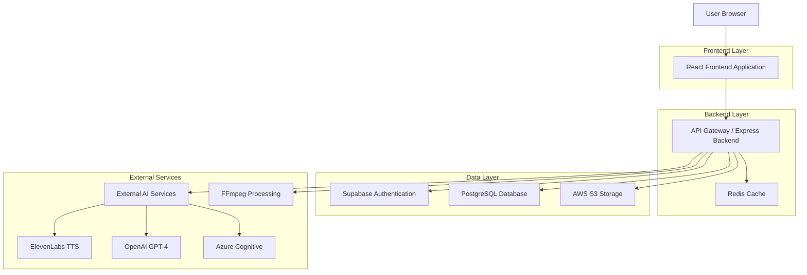
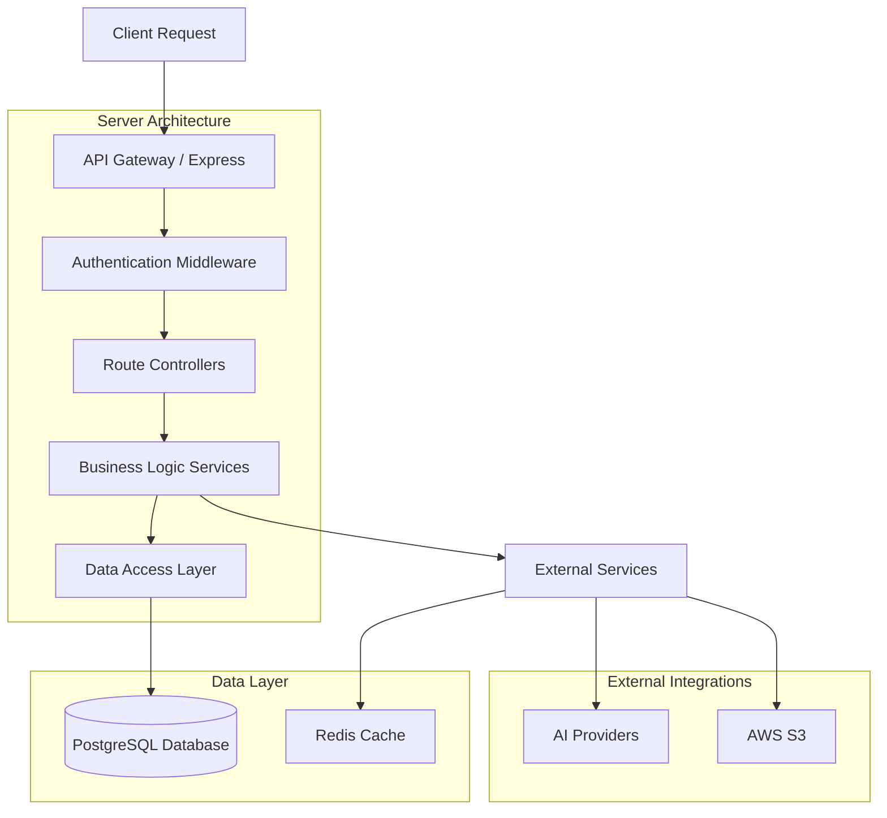
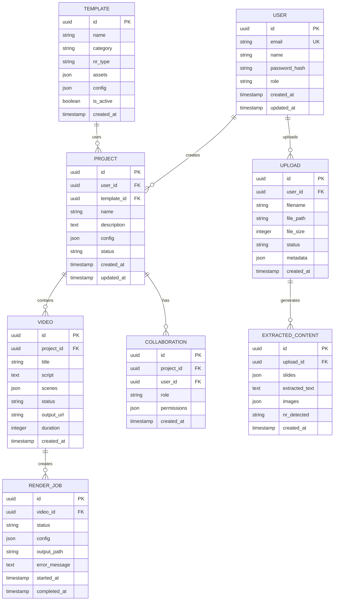

# 🏗️ DOCUMENTO DE ARQUITETURA TÉCNICA
## Studio IA Videos - Especificações Técnicas Detalhadas

**Versão:** 2.0  
**Data:** Janeiro 2025  
**Complemento ao:** PRD_ESTUDIO_IA_VIDEOS_ATUALIZADO.md

---

## 1. Arquitetura do Sistema



---

## 2. Descrição Tecnológica

### Frontend
- **React@18** + **TypeScript** + **Vite** (build tool)
- **TailwindCSS@3** + **Shadcn/ui** (componentes)
- **Zustand** (gerenciamento de estado)
- **React Router** (roteamento)
- **React Query** (cache e sincronização)

### Backend
- **Node.js** + **Express@4** (servidor)
- **Prisma ORM** (database abstraction)
- **Supabase** (autenticação e database)
- **Redis** (cache e sessões)
- **AWS S3** (storage de arquivos)

### Infraestrutura
- **Vercel** (deploy frontend)
- **Railway** (deploy backend)
- **PostgreSQL** (database principal)
- **CloudFront CDN** (distribuição de assets)

---

## 3. Definições de Rotas

| Rota | Propósito |
|------|----------|
| `/` | Página inicial com hero section e apresentação |
| `/auth/signin` | Página de login com email/senha e Google OAuth |
| `/auth/signup` | Página de registro de novos usuários |
| `/auth/forgot-password` | Recuperação de senha via email |
| `/dashboard` | Dashboard principal com estatísticas e projetos |
| `/upload` | Interface de upload e processamento de PPTX |
| `/editor` | Editor completo de vídeos com timeline |
| `/editor/:projectId` | Editor para projeto específico |
| `/templates` | Biblioteca de templates organizados por NR |
| `/projects` | Gerenciador de projetos e colaboração |
| `/projects/:id` | Visualização detalhada de projeto |
| `/profile` | Perfil do usuário e configurações |
| `/settings` | Configurações avançadas do sistema |
| `/analytics` | Dashboard de analytics e relatórios |
| `/admin/dashboard` | Painel administrativo (admin only) |
| `/admin/users` | Gerenciamento de usuários (admin only) |
| `/admin/metrics` | Métricas de sistema (admin only) |
| `/collaboration/:roomId` | Sala de colaboração em tempo real |
| `/export/:projectId` | Interface de export e download |

---

## 4. Definições de API

### 4.1 APIs de Autenticação

#### Login de usuário
```
POST /api/auth/login
```

**Request:**
| Parâmetro | Tipo | Obrigatório | Descrição |
|-----------|------|-------------|----------|
| email | string | true | Email do usuário |
| password | string | true | Senha (texto plano) |

**Response:**
| Parâmetro | Tipo | Descrição |
|-----------|------|----------|
| success | boolean | Status da operação |
| token | string | JWT token de acesso |
| user | object | Dados do usuário |

**Exemplo:**
```json
{
  "email": "admin@studio.com",
  "password": "admin123"
}
```

#### Registro de usuário
```
POST /api/auth/register
```

**Request:**
| Parâmetro | Tipo | Obrigatório | Descrição |
|-----------|------|-------------|----------|
| name | string | true | Nome completo |
| email | string | true | Email único |
| password | string | true | Senha (mín. 8 caracteres) |

### 4.2 APIs de Upload e Processamento

#### Upload de arquivo PPTX
```
POST /api/pptx/upload
```

**Request:**
| Parâmetro | Tipo | Obrigatório | Descrição |
|-----------|------|-------------|----------|
| file | File | true | Arquivo PPTX (max 50MB) |
| projectName | string | false | Nome do projeto |

**Response:**
| Parâmetro | Tipo | Descrição |
|-----------|------|----------|
| uploadId | string | ID único do upload |
| status | string | Status do processamento |
| extractedContent | object | Conteúdo extraído |

#### Processamento de conteúdo
```
POST /api/pptx/process
```

**Request:**
| Parâmetro | Tipo | Obrigatório | Descrição |
|-----------|------|-------------|----------|
| uploadId | string | true | ID do upload |
| options | object | false | Opções de processamento |

### 4.3 APIs de IA

#### Geração de roteiro
```
POST /api/ai/generate-script
```

**Request:**
| Parâmetro | Tipo | Obrigatório | Descrição |
|-----------|------|-------------|----------|
| content | string | true | Conteúdo extraído do PPTX |
| nrType | string | false | Tipo de NR identificada |
| tone | string | false | Tom da narração |

#### Conversão texto-para-fala
```
POST /api/ai/text-to-speech
```

**Request:**
| Parâmetro | Tipo | Obrigatório | Descrição |
|-----------|------|-------------|----------|
| text | string | true | Texto para conversão |
| voice | string | false | ID da voz selecionada |
| provider | string | false | Provedor TTS (elevenlabs, azure, google) |

### 4.4 APIs de Projetos

#### Listar projetos
```
GET /api/projects
```

**Query Parameters:**
| Parâmetro | Tipo | Descrição |
|-----------|------|----------|
| page | number | Página (default: 1) |
| limit | number | Itens por página (default: 10) |
| search | string | Busca por nome |
| category | string | Filtro por categoria |

#### Criar projeto
```
POST /api/projects
```

**Request:**
| Parâmetro | Tipo | Obrigatório | Descrição |
|-----------|------|-------------|----------|
| name | string | true | Nome do projeto |
| description | string | false | Descrição |
| templateId | string | false | ID do template base |

### 4.5 APIs de Templates

#### Listar templates
```
GET /api/templates
```

**Query Parameters:**
| Parâmetro | Tipo | Descrição |
|-----------|------|----------|
| category | string | Categoria (nr, safety, general) |
| nrType | string | Tipo específico de NR |

#### Obter template específico
```
GET /api/templates/:id
```

**Response:**
| Parâmetro | Tipo | Descrição |
|-----------|------|----------|
| id | string | ID único do template |
| name | string | Nome do template |
| category | string | Categoria |
| assets | array | Lista de assets inclusos |
| config | object | Configurações do template |

---

## 5. Arquitetura do Servidor



### 5.1 Camadas da Aplicação

#### Controller Layer
- **AuthController**: Gerencia autenticação e autorização
- **ProjectController**: CRUD de projetos e colaboração
- **UploadController**: Upload e processamento de arquivos
- **AIController**: Integração com serviços de IA
- **TemplateController**: Gerenciamento de templates
- **AnalyticsController**: Métricas e relatórios

#### Service Layer
- **AuthService**: Lógica de autenticação e JWT
- **ProjectService**: Regras de negócio de projetos
- **PPTXService**: Processamento de apresentações
- **AIService**: Orquestração de serviços de IA
- **RenderService**: Geração de vídeos
- **NotificationService**: Sistema de notificações

#### Repository Layer
- **UserRepository**: Operações de usuário
- **ProjectRepository**: Persistência de projetos
- **TemplateRepository**: Gerenciamento de templates
- **AnalyticsRepository**: Coleta de métricas
- **FileRepository**: Gerenciamento de arquivos

---

## 6. Modelo de Dados

### 6.1 Diagrama Entidade-Relacionamento



### 6.2 Definições DDL

#### Tabela de Usuários
```sql
-- Criar tabela de usuários
CREATE TABLE users (
    id UUID PRIMARY KEY DEFAULT gen_random_uuid(),
    email VARCHAR(255) UNIQUE NOT NULL,
    name VARCHAR(100) NOT NULL,
    password_hash VARCHAR(255),
    role VARCHAR(20) DEFAULT 'user' CHECK (role IN ('user', 'premium', 'admin')),
    avatar_url TEXT,
    preferences JSON DEFAULT '{}',
    created_at TIMESTAMP WITH TIME ZONE DEFAULT NOW(),
    updated_at TIMESTAMP WITH TIME ZONE DEFAULT NOW()
);

-- Índices para performance
CREATE INDEX idx_users_email ON users(email);
CREATE INDEX idx_users_role ON users(role);
CREATE INDEX idx_users_created_at ON users(created_at DESC);

-- Permissões Supabase
GRANT SELECT ON users TO anon;
GRANT ALL PRIVILEGES ON users TO authenticated;
```

#### Tabela de Projetos
```sql
-- Criar tabela de projetos
CREATE TABLE projects (
    id UUID PRIMARY KEY DEFAULT gen_random_uuid(),
    user_id UUID NOT NULL REFERENCES users(id) ON DELETE CASCADE,
    template_id UUID REFERENCES templates(id),
    name VARCHAR(200) NOT NULL,
    description TEXT,
    config JSON DEFAULT '{}',
    status VARCHAR(20) DEFAULT 'draft' CHECK (status IN ('draft', 'processing', 'completed', 'error')),
    thumbnail_url TEXT,
    tags TEXT[],
    is_public BOOLEAN DEFAULT false,
    created_at TIMESTAMP WITH TIME ZONE DEFAULT NOW(),
    updated_at TIMESTAMP WITH TIME ZONE DEFAULT NOW()
);

-- Índices
CREATE INDEX idx_projects_user_id ON projects(user_id);
CREATE INDEX idx_projects_status ON projects(status);
CREATE INDEX idx_projects_created_at ON projects(created_at DESC);
CREATE INDEX idx_projects_tags ON projects USING GIN(tags);

-- Permissões
GRANT SELECT ON projects TO anon;
GRANT ALL PRIVILEGES ON projects TO authenticated;
```

#### Tabela de Templates
```sql
-- Criar tabela de templates
CREATE TABLE templates (
    id UUID PRIMARY KEY DEFAULT gen_random_uuid(),
    name VARCHAR(200) NOT NULL,
    category VARCHAR(50) NOT NULL,
    nr_type VARCHAR(10),
    description TEXT,
    thumbnail_url TEXT,
    assets JSON DEFAULT '[]',
    config JSON DEFAULT '{}',
    is_active BOOLEAN DEFAULT true,
    is_premium BOOLEAN DEFAULT false,
    usage_count INTEGER DEFAULT 0,
    created_at TIMESTAMP WITH TIME ZONE DEFAULT NOW(),
    updated_at TIMESTAMP WITH TIME ZONE DEFAULT NOW()
);

-- Índices
CREATE INDEX idx_templates_category ON templates(category);
CREATE INDEX idx_templates_nr_type ON templates(nr_type);
CREATE INDEX idx_templates_is_active ON templates(is_active);
CREATE INDEX idx_templates_usage_count ON templates(usage_count DESC);

-- Permissões
GRANT SELECT ON templates TO anon;
GRANT ALL PRIVILEGES ON templates TO authenticated;
```

#### Tabela de Uploads
```sql
-- Criar tabela de uploads
CREATE TABLE uploads (
    id UUID PRIMARY KEY DEFAULT gen_random_uuid(),
    user_id UUID NOT NULL REFERENCES users(id) ON DELETE CASCADE,
    filename VARCHAR(255) NOT NULL,
    original_name VARCHAR(255) NOT NULL,
    file_path TEXT NOT NULL,
    file_size BIGINT NOT NULL,
    mime_type VARCHAR(100),
    status VARCHAR(20) DEFAULT 'uploaded' CHECK (status IN ('uploaded', 'processing', 'completed', 'error')),
    metadata JSON DEFAULT '{}',
    error_message TEXT,
    created_at TIMESTAMP WITH TIME ZONE DEFAULT NOW(),
    processed_at TIMESTAMP WITH TIME ZONE
);

-- Índices
CREATE INDEX idx_uploads_user_id ON uploads(user_id);
CREATE INDEX idx_uploads_status ON uploads(status);
CREATE INDEX idx_uploads_created_at ON uploads(created_at DESC);

-- Permissões
GRANT SELECT ON uploads TO anon;
GRANT ALL PRIVILEGES ON uploads TO authenticated;
```

#### Tabela de Vídeos
```sql
-- Criar tabela de vídeos
CREATE TABLE videos (
    id UUID PRIMARY KEY DEFAULT gen_random_uuid(),
    project_id UUID NOT NULL REFERENCES projects(id) ON DELETE CASCADE,
    title VARCHAR(200) NOT NULL,
    script TEXT,
    scenes JSON DEFAULT '[]',
    status VARCHAR(20) DEFAULT 'draft' CHECK (status IN ('draft', 'rendering', 'completed', 'error')),
    output_url TEXT,
    thumbnail_url TEXT,
    duration INTEGER, -- em segundos
    file_size BIGINT,
    quality VARCHAR(10) DEFAULT 'HD',
    created_at TIMESTAMP WITH TIME ZONE DEFAULT NOW(),
    completed_at TIMESTAMP WITH TIME ZONE
);

-- Índices
CREATE INDEX idx_videos_project_id ON videos(project_id);
CREATE INDEX idx_videos_status ON videos(status);
CREATE INDEX idx_videos_created_at ON videos(created_at DESC);

-- Permissões
GRANT SELECT ON videos TO anon;
GRANT ALL PRIVILEGES ON videos TO authenticated;
```

#### Dados Iniciais
```sql
-- Inserir templates básicos de NR
INSERT INTO templates (name, category, nr_type, description, config) VALUES
('NR-12 Segurança em Máquinas', 'safety', 'NR12', 'Template para treinamentos de segurança em máquinas e equipamentos', '{"avatars": ["engineer", "safety_officer"], "scenes": ["factory", "workshop"]}'),
('NR-10 Segurança Elétrica', 'safety', 'NR10', 'Template para treinamentos de segurança em instalações elétricas', '{"avatars": ["electrician", "supervisor"], "scenes": ["electrical_room", "substation"]}'),
('NR-06 EPI', 'safety', 'NR06', 'Template para treinamentos sobre equipamentos de proteção individual', '{"avatars": ["worker", "safety_manager"], "scenes": ["construction", "industrial"]}'),
('NR-35 Trabalho em Altura', 'safety', 'NR35', 'Template para treinamentos de trabalho em altura', '{"avatars": ["climber", "supervisor"], "scenes": ["rooftop", "scaffold"]}'),
('Template Genérico', 'general', null, 'Template básico para qualquer tipo de treinamento', '{"avatars": ["presenter"], "scenes": ["office", "classroom"]}');

-- Inserir usuário administrador padrão
INSERT INTO users (email, name, password_hash, role) VALUES
('admin@studio.com', 'Administrador', '$2b$10$hash_da_senha_admin123', 'admin');
```

---

## 7. Configurações de Segurança

### 7.1 Autenticação
- **JWT Tokens**: Expiração de 24h com refresh tokens
- **Password Hashing**: bcrypt com salt rounds 12
- **OAuth Integration**: Google OAuth 2.0 via Supabase
- **Session Management**: Redis para armazenamento de sessões

### 7.2 Autorização
- **Role-Based Access Control (RBAC)**
- **Resource-Level Permissions**
- **API Rate Limiting**: 100 requests/minute por usuário
- **CORS Configuration**: Domínios específicos permitidos

### 7.3 Proteção de Dados
- **Encryption at Rest**: AES-256 para dados sensíveis
- **Encryption in Transit**: TLS 1.3 obrigatório
- **Data Anonymization**: PII removido de logs
- **Backup Encryption**: Backups criptografados no S3

---

## 8. Monitoramento e Observabilidade

### 8.1 Métricas de Sistema
- **Application Performance Monitoring (APM)**
- **Database Performance**: Query timing e optimization
- **API Response Times**: P50, P95, P99
- **Error Rates**: 4xx e 5xx por endpoint

### 8.2 Logging
- **Structured Logging**: JSON format com correlation IDs
- **Log Levels**: ERROR, WARN, INFO, DEBUG
- **Log Retention**: 30 dias para aplicação, 90 dias para auditoria
- **Sensitive Data**: Masking automático de PII

### 8.3 Alertas
- **Uptime Monitoring**: Alertas para downtime > 1 minuto
- **Performance Degradation**: Response time > 5s
- **Error Rate Spikes**: Error rate > 1%
- **Resource Usage**: CPU > 80%, Memory > 85%

---

**Documento técnico aprovado por:**  
**Arquiteto de Software** | **Data:** Janeiro 2025  
**Versão:** 2.0 | **Próxima revisão:** Março 2025