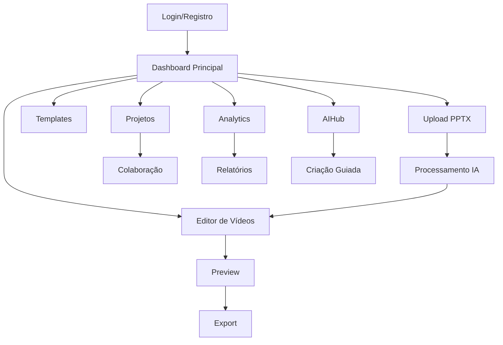
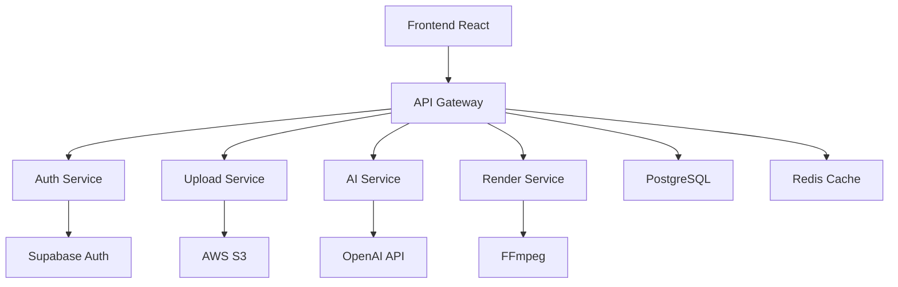

# 📋 DOCUMENTO DE REQUISITOS DE PRODUTO (PRD)
## Studio IA Videos - Sistema Low-Code/No-Code para Treinamentos de Segurança

**Versão:** 2.0  
**Data:** Janeiro 2025  
**Status:** Atualizado  

---

## 1. Visão Geral do Produto

O **Studio IA Videos** é uma plataforma revolucionária low-code/no-code que transforma apresentações PowerPoint de Normas Regulamentadoras (NRs) em vídeos profissionais de treinamento com avatares 3D hiper-realistas, narração por IA e efeitos visuais avançados. A plataforma permite que profissionais de RH e segurança do trabalho, sem conhecimento técnico, criem conteúdo de treinamento de alta qualidade em minutos.

**Objetivo Central:** Democratizar a criação de vídeos de treinamento de segurança, reduzindo o tempo de produção de semanas para minutos, mantendo alta qualidade e compliance com normas brasileiras.

**Valor de Mercado:** Atender o mercado brasileiro de treinamentos corporativos (R$ 2.8 bilhões), focando especificamente em segurança do trabalho e compliance com NRs.

---

## 2. Funcionalidades Principais

### 2.1 Papéis de Usuário

| Papel | Método de Registro | Permissões Principais |
|-------|-------------------|----------------------|
| Usuário Básico | Email + senha ou Google OAuth | Upload PPTX, usar templates básicos, criar até 5 vídeos/mês |
| Usuário Premium | Upgrade via pagamento | Acesso completo a templates, avatares premium, vídeos ilimitados |
| Administrador | Convite interno | Gerenciar usuários, configurar sistema, acessar analytics avançados |
| Colaborador | Convite de projeto | Editar projetos compartilhados, comentar, sugerir alterações |

### 2.2 Módulos Funcionais

Nosso sistema é composto pelos seguintes módulos principais:

1. **Dashboard Principal**: painel de controle, estatísticas rápidas, projetos recentes, acesso aos módulos
2. **Upload e Processamento PPTX**: importação de apresentações, análise automática de conteúdo, extração de texto e imagens
3. **Editor de Vídeos**: timeline interativa, biblioteca de avatares 3D, efeitos visuais, sincronização labial
4. **Biblioteca de Templates**: templates especializados por NR, cenários pré-configurados, elementos visuais
5. **Sistema de IA Avançada**: geração de roteiros, otimização de conteúdo, sugestões automáticas
6. **Gerenciamento de Projetos**: organização de vídeos, colaboração em equipe, controle de versões
7. **Analytics e Relatórios**: métricas de engajamento, relatórios de compliance, dashboards executivos
8. **Configurações e Administração**: gerenciamento de usuários, configurações de sistema, integrações

### 2.3 Detalhamento de Funcionalidades

| Módulo | Componente | Descrição da Funcionalidade |
|--------|------------|-----------------------------|
| Dashboard | Painel Principal | Exibir estatísticas rápidas, projetos recentes, acesso direto aos módulos principais |
| Dashboard | AIHub | Interface conversacional para criação guiada de vídeos via linguagem natural |
| Dashboard | Navegação Responsiva | Menu adaptativo para desktop e mobile, acesso rápido às funcionalidades |
| Upload PPTX | Sistema de Upload | Arrastar e soltar arquivos, validação de formato, preview de slides |
| Upload PPTX | Processamento IA | Extração automática de texto, análise de conteúdo, geração de roteiro |
| Upload PPTX | Mapeamento NR | Identificação automática da norma regulamentadora, aplicação de templates específicos |
| Editor | Timeline Interativa | Edição visual de cenas, sincronização de áudio e vídeo, controles de tempo |
| Editor | Biblioteca de Avatares | Seleção de avatares 3D hiper-realistas, personalização de aparência, configuração de expressões |
| Editor | Sistema TTS | Conversão texto-para-fala com múltiplos provedores (ElevenLabs, Azure, Google) |
| Editor | Efeitos Visuais | Transições, animações, overlays, elementos gráficos especializados em segurança |
| Templates | Biblioteca NR | Templates específicos para cada norma regulamentadora brasileira |
| Templates | Cenários 3D | Ambientes virtuais realistas (fábricas, escritórios, canteiros de obra) |
| Templates | Elementos Visuais | Ícones, gráficos, animações relacionadas à segurança do trabalho |
| IA Avançada | Geração de Roteiros | Criação automática de narrativas baseadas no conteúdo do PPTX |
| IA Avançada | Otimização de Conteúdo | Sugestões de melhorias, adequação às normas, otimização de engajamento |
| IA Avançada | Análise de Compliance | Verificação automática de conformidade com NRs, alertas de adequação |
| Projetos | Gerenciador de Projetos | Organização hierárquica, tags, filtros, busca avançada |
| Projetos | Colaboração | Compartilhamento de projetos, comentários, aprovações, controle de acesso |
| Projetos | Versionamento | Histórico de alterações, comparação de versões, restauração de backups |
| Analytics | Métricas de Engajamento | Tempo de visualização, taxa de conclusão, pontos de abandono |
| Analytics | Relatórios de Compliance | Certificados de treinamento, relatórios de conformidade, auditoria |
| Analytics | Dashboard Executivo | KPIs de treinamento, ROI, eficácia dos programas de segurança |
| Administração | Gerenciamento de Usuários | CRUD de usuários, permissões, grupos, auditoria de acesso |
| Administração | Configurações de Sistema | Integrações com APIs, configurações de marca, personalização |
| Administração | Monitoramento | Logs de sistema, performance, alertas, backup automático |

---

## 3. Fluxos Principais de Usuário

### Fluxo do Usuário Básico:
1. **Login/Registro** → Autenticação via email ou Google OAuth
2. **Dashboard** → Visualização de projetos e acesso aos módulos
3. **Upload PPTX** → Importação de apresentação sobre NR
4. **Processamento IA** → Análise automática e geração de roteiro
5. **Editor** → Personalização de avatares, cenários e efeitos
6. **Preview** → Visualização do vídeo gerado
7. **Export** → Download do vídeo final em múltiplos formatos

### Fluxo do Administrador:
1. **Login Admin** → Acesso com credenciais administrativas
2. **Dashboard Admin** → Métricas de sistema e usuários
3. **Gerenciamento** → Configuração de usuários e permissões
4. **Analytics** → Relatórios de uso e performance
5. **Configurações** → Ajustes de sistema e integrações

### Diagrama de Navegação:

---

## 4. Design de Interface

### 4.1 Estilo de Design

- **Cores Primárias**: Azul profissional (#2563EB), Verde segurança (#10B981)
- **Cores Secundárias**: Cinza moderno (#6B7280), Branco (#FFFFFF)
- **Estilo de Botões**: Rounded corners (8px), gradientes sutis, estados hover/active
- **Tipografia**: Inter (títulos), Open Sans (corpo), tamanhos 14px-24px
- **Layout**: Design card-based, navegação top + sidebar, grid responsivo
- **Ícones**: Lucide React, estilo outline, tamanho 20-24px
- **Animações**: Transições suaves (300ms), micro-interações, loading states

### 4.2 Componentes de Interface

| Módulo | Componente | Elementos de UI |
|--------|------------|----------------|
| Dashboard | Painel Principal | Cards de estatísticas, gráficos de progresso, lista de projetos recentes, botões de ação rápida |
| Dashboard | AIHub | Interface de chat, input de texto expandido, sugestões automáticas, histórico de conversas |
| Upload | Área de Upload | Zona drag-and-drop, barra de progresso, preview de slides, validação visual |
| Editor | Timeline | Linha do tempo interativa, controles de zoom, marcadores de cena, preview thumbnails |
| Editor | Biblioteca | Grid de avatares, filtros por categoria, preview 3D, configurações de personalização |
| Templates | Galeria | Layout em grid, filtros por NR, preview em hover, tags de categoria |
| Analytics | Dashboard | Gráficos interativos, métricas em tempo real, filtros de período, export de relatórios |

### 4.3 Responsividade

**Desktop-first** com adaptação mobile completa:
- **Desktop (1200px+)**: Layout completo com sidebar e múltiplas colunas
- **Tablet (768px-1199px)**: Sidebar colapsável, layout em duas colunas
- **Mobile (320px-767px)**: Navegação bottom tab, layout single column, gestos touch otimizados

---

## 5. Requisitos Técnicos

### 5.1 Requisitos Funcionais

#### RF001 - Autenticação e Autorização
- **Descrição**: Sistema completo de login com múltiplos provedores
- **Critérios de Aceitação**:
  - Login via email/senha e Google OAuth
  - Recuperação de senha via email
  - Sessões seguras com JWT
  - Controle de permissões por papel

#### RF002 - Upload e Processamento PPTX
- **Descrição**: Importação e análise automática de apresentações
- **Critérios de Aceitação**:
  - Suporte a arquivos .pptx até 50MB
  - Extração de texto, imagens e estrutura
  - Identificação automática de NR
  - Geração de roteiro via IA

#### RF003 - Editor de Vídeos
- **Descrição**: Interface completa de edição com avatares 3D
- **Critérios de Aceitação**:
  - Timeline interativa com drag-and-drop
  - Biblioteca de 20+ avatares hiper-realistas
  - Sincronização labial automática
  - Preview em tempo real

#### RF004 - Sistema de Templates
- **Descrição**: Biblioteca especializada em NRs brasileiras
- **Critérios de Aceitação**:
  - Templates para todas as 37 NRs principais
  - Cenários 3D realistas
  - Elementos visuais especializados
  - Personalização de marca

#### RF005 - IA Avançada
- **Descrição**: Funcionalidades de inteligência artificial
- **Critérios de Aceitação**:
  - Geração automática de roteiros
  - Análise de compliance com NRs
  - Sugestões de melhorias
  - Otimização de engajamento

### 5.2 Requisitos Não Funcionais

#### RNF001 - Performance
- **Tempo de carregamento**: < 3 segundos para páginas principais
- **Processamento PPTX**: < 2 minutos para arquivos de até 50MB
- **Renderização de vídeo**: < 5 minutos para vídeos de até 10 minutos
- **Suporte simultâneo**: 100+ usuários concorrentes

#### RNF002 - Segurança
- **Criptografia**: HTTPS obrigatório, dados em repouso criptografados
- **Autenticação**: JWT com refresh tokens, sessões seguras
- **Backup**: Backup automático diário, retenção de 30 dias
- **Compliance**: LGPD, ISO 27001, SOC 2

#### RNF003 - Usabilidade
- **Acessibilidade**: WCAG 2.1 AA, suporte a leitores de tela
- **Responsividade**: Funcional em dispositivos 320px-4K
- **Internacionalização**: Português brasileiro, inglês
- **Offline**: Funcionalidades básicas disponíveis offline

#### RNF004 - Escalabilidade
- **Arquitetura**: Microserviços com containers Docker
- **Database**: PostgreSQL com replicação
- **Storage**: AWS S3 com CDN CloudFront
- **Monitoramento**: Logs centralizados, métricas em tempo real

---

## 6. Critérios de Aceitação

### 6.1 Critérios de Qualidade

#### Funcionalidade
- [ ] Todos os fluxos principais funcionam sem erros
- [ ] Upload de PPTX processa corretamente 95% dos arquivos
- [ ] Geração de vídeo completa em < 5 minutos
- [ ] Sincronização labial com precisão > 90%

#### Performance
- [ ] Tempo de carregamento < 3s em conexões 4G
- [ ] Suporte a 100+ usuários simultâneos
- [ ] Uptime > 99.5%
- [ ] Backup automático funcionando

#### Usabilidade
- [ ] Usuário leigo cria primeiro vídeo em < 15 minutos
- [ ] Taxa de conclusão de projetos > 90%
- [ ] Satisfação do usuário > 4.5/5
- [ ] Interface responsiva em todos os dispositivos

#### Segurança
- [ ] Autenticação segura implementada
- [ ] Dados criptografados em trânsito e repouso
- [ ] Logs de auditoria funcionando
- [ ] Compliance com LGPD

### 6.2 Critérios de Negócio

#### Impacto
- [ ] Redução de 50%+ no tempo de criação de treinamentos
- [ ] 100% dos vídeos atendem diretrizes NR
- [ ] ROI positivo em 6 meses
- [ ] Adoção por 80%+ dos usuários-alvo

---

## 7. Roadmap e Prioridades

### 7.1 Fase 1 - MVP (Concluída)
**Duração**: 3 meses  
**Status**: ✅ Completa

- [x] Autenticação básica
- [x] Upload PPTX
- [x] Editor básico
- [x] Templates iniciais
- [x] Export de vídeo

### 7.2 Fase 2 - Funcionalidades Avançadas (Atual)
**Duração**: 2 meses  
**Status**: 🔄 Em andamento

- [x] IA para geração de roteiros
- [x] Avatares 3D hiper-realistas
- [x] Sistema de colaboração
- [ ] Analytics avançados
- [ ] Integrações LMS

### 7.3 Fase 3 - Escalabilidade (Próxima)
**Duração**: 3 meses  
**Status**: 📋 Planejada

- [ ] Voice cloning personalizado
- [ ] Ambientes 3D avançados
- [ ] Enterprise SSO
- [ ] API pública
- [ ] White label

### 7.4 Fase 4 - Expansão (Futuro)
**Duração**: 4 meses  
**Status**: 🔮 Visão

- [ ] Marketplace de templates
- [ ] IA generativa avançada
- [ ] Realidade virtual
- [ ] Expansão internacional
- [ ] Certificações ISO

---

## 8. Especificações Técnicas

### 8.1 Arquitetura do Sistema

### 8.2 Stack Tecnológico

#### Frontend
- **Framework**: React 18 + TypeScript
- **Styling**: TailwindCSS + Shadcn/ui
- **Build**: Vite
- **State**: Zustand
- **Routing**: React Router

#### Backend
- **Runtime**: Node.js + Express
- **Database**: PostgreSQL + Prisma ORM
- **Cache**: Redis
- **Storage**: AWS S3
- **Auth**: Supabase Auth

#### Infraestrutura
- **Deploy**: Vercel (Frontend) + Railway (Backend)
- **CDN**: CloudFront
- **Monitoring**: Sentry + LogRocket
- **CI/CD**: GitHub Actions

### 8.3 Integrações Externas

| Serviço | Propósito | Status |
|---------|-----------|--------|
| ElevenLabs | Text-to-Speech premium | ✅ Ativo |
| Azure Cognitive | TTS alternativo | ✅ Ativo |
| OpenAI GPT-4 | Geração de roteiros | ✅ Ativo |
| AWS S3 | Storage de arquivos | ✅ Ativo |
| Supabase | Autenticação | ✅ Ativo |
| FFmpeg | Processamento de vídeo | ✅ Ativo |
| Stripe | Pagamentos | 📋 Planejado |

---

## 9. Métricas de Sucesso

### 9.1 KPIs Técnicos
- **Uptime**: > 99.5%
- **Tempo de resposta**: < 2s (95th percentile)
- **Taxa de erro**: < 0.1%
- **Cobertura de testes**: > 80%

### 9.2 KPIs de Produto
- **Time to First Video**: < 15 minutos
- **Taxa de conversão**: > 25%
- **Retenção (30 dias)**: > 60%
- **NPS**: > 50

### 9.3 KPIs de Negócio
- **ARR**: R$ 1M+ (ano 1)
- **CAC**: < R$ 200
- **LTV**: > R$ 2.000
- **Churn mensal**: < 5%

---

## 10. Considerações de Compliance

### 10.1 Normas Regulamentadoras
- **Cobertura**: Todas as 37 NRs principais
- **Atualização**: Sincronização automática com mudanças
- **Validação**: Revisão por especialistas em segurança
- **Certificação**: Conformidade auditável

### 10.2 Proteção de Dados
- **LGPD**: Compliance total com lei brasileira
- **Consentimento**: Opt-in explícito para coleta de dados
- **Portabilidade**: Export de dados do usuário
- **Exclusão**: Right to be forgotten

---

## 11. Plano de Testes

### 11.1 Testes Funcionais
- **Unitários**: 80%+ cobertura
- **Integração**: APIs e serviços externos
- **E2E**: Fluxos críticos automatizados
- **Usabilidade**: Testes com usuários reais

### 11.2 Testes de Performance
- **Load testing**: 100+ usuários simultâneos
- **Stress testing**: Picos de 500+ usuários
- **Volume testing**: 10.000+ arquivos PPTX
- **Endurance**: 24h de operação contínua

---

## 12. Documentação e Suporte

### 12.1 Documentação Técnica
- **API Documentation**: OpenAPI/Swagger
- **Component Library**: Storybook
- **Architecture Decision Records**: ADRs
- **Deployment Guide**: Docker + Kubernetes

### 12.2 Documentação de Usuário
- **Guia de Início Rápido**: 5 minutos para primeiro vídeo
- **Tutoriais Interativos**: Onboarding guiado
- **Base de Conhecimento**: FAQ e troubleshooting
- **Vídeos Tutoriais**: Biblioteca de treinamento

---

**Documento aprovado por:**  
**Equipe de Produto** | **Data:** Janeiro 2025  
**Versão:** 2.0 | **Próxima revisão:** Março 2025