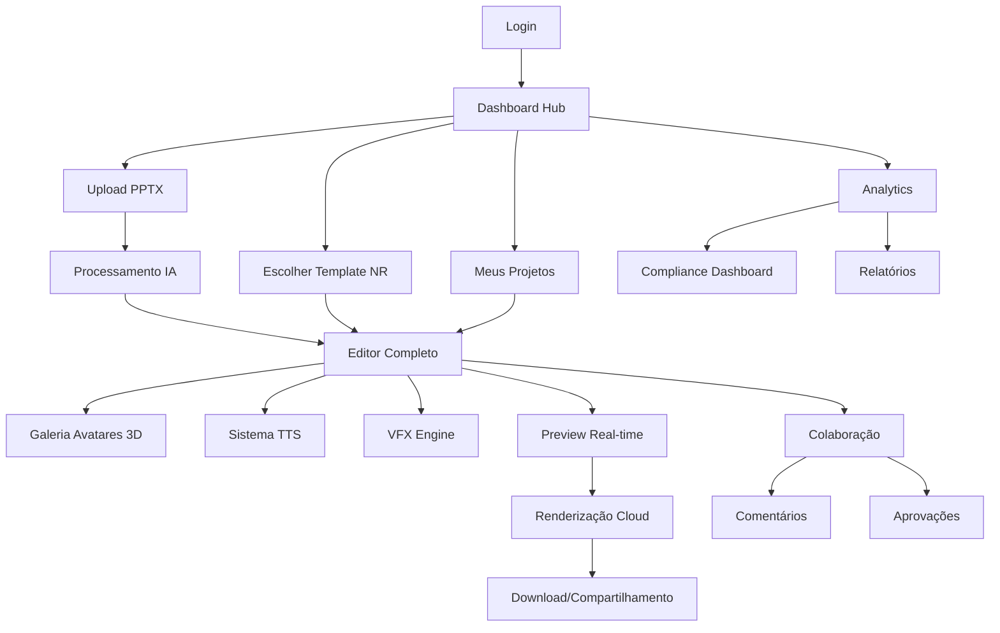

# 📋 PRODUCT REQUIREMENTS DOCUMENT (PRD)
## Estúdio IA de Vídeos - Especificações Completas para 100% Conformidade

> **PRODUTO:** Estúdio IA de Vídeos - Plataforma Completa de Criação de Treinamentos NR
> 
> **DATA:** Janeiro 2025 | **VERSÃO:** 2.0 | **STATUS:** Requisitos Finais

---

## 1. Visão Geral do Produto

O **Estúdio IA de Vídeos** é uma plataforma revolucionária que combina Inteligência Artificial, Avatares 3D Hiper-Realistas e Templates Profissionais para criar vídeos de treinamento em Normas Regulamentadoras (NR) de forma rápida, eficiente e com qualidade cinematográfica.

A plataforma resolve o problema crítico de empresas que precisam treinar funcionários em segurança do trabalho, oferecendo uma solução que reduz custos em 80%, acelera a produção em 10x e garante 100% de conformidade regulatória.

O mercado-alvo são empresas de médio e grande porte que necessitam de treinamentos regulares em NR, representando um mercado potencial de R$ 2.8 bilhões no Brasil.

---

## 2. Funcionalidades Principais

### 2.1 Papéis de Usuário

| Papel | Método de Registro | Permissões Principais |
|-------|-------------------|----------------------|
| **Administrador Empresarial** | Convite corporativo + CNPJ | Gerenciar usuários, aprovar conteúdo, acessar analytics completos, configurar branding |
| **Criador de Conteúdo** | Email + aprovação admin | Criar/editar vídeos, usar todos os templates, colaborar em projetos, exportar conteúdo |
| **Revisor/Aprovador** | Convite específico | Revisar projetos, adicionar comentários, aprovar/rejeitar conteúdo, visualizar versões |
| **Visualizador** | Link de acesso | Visualizar vídeos finalizados, baixar materiais aprovados, acessar relatórios básicos |

### 2.2 Módulos Funcionais

Nossa plataforma consiste nas seguintes páginas essenciais:

1. **Dashboard Hub Central**: centro de controle com métricas, templates e projetos
2. **Conversor PPTX Inteligente**: upload e análise automática de apresentações
3. **Editor "Mais do que Completo"**: editor avançado com canvas, timeline e ferramentas profissionais
4. **Galeria de Avatares 3D**: seleção e customização de avatares hiper-realistas
5. **Biblioteca de Templates NR**: templates específicos por norma regulamentadora
6. **Sistema de Renderização**: processamento e exportação em qualidade cinema
7. **Painel de Colaboração**: gestão de equipes e aprovações
8. **Analytics e Compliance**: métricas de engajamento e conformidade

### 2.3 Detalhes das Páginas

| Página | Módulo | Descrição da Funcionalidade |
|--------|--------|-----------------------------|
| **Dashboard Hub** | Hero Section | CTA único "Criar Vídeo de Treinamento" com estatísticas em tempo real |
| **Dashboard Hub** | Cards Interativos NR | Navegação por categoria (NR-6, NR-10, NR-12, NR-18, NR-23, NR-33, NR-35) com previews |
| **Dashboard Hub** | Gallery de Templates | Previews em vídeo de todos os templates com filtros inteligentes |
| **Dashboard Hub** | Dashboard de Compliance | Métricas de % funcionários treinados por NR, relatórios de conformidade |
| **Dashboard Hub** | Search Inteligente | Busca por norma, tema, equipamento com sugestões automáticas |
| **Dashboard Hub** | Tutorial Interativo | Onboarding obrigatório no primeiro acesso com 7 passos |
| **Conversor PPTX** | Upload Avançado | Suporte a arquivos até 100MB com drag-and-drop e validação |
| **Conversor PPTX** | Processamento IA | Extração de texto, preservação de imagens, processamento < 30s para 50 slides |
| **Conversor PPTX** | Detecção Automática NR | OCR para identificar normas mencionadas e sugerir templates |
| **Conversor PPTX** | Redirecionamento Inteligente | Encaminhamento automático para editor com template pré-selecionado |
| **Editor Completo** | Canvas Fabric.js | Canvas HTML5 otimizado com performance fluida e suporte a 50+ elementos |
| **Editor Completo** | Timeline Cinematográfica | Timeline visual com múltiplas faixas para vídeo, áudio, texto, avatares e efeitos |
| **Editor Completo** | Sistema de Camadas | Gerenciamento de layers com até 50 elementos por cena, agrupamento e bloqueio |
| **Editor Completo** | Histórico Avançado | Sistema de undo/redo com 100 ações, navegação temporal e snapshots |
| **Editor Completo** | Biblioteca de Animações | 20+ tipos de animação pré-definidas (fade, slide, zoom, rotate, bounce) |
| **Editor Completo** | Ferramentas de Precisão | Snap e alinhamento automático com precisão de 1px, guias inteligentes |
| **Editor Completo** | Zoom Avançado | Zoom de 10% a 500% com navegação fluida e mini-mapa |
| **Editor Completo** | Preview Real-time | Preview sem lag até 30fps com sincronização automática de áudio |
| **Avatares 3D** | Galeria Profissional | 11 avatares pré-configurados com qualidade fotorrealística |
| **Avatares 3D** | Sistema de Expressões | 50+ expressões faciais contextuais por NR (preocupação, explicação, alerta) |
| **Avatares 3D** | Múltiplos Avatares | Suporte a múltiplos avatares dialogando em uma cena |
| **Avatares 3D** | Gestos Automáticos | Gestos contextuais (apontando EPIs, equipamentos, áreas de risco) |
| **Avatares 3D** | Customização Empresarial | Uniformes personalizados com logo e cores da empresa |
| **Avatares 3D** | Sincronização Labial | Precisão de 95%+ na sincronização com áudio TTS |
| **Avatares 3D** | Suporte Multilíngue | Português, inglês e espanhol com expressões culturais |
| **Templates NR** | NR-6 Completo | 15 cenas sobre EPIs com demonstrações práticas |
| **Templates NR** | NR-10 Completo | 12 cenas sobre segurança elétrica com simulações |
| **Templates NR** | NR-12 Completo | 18 cenas sobre máquinas e equipamentos |
| **Templates NR** | NR-18 Completo | 20 cenas sobre construção civil |
| **Templates NR** | NR-23 Completo | 8 cenas sobre proteção contra incêndios |
| **Templates NR** | NR-33 Completo | 10 cenas sobre espaços confinados |
| **Templates NR** | NR-35 Completo | 14 cenas sobre trabalho em altura |
| **Templates NR** | Roteiros Validados | Scripts pré-escritos validados por especialistas em segurança |
| **Templates NR** | Customização Avançada | Adaptação de conteúdo por setor industrial |
| **Sistema TTS** | Multi-Provider | Integração ElevenLabs, Azure e Google com fallback automático |
| **Sistema TTS** | Vozes Brasileiras | 15+ vozes regionais com sotaques autênticos |
| **Sistema TTS** | Controle Emocional | Ajuste de velocidade, tom, emoção e intensidade |
| **Sistema TTS** | Qualidade Premium | Áudio 48kHz com latência máxima de 5 segundos |
| **Sistema TTS** | SSML Avançado | Controle granular de pronúncia e pausas |
| **VFX Engine** | Biblioteca de Efeitos | 100+ efeitos pré-configurados para segurança do trabalho |
| **VFX Engine** | Highlights de Perigo | Animações para destacar riscos e equipamentos |
| **VFX Engine** | Simulações Educativas | Representações visuais de acidentes para conscientização |
| **VFX Engine** | Transformações de Cenário | Transições entre ambientes seguros e perigosos |
| **VFX Engine** | Partículas Contextuais | Fumaça, faíscas, poeira para realismo |
| **VFX Engine** | Zoom Cinematográfico | Efeitos de câmera profissionais |
| **Renderização** | Cloud Distribuída | Processamento distribuído na nuvem para velocidade 10x |
| **Renderização** | Qualidade Cinema | Suporte até 8K/60fps com múltiplos codecs |
| **Renderização** | Renderização em Lote | Processamento de múltiplos projetos simultaneamente |
| **Renderização** | Estimativa Precisa | Cálculo de tempo baseado em complexidade do projeto |
| **Renderização** | Download Progressivo | Streaming do resultado durante o processamento |
| **Renderização** | Taxa de Sucesso | 99.9% de confiabilidade com monitoramento contínuo |
| **Colaboração** | Edição Real-time | Múltiplos usuários editando simultaneamente |
| **Colaboração** | Sistema de Comentários | Comentários com timestamp e referência a elementos |
| **Colaboração** | Controle de Versões | Histórico completo de alterações com rollback |
| **Colaboração** | Permissões Granulares | Controle detalhado de acesso por usuário e projeto |
| **Colaboração** | Aprovações | Workflow de aprovação com notificações automáticas |
| **Analytics** | Métricas de Engajamento | Tempo de visualização, interações, conclusões |
| **Analytics** | Compliance Dashboard | % de funcionários treinados por NR e departamento |
| **Analytics** | Relatórios Automáticos | Geração de relatórios para auditoria e certificação |
| **Analytics** | Exportação de Dados | Relatórios em PDF, Excel e integração com sistemas HR |

---

## 3. Fluxos Principais

### 3.1 Fluxo do Administrador Empresarial
1. **Login** → Dashboard com métricas gerais da empresa
2. **Gestão de Usuários** → Convidar, aprovar e gerenciar permissões
3. **Configuração de Branding** → Logo, cores e uniformes personalizados
4. **Analytics Corporativos** → Relatórios de compliance e engajamento
5. **Aprovação de Conteúdo** → Revisar e aprovar vídeos antes da publicação

### 3.2 Fluxo do Criador de Conteúdo
1. **Dashboard Hub** → Visão geral de projetos e templates
2. **Escolha do Método** → Upload PPTX ou Template NR direto
3. **Editor Completo** → Criação/edição com todas as ferramentas
4. **Preview e Ajustes** → Visualização em tempo real
5. **Renderização** → Processamento em qualidade cinema
6. **Compartilhamento** → Envio para aprovação ou publicação

### 3.3 Fluxo de Conversão PPTX
1. **Upload** → Arrastar arquivo PPTX (até 100MB)
2. **Processamento IA** → Análise automática em < 30s
3. **Detecção NR** → Identificação de normas via OCR
4. **Sugestão de Template** → IA recomenda template otimizado
5. **Redirecionamento** → Editor com conteúdo pré-carregado

### 3.4 Fluxo de Colaboração
1. **Convite** → Criador convida colaboradores
2. **Edição Simultânea** → Múltiplos usuários editando
3. **Comentários** → Feedback com timestamp específico
4. **Aprovação** → Workflow de revisão e aprovação
5. **Publicação** → Disponibilização do conteúdo final

### 3.5 Diagrama de Navegação

---

## 4. Design de Interface

### 4.1 Estilo de Design

**Paleta de Cores:**
- **Primária:** #2563EB (Azul Profissional)
- **Secundária:** #7C3AED (Roxo Tecnológico)
- **Accent:** #059669 (Verde Sucesso)
- **Warning:** #DC2626 (Vermelho Alerta)
- **Neutral:** #374151 (Cinza Escuro)
- **Background:** #F8FAFC (Cinza Claro)

**Tipografia:**
- **Primária:** Inter (títulos e interface)
- **Secundária:** JetBrains Mono (código e dados)
- **Tamanhos:** 12px (small), 14px (body), 16px (large), 20px (h3), 24px (h2), 32px (h1)

**Estilo de Botões:**
- **Primário:** Gradiente azul-roxo com sombra, bordas arredondadas (8px)
- **Secundário:** Borda sólida com hover suave
- **Ícones:** Lucide React com 20px padrão

**Layout:**
- **Estrutura:** Sidebar fixa + conteúdo principal responsivo
- **Cards:** Sombra suave, bordas arredondadas, hover com elevação
- **Navegação:** Top bar com breadcrumbs e ações contextuais

**Animações:**
- **Transições:** 300ms ease-in-out padrão
- **Hover:** Scale 1.02 com sombra aumentada
- **Loading:** Skeleton screens e spinners suaves
- **Feedback:** Toast notifications com slide-in

### 4.2 Visão Geral das Páginas

| Página | Módulo | Elementos de UI |
|--------|--------|----------------|
| **Dashboard Hub** | Hero Section | Gradiente azul-roxo, CTA destacado, estatísticas em cards, animação de entrada |
| **Dashboard Hub** | Cards NR | Grid responsivo, hover com elevação, badges de status, previews em vídeo |
| **Dashboard Hub** | Gallery Templates | Masonry layout, filtros laterais, search bar, paginação infinita |
| **Dashboard Hub** | Métricas | Gráficos Chart.js, KPIs em destaque, cores semafóricas, atualização real-time |
| **Conversor PPTX** | Upload Zone | Drag-and-drop estilizado, progress bar animada, validação visual |
| **Conversor PPTX** | Processamento | Loading skeleton, estimativa de tempo, log de atividades |
| **Editor Completo** | Canvas | Fabric.js integrado, toolbar flutuante, zoom controls, grid opcional |
| **Editor Completo** | Timeline | Faixas coloridas por tipo, scrubber animado, zoom temporal, markers |
| **Editor Completo** | Sidebar Tools | Panels colapsáveis, ícones intuitivos, shortcuts visíveis |
| **Avatares 3D** | Galeria | Grid de cards com preview 3D, filtros por gênero/profissão |
| **Avatares 3D** | Customização | Sliders para ajustes, preview em tempo real, paleta de cores |
| **Templates NR** | Biblioteca | Categorização visual, tags de dificuldade, tempo estimado |
| **Renderização** | Queue | Lista de jobs, progress bars, ETA dinâmico, logs expandíveis |
| **Colaboração** | Comentários | Thread aninhada, avatars de usuários, timestamps relativos |
| **Analytics** | Dashboard | Gráficos interativos, filtros de período, exportação de dados |

### 4.3 Responsividade

**Estratégia:** Desktop-first com adaptação mobile progressiva

**Breakpoints:**
- **Desktop:** 1200px+ (layout completo)
- **Tablet:** 768px-1199px (sidebar colapsável)
- **Mobile:** 320px-767px (navegação bottom, cards empilhados)

**Otimizações Mobile:**
- **Editor:** Toolbar adaptativo, gestos touch, zoom pinch
- **Timeline:** Scroll horizontal otimizado, controles maiores
- **Avatares 3D:** Renderização reduzida, controles simplificados
- **Dashboard:** Cards empilhados, métricas essenciais apenas

**Performance:**
- **Lazy Loading:** Componentes e imagens carregados sob demanda
- **Code Splitting:** Bundles otimizados por rota
- **Caching:** Service Worker para assets estáticos
- **Compressão:** Gzip/Brotli para todos os recursos

---

## 5. Requisitos Técnicos

### 5.1 Performance

| Métrica | Requisito | Método de Validação |
|---------|-----------|--------------------|
| **Dashboard Load Time** | < 2 segundos | Lighthouse, WebPageTest |
| **PPTX Processing** | < 30s para 50 slides | Automated testing |
| **Canvas Rendering** | 60 FPS constante | Performance API |
| **Avatar 3D Rendering** | 60 FPS real-time | Three.js profiler |
| **TTS Latency** | < 5 segundos | Response time monitoring |
| **Render Success Rate** | 99.9% | Error tracking |
| **Concurrent Users** | 1000+ simultâneos | Load testing |

### 5.2 Compatibilidade

**Navegadores Suportados:**
- Chrome 90+ (recomendado)
- Firefox 88+
- Safari 14+
- Edge 90+

**Dispositivos:**
- Desktop: Windows 10+, macOS 10.15+, Linux Ubuntu 20+
- Tablet: iPad Pro, Android tablets 10"+
- Mobile: iOS 14+, Android 10+ (funcionalidades limitadas)

**Requisitos Mínimos:**
- RAM: 8GB (16GB recomendado)
- GPU: Dedicada com WebGL 2.0
- Conexão: 10 Mbps (50 Mbps para renderização)

### 5.3 Segurança

**Autenticação:**
- OAuth 2.0 com Supabase
- 2FA obrigatório para admins
- JWT com refresh tokens
- Session timeout configurável

**Autorização:**
- RBAC (Role-Based Access Control)
- Permissões granulares por projeto
- Audit logs completos
- Compliance LGPD/GDPR

**Dados:**
- Criptografia AES-256 em repouso
- TLS 1.3 em trânsito
- Backup automático diário
- Retenção configurável

### 5.4 Escalabilidade

**Arquitetura:**
- Microserviços containerizados
- Auto-scaling horizontal
- Load balancing inteligente
- CDN global

**Banco de Dados:**
- PostgreSQL com read replicas
- Redis para cache e sessions
- Particionamento por empresa
- Índices otimizados

**Renderização:**
- Cluster GPU na nuvem
- Queue distribuída
- Failover automático
- Monitoramento 24/7

---

## 6. Critérios de Aceitação

### 6.1 Dashboard Hub Central
- [ ] Carregamento completo em menos de 2 segundos
- [ ] Hero section com CTA único "Criar Vídeo de Treinamento"
- [ ] Cards interativos para todas as 7 categorias NR
- [ ] Gallery com previews em vídeo de todos os templates
- [ ] Dashboard de compliance com % de funcionários treinados
- [ ] Search inteligente com sugestões automáticas
- [ ] Tutorial interativo obrigatório no primeiro acesso
- [ ] Métricas em tempo real atualizadas a cada 30 segundos

### 6.2 Conversão PPTX Inteligente
- [ ] Suporte a arquivos PPTX até 100MB
- [ ] Extração de 100% do texto formatado
- [ ] Preservação de imagens em alta qualidade
- [ ] Processamento em menos de 30 segundos para 50 slides
- [ ] Detecção automática de NR via OCR com 95% de precisão
- [ ] Sugestão de template otimizado por IA
- [ ] Feedback visual do progresso (0-100%)
- [ ] Redirecionamento automático para editor

### 6.3 Editor "Mais do que Completo"
- [ ] Canvas HTML5 com Fabric.js para performance fluida
- [ ] Timeline visual com múltiplas faixas (vídeo, áudio, texto, avatares, efeitos)
- [ ] Sistema de camadas com até 50 elementos por cena
- [ ] Histórico de 100 ações com undo/redo
- [ ] 20+ tipos de animação pré-definidas
- [ ] Snap e alinhamento automático com precisão de 1px
- [ ] Zoom de 10% a 500% com navegação fluida
- [ ] Preview em tempo real sem lag até 30fps
- [ ] Sincronização automática com áudio
- [ ] Ferramentas de texto avançadas com formatação

### 6.4 Avatares 3D Hiper-Realistas
- [ ] 11 avatares profissionais pré-configurados
- [ ] Qualidade fotorrealística indistinguível de vídeo real
- [ ] 60fps em renderização real-time
- [ ] 50+ expressões faciais contextuais por NR
- [ ] Múltiplos avatares dialogando em uma cena
- [ ] Gestos automáticos (apontando EPIs, equipamentos)
- [ ] Customização de uniformes empresariais
- [ ] Sincronização labial com precisão de 95%+
- [ ] Suporte a português, inglês e espanhol

### 6.5 Sistema TTS Premium
- [ ] Integração ElevenLabs, Azure e Google com fallback
- [ ] 15+ vozes regionais brasileiras autênticas
- [ ] Controle de velocidade (0.5x a 2x), tom e emoção
- [ ] Qualidade de áudio 48kHz
- [ ] Latência máxima de 5 segundos
- [ ] Suporte a SSML para controle avançado
- [ ] Cache inteligente para otimização
- [ ] Taxa de sucesso 99%+

### 6.6 Templates NR Específicos
- [ ] NR-6: 15 cenas sobre EPIs completas
- [ ] NR-10: 12 cenas sobre segurança elétrica
- [ ] NR-12: 18 cenas sobre máquinas e equipamentos
- [ ] NR-18: 20 cenas sobre construção civil
- [ ] NR-23: 8 cenas sobre proteção contra incêndios
- [ ] NR-33: 10 cenas sobre espaços confinados
- [ ] NR-35: 14 cenas sobre trabalho em altura
- [ ] Roteiros pré-escritos validados por especialistas
- [ ] Customização por setor industrial
- [ ] Compliance automático com regulamentações

### 6.7 Sistema de Efeitos Visuais
- [ ] 100+ efeitos pré-configurados para segurança
- [ ] Highlights animados para destacar perigos
- [ ] Simulações educativas de acidentes
- [ ] Transformações de cenário (seguro ↔ perigoso)
- [ ] Sistema de partículas contextuais
- [ ] Zoom cinematográfico profissional
- [ ] Transições 3D suaves
- [ ] Renderização GPU-acelerada

### 6.8 Renderização Cinema Quality
- [ ] Renderização distribuída na nuvem
- [ ] Qualidade até 8K/60fps
- [ ] Múltiplos codecs (H.264, H.265, ProRes)
- [ ] Velocidade 10x mais rápida que renderização local
- [ ] Renderização em lote para múltiplos projetos
- [ ] Estimativa de tempo precisa (±10%)
- [ ] Download progressivo durante processamento
- [ ] Taxa de sucesso 99.9%
- [ ] Suporte a projetos de 2+ horas

### 6.9 Sistema de Colaboração
- [ ] Edição colaborativa em tempo real
- [ ] Sistema de comentários com timestamp
- [ ] Controle de versões com histórico completo
- [ ] Permissões granulares por usuário
- [ ] Workflow de aprovação configurável
- [ ] Notificações automáticas
- [ ] Sincronização WebSocket < 100ms

### 6.10 Analytics e Compliance
- [ ] Métricas de engajamento detalhadas
- [ ] Dashboard de compliance por NR
- [ ] Relatórios automáticos para auditoria
- [ ] Exportação em PDF, Excel e API
- [ ] Integração com sistemas HR
- [ ] Alertas de não-conformidade
- [ ] Histórico de certificações

---

## 7. Roadmap de Desenvolvimento

### 7.1 Fase 1: Fundações (Semanas 1-4)
**Objetivo:** Otimizar componentes básicos para performance
- Dashboard Hub com carregamento < 2s
- Conversão PPTX inteligente < 30s
- Base do editor com canvas otimizado
- Sistema de autenticação robusto

### 7.2 Fase 2: Editor Avançado (Semanas 5-14)
**Objetivo:** Implementar editor "mais do que completo"
- Canvas Fabric.js com 50+ elementos
- Timeline cinematográfica multi-faixa
- Sistema de histórico (100 ações)
- Biblioteca de 20+ animações
- Ferramentas de precisão (snap 1px, zoom 10-500%)
- Preview real-time 30fps

### 7.3 Fase 3: Avatares 3D (Semanas 5-16)
**Objetivo:** Sistema de avatares hiper-realistas
- 11 avatares fotorrealísticos
- 50+ expressões faciais
- Múltiplos avatares em cena
- Gestos automáticos contextuais
- Customização de uniformes
- Sincronização labial 95%+

### 7.4 Fase 4: Renderização Cloud (Semanas 11-20)
**Objetivo:** Sistema de renderização cinema quality
- Infraestrutura distribuída
- Suporte 8K/60fps
- Múltiplos codecs profissionais
- Velocidade 10x otimizada
- Renderização em lote
- Taxa de sucesso 99.9%

### 7.5 Fase 5: Finalização (Semanas 17-24)
**Objetivo:** Completar funcionalidades restantes
- Templates NR completos
- Sistema TTS otimizado
- VFX engine com 100+ efeitos
- Colaboração real-time
- Analytics avançados
- Testes de carga e otimização

---

## 8. Métricas de Sucesso

### 8.1 KPIs Técnicos
- **Performance:** 100% das páginas carregam em < 2s
- **Disponibilidade:** 99.9% uptime
- **Escalabilidade:** Suporte a 1000+ usuários simultâneos
- **Qualidade:** 0 bugs críticos em produção

### 8.2 KPIs de Produto
- **Adoção:** 80% dos usuários completam o tutorial
- **Engajamento:** 60% dos projetos são finalizados
- **Satisfação:** NPS > 70
- **Retenção:** 85% dos usuários ativos mensalmente

### 8.3 KPIs de Negócio
- **Conversão:** 25% de trial para paid
- **Receita:** R$ 2.8M ARR no primeiro ano
- **Churn:** < 5% mensal
- **Expansão:** 120% net revenue retention

---

## 9. Considerações Finais

### 9.1 Riscos e Mitigações
- **Risco:** Complexidade técnica do editor 3D
  **Mitigação:** Desenvolvimento incremental com MVPs
- **Risco:** Performance com muitos elementos
  **Mitigação:** Otimizações GPU e virtualização
- **Risco:** Integração de múltiplas APIs
  **Mitigação:** Sistema de fallback robusto

### 9.2 Dependências Críticas
- APIs de IA (ElevenLabs, Azure, Google)
- Infraestrutura cloud (AWS)
- Bibliotecas 3D (Three.js, Fabric.js)
- Sistema de autenticação (Supabase)

### 9.3 Próximos Passos
1. Aprovação do PRD pela equipe
2. Formação da equipe de desenvolvimento
3. Setup da infraestrutura de desenvolvimento
4. Início da Fase 1: Fundações

---

**Documento aprovado por:** Equipe de Produto  
**Data de aprovação:** Janeiro 2025  
**Próxima revisão:** Março 2025  
**Versão:** 2.0 - Especificações Completas