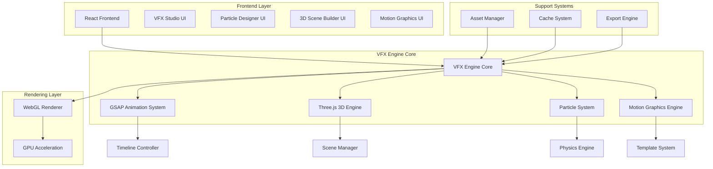
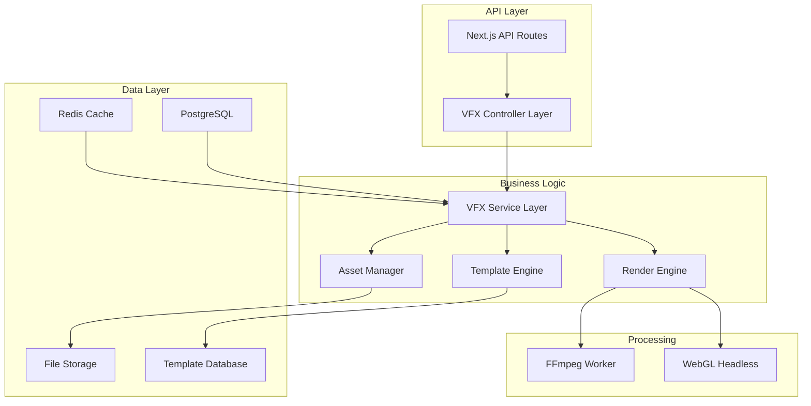
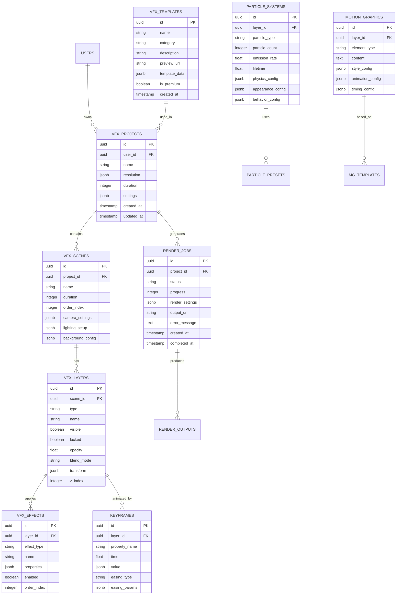

# SPRINT 17 - VFX ENGINE: ARQUITETURA TÉCNICA

## 1. Arquitetura do Sistema



## 2. Descrição das Tecnologias

**Frontend:**
- React@18 + TypeScript
- Tailwind CSS@3 + Framer Motion
- Vite@5 (build tool)
- Zustand (state management)

**VFX Engine:**
- GSAP@3.12 Professional (animações)
- Three.js@0.160 (renderização 3D)
- Cannon.js (física de partículas)
- Web Workers (processamento paralelo)

**Rendering:**
- WebGL2 (aceleração GPU)
- OffscreenCanvas (rendering em background)
- WebAssembly (operações críticas)

**Build & Optimization:**
- Webpack Bundle Analyzer
- Terser (minificação)
- Workbox (service workers)

## 3. Definições de Rotas

| Rota | Propósito |
|------|----------|
| `/vfx-studio` | Interface principal do VFX Engine |
| `/vfx-studio/particle-designer` | Editor de sistemas de partículas |
| `/vfx-studio/3d-scene-builder` | Construtor de cenas 3D |
| `/vfx-studio/motion-graphics` | Editor de motion graphics |
| `/vfx-studio/template-gallery` | Galeria de templates VFX |
| `/vfx-studio/preview-theater` | Visualizador de alta qualidade |
| `/vfx-studio/project/:id` | Projeto específico do VFX |
| `/vfx-studio/export/:id` | Interface de exportação |

## 4. Definições de API

### 4.1 Core VFX APIs

**Gerenciamento de Projetos VFX**
```
POST /api/vfx/projects
GET /api/vfx/projects/:id
PUT /api/vfx/projects/:id
DELETE /api/vfx/projects/:id
```

**Criação de Projeto VFX**
```
POST /api/vfx/projects
```

Request:
| Param Name | Param Type | isRequired | Description |
|------------|------------|------------|-------------|
| name | string | true | Nome do projeto VFX |
| template_id | string | false | ID do template base |
| resolution | object | true | Resolução do projeto (width, height, fps) |
| duration | number | true | Duração em segundos |

Response:
| Param Name | Param Type | Description |
|------------|------------|-------------|
| id | string | ID único do projeto |
| name | string | Nome do projeto |
| created_at | string | Data de criação |
| settings | object | Configurações do projeto |

Example:
```json
{
  "name": "Intro Corporativo",
  "template_id": "corporate-intro-01",
  "resolution": {
    "width": 1920,
    "height": 1080,
    "fps": 60
  },
  "duration": 30
}
```

**Sistema de Partículas**
```
POST /api/vfx/particles/systems
GET /api/vfx/particles/presets
PUT /api/vfx/particles/systems/:id
```

**Renderização e Export**
```
POST /api/vfx/render
GET /api/vfx/render/:job_id/status
GET /api/vfx/render/:job_id/download
```

**Templates e Assets**
```
GET /api/vfx/templates
GET /api/vfx/templates/:category
POST /api/vfx/assets/upload
GET /api/vfx/assets/:id
```

### 4.2 Tipos TypeScript Compartilhados

```typescript
// Tipos base do VFX Engine
interface VFXProject {
  id: string
  name: string
  resolution: Resolution
  duration: number
  scenes: VFXScene[]
  timeline: Timeline
  settings: ProjectSettings
  created_at: string
  updated_at: string
}

interface VFXScene {
  id: string
  name: string
  duration: number
  layers: VFXLayer[]
  camera: Camera3D
  lighting: LightingSetup
  background: Background
}

interface VFXLayer {
  id: string
  type: 'particle' | '3d-object' | 'motion-graphics' | 'text'
  name: string
  visible: boolean
  locked: boolean
  opacity: number
  blend_mode: BlendMode
  transform: Transform3D
  effects: VFXEffect[]
  keyframes: Keyframe[]
}

interface ParticleSystem {
  id: string
  type: 'fire' | 'smoke' | 'rain' | 'snow' | 'sparkles' | 'dust'
  count: number
  emission_rate: number
  lifetime: number
  physics: ParticlePhysics
  appearance: ParticleAppearance
  behavior: ParticleBehavior
}

interface MotionGraphicsElement {
  id: string
  type: 'text' | 'shape' | 'logo' | 'icon'
  content: string | SVGElement
  style: MotionGraphicsStyle
  animations: MotionAnimation[]
  timing: AnimationTiming
}

interface RenderJob {
  id: string
  project_id: string
  status: 'queued' | 'processing' | 'completed' | 'failed'
  progress: number
  settings: RenderSettings
  output_url?: string
  error_message?: string
  created_at: string
  completed_at?: string
}
```

## 5. Arquitetura do Servidor (Backend)



## 6. Modelo de Dados

### 6.1 Diagrama de Entidades



### 6.2 Definições DDL

**Tabela de Projetos VFX**
```sql
-- Criar tabela de projetos VFX
CREATE TABLE vfx_projects (
    id UUID PRIMARY KEY DEFAULT gen_random_uuid(),
    user_id UUID NOT NULL REFERENCES users(id) ON DELETE CASCADE,
    name VARCHAR(255) NOT NULL,
    resolution JSONB NOT NULL DEFAULT '{"width": 1920, "height": 1080, "fps": 60}',
    duration INTEGER NOT NULL DEFAULT 30,
    settings JSONB DEFAULT '{}',
    created_at TIMESTAMP WITH TIME ZONE DEFAULT NOW(),
    updated_at TIMESTAMP WITH TIME ZONE DEFAULT NOW()
);

-- Criar tabela de cenas VFX
CREATE TABLE vfx_scenes (
    id UUID PRIMARY KEY DEFAULT gen_random_uuid(),
    project_id UUID NOT NULL REFERENCES vfx_projects(id) ON DELETE CASCADE,
    name VARCHAR(255) NOT NULL,
    duration INTEGER NOT NULL,
    order_index INTEGER NOT NULL DEFAULT 0,
    camera_settings JSONB DEFAULT '{}',
    lighting_setup JSONB DEFAULT '{}',
    background_config JSONB DEFAULT '{}',
    created_at TIMESTAMP WITH TIME ZONE DEFAULT NOW()
);

-- Criar tabela de layers VFX
CREATE TABLE vfx_layers (
    id UUID PRIMARY KEY DEFAULT gen_random_uuid(),
    scene_id UUID NOT NULL REFERENCES vfx_scenes(id) ON DELETE CASCADE,
    type VARCHAR(50) NOT NULL CHECK (type IN ('particle', '3d-object', 'motion-graphics', 'text')),
    name VARCHAR(255) NOT NULL,
    visible BOOLEAN DEFAULT true,
    locked BOOLEAN DEFAULT false,
    opacity FLOAT DEFAULT 1.0 CHECK (opacity >= 0 AND opacity <= 1),
    blend_mode VARCHAR(50) DEFAULT 'normal',
    transform JSONB DEFAULT '{}',
    z_index INTEGER DEFAULT 0,
    created_at TIMESTAMP WITH TIME ZONE DEFAULT NOW()
);

-- Criar tabela de efeitos VFX
CREATE TABLE vfx_effects (
    id UUID PRIMARY KEY DEFAULT gen_random_uuid(),
    layer_id UUID NOT NULL REFERENCES vfx_layers(id) ON DELETE CASCADE,
    effect_type VARCHAR(100) NOT NULL,
    name VARCHAR(255) NOT NULL,
    properties JSONB DEFAULT '{}',
    enabled BOOLEAN DEFAULT true,
    order_index INTEGER DEFAULT 0,
    created_at TIMESTAMP WITH TIME ZONE DEFAULT NOW()
);

-- Criar tabela de keyframes
CREATE TABLE keyframes (
    id UUID PRIMARY KEY DEFAULT gen_random_uuid(),
    layer_id UUID NOT NULL REFERENCES vfx_layers(id) ON DELETE CASCADE,
    property_name VARCHAR(100) NOT NULL,
    time FLOAT NOT NULL CHECK (time >= 0),
    value JSONB NOT NULL,
    easing_type VARCHAR(50) DEFAULT 'linear',
    easing_params JSONB DEFAULT '{}',
    created_at TIMESTAMP WITH TIME ZONE DEFAULT NOW()
);

-- Criar tabela de sistemas de partículas
CREATE TABLE particle_systems (
    id UUID PRIMARY KEY DEFAULT gen_random_uuid(),
    layer_id UUID NOT NULL REFERENCES vfx_layers(id) ON DELETE CASCADE,
    particle_type VARCHAR(50) NOT NULL CHECK (particle_type IN ('fire', 'smoke', 'rain', 'snow', 'sparkles', 'dust')),
    particle_count INTEGER DEFAULT 1000 CHECK (particle_count > 0),
    emission_rate FLOAT DEFAULT 100 CHECK (emission_rate > 0),
    lifetime FLOAT DEFAULT 5.0 CHECK (lifetime > 0),
    physics_config JSONB DEFAULT '{}',
    appearance_config JSONB DEFAULT '{}',
    behavior_config JSONB DEFAULT '{}',
    created_at TIMESTAMP WITH TIME ZONE DEFAULT NOW()
);

-- Criar tabela de motion graphics
CREATE TABLE motion_graphics (
    id UUID PRIMARY KEY DEFAULT gen_random_uuid(),
    layer_id UUID NOT NULL REFERENCES vfx_layers(id) ON DELETE CASCADE,
    element_type VARCHAR(50) NOT NULL CHECK (element_type IN ('text', 'shape', 'logo', 'icon')),
    content TEXT,
    style_config JSONB DEFAULT '{}',
    animation_config JSONB DEFAULT '{}',
    timing_config JSONB DEFAULT '{}',
    created_at TIMESTAMP WITH TIME ZONE DEFAULT NOW()
);

-- Criar tabela de jobs de renderização
CREATE TABLE render_jobs (
    id UUID PRIMARY KEY DEFAULT gen_random_uuid(),
    project_id UUID NOT NULL REFERENCES vfx_projects(id) ON DELETE CASCADE,
    status VARCHAR(20) DEFAULT 'queued' CHECK (status IN ('queued', 'processing', 'completed', 'failed')),
    progress INTEGER DEFAULT 0 CHECK (progress >= 0 AND progress <= 100),
    render_settings JSONB DEFAULT '{}',
    output_url TEXT,
    error_message TEXT,
    created_at TIMESTAMP WITH TIME ZONE DEFAULT NOW(),
    completed_at TIMESTAMP WITH TIME ZONE
);

-- Criar tabela de templates VFX
CREATE TABLE vfx_templates (
    id UUID PRIMARY KEY DEFAULT gen_random_uuid(),
    name VARCHAR(255) NOT NULL,
    category VARCHAR(100) NOT NULL,
    description TEXT,
    preview_url TEXT,
    template_data JSONB NOT NULL,
    is_premium BOOLEAN DEFAULT false,
    created_at TIMESTAMP WITH TIME ZONE DEFAULT NOW()
);

-- Criar índices para performance
CREATE INDEX idx_vfx_projects_user_id ON vfx_projects(user_id);
CREATE INDEX idx_vfx_projects_created_at ON vfx_projects(created_at DESC);
CREATE INDEX idx_vfx_scenes_project_id ON vfx_scenes(project_id);
CREATE INDEX idx_vfx_scenes_order_index ON vfx_scenes(project_id, order_index);
CREATE INDEX idx_vfx_layers_scene_id ON vfx_layers(scene_id);
CREATE INDEX idx_vfx_layers_z_index ON vfx_layers(scene_id, z_index);
CREATE INDEX idx_vfx_effects_layer_id ON vfx_effects(layer_id);
CREATE INDEX idx_keyframes_layer_id ON keyframes(layer_id);
CREATE INDEX idx_keyframes_time ON keyframes(layer_id, time);
CREATE INDEX idx_particle_systems_layer_id ON particle_systems(layer_id);
CREATE INDEX idx_motion_graphics_layer_id ON motion_graphics(layer_id);
CREATE INDEX idx_render_jobs_project_id ON render_jobs(project_id);
CREATE INDEX idx_render_jobs_status ON render_jobs(status);
CREATE INDEX idx_vfx_templates_category ON vfx_templates(category);
CREATE INDEX idx_vfx_templates_premium ON vfx_templates(is_premium);

-- Configurar permissões Supabase
GRANT SELECT ON vfx_projects TO anon;
GRANT ALL PRIVILEGES ON vfx_projects TO authenticated;
GRANT SELECT ON vfx_scenes TO anon;
GRANT ALL PRIVILEGES ON vfx_scenes TO authenticated;
GRANT SELECT ON vfx_layers TO anon;
GRANT ALL PRIVILEGES ON vfx_layers TO authenticated;
GRANT SELECT ON vfx_effects TO anon;
GRANT ALL PRIVILEGES ON vfx_effects TO authenticated;
GRANT SELECT ON keyframes TO anon;
GRANT ALL PRIVILEGES ON keyframes TO authenticated;
GRANT SELECT ON particle_systems TO anon;
GRANT ALL PRIVILEGES ON particle_systems TO authenticated;
GRANT SELECT ON motion_graphics TO anon;
GRANT ALL PRIVILEGES ON motion_graphics TO authenticated;
GRANT SELECT ON render_jobs TO anon;
GRANT ALL PRIVILEGES ON render_jobs TO authenticated;
GRANT SELECT ON vfx_templates TO anon;
GRANT ALL PRIVILEGES ON vfx_templates TO authenticated;

-- Inserir dados iniciais de templates
INSERT INTO vfx_templates (name, category, description, template_data, is_premium) VALUES
('Fire Explosion', 'particles', 'Explosão de fogo realística com partículas', '{"type": "fire", "intensity": "high"}', true),
('Smoke Trail', 'particles', 'Rastro de fumaça suave', '{"type": "smoke", "density": "medium"}', false),
('Corporate Logo Reveal', 'motion-graphics', 'Revelação elegante de logo corporativo', '{"animation": "fade-scale", "duration": 3}', true),
('Text Typewriter', 'motion-graphics', 'Efeito de máquina de escrever', '{"animation": "typewriter", "speed": "medium"}', false),
('Rain Storm', 'particles', 'Tempestade de chuva intensa', '{"type": "rain", "intensity": "storm"}', true),
('Snow Fall', 'particles', 'Neve caindo suavemente', '{"type": "snow", "density": "light"}', false);
```

## 7. Especificações de Performance

### 7.1 Benchmarks de Renderização

| Componente | Target FPS | Memory Limit | GPU Usage |
|------------|------------|--------------|----------|
| **Particle System** | 60fps | 256MB | 70% |
| **3D Rendering** | 60fps | 512MB | 80% |
| **Motion Graphics** | 60fps | 128MB | 50% |
| **Combined VFX** | 30fps | 1GB | 90% |

### 7.2 Otimizações Implementadas

**Rendering Optimizations:**
```typescript
// Level of Detail (LOD) para partículas
class ParticleLOD {
  static getParticleCount(distance: number, baseCount: number): number {
    if (distance < 10) return baseCount
    if (distance < 50) return Math.floor(baseCount * 0.7)
    if (distance < 100) return Math.floor(baseCount * 0.4)
    return Math.floor(baseCount * 0.2)
  }
}

// Frustum culling para objetos 3D
class FrustumCuller {
  static isInView(object: THREE.Object3D, camera: THREE.Camera): boolean {
    const frustum = new THREE.Frustum()
    const matrix = new THREE.Matrix4().multiplyMatrices(
      camera.projectionMatrix,
      camera.matrixWorldInverse
    )
    frustum.setFromProjectionMatrix(matrix)
    return frustum.intersectsObject(object)
  }
}

// Object pooling para partículas
class ParticlePool {
  private pool: Particle[] = []
  private active: Particle[] = []
  
  getParticle(): Particle {
    return this.pool.pop() || new Particle()
  }
  
  releaseParticle(particle: Particle): void {
    particle.reset()
    this.pool.push(particle)
  }
}
```

### 7.3 Web Workers para Processamento Paralelo

```typescript
// Worker para cálculos de física de partículas
// workers/particle-physics.worker.ts
self.onmessage = function(e) {
  const { particles, deltaTime, forces } = e.data
  
  const updatedParticles = particles.map(particle => {
    // Aplicar forças (gravidade, vento, etc.)
    particle.velocity.add(forces.gravity.multiplyScalar(deltaTime))
    particle.velocity.add(forces.wind.multiplyScalar(deltaTime))
    
    // Atualizar posição
    particle.position.add(particle.velocity.multiplyScalar(deltaTime))
    
    // Atualizar tempo de vida
    particle.life -= deltaTime
    
    return particle
  }).filter(p => p.life > 0)
  
  self.postMessage({ updatedParticles })
}

// Uso no main thread
class ParticleSystem {
  private worker = new Worker('/workers/particle-physics.worker.js')
  
  updatePhysics(deltaTime: number) {
    this.worker.postMessage({
      particles: this.particles,
      deltaTime,
      forces: this.forces
    })
  }
}
```

## 8. Integração com Sistemas Existentes

### 8.1 Compatibilidade com Sprints Anteriores

```typescript
// Integração com PPTX Engine
interface PPTXToVFXAdapter {
  convertSlideToBackground(slide: PPTXSlide): VFXBackground
  extractAnimations(slide: PPTXSlide): MotionGraphicsElement[]
  preserveTimings(slide: PPTXSlide): Timeline
}

// Integração com Avatar 3D
interface AvatarVFXIntegration {
  addAvatarToScene(avatar: Avatar3D, scene: VFXScene): void
  syncAvatarWithVFX(avatar: Avatar3D, effects: VFXEffect[]): void
  createAvatarParticleEffects(avatar: Avatar3D): ParticleSystem[]
}

// Integração com TTS
interface TTSVFXSync {
  syncEffectsWithAudio(audio: TTSAudio, effects: VFXEffect[]): void
  createAudioVisualization(audio: TTSAudio): MotionGraphicsElement
  generateLipSyncParticles(audio: TTSAudio): ParticleSystem
}
```

### 8.2 APIs de Extensibilidade

```typescript
// Plugin system para efeitos customizados
interface VFXPlugin {
  name: string
  version: string
  init(engine: VFXEngine): void
  createEffect(params: any): VFXEffect
  render(effect: VFXEffect, context: RenderContext): void
  cleanup(): void
}

// Registro de plugins
class VFXPluginManager {
  private plugins: Map<string, VFXPlugin> = new Map()
  
  register(plugin: VFXPlugin): void {
    this.plugins.set(plugin.name, plugin)
    plugin.init(this.engine)
  }
  
  createEffect(pluginName: string, params: any): VFXEffect {
    const plugin = this.plugins.get(pluginName)
    if (!plugin) throw new Error(`Plugin ${pluginName} not found`)
    return plugin.createEffect(params)
  }
}
```

## 9. Monitoramento e Analytics

### 9.1 Métricas de Performance

```typescript
// Sistema de métricas em tempo real
class VFXMetrics {
  private metrics = {
    fps: 0,
    memoryUsage: 0,
    gpuUsage: 0,
    renderTime: 0,
    particleCount: 0,
    drawCalls: 0
  }
  
  startFrame(): void {
    this.frameStart = performance.now()
  }
  
  endFrame(): void {
    const frameTime = performance.now() - this.frameStart
    this.metrics.fps = 1000 / frameTime
    this.metrics.renderTime = frameTime
    
    // Enviar métricas para analytics
    this.sendMetrics()
  }
  
  private sendMetrics(): void {
    // Throttle para evitar spam
    if (Date.now() - this.lastSent > 1000) {
      analytics.track('vfx_performance', this.metrics)
      this.lastSent = Date.now()
    }
  }
}
```

### 9.2 Error Tracking

```typescript
// Sistema de tracking de erros específico para VFX
class VFXErrorTracker {
  static trackRenderError(error: Error, context: RenderContext): void {
    const errorData = {
      message: error.message,
      stack: error.stack,
      context: {
        scene: context.scene.id,
        layer: context.layer?.id,
        effect: context.effect?.type,
        timestamp: Date.now()
      },
      performance: {
        fps: VFXMetrics.current.fps,
        memory: VFXMetrics.current.memoryUsage,
        gpu: VFXMetrics.current.gpuUsage
      }
    }
    
    // Enviar para Sentry ou sistema de logging
    logger.error('VFX Render Error', errorData)
  }
}
```

## 10. Deployment e DevOps

### 10.1 Build Configuration

```javascript
// vite.config.js - Configuração otimizada para VFX
export default defineConfig({
  plugins: [
    react(),
    // Plugin para otimizar shaders WebGL
    glslify(),
    // Plugin para comprimir assets 3D
    gltfOptimizer()
  ],
  build: {
    rollupOptions: {
      output: {
        manualChunks: {
          'vfx-core': ['three', 'gsap'],
          'vfx-particles': ['cannon-es'],
          'vfx-ui': ['@radix-ui/react-slider', 'react-color']
        }
      }
    },
    // Otimizações específicas para WebGL
    target: 'es2020',
    minify: 'terser',
    terserOptions: {
      compress: {
        drop_console: true,
        drop_debugger: true
      }
    }
  },
  optimizeDeps: {
    include: ['three', 'gsap', 'cannon-es'],
    exclude: ['@ffmpeg/ffmpeg']
  }
})
```

### 10.2 Performance Monitoring

```typescript
// Configuração de monitoring para produção
const performanceConfig = {
  // Limites de alerta
  thresholds: {
    fps: 30,
    memory: 1024, // MB
    renderTime: 33 // ms (30fps)
  },
  
  // Sampling rate para métricas
  sampleRate: 0.1, // 10% dos usuários
  
  // Alertas automáticos
  alerts: {
    lowFPS: true,
    highMemory: true,
    renderErrors: true
  }
}
```

---

**Documento criado:** Janeiro 2025  
**Versão:** 1.0  
**Próxima revisão:** Início do Sprint 18  
**Status:** Aprovado para implementação