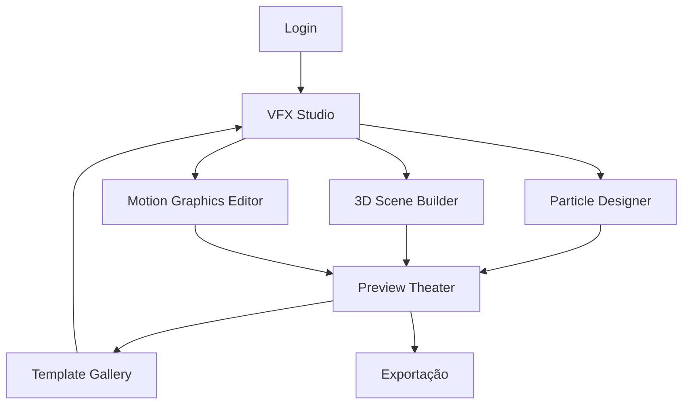

# SPRINT 17 - VFX ENGINE: DOCUMENTO DE REQUISITOS DE PRODUTO

## 1. Visão Geral do Produto

O Sprint 17 marca o início da **Fase 2 - VFX Engine** do Estúdio IA de Vídeos, introduzindo capacidades avançadas de efeitos visuais, animações 3D e motion graphics. Este sprint estabelece a base tecnológica para transformar o editor de vídeos em uma plataforma profissional de criação de conteúdo visual com efeitos cinematográficos.

O VFX Engine permitirá aos usuários criar vídeos com qualidade profissional, incorporando efeitos de partículas, animações 3D complexas, motion graphics dinâmicos e transições cinematográficas, democratizando o acesso a ferramentas antes exclusivas de estúdios profissionais.

## 2. Funcionalidades Principais

### 2.1 Papéis de Usuário

| Papel | Método de Acesso | Permissões Principais |
|-------|------------------|----------------------|
| **Usuário Básico** | Conta gratuita | Acesso a efeitos básicos, templates limitados |
| **Usuário Premium** | Assinatura mensal | Acesso completo ao VFX Engine, todos os templates |
| **Usuário Profissional** | Assinatura anual | Recursos avançados, exportação 4K, suporte prioritário |
| **Administrador** | Convite interno | Gerenciamento de templates, analytics, configurações |

### 2.2 Módulos de Funcionalidade

Nossos requisitos do Sprint 17 consistem nas seguintes páginas principais:

1. **VFX Studio**: Interface principal para criação de efeitos visuais
2. **Particle Designer**: Editor especializado para sistemas de partículas
3. **3D Scene Builder**: Construtor de cenas tridimensionais
4. **Motion Graphics Editor**: Editor de gráficos em movimento
5. **Template Gallery**: Galeria de templates de efeitos
6. **Preview Theater**: Visualizador de alta qualidade para preview

### 2.3 Detalhes das Páginas

| Nome da Página | Nome do Módulo | Descrição da Funcionalidade |
|----------------|----------------|-----------------------------|
| **VFX Studio** | Interface Principal | Workspace unificado com timeline, layers, propriedades e preview em tempo real |
| **VFX Studio** | Timeline Avançado | Sistema de keyframes, curvas de animação, sincronização de áudio |
| **VFX Studio** | Sistema de Layers | Gerenciamento de camadas com blend modes, máscaras e transformações |
| **Particle Designer** | Editor de Partículas | Interface drag-and-drop para criar sistemas de partículas personalizados |
| **Particle Designer** | Presets de Efeitos | Biblioteca com fogo, fumaça, chuva, neve, faíscas e poeira |
| **Particle Designer** | Configuração Avançada | Controles para física, gravidade, colisões e tempo de vida |
| **3D Scene Builder** | Importador de Modelos | Suporte para GLTF, OBJ, FBX com preview e otimização automática |
| **3D Scene Builder** | Sistema de Iluminação | Luzes direcionais, pontuais, ambiente com sombras em tempo real |
| **3D Scene Builder** | Materiais PBR | Editor de materiais físicos com texturas, normal maps e roughness |
| **Motion Graphics Editor** | Text Animator | Animações de texto com efeitos de typewriter, reveal e morphing |
| **Motion Graphics Editor** | Shape Designer | Criação de formas vetoriais com animações de path e morphing |
| **Motion Graphics Editor** | Logo Animator | Ferramentas especializadas para animação de logotipos e marcas |
| **Template Gallery** | Navegação por Categoria | Organização por tipo: títulos, transições, lower thirds, call-to-actions |
| **Template Gallery** | Preview Interativo | Visualização em tempo real com possibilidade de customização |
| **Template Gallery** | Sistema de Favoritos | Salvamento e organização de templates preferidos |
| **Preview Theater** | Renderização em Tempo Real | Preview de alta qualidade com controles de playback avançados |
| **Preview Theater** | Múltiplas Resoluções | Visualização em diferentes formatos: HD, 4K, mobile, social media |
| **Preview Theater** | Exportação Otimizada | Configurações de export com presets para diferentes plataformas |

## 3. Fluxo Principal de Uso

### Fluxo do Usuário Premium

1. **Acesso ao VFX Studio** → Login e seleção do projeto
2. **Criação de Cena** → Importação de assets e configuração inicial
3. **Adição de Efeitos** → Seleção e aplicação de efeitos VFX
4. **Customização** → Ajuste de parâmetros e animações
5. **Preview** → Visualização em tempo real no Preview Theater
6. **Refinamento** → Iteração e ajustes finos
7. **Exportação** → Renderização final em alta qualidade

### Fluxo do Usuário Básico

1. **Acesso Limitado** → Login com restrições de funcionalidades
2. **Templates Básicos** → Seleção de templates gratuitos
3. **Customização Simples** → Ajustes básicos de texto e cores
4. **Preview com Marca D'água** → Visualização com limitações
5. **Upgrade Prompt** → Incentivo para assinatura premium



## 4. Design da Interface do Usuário

### 4.1 Estilo de Design

**Paleta de Cores:**
- **Primária:** #1a1a1a (Preto profundo)
- **Secundária:** #2d2d2d (Cinza escuro)
- **Accent:** #00d4ff (Azul neon)
- **Success:** #00ff88 (Verde neon)
- **Warning:** #ffaa00 (Laranja vibrante)
- **Error:** #ff4444 (Vermelho vibrante)

**Tipografia:**
- **Fonte Principal:** Inter (14px-16px para texto, 12px para labels)
- **Fonte Monospace:** JetBrains Mono (para código e valores numéricos)
- **Títulos:** Inter Bold (18px-24px)

**Estilo de Componentes:**
- **Botões:** Bordas arredondadas (8px), gradientes sutis, hover effects
- **Painéis:** Background semi-transparente, blur effects, bordas neon
- **Timeline:** Estilo profissional similar ao After Effects
- **Controles:** Sliders customizados, color pickers avançados

**Layout:**
- **Estilo:** Dark theme profissional, layout modular
- **Navegação:** Sidebar retrátil, tabs contextuais
- **Ícones:** Lucide icons com estilo neon, animações micro

### 4.2 Visão Geral do Design das Páginas

| Nome da Página | Nome do Módulo | Elementos da UI |
|----------------|----------------|----------------|
| **VFX Studio** | Interface Principal | Layout em 4 painéis: timeline (bottom), layers (left), properties (right), viewport (center). Dark theme com accent colors neon |
| **VFX Studio** | Timeline Avançado | Keyframe editor com curvas Bezier, zoom temporal, snap guides, color coding por tipo de propriedade |
| **Particle Designer** | Editor Visual | Canvas 3D interativo, painel de propriedades com sliders animados, preview em tempo real, biblioteca de presets |
| **3D Scene Builder** | Viewport 3D | Controles de câmera orbital, gizmos de transformação, hierarchy tree, material editor com preview spheres |
| **Motion Graphics Editor** | Canvas 2D/3D | Timeline híbrido, text tools, shape tools, bezier path editor, animation curves com easing presets |
| **Template Gallery** | Grid Responsivo | Cards com preview animado, filtros por categoria, search bar, rating system, download progress |
| **Preview Theater** | Player Avançado | Controles de playback profissionais, timeline scrubbing, quality selector, fullscreen mode |

### 4.3 Responsividade

**Estratégia:** Desktop-first com adaptações para tablets. A interface VFX é otimizada para telas grandes (1920x1080+) mas mantém funcionalidade em tablets (1024x768+). Mobile não é suportado devido à complexidade da interface.

**Breakpoints:**
- **Desktop Large:** 1920px+ (Layout completo)
- **Desktop:** 1440px+ (Layout otimizado)
- **Tablet:** 1024px+ (Layout compacto, painéis colapsáveis)

## 5. Funcionalidades Técnicas Avançadas

### 5.1 Sistema de Partículas

**Tipos de Partículas Disponíveis:**
- **Fire:** Chamas realistas com física de combustão
- **Smoke:** Fumaça volumétrica com dispersão natural
- **Rain:** Chuva com colisões e splash effects
- **Snow:** Neve com acumulação e derretimento
- **Sparkles:** Faíscas e brilhos mágicos
- **Dust:** Partículas de poeira atmosférica

**Controles Avançados:**
- Configuração de física (gravidade, vento, turbulência)
- Sistema de colisões com objetos 3D
- Tempo de vida e fade out customizáveis
- Texturas e materiais personalizados

### 5.2 Animações 3D

**Capacidades 3D:**
- Importação de modelos GLTF/OBJ/FBX
- Sistema de bones e rigging básico
- Animações de câmera cinematográficas
- Iluminação PBR com sombras em tempo real

**Materiais e Texturas:**
- Materiais PBR (Albedo, Normal, Roughness, Metallic)
- Sistema de UV mapping automático
- Texturas procedurais básicas
- Ambiente HDRI para iluminação global

### 5.3 Motion Graphics

**Templates Incluídos:**
- **Title Reveals:** 10 estilos de revelação de título
- **Logo Animations:** 8 animações de logo profissionais
- **Lower Thirds:** 12 designs de terço inferior
- **Transitions:** 15 transições cinematográficas
- **Call to Actions:** 6 designs de CTA animados
- **Social Media:** 10 templates para redes sociais

**Editor de Texto Avançado:**
- Animações character-by-character
- Efeitos de typewriter e reveal
- Morphing entre diferentes textos
- Integração com Google Fonts

## 6. Critérios de Performance

### 6.1 Benchmarks de Performance

| Métrica | Target | Crítico |
|---------|--------|--------|
| **Frame Rate** | 60fps | 30fps mínimo |
| **Load Time** | < 3s | < 5s |
| **Memory Usage** | < 512MB | < 1GB |
| **Render Time** | Real-time | < 2x tempo real |

### 6.2 Otimizações Implementadas

- **Level of Detail (LOD):** Redução automática de qualidade baseada na distância
- **Frustum Culling:** Renderização apenas de objetos visíveis
- **Instanced Rendering:** Otimização para múltiplas partículas
- **Web Workers:** Processamento paralelo para cálculos pesados
- **WebGL2:** Utilização de recursos avançados de GPU

## 7. Integração com Sistema Existente

### 7.1 Compatibilidade com Sprints Anteriores

- **PPTX Engine:** Importação de slides como backgrounds 3D
- **Avatar 3D:** Integração de avatares nas cenas VFX
- **TTS System:** Sincronização de efeitos com narração
- **Asset Library:** Acesso a todos os assets existentes

### 7.2 APIs de Integração

```typescript
// Exemplo de API para adicionar efeito VFX
interface VFXEffect {
  id: string
  type: 'particle' | '3d' | 'motion-graphics'
  properties: Record<string, any>
  timeline: Keyframe[]
}

// Integração com timeline principal
const addVFXEffect = (effect: VFXEffect, startTime: number) => {
  timeline.addEffect(effect, startTime)
  vfxEngine.loadEffect(effect)
}
```

## 8. Roadmap de Funcionalidades

### 8.1 Sprint 17 (Atual)
- ✅ Setup GSAP Professional
- ✅ Three.js Advanced Setup
- ✅ Particle System Base
- ✅ Motion Graphics Foundation

### 8.2 Sprint 18 (Próximo)
- 🔄 GSAP Animations Library
- 🔄 Three.js Particle Effects
- 🔄 Green Screen Integration
- 🔄 Template Motion Graphics

### 8.3 Sprint 19 (Futuro)
- 📋 VFX Engine Integration
- 📋 Performance Optimization
- 📋 Quality Assurance VFX
- 📋 User Interface VFX

## 9. Métricas de Sucesso

### 9.1 KPIs de Produto

| Métrica | Target | Método de Medição |
|---------|--------|------------------|
| **Adoção de VFX** | 40% dos usuários premium | Analytics de uso |
| **Tempo de Criação** | Redução de 60% vs. ferramentas tradicionais | Estudos de usuário |
| **Satisfação** | NPS > 70 | Pesquisas pós-uso |
| **Retenção** | +25% na retenção mensal | Cohort analysis |

### 9.2 Métricas Técnicas

- **Uptime:** 99.9%
- **Error Rate:** < 0.1%
- **Performance Score:** > 90 (Lighthouse)
- **Bundle Size:** < 2MB gzipped

## 10. Considerações de Segurança e Privacidade

### 10.1 Proteção de Assets

- **DRM:** Proteção de templates premium
- **Watermarking:** Marca d'água em exports gratuitos
- **License Validation:** Verificação de licenças GSAP

### 10.2 Performance e Recursos

- **Rate Limiting:** Limitação de renders por usuário
- **Resource Monitoring:** Monitoramento de uso de GPU/CPU
- **Graceful Degradation:** Fallbacks para hardware limitado

## 11. Conclusão

O Sprint 17 representa um marco fundamental na evolução do Estúdio IA de Vídeos, introduzindo capacidades profissionais de VFX que posicionam a plataforma como uma alternativa viável a ferramentas como After Effects e Cinema 4D. Com foco na experiência do usuário e performance otimizada, o VFX Engine democratiza o acesso a efeitos visuais de alta qualidade.

**Impacto Esperado:**
- Aumento significativo no valor percebido da plataforma
- Diferenciação competitiva no mercado
- Expansão da base de usuários profissionais
- Fundação sólida para funcionalidades avançadas futuras

---

**Documento criado:** Janeiro 2025  
**Versão:** 1.0  
**Próxima revisão:** Início do Sprint 18  
**Status:** Aprovado para desenvolvimento