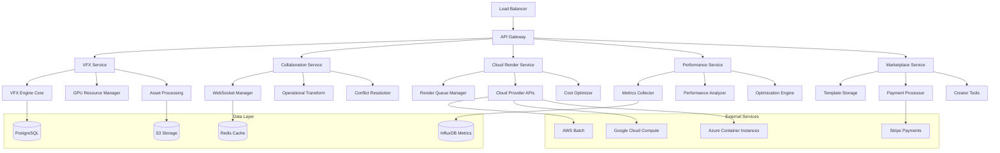
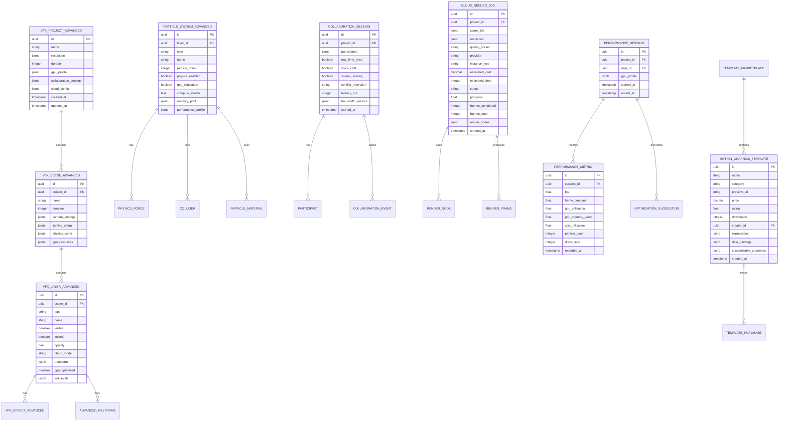

# SPRINT 19 - VFX ENGINE ADVANCED: ARQUITETURA TÉCNICA

## 1. Arquitetura do Sistema

```mermaid
graph TD
    A[React Frontend Pro] --> B[VFX Engine Advanced Core]
    B --> C[GPU Acceleration Layer]
    B --> D[Real-time Collaboration Engine]
    B --> E[Advanced Particle System]
    B --> F[3D Compositor Pro]
    B --> G[Motion Graphics Engine Pro]
    
    C --> H[WebGL2 + WebGPU]
    C --> I[Compute Shaders]
    C --> J[GPU Memory Manager]
    
    D --> K[WebRTC P2P]
    D --> L[Operational Transform]
    D --> M[Real-time Sync]
    
    E --> N[Physics Engine]
    E --> O[Fluid Simulation]
    E --> P[Destruction System]
    
    F --> Q[Node-based Compositor]
    F --> R[Ray Tracing Engine]
    F --> S[Material Editor]
    
    G --> T[Expression Engine]
    G --> U[Template Automation]
    G --> V[Data Visualization]
    
    W[Cloud Render Connector] --> B
    X[Performance Monitor] --> B
    Y[Asset Streaming] --> B
    Z[Cache Management] --> B
    
    subgraph "Frontend Layer"
        A
        AA[VFX Studio Pro UI]
        BB[Collaboration Hub UI]
        CC[Performance Monitor UI]
        DD[Cloud Render UI]
    end
    
    subgraph "VFX Engine Advanced"
        B
        C
        D
        E
        F
        G
    end
    
    subgraph "GPU Acceleration"
        H
        I
        J
    end
    
    subgraph "Collaboration Layer"
        K
        L
        M
    end
    
    subgraph "Cloud Integration"
        W
        EE[AWS Batch]
        FF[Google Cloud]
        GG[Azure Compute]
    end
    
    subgraph "Performance & Optimization"
        X
        Y
        Z
    end
```



## 2. Descrição das Tecnologias

**Frontend Avançado:**
- React@18 + TypeScript@5
- Tailwind CSS@3 + Framer Motion@10
- Vite@5 + SWC (build optimization)
- Zustand@4 (state management)
- React Query@5 (server state)

**VFX Engine Advanced:**
- GSAP@3.12 Professional License
- Three.js@0.160 + Three-GPU@1.2
- Cannon-es@0.20 (physics)
- Web Workers + SharedArrayBuffer
- WebAssembly (WASM) modules

**GPU Acceleration:**
- WebGL2 + WebGPU (experimental)
- GPU.js@2.16 (compute shaders)
- TWGL.js@5 (WebGL utilities)
- Spector.js (GPU debugging)

**Real-time Collaboration:**
- Socket.io@4.7 (WebSocket)
- WebRTC@1.0 (P2P communication)
- Y.js@13 (CRDT for collaboration)
- ShareJS@1.0 (operational transform)

**Cloud Integration:**
- AWS SDK@3 (cloud services)
- Google Cloud SDK@6
- Azure SDK@1.5
- FFmpeg.wasm@0.12

**Performance & Monitoring:**
- Web Vitals@3
- Performance Observer API
- GPU Memory Profiler
- Real User Monitoring (RUM)

## 3. Definições de Rotas

| Rota | Propósito |
|------|----------|
| `/vfx-studio-pro` | Interface principal avançada do VFX Engine |
| `/vfx-studio-pro/particle-physics` | Editor de física de partículas |
| `/vfx-studio-pro/3d-compositor` | Compositor 3D profissional |
| `/vfx-studio-pro/motion-graphics-pro` | Editor avançado de motion graphics |
| `/vfx-studio-pro/collaboration` | Hub de colaboração em tempo real |
| `/vfx-studio-pro/cloud-render` | Gerenciador de renderização em nuvem |
| `/vfx-studio-pro/performance` | Monitor de performance |
| `/vfx-studio-pro/marketplace` | Marketplace de templates |
| `/vfx-studio-pro/project/:id/collaborate` | Sessão de colaboração específica |
| `/vfx-studio-pro/render/:jobId/status` | Status de renderização |

## 4. Definições de API

### 4.1 Core VFX Advanced APIs

**Gerenciamento de Projetos Avançados**
```
POST /api/vfx-advanced/projects
GET /api/vfx-advanced/projects/:id
PUT /api/vfx-advanced/projects/:id
DELETE /api/vfx-advanced/projects/:id
POST /api/vfx-advanced/projects/:id/collaborate
```

**Criação de Projeto VFX Avançado**
```
POST /api/vfx-advanced/projects
```

Request:
| Param Name | Param Type | isRequired | Description |
|------------|------------|------------|-------------|
| name | string | true | Nome do projeto VFX |
| template_id | string | false | ID do template premium |
| resolution | object | true | Resolução (width, height, fps, hdr) |
| duration | number | true | Duração em segundos |
| gpu_acceleration | boolean | true | Habilitar aceleração GPU |
| collaboration_enabled | boolean | false | Habilitar colaboração |
| cloud_rendering | boolean | false | Habilitar renderização em nuvem |

Response:
| Param Name | Param Type | Description |
|------------|------------|-------------|
| id | string | ID único do projeto |
| name | string | Nome do projeto |
| gpu_profile | object | Perfil de GPU detectado |
| collaboration_room | string | ID da sala de colaboração |
| cloud_config | object | Configuração de nuvem |
| created_at | string | Data de criação |

Example:
```json
{
  "name": "Campanha Premium 4K",
  "template_id": "cinematic-intro-pro",
  "resolution": {
    "width": 3840,
    "height": 2160,
    "fps": 60,
    "hdr": true
  },
  "duration": 60,
  "gpu_acceleration": true,
  "collaboration_enabled": true,
  "cloud_rendering": true
}
```

**Sistema de Partículas Avançado**
```
POST /api/vfx-advanced/particles/systems
GET /api/vfx-advanced/particles/presets/cinematic
PUT /api/vfx-advanced/particles/systems/:id
POST /api/vfx-advanced/particles/simulate
```

**Colaboração em Tempo Real**
```
POST /api/vfx-advanced/collaboration/rooms
GET /api/vfx-advanced/collaboration/rooms/:id
POST /api/vfx-advanced/collaboration/rooms/:id/join
DELETE /api/vfx-advanced/collaboration/rooms/:id/leave
POST /api/vfx-advanced/collaboration/rooms/:id/sync
```

**Cloud Rendering**
```
POST /api/vfx-advanced/cloud-render/jobs
GET /api/vfx-advanced/cloud-render/jobs/:id/status
GET /api/vfx-advanced/cloud-render/jobs/:id/progress
POST /api/vfx-advanced/cloud-render/jobs/:id/cancel
GET /api/vfx-advanced/cloud-render/jobs/:id/download
```

**Performance Monitoring**
```
GET /api/vfx-advanced/performance/metrics
POST /api/vfx-advanced/performance/profile
GET /api/vfx-advanced/performance/gpu-status
GET /api/vfx-advanced/performance/optimization-tips
```

**Template Marketplace**
```
GET /api/vfx-advanced/marketplace/templates
GET /api/vfx-advanced/marketplace/templates/:id
POST /api/vfx-advanced/marketplace/templates/:id/purchase
POST /api/vfx-advanced/marketplace/templates/:id/download
```

### 4.2 Tipos TypeScript Avançados

```typescript
// Tipos avançados do VFX Engine
interface VFXProjectAdvanced {
  id: string
  name: string
  resolution: AdvancedResolution
  duration: number
  scenes: VFXSceneAdvanced[]
  timeline: AdvancedTimeline
  settings: AdvancedProjectSettings
  gpu_profile: GPUProfile
  collaboration: CollaborationSettings
  cloud_config: CloudRenderConfig
  created_at: string
  updated_at: string
}

interface AdvancedResolution {
  width: number
  height: number
  fps: number
  hdr: boolean
  color_space: 'sRGB' | 'Rec2020' | 'DCI-P3'
  bit_depth: 8 | 10 | 12 | 16
}

interface VFXSceneAdvanced {
  id: string
  name: string
  duration: number
  layers: VFXLayerAdvanced[]
  camera: AdvancedCamera3D
  lighting: AdvancedLightingSetup
  background: AdvancedBackground
  physics: PhysicsWorld
  gpu_resources: GPUResourceAllocation
}

interface VFXLayerAdvanced {
  id: string
  type: 'particle-physics' | '3d-object' | 'motion-graphics' | 'text' | 'fluid' | 'destruction'
  name: string
  visible: boolean
  locked: boolean
  opacity: number
  blend_mode: AdvancedBlendMode
  transform: Transform3D
  effects: VFXEffectAdvanced[]
  keyframes: AdvancedKeyframe[]
  gpu_optimized: boolean
  lod_levels: LODLevel[]
}

interface ParticleSystemAdvanced {
  id: string
  type: 'volumetric-fire' | 'fluid-simulation' | 'destruction' | 'cloth' | 'magic' | 'sci-fi'
  name: string
  particle_count: number
  physics_enabled: boolean
  gpu_simulation: boolean
  compute_shader: string
  memory_pool: MemoryPool
  performance_profile: PerformanceProfile
  emitter: AdvancedEmitter
  forces: PhysicsForce[]
  colliders: Collider[]
  materials: ParticleMaterial[]
  rendering: ParticleRendering
}

interface CollaborationSession {
  id: string
  project_id: string
  participants: Participant[]
  real_time_sync: boolean
  voice_chat: boolean
  screen_sharing: boolean
  cursor_tracking: boolean
  conflict_resolution: 'operational-transform' | 'crdt'
  latency_ms: number
  bandwidth_usage: BandwidthMetrics
}

interface CloudRenderJob {
  id: string
  project_id: string
  scene_ids: string[]
  resolution: AdvancedResolution
  quality_preset: 'draft' | 'preview' | 'production' | 'cinematic'
  provider: 'aws' | 'google' | 'azure' | 'custom'
  instance_type: string
  estimated_cost: number
  estimated_time: number
  status: 'queued' | 'processing' | 'completed' | 'failed' | 'cancelled'
  progress: number
  frames_completed: number
  frames_total: number
  current_frame: number
  render_nodes: RenderNode[]
  optimization_settings: RenderOptimization
}

interface GPUProfile {
  vendor: 'nvidia' | 'amd' | 'intel' | 'apple'
  model: string
  memory_gb: number
  compute_units: number
  ray_tracing_support: boolean
  webgpu_support: boolean
  performance_score: number
  recommended_settings: GPUSettings
}

interface PerformanceMetrics {
  fps: number
  frame_time_ms: number
  gpu_utilization: number
  gpu_memory_used: number
  gpu_memory_total: number
  cpu_utilization: number
  ram_used: number
  particle_count: number
  draw_calls: number
  triangles_rendered: number
  bottlenecks: PerformanceBottleneck[]
  optimization_suggestions: OptimizationSuggestion[]
}

interface AdvancedTimeline {
  duration: number
  fps: number
  tracks: TimelineTrack[]
  keyframes: AdvancedKeyframe[]
  markers: TimelineMarker[]
  audio_waveform: AudioWaveform
  motion_blur: MotionBlurSettings
  time_remapping: TimeRemappingCurve
}

interface AdvancedKeyframe {
  id: string
  time: number
  property: string
  value: any
  interpolation: 'linear' | 'bezier' | 'ease-in' | 'ease-out' | 'ease-in-out' | 'custom'
  bezier_handles: BezierHandle[]
  velocity: number
  influence: number
}

interface NodeBasedCompositor {
  nodes: CompositorNode[]
  connections: NodeConnection[]
  groups: NodeGroup[]
  variables: NodeVariable[]
  expressions: NodeExpression[]
}

interface CompositorNode {
  id: string
  type: 'input' | 'output' | 'effect' | 'generator' | 'utility' | 'color' | 'transform'
  name: string
  position: Vector2
  inputs: NodeInput[]
  outputs: NodeOutput[]
  parameters: NodeParameter[]
  gpu_accelerated: boolean
  compute_shader: string
}

interface MotionGraphicsTemplate {
  id: string
  name: string
  category: 'corporate' | 'broadcast' | 'social' | 'event' | 'product' | 'data-viz'
  preview_url: string
  price: number
  rating: number
  downloads: number
  creator: TemplateCreator
  expressions: TemplateExpression[]
  data_bindings: DataBinding[]
  customizable_properties: CustomProperty[]
  automation_scripts: AutomationScript[]
}
```

## 5. Arquitetura do Servidor



## 6. Modelo de Dados

### 6.1 Definição do Modelo de Dados



### 6.2 Linguagem de Definição de Dados

**Tabela de Projetos VFX Avançados (vfx_projects_advanced)**
```sql
-- Criar tabela de projetos VFX avançados
CREATE TABLE vfx_projects_advanced (
    id UUID PRIMARY KEY DEFAULT gen_random_uuid(),
    name VARCHAR(255) NOT NULL,
    resolution JSONB NOT NULL,
    duration INTEGER NOT NULL,
    gpu_profile JSONB,
    collaboration_settings JSONB DEFAULT '{}',
    cloud_config JSONB DEFAULT '{}',
    user_id UUID NOT NULL REFERENCES users(id),
    created_at TIMESTAMP WITH TIME ZONE DEFAULT NOW(),
    updated_at TIMESTAMP WITH TIME ZONE DEFAULT NOW()
);

-- Índices para performance
CREATE INDEX idx_vfx_projects_advanced_user_id ON vfx_projects_advanced(user_id);
CREATE INDEX idx_vfx_projects_advanced_created_at ON vfx_projects_advanced(created_at DESC);
CREATE INDEX idx_vfx_projects_advanced_gpu_profile ON vfx_projects_advanced USING GIN(gpu_profile);
```

**Tabela de Cenas VFX Avançadas (vfx_scenes_advanced)**
```sql
CREATE TABLE vfx_scenes_advanced (
    id UUID PRIMARY KEY DEFAULT gen_random_uuid(),
    project_id UUID NOT NULL REFERENCES vfx_projects_advanced(id) ON DELETE CASCADE,
    name VARCHAR(255) NOT NULL,
    duration INTEGER NOT NULL,
    camera_settings JSONB DEFAULT '{}',
    lighting_setup JSONB DEFAULT '{}',
    physics_world JSONB DEFAULT '{}',
    gpu_resources JSONB DEFAULT '{}',
    created_at TIMESTAMP WITH TIME ZONE DEFAULT NOW()
);

CREATE INDEX idx_vfx_scenes_advanced_project_id ON vfx_scenes_advanced(project_id);
```

**Tabela de Layers VFX Avançados (vfx_layers_advanced)**
```sql
CREATE TABLE vfx_layers_advanced (
    id UUID PRIMARY KEY DEFAULT gen_random_uuid(),
    scene_id UUID NOT NULL REFERENCES vfx_scenes_advanced(id) ON DELETE CASCADE,
    type VARCHAR(50) NOT NULL CHECK (type IN ('particle-physics', '3d-object', 'motion-graphics', 'text', 'fluid', 'destruction')),
    name VARCHAR(255) NOT NULL,
    visible BOOLEAN DEFAULT true,
    locked BOOLEAN DEFAULT false,
    opacity FLOAT DEFAULT 1.0 CHECK (opacity >= 0 AND opacity <= 1),
    blend_mode VARCHAR(50) DEFAULT 'normal',
    transform JSONB DEFAULT '{}',
    gpu_optimized BOOLEAN DEFAULT true,
    lod_levels JSONB DEFAULT '[]',
    created_at TIMESTAMP WITH TIME ZONE DEFAULT NOW()
);

CREATE INDEX idx_vfx_layers_advanced_scene_id ON vfx_layers_advanced(scene_id);
CREATE INDEX idx_vfx_layers_advanced_type ON vfx_layers_advanced(type);
```

**Tabela de Sistemas de Partículas Avançados (particle_systems_advanced)**
```sql
CREATE TABLE particle_systems_advanced (
    id UUID PRIMARY KEY DEFAULT gen_random_uuid(),
    layer_id UUID NOT NULL REFERENCES vfx_layers_advanced(id) ON DELETE CASCADE,
    type VARCHAR(50) NOT NULL CHECK (type IN ('volumetric-fire', 'fluid-simulation', 'destruction', 'cloth', 'magic', 'sci-fi')),
    name VARCHAR(255) NOT NULL,
    particle_count INTEGER DEFAULT 1000 CHECK (particle_count > 0),
    physics_enabled BOOLEAN DEFAULT true,
    gpu_simulation BOOLEAN DEFAULT true,
    compute_shader TEXT,
    memory_pool JSONB DEFAULT '{}',
    performance_profile JSONB DEFAULT '{}',
    created_at TIMESTAMP WITH TIME ZONE DEFAULT NOW()
);

CREATE INDEX idx_particle_systems_advanced_layer_id ON particle_systems_advanced(layer_id);
CREATE INDEX idx_particle_systems_advanced_type ON particle_systems_advanced(type);
```

**Tabela de Sessões de Colaboração (collaboration_sessions)**
```sql
CREATE TABLE collaboration_sessions (
    id UUID PRIMARY KEY DEFAULT gen_random_uuid(),
    project_id UUID NOT NULL REFERENCES vfx_projects_advanced(id) ON DELETE CASCADE,
    participants JSONB DEFAULT '[]',
    real_time_sync BOOLEAN DEFAULT true,
    voice_chat BOOLEAN DEFAULT false,
    screen_sharing BOOLEAN DEFAULT false,
    conflict_resolution VARCHAR(50) DEFAULT 'operational-transform',
    latency_ms INTEGER DEFAULT 0,
    bandwidth_metrics JSONB DEFAULT '{}',
    started_at TIMESTAMP WITH TIME ZONE DEFAULT NOW(),
    ended_at TIMESTAMP WITH TIME ZONE
);

CREATE INDEX idx_collaboration_sessions_project_id ON collaboration_sessions(project_id);
CREATE INDEX idx_collaboration_sessions_started_at ON collaboration_sessions(started_at DESC);
```

**Tabela de Jobs de Renderização em Nuvem (cloud_render_jobs)**
```sql
CREATE TABLE cloud_render_jobs (
    id UUID PRIMARY KEY DEFAULT gen_random_uuid(),
    project_id UUID NOT NULL REFERENCES vfx_projects_advanced(id),
    scene_ids JSONB NOT NULL,
    resolution JSONB NOT NULL,
    quality_preset VARCHAR(50) DEFAULT 'production' CHECK (quality_preset IN ('draft', 'preview', 'production', 'cinematic')),
    provider VARCHAR(50) DEFAULT 'aws' CHECK (provider IN ('aws', 'google', 'azure', 'custom')),
    instance_type VARCHAR(100),
    estimated_cost DECIMAL(10,2),
    estimated_time INTEGER,
    status VARCHAR(50) DEFAULT 'queued' CHECK (status IN ('queued', 'processing', 'completed', 'failed', 'cancelled')),
    progress FLOAT DEFAULT 0 CHECK (progress >= 0 AND progress <= 100),
    frames_completed INTEGER DEFAULT 0,
    frames_total INTEGER DEFAULT 0,
    render_nodes JSONB DEFAULT '[]',
    created_at TIMESTAMP WITH TIME ZONE DEFAULT NOW(),
    started_at TIMESTAMP WITH TIME ZONE,
    completed_at TIMESTAMP WITH TIME ZONE
);

CREATE INDEX idx_cloud_render_jobs_project_id ON cloud_render_jobs(project_id);
CREATE INDEX idx_cloud_render_jobs_status ON cloud_render_jobs(status);
CREATE INDEX idx_cloud_render_jobs_created_at ON cloud_render_jobs(created_at DESC);
```

**Tabela de Métricas de Performance (performance_metrics)**
```sql
CREATE TABLE performance_metrics (
    id UUID PRIMARY KEY DEFAULT gen_random_uuid(),
    project_id UUID NOT NULL REFERENCES vfx_projects_advanced(id),
    user_id UUID NOT NULL REFERENCES users(id),
    fps FLOAT NOT NULL,
    frame_time_ms FLOAT NOT NULL,
    gpu_utilization FLOAT CHECK (gpu_utilization >= 0 AND gpu_utilization <= 100),
    gpu_memory_used FLOAT,
    cpu_utilization FLOAT CHECK (cpu_utilization >= 0 AND cpu_utilization <= 100),
    particle_count INTEGER DEFAULT 0,
    draw_calls INTEGER DEFAULT 0,
    recorded_at TIMESTAMP WITH TIME ZONE DEFAULT NOW()
);

CREATE INDEX idx_performance_metrics_project_id ON performance_metrics(project_id);
CREATE INDEX idx_performance_metrics_recorded_at ON performance_metrics(recorded_at DESC);
CREATE INDEX idx_performance_metrics_fps ON performance_metrics(fps);
```

**Tabela de Templates de Motion Graphics (motion_graphics_templates)**
```sql
CREATE TABLE motion_graphics_templates (
    id UUID PRIMARY KEY DEFAULT gen_random_uuid(),
    name VARCHAR(255) NOT NULL,
    category VARCHAR(50) NOT NULL CHECK (category IN ('corporate', 'broadcast', 'social', 'event', 'product', 'data-viz')),
    preview_url VARCHAR(500),
    price DECIMAL(10,2) DEFAULT 0,
    rating FLOAT DEFAULT 0 CHECK (rating >= 0 AND rating <= 5),
    downloads INTEGER DEFAULT 0,
    creator_id UUID NOT NULL REFERENCES users(id),
    expressions JSONB DEFAULT '[]',
    data_bindings JSONB DEFAULT '[]',
    customizable_properties JSONB DEFAULT '[]',
    created_at TIMESTAMP WITH TIME ZONE DEFAULT NOW()
);

CREATE INDEX idx_motion_graphics_templates_category ON motion_graphics_templates(category);
CREATE INDEX idx_motion_graphics_templates_rating ON motion_graphics_templates(rating DESC);
CREATE INDEX idx_motion_graphics_templates_downloads ON motion_graphics_templates(downloads DESC);
```

**Dados Iniciais**
```sql
-- Inserir templates de exemplo
INSERT INTO motion_graphics_templates (name, category, preview_url, price, creator_id, expressions, customizable_properties)
VALUES 
('Corporate Intro Pro', 'corporate', '/previews/corporate-intro-pro.mp4', 29.99, 
 (SELECT id FROM users WHERE email = 'admin@estudio-ia.com' LIMIT 1),
 '[{"name": "titleReveal", "expression": "ease(time, 0, 1, 2)"}]',
 '[{"name": "title", "type": "text", "default": "Your Company"}, {"name": "color", "type": "color", "default": "#00ffff"}]'),

('Broadcast Lower Third', 'broadcast', '/previews/broadcast-lower-third.mp4', 19.99,
 (SELECT id FROM users WHERE email = 'admin@estudio-ia.com' LIMIT 1),
 '[{"name": "slideIn", "expression": "linear(time, 0, 1, 1)"}]',
 '[{"name": "name", "type": "text", "default": "John Doe"}, {"name": "title", "type": "text", "default": "CEO"}]'),

('Social Media Kit', 'social', '/previews/social-media-kit.mp4', 39.99,
 (SELECT id FROM users WHERE email = 'admin@estudio-ia.com' LIMIT 1),
 '[{"name": "bounce", "expression": "bounce(time, 0, 1, 1.5)"}]',
 '[{"name": "hashtag", "type": "text", "default": "#YourBrand"}, {"name": "logo", "type": "image", "default": null}]');

-- Inserir configurações de GPU padrão
INSERT INTO gpu_profiles (vendor, model, memory_gb, compute_units, ray_tracing_support, webgpu_support, performance_score)
VALUES 
('nvidia', 'RTX 4090', 24, 128, true, true, 100),
('nvidia', 'RTX 4080', 16, 76, true, true, 85),
('nvidia', 'RTX 4070', 12, 60, true, true, 75),
('amd', 'RX 7900 XTX', 24, 96, false, true, 80),
('intel', 'Arc A770', 16, 32, true, true, 60);
```

## 7. Otimizações de Performance

### 7.1 GPU Acceleration

**Compute Shaders para Partículas:**
```glsl
#version 450

layout(local_size_x = 64, local_size_y = 1, local_size_z = 1) in;

layout(std430, binding = 0) restrict buffer ParticleBuffer {
    vec4 positions[];
    vec4 velocities[];
    vec4 forces[];
    float lifetimes[];
};

uniform float deltaTime;
uniform vec3 gravity;
uniform float damping;

void main() {
    uint index = gl_GlobalInvocationID.x;
    if (index >= positions.length()) return;
    
    // Physics simulation
    vec3 acceleration = forces[index].xyz + gravity;
    velocities[index].xyz += acceleration * deltaTime;
    velocities[index].xyz *= damping;
    positions[index].xyz += velocities[index].xyz * deltaTime;
    
    // Lifetime management
    lifetimes[index] -= deltaTime;
    if (lifetimes[index] <= 0.0) {
        // Reset particle
        positions[index] = vec4(0.0, 0.0, 0.0, 1.0);
        velocities[index] = vec4(0.0, 0.0, 0.0, 0.0);
        lifetimes[index] = 5.0; // Reset lifetime
    }
}
```

### 7.2 Memory Management

**Object Pooling para Partículas:**
```typescript
class ParticlePool {
  private pool: Particle[] = []
  private active: Set<Particle> = new Set()
  private maxSize: number
  
  constructor(maxSize: number = 10000) {
    this.maxSize = maxSize
    this.preallocate()
  }
  
  private preallocate() {
    for (let i = 0; i < this.maxSize; i++) {
      this.pool.push(new Particle())
    }
  }
  
  acquire(): Particle | null {
    if (this.pool.length === 0) return null
    
    const particle = this.pool.pop()!
    this.active.add(particle)
    return particle
  }
  
  release(particle: Particle) {
    if (this.active.has(particle)) {
      this.active.delete(particle)
      particle.reset()
      this.pool.push(particle)
    }
  }
  
  getActiveCount(): number {
    return this.active.size
  }
  
  getAvailableCount(): number {
    return this.pool.length
  }
}
```

### 7.3 Real-time Collaboration

**Operational Transform para Sincronização:**
```typescript
class OperationalTransform {
  static transform(op1: Operation, op2: Operation): [Operation, Operation] {
    if (op1.type === 'insert' && op2.type === 'insert') {
      if (op1.position <= op2.position) {
        return [op1, { ...op2, position: op2.position + op1.length }]
      } else {
        return [{ ...op1, position: op1.position + op2.length }, op2]
      }
    }
    
    if (op1.type === 'delete' && op2.type === 'delete') {
      if (op1.position + op1.length <= op2.position) {
        return [op1, { ...op2, position: op2.position - op1.length }]
      } else if (op2.position + op2.length <= op1.position) {
        return [{ ...op1, position: op1.position - op2.length }, op2]
      } else {
        // Overlapping deletes - complex case
        return this.handleOverlappingDeletes(op1, op2)
      }
    }
    
    // Insert vs Delete transformations
    if (op1.type === 'insert' && op2.type === 'delete') {
      if (op1.position <= op2.position) {
        return [op1, { ...op2, position: op2.position + op1.length }]
      } else if (op1.position >= op2.position + op2.length) {
        return [{ ...op1, position: op1.position - op2.length }, op2]
      } else {
        return [{ ...op1, position: op2.position }, op2]
      }
    }
    
    return [op1, op2]
  }
}
```