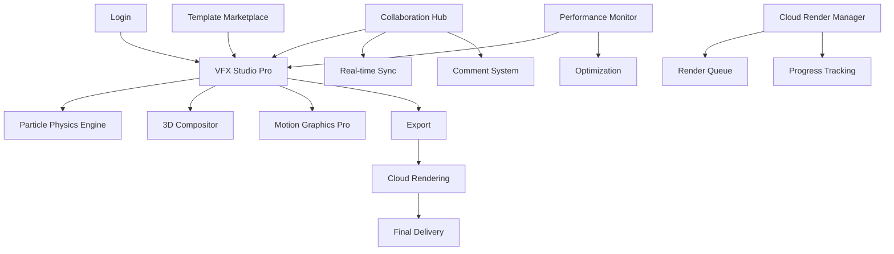

# SPRINT 19 - VFX ENGINE ADVANCED: DOCUMENTO DE REQUISITOS DE PRODUTO

## 1. Visão Geral do Produto

O Sprint 19 representa a **evolução avançada do VFX Engine** do Estúdio IA de Vídeos, introduzindo capacidades de renderização em tempo real de alta performance, sistemas de partículas cinematográficos e ferramentas de motion graphics profissionais. Este sprint estabelece a base tecnológica para competir diretamente com ferramentas como After Effects e Cinema 4D.

O VFX Engine Advanced permitirá criação de conteúdo visual de qualidade cinematográfica com renderização GPU acelerada, colaboração em tempo real e preparação para renderização em nuvem, democratizando ferramentas de VFX de nível Hollywood para criadores de conteúdo.

## 2. Funcionalidades Principais

### 2.1 Papéis de Usuário

| Papel | Método de Acesso | Permissões Principais |
|-------|------------------|----------------------|
| **Usuário Básico** | Conta gratuita | VFX básicos, templates limitados, marca d'água |
| **Usuário Premium** | Assinatura mensal | VFX Engine completo, colaboração, export HD |
| **Usuário Pro** | Assinatura anual | GPU rendering, 4K/8K export, cloud rendering |
| **Usuário Enterprise** | Licença corporativa | Recursos ilimitados, suporte dedicado, white-label |
| **Colaborador** | Convite de projeto | Acesso específico ao projeto, permissões limitadas |

### 2.2 Módulos de Funcionalidade

Nossos requisitos do Sprint 19 consistem nas seguintes páginas principais:

1. **VFX Studio Pro**: Interface avançada com GPU acceleration e real-time rendering
2. **Particle Physics Engine**: Sistema de partículas com física realística
3. **3D Compositor**: Compositor profissional para cenas 3D complexas
4. **Motion Graphics Pro**: Editor avançado com automação e scripting
5. **Collaboration Hub**: Central de colaboração em tempo real
6. **Cloud Render Manager**: Gerenciador de renderização em nuvem
7. **Performance Monitor**: Monitor de performance e otimização
8. **Template Marketplace**: Marketplace de templates premium

### 2.3 Detalhes das Páginas

| Nome da Página | Nome do Módulo | Descrição da Funcionalidade |
|----------------|----------------|-----------------------------||
| **VFX Studio Pro** | Interface Avançada | Workspace com GPU acceleration, real-time raytracing, multi-viewport |
| **VFX Studio Pro** | Timeline Profissional | Keyframe editor avançado, curve editor, motion blur, time remapping |
| **VFX Studio Pro** | Node-based Compositor | Sistema de nós para composição complexa, color grading, effects chaining |
| **Particle Physics Engine** | Simulador Físico | Física realística com colisões, fluidos, soft bodies, cloth simulation |
| **Particle Physics Engine** | Presets Cinematográficos | Explosões, fogo volumétrico, água, destruição, magia, sci-fi effects |
| **Particle Physics Engine** | GPU Acceleration | Compute shaders para simulação de milhões de partículas |
| **3D Compositor** | Scene Manager | Hierarquia complexa, instancing, LOD system, occlusion culling |
| **3D Compositor** | Advanced Lighting | Global illumination, volumetric lighting, HDRI environments |
| **3D Compositor** | Material Editor | Shader editor visual, PBR materials, procedural textures |
| **Motion Graphics Pro** | Expression Engine | Sistema de expressões JavaScript para automação |
| **Motion Graphics Pro** | Data Visualization | Gráficos animados, charts dinâmicos, infográficos interativos |
| **Motion Graphics Pro** | Template Automation | Geração automática baseada em dados, batch processing |
| **Collaboration Hub** | Real-time Sync | Sincronização em tempo real, conflict resolution, version control |
| **Collaboration Hub** | Comment System | Sistema de comentários com timestamps, annotations, approval workflow |
| **Collaboration Hub** | Asset Sharing | Compartilhamento de assets, bibliotecas colaborativas |
| **Cloud Render Manager** | Render Queue | Fila de renderização distribuída, priority management |
| **Cloud Render Manager** | Progress Tracking | Monitoramento em tempo real, estimativas, notificações |
| **Cloud Render Manager** | Cost Optimization | Otimização de custos, render presets, quality vs speed |
| **Performance Monitor** | Real-time Metrics | FPS, memory usage, GPU utilization, bottleneck detection |
| **Performance Monitor** | Optimization Suggestions | Sugestões automáticas de otimização, performance profiling |
| **Template Marketplace** | Browse & Purchase | Navegação, preview, compra de templates premium |
| **Template Marketplace** | Creator Tools | Ferramentas para criadores publicarem templates |

## 3. Fluxo Principal de Uso

### Fluxo do Usuário Pro

1. **Login Avançado** → Autenticação com workspace selection
2. **Project Setup** → Configuração de projeto com GPU optimization
3. **Asset Import** → Importação otimizada com preview e metadata
4. **VFX Creation** → Criação com real-time feedback e GPU acceleration
5. **Collaboration** → Trabalho colaborativo com sync em tempo real
6. **Preview & Iterate** → Preview de alta qualidade com instant feedback
7. **Cloud Rendering** → Renderização distribuída em nuvem
8. **Export & Delivery** → Export otimizado para múltiplas plataformas

### Fluxo de Colaboração

1. **Project Invitation** → Convite para colaboração
2. **Real-time Sync** → Sincronização automática de mudanças
3. **Comment & Review** → Sistema de review com annotations
4. **Version Control** → Controle de versões automático
5. **Approval Workflow** → Fluxo de aprovação estruturado

## 4. Design da Interface do Usuário

### 4.1 Estilo de Design

**Paleta de Cores Avançada:**
- **Primary Dark:** #0a0a0a (Preto absoluto)
- **Secondary Dark:** #1a1a1a (Cinza muito escuro)
- **Accent Neon:** #00ffff (Ciano neon)
- **Success Glow:** #00ff00 (Verde neon)
- **Warning Pulse:** #ffff00 (Amarelo neon)
- **Error Flash:** #ff0040 (Rosa neon)
- **GPU Indicator:** #ff6600 (Laranja GPU)

**Tipografia Profissional:**
- **Interface:** Inter Variable (12px-16px, weight 400-600)
- **Code/Values:** JetBrains Mono (10px-14px, monospace)
- **Headers:** Inter Display (18px-32px, weight 700-900)
- **Annotations:** Inter (10px-12px, weight 300-400)

**Componentes Avançados:**
- **Botões:** Glass morphism, glow effects, micro-animations
- **Painéis:** Floating panels, blur backgrounds, neon borders
- **Timeline:** Professional grade com waveforms, thumbnails
- **Node Editor:** Bezier connections, color-coded nodes
- **3D Viewport:** Multi-viewport, gizmos, grid overlays

**Layout Profissional:**
- **Estilo:** Dark theme cinematográfico, layout adaptável
- **Navegação:** Context-sensitive menus, hotkey overlays
- **Workspace:** Customizable panels, saved layouts
- **Ícones:** Phosphor icons com glow effects, state animations

### 4.2 Visão Geral do Design das Páginas

| Nome da Página | Nome do Módulo | Elementos da UI |
|----------------|----------------|----------------|
| **VFX Studio Pro** | Interface Principal | Multi-viewport layout, node editor, advanced timeline, real-time preview, GPU status indicators |
| **VFX Studio Pro** | Timeline Avançado | Waveform display, keyframe curves, motion blur visualization, time remapping controls |
| **Particle Physics Engine** | Simulador 3D | Interactive 3D viewport, physics controls, real-time simulation, performance metrics |
| **3D Compositor** | Node Editor | Visual node graph, connection flows, parameter linking, shader preview |
| **Motion Graphics Pro** | Expression Editor | Code editor with syntax highlighting, autocomplete, expression library |
| **Collaboration Hub** | Activity Feed | Real-time updates, user avatars, comment threads, notification center |
| **Cloud Render Manager** | Dashboard | Progress bars, render farm status, cost tracking, queue management |
| **Performance Monitor** | Metrics Display | Real-time graphs, heat maps, bottleneck visualization, optimization tips |
| **Template Marketplace** | Store Interface | Grid layout, video previews, rating system, purchase flow, creator profiles |

### 4.3 Responsividade Avançada

**Estratégia:** Desktop-first profissional com suporte a múltiplos monitores. Interface otimizada para workstations (2560x1440+) com suporte a tablets para review e aprovação.

**Breakpoints Profissionais:**
- **Workstation:** 2560px+ (Layout completo multi-monitor)
- **Desktop Pro:** 1920px+ (Layout profissional single monitor)
- **Desktop:** 1440px+ (Layout compacto)
- **Tablet Review:** 1024px+ (Interface de review simplificada)

**Multi-Monitor Support:**
- Detach panels para monitores secundários
- Viewport dedicado para preview
- Timeline em monitor ultrawide
- Tool palettes em monitores verticais

## 5. Funcionalidades Técnicas Avançadas

### 5.1 Sistema de Partículas Cinematográfico

**Tipos Avançados de Partículas:**
- **Volumetric Fire:** Fogo volumétrico com combustão realística
- **Fluid Simulation:** Simulação de líquidos com surface tension
- **Destruction:** Sistema de destruição com fragmentação
- **Cloth Simulation:** Simulação de tecidos e soft bodies
- **Magic Effects:** Efeitos mágicos com trails e glows
- **Sci-Fi Elements:** Hologramas, energy beams, portals

**GPU Acceleration:**
- Compute Shaders para simulação massiva
- Instanced rendering para performance
- LOD system para otimização automática
- Memory pooling para eficiência

### 5.2 Renderização 3D Avançada

**Capacidades de Renderização:**
- Real-time ray tracing (RTX support)
- Global illumination com light bounces
- Volumetric lighting e fog
- Screen-space reflections
- Temporal anti-aliasing (TAA)
- Motion blur e depth of field

**Pipeline de Materiais:**
- Node-based material editor
- PBR materials com subsurface scattering
- Procedural textures e noise functions
- Texture streaming para assets grandes
- Material instancing para performance

### 5.3 Motion Graphics Profissional

**Templates Cinematográficos:**
- **Corporate Packages:** 25 templates corporativos
- **Broadcast Graphics:** 20 templates para TV/streaming
- **Social Media Kits:** 30 templates para redes sociais
- **Event Graphics:** 15 templates para eventos
- **Product Showcases:** 12 templates para produtos
- **Data Visualization:** 18 templates para infográficos

**Sistema de Expressões:**
- JavaScript engine integrado
- Biblioteca de funções matemáticas
- Data binding para automação
- Conditional logic para templates dinâmicos

### 5.4 Colaboração em Tempo Real

**Sincronização Avançada:**
- Operational Transform para conflict resolution
- Real-time cursor tracking
- Live preview sharing
- Voice/video chat integrado
- Screen sharing para review

**Controle de Versões:**
- Git-like branching para projetos
- Automatic snapshots
- Merge conflict resolution
- History timeline com thumbnails

## 6. Critérios de Performance Avançados

### 6.1 Benchmarks de Performance

| Métrica | Target Pro | Target Enterprise | Crítico |
|---------|------------|-------------------|--------|
| **Frame Rate 4K** | 60fps | 120fps | 30fps |
| **Particle Count** | 1M particles | 10M particles | 100K |
| **Memory Usage** | < 2GB | < 8GB | < 4GB |
| **GPU Utilization** | 80% | 95% | 60% |
| **Render Time 4K** | Real-time | 0.5x real-time | 2x real-time |
| **Collaboration Latency** | < 50ms | < 20ms | < 100ms |

### 6.2 Otimizações GPU

**Técnicas Implementadas:**
- **GPU Instancing:** Renderização eficiente de múltiplos objetos
- **Compute Shaders:** Simulação de partículas em GPU
- **Texture Streaming:** Carregamento dinâmico de texturas
- **Occlusion Culling:** Eliminação de objetos não visíveis
- **Level of Detail:** Redução automática de qualidade
- **Temporal Upsampling:** Upscaling inteligente para performance

### 6.3 Otimizações de Memória

**Estratégias Avançadas:**
- Object pooling para partículas
- Texture compression automática
- Asset streaming baseado em viewport
- Garbage collection otimizada
- Memory profiling em tempo real

## 7. Integração com Cloud Rendering

### 7.1 Preparação para Fase 4

**Arquitetura Distribuída:**
- Job splitting para renderização paralela
- Asset synchronization para cloud
- Progress tracking distribuído
- Cost optimization algorithms

**APIs de Integração:**
- AWS Batch integration
- Google Cloud Compute integration
- Azure Container Instances
- Custom render farm support

### 7.2 Otimização de Custos

**Estratégias de Economia:**
- Spot instance utilization
- Render quality presets
- Intelligent frame skipping
- Compression optimization
- Regional server selection

## 8. Métricas de Sucesso

### 8.1 KPIs Técnicos

- **Performance Score:** > 95/100
- **GPU Utilization:** > 80%
- **Memory Efficiency:** < 2GB para projetos médios
- **Render Speed:** Real-time para HD, < 2x para 4K
- **Collaboration Latency:** < 50ms

### 8.2 KPIs de Usuário

- **User Satisfaction:** > 4.5/5
- **Feature Adoption:** > 70% para features principais
- **Collaboration Usage:** > 60% dos projetos
- **Template Usage:** > 80% dos usuários
- **Performance Complaints:** < 5%

### 8.3 KPIs de Negócio

- **Upgrade Rate:** > 40% Basic → Premium
- **Retention Rate:** > 85% mensal
- **Revenue per User:** +50% vs Sprint 17
- **Enterprise Adoption:** > 20 clientes
- **Marketplace Revenue:** > $10K/mês