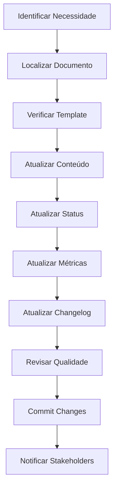

# 📋 TEMPLATE - ESTRUTURA PADRÃO PARA DOCUMENTOS
## Estúdio IA de Vídeos - Guia de Padronização

> **Status:** ✅ Concluído  
> **Data Criação:** 25/01/2025  
> **Data Atualização:** 25/01/2025  
> **Responsável:** Equipe Documentação  
> **Progresso:** 100%  

---

## 📋 **RESUMO EXECUTIVO**

Este documento define a estrutura padrão obrigatória para todos os documentos Markdown (.md) do projeto Estúdio IA de Vídeos, garantindo consistência, rastreabilidade e facilidade de manutenção.

**Objetivo:** Padronizar a documentação para melhor organização e acompanhamento de status.

## 🎯 **OBJETIVOS DA PADRONIZAÇÃO**
- ✅ Garantir consistência visual e estrutural
- ✅ Facilitar identificação rápida de status
- ✅ Melhorar rastreabilidade de progresso
- ✅ Simplificar manutenção e atualizações
- ✅ Estabelecer processo de revisão padronizado

---

## 📊 **TIPOS DE DOCUMENTOS**

### **Categorias Principais:**

| Tipo | Prefixo | Exemplo | Uso |
|------|---------|---------|-----|
| **Roadmap** | `ROADMAP_` | `ROADMAP_MASTER_2025.md` | Planejamento estratégico |
| **Sprint** | `SPRINT##_` | `SPRINT16_CHANGELOG.md` | Documentação de sprints |
| **Cronograma** | `CRONOGRAMA_` | `CRONOGRAMA_Q2_2025.md` | Planejamento temporal |
| **Plano** | `PLANO_` | `PLANO_DESENVOLVIMENTO.md` | Planos detalhados |
| **Análise** | `ANALISE_` | `ANALISE_TECNICA_VFX.md` | Análises técnicas |
| **Debug** | `DEBUG_` | `DEBUG_REPORT_SPRINT16.md` | Relatórios de correção |
| **Relatório** | `RELATORIO_` | `RELATORIO_STATUS_MENSAL.md` | Relatórios consolidados |
| **Template** | `TEMPLATE_` | `TEMPLATE_SPRINT.md` | Templates e guias |

---

## 📝 **ESTRUTURA PADRÃO OBRIGATÓRIA**

### **Template Base:**

```markdown
# 🎯 [TÍTULO DO DOCUMENTO]
## [Subtítulo/Descrição Breve]

> **Status:** [✅ Concluído / 🟡 Em Andamento / 🔴 Pendente / ⚠️ Bloqueado / ❌ Cancelado]  
> **Data Início:** [DD/MM/AAAA]  
> **Data Conclusão:** [DD/MM/AAAA ou Estimativa]  
> **Responsável:** [Nome/Equipe]  
> **Progresso:** [X%]  

---

## 📋 **RESUMO EXECUTIVO**
[Descrição breve do objetivo, escopo e contexto do documento em 2-3 linhas]

## 🎯 **OBJETIVOS**
- [ ] Objetivo 1 específico e mensurável
- [ ] Objetivo 2 específico e mensurável
- [ ] Objetivo 3 específico e mensurável

## 📊 **STATUS DETALHADO**

### **Tarefas Principais:**
| Tarefa | Status | Responsável | Prazo | Progresso |
|--------|--------|-------------|-------|----------|
| Tarefa 1 | ✅ Concluído | Nome | DD/MM | 100% |
| Tarefa 2 | 🟡 Em Andamento | Nome | DD/MM | 60% |
| Tarefa 3 | 🔴 Pendente | Nome | DD/MM | 0% |

### **Entregas:**
- ✅ **Entrega 1:** Descrição detalhada (Concluída em DD/MM)
- 🟡 **Entrega 2:** Descrição detalhada (Em andamento)
- 🔴 **Entrega 3:** Descrição detalhada (Pendente)

## 🚧 **DEPENDÊNCIAS**
- [ ] Dependência 1 (Status atual)
- [ ] Dependência 2 (Status atual)
- [ ] Dependência 3 (Status atual)

## ⚠️ **RISCOS E BLOQUEIOS**
- **Risco 1:** Descrição do risco e estratégia de mitigação
- **Bloqueio 1:** Descrição do bloqueio e ação necessária para resolução

## 📈 **MÉTRICAS**
- **Progresso Geral:** X%
- **Tarefas Concluídas:** X/Y
- **Prazo:** [No prazo / Atrasado / Adiantado]
- **Quality Score:** X/100

---

**Última Atualização:** [DD/MM/AAAA]  
**Próxima Revisão:** [DD/MM/AAAA]  
**Responsável Atualização:** [Nome]  

---

## 📝 **CHANGELOG**

### **v1.1 - DD/MM/AAAA**
- ✅ Mudança implementada
- 🔴 Problema identificado
- 📊 Métrica atualizada

### **v1.0 - DD/MM/AAAA**
- 📋 Versão inicial do documento
```

---

## 🏷️ **CÓDIGOS DE STATUS PADRONIZADOS**

### **Status Principais:**

| Emoji | Código | Significado | Uso |
|-------|--------|-------------|-----|
| ✅ | **Concluído** | 100% finalizado e aprovado | Tarefas/projetos finalizados |
| 🟡 | **Em Andamento** | Iniciado mas não finalizado | Trabalho ativo em progresso |
| 🔴 | **Pendente** | Não iniciado, aguardando | Itens na fila de trabalho |
| ⚠️ | **Bloqueado** | Impedido por dependência | Aguardando resolução externa |
| ❌ | **Cancelado** | Descontinuado permanentemente | Itens removidos do escopo |
| 🔄 | **Em Revisão** | Aguardando aprovação/feedback | Pendente de validação |
| 🎯 | **Prioritário** | Alta prioridade de execução | Itens críticos |
| 💡 | **Ideia** | Conceito em avaliação | Brainstorming/planejamento |

### **Status Secundários:**

| Emoji | Código | Significado | Uso |
|-------|--------|-------------|-----|
| 🚀 | **Lançado** | Entregue em produção | Features live |
| 🧪 | **Testando** | Em fase de testes | QA/validação |
| 📋 | **Planejado** | Definido mas não iniciado | Backlog organizado |
| 🔧 | **Manutenção** | Correções e ajustes | Bug fixes |
| 📊 | **Analisando** | Em fase de análise | Research/discovery |
| 🎨 | **Design** | Em fase de design | UI/UX work |
| 💻 | **Desenvolvimento** | Em codificação | Active coding |
| 🔍 | **Investigando** | Pesquisando solução | Problem solving |

---

## 📏 **REGRAS DE FORMATAÇÃO**

### **Cabeçalhos:**
- **H1 (#):** Título principal do documento
- **H2 (##):** Seções principais
- **H3 (###):** Subseções
- **H4 (####):** Detalhes específicos

### **Tabelas:**
- Sempre incluir cabeçalho
- Alinhar colunas para legibilidade
- Usar status emoji na primeira coluna relevante
- Máximo 6 colunas por tabela

### **Listas:**
- **Checkboxes:** Para itens acionáveis `- [ ]` / `- [x]`
- **Bullets:** Para informações `- item`
- **Numeradas:** Para sequências `1. item`

### **Citações:**
- **Info Box:** `> **Status:** informação importante`
- **Alertas:** `> ⚠️ **Atenção:** aviso crítico`
- **Notas:** `> 📝 **Nota:** informação adicional`

### **Código:**
- **Inline:** `código`
- **Blocos:** ```linguagem
- **Comandos:** `$ comando`

---

## 📅 **PROCESSO DE ATUALIZAÇÃO**

### **Frequência de Revisão:**

| Tipo Documento | Frequência | Responsável | Gatilho |
|----------------|------------|-------------|----------|
| **Roadmap Master** | Mensal | Product Owner | Fim do mês |
| **Cronograma** | Semanal | Scrum Master | Fim do sprint |
| **Sprint Changelog** | Diário | Dev Lead | Daily standup |
| **Análise Técnica** | Quinzenal | Tech Lead | Sprint review |
| **Debug Reports** | Imediato | Developer | Bug resolution |
| **Relatórios** | Mensal | Project Manager | Milestone |

### **Workflow de Atualização:**



### **Checklist de Atualização:**
- [ ] Status atualizado no cabeçalho
- [ ] Progresso percentual atualizado
- [ ] Tabelas de status atualizadas
- [ ] Dependências verificadas
- [ ] Riscos reavaliados
- [ ] Métricas recalculadas
- [ ] Data de atualização modificada
- [ ] Changelog adicionado
- [ ] Próxima revisão agendada

---

## 🎨 **DIRETRIZES VISUAIS**

### **Uso de Emojis:**
- **Obrigatório:** Status, seções principais
- **Recomendado:** Títulos, alertas importantes
- **Evitar:** Uso excessivo, emojis decorativos

### **Formatação de Texto:**
- **Negrito:** `**texto importante**`
- **Itálico:** `*ênfase*`
- **Código:** `código inline`
- **Links:** `[texto](url)`

### **Cores e Destaque:**
- **Sucesso:** ✅ Verde (concluído)
- **Atenção:** 🟡 Amarelo (em andamento)
- **Erro:** 🔴 Vermelho (pendente/problema)
- **Info:** 🔵 Azul (informação)
- **Aviso:** ⚠️ Laranja (bloqueio/risco)

---

## 🔍 **VALIDAÇÃO E QUALIDADE**

### **Critérios de Qualidade:**

| Critério | Peso | Descrição | Validação |
|----------|------|-----------|----------|
| **Completude** | 25% | Todas as seções preenchidas | Checklist |
| **Atualidade** | 25% | Informações atualizadas | Data < 7 dias |
| **Clareza** | 20% | Linguagem clara e objetiva | Review |
| **Consistência** | 15% | Segue template padrão | Automated |
| **Rastreabilidade** | 15% | Status e progresso claros | Metrics |

### **Processo de Validação:**

1. **Auto-validação:** Autor verifica checklist
2. **Peer Review:** Colega revisa conteúdo
3. **Tech Review:** Lead técnico aprova
4. **Final Approval:** Stakeholder aprova

### **Métricas de Qualidade:**
- **Score Mínimo:** 80/100
- **Tempo Máximo Desatualização:** 7 dias
- **Taxa de Conformidade:** >95%
- **Feedback Score:** >4.5/5

---

## 🛠️ **FERRAMENTAS E AUTOMAÇÃO**

### **Ferramentas Recomendadas:**

| Ferramenta | Uso | Benefício |
|------------|-----|----------|
| **VS Code** | Edição Markdown | Syntax highlighting |
| **Markdown Preview** | Visualização | Preview em tempo real |
| **Mermaid** | Diagramas | Fluxogramas integrados |
| **GitHub Actions** | Automação | Validação automática |
| **Prettier** | Formatação | Consistência automática |

### **Scripts de Automação:**

```bash
# Validar estrutura do documento
./scripts/validate-doc.sh documento.md

# Atualizar status automaticamente
./scripts/update-status.sh documento.md "Em Andamento" 75

# Gerar relatório de qualidade
./scripts/quality-report.sh *.md
```

### **Integração CI/CD:**
- **Pre-commit:** Validação de formato
- **PR Checks:** Verificação de qualidade
- **Auto-update:** Status baseado em commits
- **Notifications:** Alertas de desatualização

---

## 📚 **EXEMPLOS PRÁTICOS**

### **Exemplo 1: Sprint Changelog**

```markdown
# 🎯 SPRINT 16 - FINALIZAÇÕES FASE 1
## Conclusão do Módulo PPTX e Preparação VFX

> **Status:** 🟡 Em Andamento  
> **Data Início:** 24/03/2025  
> **Data Conclusão:** 07/04/2025  
> **Responsável:** Scrum Master  
> **Progresso:** 30%  

## 📋 **RESUMO EXECUTIVO**
Sprint focado na finalização completa da Fase 1 (PPTX) e preparação para início da Fase 2 (VFX Engine).

## 🎯 **OBJETIVOS**
- [ ] Finalizar Sprint 13 pendências (40%)
- [ ] Implementar ElevenLabs TTS Premium
- [ ] Otimizar Asset Library performance
- [ ] Preparar documentação técnica completa
```

### **Exemplo 2: Análise Técnica**

```markdown
# 🎯 ANÁLISE TÉCNICA - VFX ENGINE
## Avaliação de Tecnologias para Efeitos Visuais

> **Status:** 🔴 Pendente  
> **Data Início:** 01/04/2025  
> **Data Conclusão:** 15/04/2025 (Estimativa)  
> **Responsável:** Tech Lead VFX  
> **Progresso:** 0%  

## 📋 **RESUMO EXECUTIVO**
Análise detalhada das tecnologias GSAP, Three.js e WebGL para implementação do engine de efeitos visuais premium.
```

---

## 🔄 **MIGRAÇÃO DE DOCUMENTOS EXISTENTES**

### **Processo de Migração:**

1. **Inventário:** Listar todos os documentos .md
2. **Classificação:** Categorizar por tipo
3. **Priorização:** Definir ordem de migração
4. **Conversão:** Aplicar template padrão
5. **Validação:** Verificar qualidade
6. **Aprovação:** Stakeholder approval

### **Cronograma de Migração:**

| Documento | Prioridade | Responsável | Prazo |
|-----------|------------|-------------|-------|
| ROADMAP_MASTER | 🎯 Alta | Product Owner | 26/01 |
| CRONOGRAMA_DETALHADO | 🎯 Alta | Scrum Master | 27/01 |
| SPRINT_CHANGELOGS | 🟡 Média | Dev Leads | 30/01 |
| ANALISES_TECNICAS | 🟡 Média | Tech Leads | 02/02 |
| DEBUG_REPORTS | 🔴 Baixa | Developers | 05/02 |

### **Backup e Versionamento:**
- **Backup:** Cópia dos originais em `/backup/`
- **Versionamento:** Git tags para marcos
- **Rollback:** Processo de reversão definido

---

## 📞 **SUPORTE E CONTATOS**

### **Responsáveis:**
- **Documentação:** Tech Writer Lead
- **Templates:** Documentation Team
- **Qualidade:** QA Documentation
- **Automação:** DevOps Team

### **Canais de Suporte:**
- **Slack:** #documentation-help
- **Email:** docs@estudio-ia.com
- **Wiki:** Internal documentation wiki
- **Issues:** GitHub documentation issues

---

**Última Atualização:** 25/01/2025  
**Próxima Revisão:** 01/02/2025  
**Responsável:** Documentation Team  

---

## 📝 **CHANGELOG**

### **v1.0 - 25/01/2025**
- ✅ Criação do template padrão completo
- ✅ Definição de códigos de status
- ✅ Estabelecimento de processo de atualização
- ✅ Criação de exemplos práticos
- ✅ Definição de métricas de qualidade
- ✅ Planejamento de migração de documentos existentes