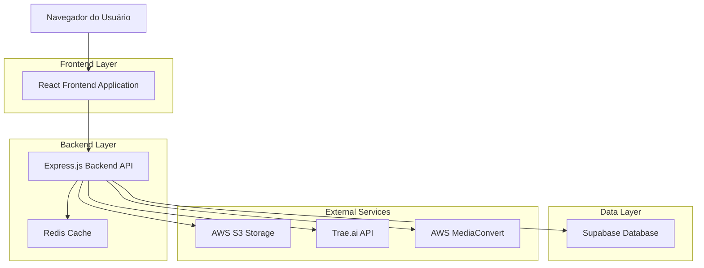
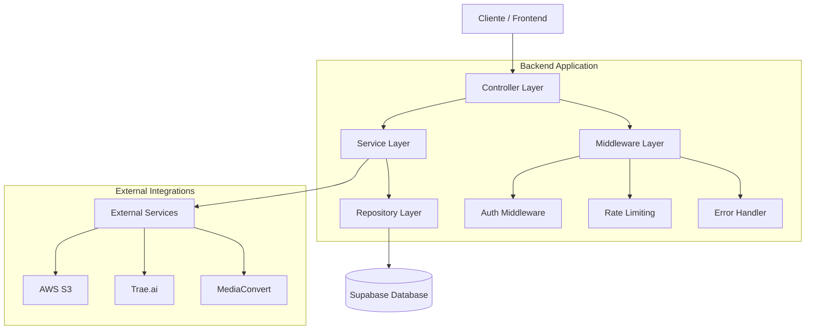
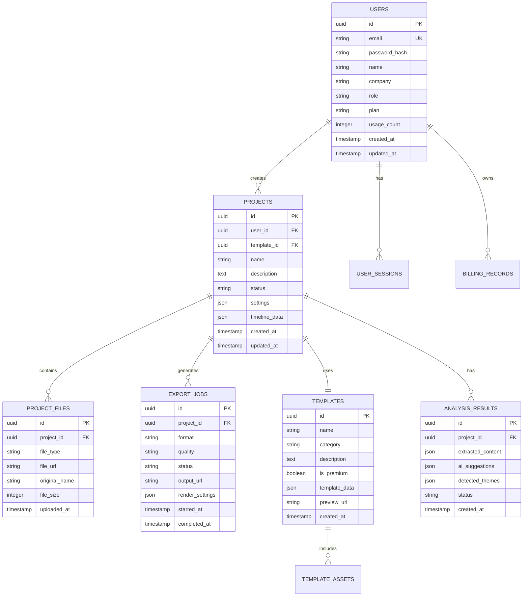

# Documento de Arquitetura Técnica - Estúdio IA de Vídeos

## 1. Arquitetura do Sistema



## 2. Descrição das Tecnologias

* **Frontend**: React\@18 + TypeScript + Tailwind CSS + Vite + Zustand

* **Backend**: Express.js\@4 + TypeScript + Node.js\@18

* **Database**: Supabase (PostgreSQL)

* **Cache**: Redis\@7

* **Storage**: AWS S3 + CloudFront CDN

* **Video Processing**: AWS MediaConvert + FFmpeg

* **AI Integration**: Trae.ai API

* **Authentication**: Supabase Auth + JWT

* **Real-time**: Socket.io

## 3. Definições de Rotas

| Rota                  | Propósito                                        |
| --------------------- | ------------------------------------------------ |
| /                     | Página inicial com informações do produto        |
| /auth/login           | Página de login do usuário                       |
| /auth/register        | Página de registro de novo usuário               |
| /auth/forgot-password | Página de recuperação de senha                   |
| /dashboard            | Dashboard principal com visão geral dos projetos |
| /projects             | Lista completa de projetos do usuário            |
| /projects/:id         | Detalhes de um projeto específico                |
| /editor/:projectId    | Interface do editor de vídeo                     |
| /upload               | Página de upload de arquivos PPTX                |
| /templates            | Biblioteca de templates NR                       |
| /templates/:category  | Templates filtrados por categoria NR             |
| /export/:projectId    | Página de exportação e renderização              |
| /profile              | Perfil e configurações do usuário                |
| /admin                | Painel administrativo (apenas admins)            |
| /admin/users          | Gerenciamento de usuários                        |
| /admin/analytics      | Relatórios e analytics do sistema                |

## 4. Definições de API

### 4.1 APIs de Autenticação

**Login de usuário**

```
POST /api/auth/login
```

Request:

| Parâmetro | Tipo    | Obrigatório | Descrição          |
| --------- | ------- | ----------- | ------------------ |
| email     | string  | true        | Email do usuário   |
| password  | string  | true        | Senha do usuário   |
| remember  | boolean | false       | Manter login ativo |

Response:

| Parâmetro | Tipo    | Descrição                   |
| --------- | ------- | --------------------------- |
| success   | boolean | Status da operação          |
| token     | string  | JWT token de autenticação   |
| user      | object  | Dados do usuário            |
| expiresIn | number  | Tempo de expiração do token |

Exemplo:

```json
{
  "email": "usuario@empresa.com",
  "password": "senhaSegura123",
  "remember": true
}
```

**Registro de usuário**

```
POST /api/auth/register
```

Request:

| Parâmetro | Tipo   | Obrigatório | Descrição                   |
| --------- | ------ | ----------- | --------------------------- |
| name      | string | true        | Nome completo do usuário    |
| email     | string | true        | Email do usuário            |
| password  | string | true        | Senha (mínimo 8 caracteres) |
| company   | string | false       | Nome da empresa             |
| role      | string | false       | Função na empresa           |

### 4.2 APIs de Projetos

**Listar projetos do usuário**

```
GET /api/projects
```

Query Parameters:

| Parâmetro | Tipo   | Descrição                                         |
| --------- | ------ | ------------------------------------------------- |
| page      | number | Número da página (padrão: 1)                      |
| limit     | number | Itens por página (padrão: 10)                     |
| status    | string | Filtrar por status (draft, processing, completed) |
| search    | string | Buscar por nome do projeto                        |

**Criar novo projeto**

```
POST /api/projects
```

Request:

| Parâmetro   | Tipo   | Obrigatório | Descrição                 |
| ----------- | ------ | ----------- | ------------------------- |
| name        | string | true        | Nome do projeto           |
| description | string | false       | Descrição do projeto      |
| templateId  | string | false       | ID do template base       |
| settings    | object | false       | Configurações específicas |

### 4.3 APIs de Upload

**Upload de arquivo PPTX**

```
POST /api/upload/pptx
```

Request (multipart/form-data):

| Parâmetro | Tipo   | Obrigatório | Descrição     |
| --------- | ------ | ----------- | ------------- |
| file      | File   | true        | Arquivo PPTX  |
| projectId | string | true        | ID do projeto |

Response:

| Parâmetro  | Tipo    | Descrição                    |
| ---------- | ------- | ---------------------------- |
| success    | boolean | Status do upload             |
| fileUrl    | string  | URL do arquivo no S3         |
| analysisId | string  | ID da análise iniciada       |
| slides     | array   | Preview dos slides extraídos |

### 4.4 APIs de Análise IA

**Obter resultado da análise**

```
GET /api/analysis/:analysisId
```

Response:

| Parâmetro      | Tipo   | Descrição                                        |
| -------------- | ------ | ------------------------------------------------ |
| status         | string | Status da análise (processing, completed, error) |
| suggestions    | object | Sugestões de avatares, música, etc.              |
| extractedText  | array  | Texto extraído de cada slide                     |
| detectedThemes | array  | Temas NR identificados                           |

### 4.5 APIs de Templates

**Listar templates por categoria**

```
GET /api/templates
```

Query Parameters:

| Parâmetro | Tipo    | Descrição                                |
| --------- | ------- | ---------------------------------------- |
| category  | string  | Categoria NR (nr-10, nr-12, nr-35, etc.) |
| premium   | boolean | Filtrar templates premium                |
| search    | string  | Buscar por nome ou tags                  |

### 4.6 APIs de Exportação

**Iniciar renderização de vídeo**

```
POST /api/export/render
```

Request:

| Parâmetro | Tipo   | Obrigatório | Descrição                     |
| --------- | ------ | ----------- | ----------------------------- |
| projectId | string | true        | ID do projeto                 |
| format    | string | true        | Formato (mp4, mov, webm)      |
| quality   | string | true        | Qualidade (720p, 1080p, 4k)   |
| settings  | object | false       | Configurações de renderização |

## 5. Arquitetura do Servidor



## 6. Modelo de Dados

### 6.1 Diagrama de Entidades



### 6.2 Definições DDL

**Tabela de Usuários (users)**

```sql
-- Criar tabela de usuários
CREATE TABLE users (
    id UUID PRIMARY KEY DEFAULT gen_random_uuid(),
    email VARCHAR(255) UNIQUE NOT NULL,
    password_hash VARCHAR(255) NOT NULL,
    name VARCHAR(100) NOT NULL,
    company VARCHAR(100),
    role VARCHAR(50),
    plan VARCHAR(20) DEFAULT 'free' CHECK (plan IN ('free', 'pro', 'enterprise')),
    usage_count INTEGER DEFAULT 0,
    is_active BOOLEAN DEFAULT true,
    email_verified BOOLEAN DEFAULT false,
    created_at TIMESTAMP WITH TIME ZONE DEFAULT NOW(),
    updated_at TIMESTAMP WITH TIME ZONE DEFAULT NOW()
);

-- Criar índices
CREATE INDEX idx_users_email ON users(email);
CREATE INDEX idx_users_plan ON users(plan);
CREATE INDEX idx_users_created_at ON users(created_at DESC);

-- Configurar RLS (Row Level Security)
ALTER TABLE users ENABLE ROW LEVEL SECURITY;

-- Política para usuários autenticados
CREATE POLICY "Users can view own profile" ON users
    FOR SELECT USING (auth.uid() = id);

CREATE POLICY "Users can update own profile" ON users
    FOR UPDATE USING (auth.uid() = id);

-- Permissões
GRANT SELECT ON users TO anon;
GRANT ALL PRIVILEGES ON users TO authenticated;
```

**Tabela de Projetos (projects)**

```sql
-- Criar tabela de projetos
CREATE TABLE projects (
    id UUID PRIMARY KEY DEFAULT gen_random_uuid(),
    user_id UUID NOT NULL REFERENCES users(id) ON DELETE CASCADE,
    template_id UUID REFERENCES templates(id),
    name VARCHAR(200) NOT NULL,
    description TEXT,
    status VARCHAR(20) DEFAULT 'draft' CHECK (status IN ('draft', 'processing', 'completed', 'error')),
    settings JSONB DEFAULT '{}',
    timeline_data JSONB DEFAULT '{}',
    thumbnail_url VARCHAR(500),
    duration_seconds INTEGER DEFAULT 0,
    created_at TIMESTAMP WITH TIME ZONE DEFAULT NOW(),
    updated_at TIMESTAMP WITH TIME ZONE DEFAULT NOW()
);

-- Criar índices
CREATE INDEX idx_projects_user_id ON projects(user_id);
CREATE INDEX idx_projects_status ON projects(status);
CREATE INDEX idx_projects_created_at ON projects(created_at DESC);
CREATE INDEX idx_projects_template_id ON projects(template_id);

-- Configurar RLS
ALTER TABLE projects ENABLE ROW LEVEL SECURITY;

CREATE POLICY "Users can manage own projects" ON projects
    FOR ALL USING (auth.uid() = user_id);

-- Permissões
GRANT SELECT ON projects TO anon;
GRANT ALL PRIVILEGES ON projects TO authenticated;
```

**Tabela de Templates (templates)**

```sql
-- Criar tabela de templates
CREATE TABLE templates (
    id UUID PRIMARY KEY DEFAULT gen_random_uuid(),
    name VARCHAR(200) NOT NULL,
    category VARCHAR(50) NOT NULL,
    description TEXT,
    is_premium BOOLEAN DEFAULT false,
    template_data JSONB NOT NULL,
    preview_url VARCHAR(500),
    tags TEXT[],
    usage_count INTEGER DEFAULT 0,
    is_active BOOLEAN DEFAULT true,
    created_at TIMESTAMP WITH TIME ZONE DEFAULT NOW(),
    updated_at TIMESTAMP WITH TIME ZONE DEFAULT NOW()
);

-- Criar índices
CREATE INDEX idx_templates_category ON templates(category);
CREATE INDEX idx_templates_is_premium ON templates(is_premium);
CREATE INDEX idx_templates_usage_count ON templates(usage_count DESC);
CREATE INDEX idx_templates_tags ON templates USING GIN(tags);

-- Configurar RLS
ALTER TABLE templates ENABLE ROW LEVEL SECURITY;

CREATE POLICY "Templates are viewable by everyone" ON templates
    FOR SELECT USING (is_active = true);

-- Permissões
GRANT SELECT ON templates TO anon;
GRANT ALL PRIVILEGES ON templates TO authenticated;
```

**Tabela de Arquivos de Projeto (project\_files)**

```sql
-- Criar tabela de arquivos
CREATE TABLE project_files (
    id UUID PRIMARY KEY DEFAULT gen_random_uuid(),
    project_id UUID NOT NULL REFERENCES projects(id) ON DELETE CASCADE,
    file_type VARCHAR(20) NOT NULL CHECK (file_type IN ('pptx', 'image', 'audio', 'video')),
    file_url VARCHAR(500) NOT NULL,
    original_name VARCHAR(255) NOT NULL,
    file_size INTEGER NOT NULL,
    mime_type VARCHAR(100),
    metadata JSONB DEFAULT '{}',
    uploaded_at TIMESTAMP WITH TIME ZONE DEFAULT NOW()
);

-- Criar índices
CREATE INDEX idx_project_files_project_id ON project_files(project_id);
CREATE INDEX idx_project_files_type ON project_files(file_type);
CREATE INDEX idx_project_files_uploaded_at ON project_files(uploaded_at DESC);

-- Configurar RLS
ALTER TABLE project_files ENABLE ROW LEVEL SECURITY;

CREATE POLICY "Users can manage files of own projects" ON project_files
    FOR ALL USING (
        EXISTS (
            SELECT 1 FROM projects 
            WHERE projects.id = project_files.project_id 
            AND projects.user_id = auth.uid()
        )
    );

-- Permissões
GRANT ALL PRIVILEGES ON project_files TO authenticated;
```

\*\*
