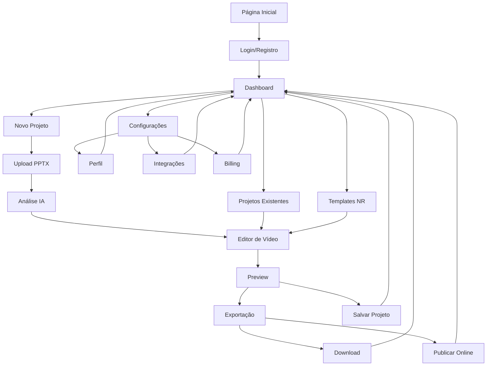
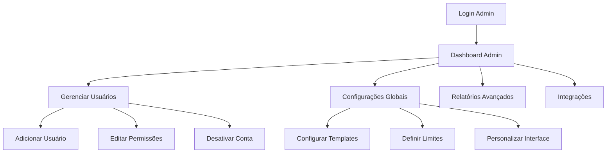
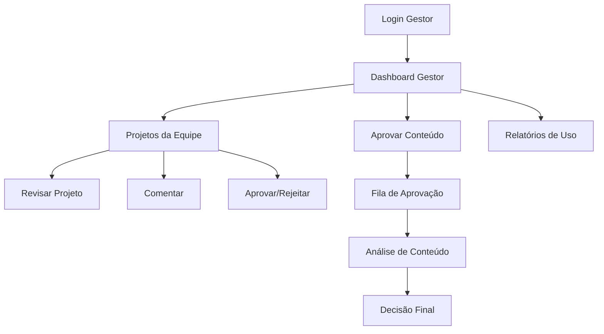
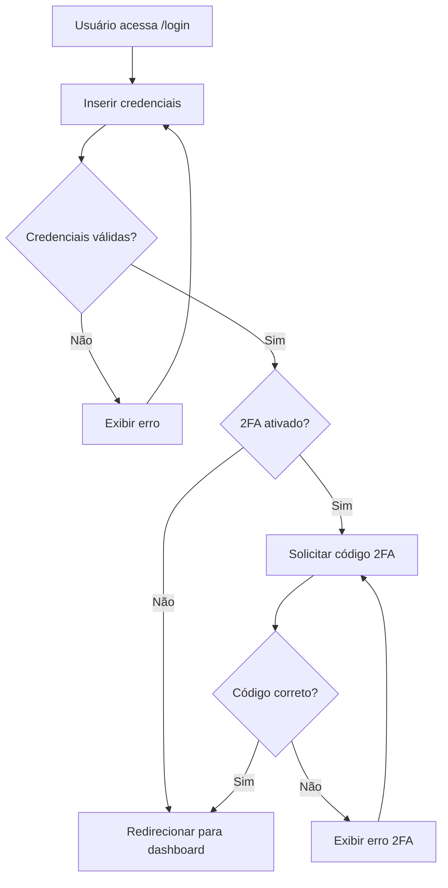
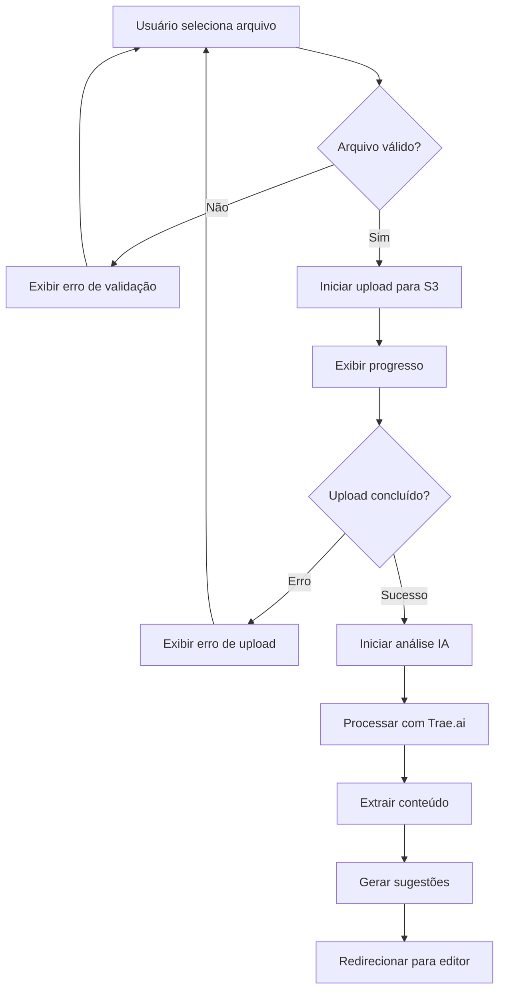
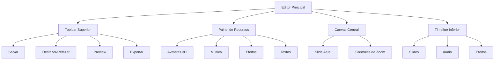
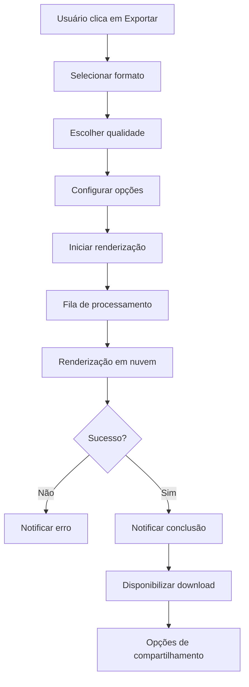

# Documento de Requisitos de Produto - Estúdio IA de Vídeos

## 1. Visão Geral do Produto

O **Estúdio IA de Vídeos** é uma plataforma low-code/no-code inovadora para criação e edição de vídeos de treinamentos de segurança do trabalho no Brasil. A plataforma permite que usuários leigos (profissionais de segurança, RH) transformem apresentações PPTX em vídeos profissionais com avatares 3D hiper-realistas, músicas, textos animados e templates específicos das Normas Regulamentadoras (NR).

* **Problema a resolver**: Democratizar a criação de conteúdo de vídeo para treinamentos de segurança, eliminando a necessidade de conhecimento técnico avançado.

* **Público-alvo**: Profissionais de segurança do trabalho, departamentos de RH, gestores de treinamento e consultores em segurança ocupacional.

* **Valor de mercado**: Redução de custos de produção de vídeos em até 80% e aceleração do processo de criação de conteúdo educativo.

## 2. Funcionalidades Principais

### 2.1 Perfis de Usuário

| Perfil            | Método de Registro      | Permissões Principais                                                |
| ----------------- | ----------------------- | -------------------------------------------------------------------- |
| Usuário Final     | Email + verificação     | Criar projetos, usar templates, exportar vídeos básicos              |
| Gestor            | Convite da empresa      | Gerenciar equipe, aprovar conteúdo, relatórios avançados             |
| Administrador     | Configuração do sistema | Configurações globais, gerenciar usuários, integrações               |
| Consultor Premium | Upgrade por plano       | Acesso a templates exclusivos, avatares premium, suporte prioritário |

### 2.2 Módulos do Sistema

Nosso sistema é composto pelos seguintes módulos principais:

1. **Página de Login/Registro**: autenticação segura, recuperação de senha, integração SSO
2. **Dashboard Principal**: visão geral de projetos, estatísticas, acesso rápido às funcionalidades
3. **Upload e Análise**: importação de PPTX, análise automática de conteúdo, sugestões de melhorias
4. **Editor de Vídeo**: interface drag & drop, avatares 3D, biblioteca de recursos, timeline avançada
5. **Templates NR**: biblioteca especializada em normas regulamentadoras brasileiras
6. **Gerenciamento de Projetos**: organização, colaboração, versionamento
7. **Exportação e Publicação**: múltiplos formatos, otimização automática, distribuição
8. **Configurações e Perfil**: personalização, integrações, billing

### 2.3 Detalhes das Funcionalidades

| Página           | Módulo         | Descrição da Funcionalidade                                                                                       |
| ---------------- | -------------- | ----------------------------------------------------------------------------------------------------------------- |
| Login/Registro   | Autenticação   | Login seguro com email/senha, autenticação 2FA, login social (Google, Microsoft), recuperação de senha            |
| Dashboard        | Visão Geral    | Exibir projetos recentes, estatísticas de uso, templates populares, notificações, acesso rápido a funcionalidades |
| Upload           | Importação     | Upload de arquivos PPTX via drag & drop, validação de formato, barra de progresso, preview automático             |
| Análise IA       | Processamento  | Análise automática de slides, extração de texto, sugestões de avatares, identificação de temas NR                 |
| Editor Principal | Edição Visual  | Interface drag & drop, timeline de vídeo, biblioteca de avatares 3D, inserção de música e efeitos                 |
| Templates NR     | Biblioteca     | Catálogo de templates por norma (NR-10, NR-12, NR-35, etc.), preview em tempo real, customização                  |
| Projetos         | Gerenciamento  | Lista de projetos, filtros avançados, compartilhamento, controle de versão, colaboração em equipe                 |
| Exportação       | Renderização   | Múltiplos formatos (MP4, MOV, WebM), qualidades diferentes, upload direto para plataformas                        |
| Configurações    | Personalização | Perfil do usuário, preferências de edição, integrações externas, configurações de billing                         |

## 3. Fluxos Principais do Sistema

### 3.1 Fluxo Principal do Usuário

O usuário típico segue este caminho para criar um vídeo:

1. **Login** → Autenticação e acesso ao dashboard
2. **Dashboard** → Visão geral e início de novo projeto
3. **Upload** → Importação do arquivo PPTX
4. **Análise** → Processamento automático e sugestões
5. **Editor** → Customização e edição do vídeo
6. **Preview** → Visualização e ajustes finais
7. **Exportação** → Renderização e download/publicação

### 3.2 Fluxo de Navegação Completo

### 3.3 Fluxos por Perfil de Usuário

**Fluxo do Administrador:**

**Fluxo do Gestor:**

## 4. Design de Interface do Usuário

### 4.1 Estilo de Design

* **Cores Primárias**: Azul corporativo (#2563EB), Verde segurança (#059669)

* **Cores Secundárias**: Cinza neutro (#6B7280), Branco (#FFFFFF), Laranja alerta (#EA580C)

* **Estilo de Botões**: Arredondados com sombra sutil, estados hover e active bem definidos

* **Tipografia**: Inter (títulos), Open Sans (corpo), tamanhos 14px-24px

* **Layout**: Design card-based, navegação lateral fixa, grid responsivo

* **Ícones**: Lucide icons, estilo outline, tamanho 20px-24px

* **Animações**: Transições suaves (300ms), micro-interações, loading states

### 4.2 Visão Geral das Páginas

| Página     | Módulo        | Elementos de UI                                                                     |
| ---------- | ------------- | ----------------------------------------------------------------------------------- |
| Login      | Autenticação  | Card centralizado, campos com validação visual, botões sociais, link de recuperação |
| Dashboard  | Principal     | Sidebar com navegação, cards de estatísticas, grid de projetos, botão CTA destacado |
| Upload     | Importação    | Área de drop zone, barra de progresso circular, preview de arquivo, botões de ação  |
| Editor     | Edição        | Timeline horizontal, painel de recursos lateral, canvas central, toolbar superior   |
| Templates  | Biblioteca    | Grid de cards com preview, filtros laterais, busca avançada, tags de categorização  |
| Projetos   | Gerenciamento | Tabela responsiva, filtros avançados, ações em lote, modal de detalhes              |
| Exportação | Renderização  | Wizard de passos, opções de qualidade, preview final, barra de progresso            |

### 4.3 Responsividade

* **Desktop-first**: Otimizado para telas 1920x1080, adaptável até 1366x768

* **Tablet**: Layout adaptativo para iPads (768px-1024px), navegação colapsável

* **Mobile**: Interface simplificada para smartphones (320px-768px), gestos touch otimizados

* **Acessibilidade**: Contraste WCAG AA, navegação por teclado, screen readers, textos alternativos

## 5. Especificações Técnicas Detalhadas

### 5.1 Módulo de Autenticação

**Rota**: `/auth`

**Funcionalidades**:

* Login com email/senha

* Autenticação 2FA (SMS/App)

* Login social (Google, Microsoft, LinkedIn)

* Recuperação de senha

* Registro de novos usuários

* Verificação de email

**Fluxo de Autenticação**:

**Tratamento de Erros**:

* Credenciais inválidas: "Email ou senha incorretos"

* Conta bloqueada: "Conta temporariamente bloqueada. Tente novamente em X minutos"

* Email não verificado: "Verifique seu email antes de fazer login"

* Erro de rede: "Problema de conexão. Verifique sua internet"

**Elementos de Usabilidade**:

* Validação em tempo real dos campos

* Indicador de força da senha

* Opção "Lembrar-me"

* Links de ajuda contextuais

* Loading states durante autenticação

### 5.2 Módulo de Upload e Análise

**Rota**: `/upload`

**Funcionalidades**:

* Upload de arquivos PPTX via drag & drop

* Validação de formato e tamanho

* Upload para AWS S3

* Análise automática com Trae.ai

* Extração de texto e imagens

* Sugestões de avatares e temas

**Fluxo de Upload**:

**Validações**:

* Formato: Apenas .pptx

* Tamanho máximo: 50MB

* Número de slides: Máximo 100

* Conteúdo: Verificação de malware

**Integrações**:

* **AWS S3**: Armazenamento seguro de arquivos

* **Trae.ai**: Análise de conteúdo e sugestões

* **CloudFront**: CDN para otimização de download

### 5.3 Módulo Editor de Vídeo

**Rota**: `/editor/:projectId`

**Funcionalidades**:

* Interface drag & drop

* Timeline de vídeo avançada

* Biblioteca de avatares 3D

* Inserção de música e efeitos

* Textos animados

* Transições entre slides

* Preview em tempo real

**Componentes do Editor**:

**Funcionalidades de IA**:

* Sugestão automática de avatares baseada no conteúdo

* Recomendação de música por tema

* Otimização automática de timing

* Correção de texto com IA

* Geração de legendas automáticas

### 5.4 Módulo Templates NR

**Rota**: `/templates`

**Funcionalidades**:

* Biblioteca de templates por norma regulamentadora

* Filtros por categoria (NR-10, NR-12, NR-35, etc.)

* Preview em tempo real

* Customização de cores e logos

* Templates premium para consultores

**Categorias de Templates**:

* **NR-10**: Segurança em Instalações e Serviços em Eletricidade

* **NR-12**: Segurança no Trabalho em Máquinas e Equipamentos

* **NR-35**: Trabalho em Altura

* **NR-06**: Equipamentos de Proteção Individual

* **NR-17**: Ergonomia

* **NR-23**: Proteção Contra Incêndios

### 5.5 Módulo de Exportação

**Rota**: `/export/:projectId`

**Funcionalidades**:

* Múltiplos formatos (MP4, MOV, WebM)

* Diferentes qualidades (720p, 1080p, 4K)

* Renderização em nuvem

* Upload direto para YouTube/Vimeo

* Geração de links compartilháveis

**Fluxo de Exportação**:

### 5.6 Dashboard e Gerenciamento

**Rota**: `/dashboard`

**Funcionalidades**:

* Visão geral de projetos

* Estatísticas de uso

* Projetos recentes

* Templates populares

* Notificações do sistema

* Acesso rápido a funcionalidades

\*\*Mé
