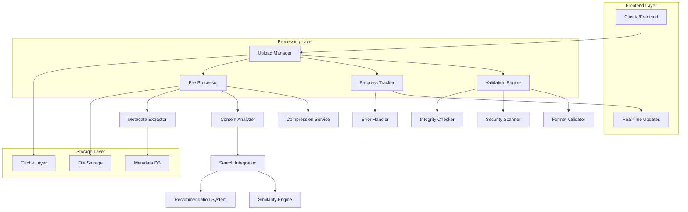
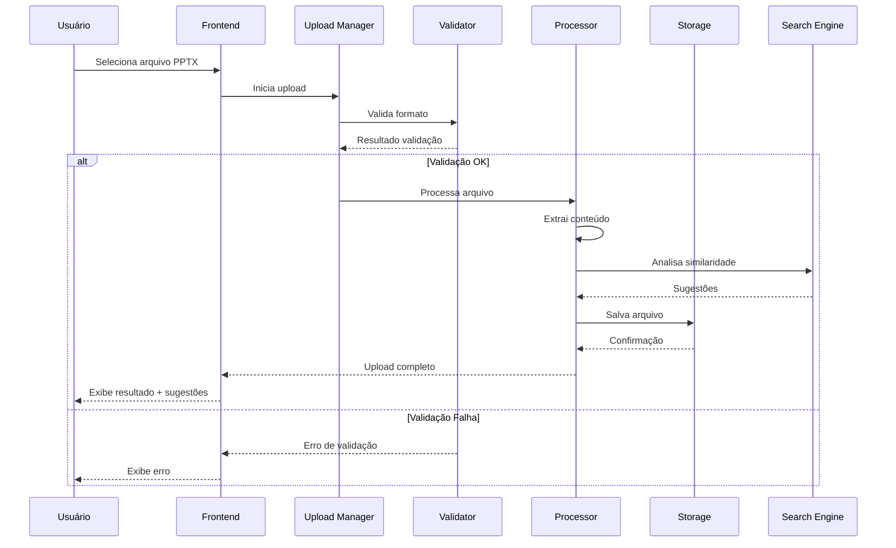

# Módulo de Upload PPTX - Melhorias Técnicas

## 1. Visão Geral do Projeto

Este documento detalha as melhorias técnicas propostas para o módulo de upload de arquivos PPTX no sistema Studio Treiax. O objetivo é criar um sistema robusto, seguro e eficiente para upload de apresentações PowerPoint com validação avançada, feedback visual em tempo real e integração inteligente com sistemas de pesquisa.

## 2. Funcionalidades Principais

### 2.1 Validação de Formato Robusta
- **Verificação de integridade**: Validação da estrutura XML interna do arquivo PPTX
- **Detecção de corrupção**: Identificação de slides corrompidos ou dados inconsistentes
- **Validação de conteúdo**: Análise de elementos multimídia e formatação
- **Verificação de segurança**: Detecção de macros maliciosos e conteúdo suspeito

### 2.2 Sistema de Limite de Tamanho Configurável
- **Limites progressivos**: Diferentes limites baseados no tipo de usuário
- **Compressão inteligente**: Otimização automática de arquivos grandes
- **Validação em tempo real**: Verificação de tamanho durante o upload
- **Alertas preventivos**: Notificações antes de atingir limites

### 2.3 Feedback Visual Aprimorado
- **Indicadores de progresso**: Barras de progresso detalhadas por etapa
- **Status em tempo real**: Atualizações visuais do estado do upload
- **Estimativas de tempo**: Cálculo dinâmico do tempo restante
- **Notificações contextuais**: Mensagens específicas para cada fase

### 2.4 Integração com Sistema de Pesquisas
- **Sugestões automáticas**: Conteúdo relacionado baseado no upload
- **Análise de similaridade**: Detecção de apresentações similares
- **Recomendações inteligentes**: Templates e recursos relacionados
- **Indexação automática**: Catalogação para futuras pesquisas

## 3. Arquitetura Técnica

### 3.1 Diagrama de Arquitetura



### 3.2 Tecnologias Utilizadas

- **Frontend**: React 18 + TypeScript + Tailwind CSS
- **Upload Engine**: Custom upload manager com chunking
- **Validação**: JSZip + Custom XML parsers
- **Cache**: Redis para uploads grandes
- **Storage**: Supabase Storage + Local filesystem
- **Análise**: GPT-4 Vision API para análise de conteúdo

## 4. Especificações de Implementação

### 4.1 Validação de Formato Robusta

#### Estrutura do Validador
```typescript
interface ValidationResult {
  isValid: boolean
  errors: ValidationError[]
  warnings: ValidationWarning[]
  metadata: FileMetadata
  securityScore: number
}

class PPTXValidator {
  async validateFile(file: File): Promise<ValidationResult>
  async checkIntegrity(zipContent: JSZip): Promise<boolean>
  async scanForMalware(content: any): Promise<SecurityScanResult>
  async validateSlides(slides: SlideData[]): Promise<SlideValidationResult[]>
}
```

#### Critérios de Validação
- **Formato**: Verificação de extensão .pptx e MIME type
- **Estrutura**: Validação da estrutura ZIP e arquivos XML internos
- **Integridade**: Verificação de checksums e consistência de dados
- **Segurança**: Detecção de macros, scripts e conteúdo malicioso
- **Conteúdo**: Validação de slides, layouts e elementos multimídia

### 4.2 Sistema de Limite de Tamanho

#### Configuração de Limites
```typescript
interface SizeLimits {
  free: {
    maxFileSize: number // 50MB
    maxMonthlyUpload: number // 500MB
    compressionLevel: 'high'
  }
  premium: {
    maxFileSize: number // 200MB
    maxMonthlyUpload: number // 5GB
    compressionLevel: 'medium'
  }
  enterprise: {
    maxFileSize: number // 1GB
    maxMonthlyUpload: number // Unlimited
    compressionLevel: 'low'
  }
}
```

#### Sistema de Compressão
- **Compressão de imagens**: Otimização automática de qualidade
- **Remoção de metadados**: Limpeza de dados desnecessários
- **Otimização de XML**: Minificação de estruturas XML
- **Chunking inteligente**: Divisão de uploads grandes

### 4.3 Feedback Visual Aprimorado

#### Componentes de Interface
```typescript
interface UploadProgress {
  stage: 'uploading' | 'validating' | 'processing' | 'analyzing' | 'completed'
  progress: number // 0-100
  speed: number // bytes/second
  timeRemaining: number // seconds
  currentFile: string
  processedBytes: number
  totalBytes: number
}

interface ProgressIndicator {
  showDetailedProgress: boolean
  showSpeedIndicator: boolean
  showTimeEstimate: boolean
  showStageDetails: boolean
}
```

#### Estados Visuais
- **Idle**: Estado inicial com área de drop
- **Uploading**: Barra de progresso com velocidade
- **Validating**: Indicador de validação com checklist
- **Processing**: Análise de conteúdo com etapas detalhadas
- **Completed**: Resumo com opções de ação
- **Error**: Mensagens de erro com sugestões de correção

### 4.4 Integração com Sistema de Pesquisas

#### Engine de Similaridade
```typescript
interface SimilarityEngine {
  analyzeContent(file: PPTXFile): Promise<ContentAnalysis>
  findSimilarPresentations(analysis: ContentAnalysis): Promise<SimilarPresentation[]>
  generateRecommendations(context: UploadContext): Promise<Recommendation[]>
  indexForSearch(file: PPTXFile, analysis: ContentAnalysis): Promise<void>
}

interface ContentAnalysis {
  topics: string[]
  keywords: string[]
  nrCategories: string[]
  complexity: 'basic' | 'intermediate' | 'advanced'
  targetAudience: string
  estimatedDuration: number
}
```

#### Funcionalidades de Pesquisa
- **Análise semântica**: Extração de tópicos e conceitos
- **Detecção de NRs**: Identificação automática de normas regulamentadoras
- **Classificação de conteúdo**: Categorização por área e complexidade
- **Sugestões contextuais**: Recomendações baseadas no conteúdo

## 5. Fluxo de Dados

### 5.1 Processo de Upload



### 5.2 Sistema de Retry Automático

#### Estratégia de Retry
```typescript
interface RetryConfig {
  maxAttempts: number // 3
  backoffStrategy: 'exponential' | 'linear'
  retryableErrors: ErrorType[]
  chunkRetry: boolean
}

class RetryManager {
  async executeWithRetry<T>(operation: () => Promise<T>, config: RetryConfig): Promise<T>
  async retryChunk(chunk: FileChunk, attempt: number): Promise<boolean>
  calculateBackoff(attempt: number, strategy: BackoffStrategy): number
}
```

#### Cenários de Retry
- **Falha de rede**: Reconexão automática
- **Timeout**: Aumento do timeout progressivo
- **Erro de servidor**: Retry com backoff exponencial
- **Chunk corrompido**: Re-upload do chunk específico

### 5.3 Sistema de Cache

#### Estratégia de Cache
```typescript
interface CacheStrategy {
  chunkCache: {
    enabled: boolean
    ttl: number // 24 hours
    maxSize: number // 1GB
  }
  metadataCache: {
    enabled: boolean
    ttl: number // 7 days
  }
  analysisCache: {
    enabled: boolean
    ttl: number // 30 days
  }
}
```

#### Implementação
- **Cache de chunks**: Armazenamento temporário de partes do arquivo
- **Cache de metadados**: Informações de arquivos processados
- **Cache de análise**: Resultados de análise de conteúdo
- **Invalidação inteligente**: Limpeza automática baseada em uso

## 6. Validação de Conteúdo

### 6.1 Detecção de Slides Corrompidos

#### Verificações Implementadas
- **Estrutura XML**: Validação de sintaxe e esquema
- **Referências**: Verificação de links internos e externos
- **Elementos multimídia**: Validação de imagens, vídeos e áudios
- **Formatação**: Consistência de estilos e layouts

### 6.2 Preview em Tempo Real

#### Funcionalidades
```typescript
interface PreviewGenerator {
  generateThumbnails(slides: SlideData[]): Promise<string[]>
  createPreviewVideo(presentation: PPTXFile): Promise<string>
  extractKeyFrames(slides: SlideData[]): Promise<ImageData[]>
}
```

- **Thumbnails**: Geração de miniaturas dos slides
- **Preview de vídeo**: Conversão rápida para preview
- **Extração de texto**: Análise de conteúdo textual
- **Detecção de elementos**: Identificação de gráficos e imagens

## 7. Especificações de Performance

### 7.1 Métricas de Performance

- **Upload Speed**: Mínimo 10MB/s em conexões estáveis
- **Validation Time**: Máximo 5 segundos para arquivos de 100MB
- **Processing Time**: Máximo 30 segundos para análise completa
- **Memory Usage**: Máximo 512MB durante processamento
- **Cache Hit Rate**: Mínimo 80% para arquivos similares

### 7.2 Otimizações

- **Chunking paralelo**: Upload simultâneo de múltiplos chunks
- **Compressão adaptativa**: Ajuste automático baseado no conteúdo
- **Lazy loading**: Carregamento sob demanda de componentes
- **Worker threads**: Processamento em background

## 8. Segurança e Compliance

### 8.1 Medidas de Segurança

- **Validação de MIME type**: Verificação rigorosa do tipo de arquivo
- **Scan de malware**: Detecção de conteúdo malicioso
- **Sanitização**: Limpeza de metadados sensíveis
- **Criptografia**: Armazenamento seguro de arquivos

### 8.2 Compliance

- **LGPD**: Proteção de dados pessoais
- **ISO 27001**: Padrões de segurança da informação
- **Auditoria**: Logs detalhados de todas as operações
- **Backup**: Estratégia de backup e recuperação

## 9. Monitoramento e Analytics

### 9.1 Métricas Coletadas

- **Taxa de sucesso**: Percentual de uploads bem-sucedidos
- **Tempo médio**: Duração média do processo completo
- **Tipos de erro**: Categorização de falhas
- **Uso de recursos**: Monitoramento de CPU e memória
- **Satisfação do usuário**: Feedback e avaliações

### 9.2 Dashboards

- **Operacional**: Métricas em tempo real
- **Analítico**: Tendências e padrões de uso
- **Alertas**: Notificações de problemas críticos
- **Relatórios**: Análises periódicas detalhadas

## 10. Roadmap de Implementação

### 10.1 Fase 1 - Validação Robusta (2 semanas)
- Implementar validador avançado
- Sistema de detecção de corrupção
- Testes de segurança

### 10.2 Fase 2 - Feedback Visual (1 semana)
- Componentes de progresso
- Indicadores em tempo real
- Sistema de notificações

### 10.3 Fase 3 - Sistema de Cache (1 semana)
- Implementar cache de chunks
- Cache de metadados
- Estratégias de invalidação

### 10.4 Fase 4 - Integração de Pesquisa (2 semanas)
- Engine de similaridade
- Sistema de recomendações
- Indexação automática

### 10.5 Fase 5 - Otimizações (1 semana)
- Sistema de retry
- Preview em tempo real
- Ajustes de performance

## 11. Considerações Finais

Este módulo de upload PPTX aprimorado fornecerá uma experiência robusta e eficiente para os usuários, com validação avançada, feedback visual em tempo real e integração inteligente com sistemas de pesquisa. A implementação seguirá as melhores práticas de segurança e performance, garantindo escalabilidade e confiabilidade do sistema.