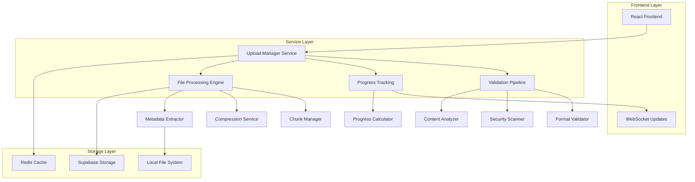
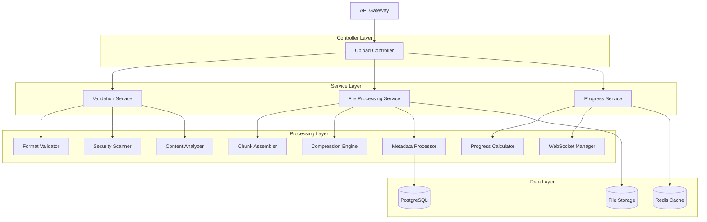
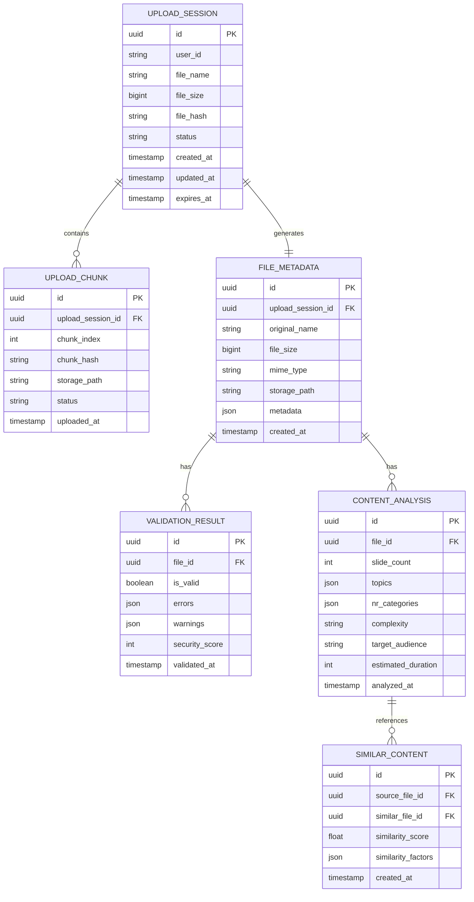

# Arquitetura Técnica - Módulo Upload PPTX

## 1. Arquitetura do Sistema



## 2. Descrição das Tecnologias

* **Frontend**: React 18 + TypeScript + Tailwind CSS + Vite

* **Upload Engine**: Custom service com chunking e retry automático

* **Validação**: JSZip + Custom XML parsers + Security scanners

* **Cache**: Redis para chunks e metadados

* **Storage**: Supabase Storage para arquivos finais

* **Real-time**: WebSocket para atualizações de progresso

* **Análise**: GPT-4 Vision API + Custom content analyzers

## 3. Definições de Rotas

| Rota                 | Propósito                                 |
| -------------------- | ----------------------------------------- |
| /upload              | Página principal de upload PPTX           |
| /upload/progress/:id | Acompanhamento de progresso em tempo real |
| /upload/preview/:id  | Preview do arquivo durante processamento  |
| /upload/history      | Histórico de uploads do usuário           |
| /upload/settings     | Configurações de upload e limites         |

## 4. Definições de API

### 4.1 Core Upload API

**Iniciar Upload**

```
POST /api/upload/initiate
```

Request:

| Param Name | Param Type | isRequired | Description                      |
| ---------- | ---------- | ---------- | -------------------------------- |
| fileName   | string     | true       | Nome do arquivo PPTX             |
| fileSize   | number     | true       | Tamanho do arquivo em bytes      |
| fileHash   | string     | true       | Hash MD5 do arquivo              |
| chunkSize  | number     | false      | Tamanho dos chunks (padrão: 1MB) |

Response:

| Param Name | Param Type | Description                 |
| ---------- | ---------- | --------------------------- |
| uploadId   | string     | ID único do upload          |
| chunkUrls  | string\[]  | URLs para upload dos chunks |
| expiresAt  | string     | Data de expiração das URLs  |

Example:

```json
{
  "uploadId": "upload_123456",
  "chunkUrls": [
    "https://api.example.com/upload/chunk/1",
    "https://api.example.com/upload/chunk/2"
  ],
  "expiresAt": "2024-01-15T10:30:00Z"
}
```

**Upload de Chunk**

```
PUT /api/upload/chunk/:chunkId
```

Request:

| Param Name | Param Type | isRequired | Description                    |
| ---------- | ---------- | ---------- | ------------------------------ |
| uploadId   | string     | true       | ID do upload                   |
| chunkIndex | number     | true       | Índice do chunk (0-based)      |
| chunkData  | binary     | true       | Dados binários do chunk        |
| chunkHash  | string     | true       | Hash do chunk para verificação |

Response:

| Param Name | Param Type | Description                 |
| ---------- | ---------- | --------------------------- |
| success    | boolean    | Status do upload do chunk   |
| nextChunk  | number     | Próximo chunk a ser enviado |
| progress   | number     | Progresso total (0-100)     |

**Finalizar Upload**

```
POST /api/upload/complete
```

Request:

| Param Name  | Param Type | isRequired | Description                    |
| ----------- | ---------- | ---------- | ------------------------------ |
| uploadId    | string     | true       | ID do upload                   |
| totalChunks | number     | true       | Total de chunks enviados       |
| finalHash   | string     | true       | Hash final do arquivo completo |

Response:

| Param Name       | Param Type | Description              |
| ---------------- | ---------- | ------------------------ |
| fileId           | string     | ID do arquivo processado |
| validationResult | object     | Resultado da validação   |
| processingStatus | string     | Status do processamento  |

### 4.2 Validation API

**Validar Arquivo**

```
POST /api/validation/validate
```

Request:

| Param Name      | Param Type | isRequired | Description                     |
| --------------- | ---------- | ---------- | ------------------------------- |
| fileId          | string     | true       | ID do arquivo a validar         |
| validationLevel | string     | false      | Nível de validação (basic/full) |

Response:

| Param Name    | Param Type | Description                    |
| ------------- | ---------- | ------------------------------ |
| isValid       | boolean    | Arquivo é válido               |
| errors        | array      | Lista de erros encontrados     |
| warnings      | array      | Lista de avisos                |
| securityScore | number     | Pontuação de segurança (0-100) |

### 4.3 Progress API

**Obter Progresso**

```
GET /api/upload/progress/:uploadId
```

Response:

| Param Name       | Param Type | Description                                     |
| ---------------- | ---------- | ----------------------------------------------- |
| stage            | string     | Estágio atual (uploading/validating/processing) |
| progress         | number     | Progresso percentual (0-100)                    |
| speed            | number     | Velocidade atual (bytes/s)                      |
| timeRemaining    | number     | Tempo estimado restante (segundos)              |
| currentOperation | string     | Operação atual sendo executada                  |

### 4.4 Search Integration API

**Buscar Conteúdo Similar**

```
POST /api/search/similar
```

Request:

| Param Name      | Param Type | isRequired | Description                       |
| --------------- | ---------- | ---------- | --------------------------------- |
| fileId          | string     | true       | ID do arquivo para busca          |
| maxResults      | number     | false      | Máximo de resultados (padrão: 10) |
| includeMetadata | boolean    | false      | Incluir metadados nos resultados  |

Response:

| Param Name      | Param Type | Description                        |
| --------------- | ---------- | ---------------------------------- |
| similarFiles    | array      | Lista de arquivos similares        |
| recommendations | array      | Recomendações baseadas no conteúdo |
| nrCategories    | array      | Categorias NR detectadas           |

## 5. Arquitetura do Servidor



## 6. Modelo de Dados

### 6.1 Definição do Modelo de Dados



### 6.2 DDL (Data Definition Language)

**Tabela de Sessões de Upload**

```sql
CREATE TABLE upload_sessions (
    id UUID PRIMARY KEY DEFAULT gen_random_uuid(),
    user_id VARCHAR(255) NOT NULL,
    file_name VARCHAR(500) NOT NULL,
    file_size BIGINT NOT NULL,
    file_hash VARCHAR(64) NOT NULL,
    status VARCHAR(50) DEFAULT 'initiated' CHECK (status IN ('initiated', 'uploading', 'validating', 'processing', 'completed', 'failed')),
    created_at TIMESTAMP WITH TIME ZONE DEFAULT NOW(),
    updated_at TIMESTAMP WITH TIME ZONE DEFAULT NOW(),
    expires_at TIMESTAMP WITH TIME ZONE DEFAULT (NOW() + INTERVAL '24 hours')
);

CREATE INDEX idx_upload_sessions_user_id ON upload_sessions(user_id);
CREATE INDEX idx_upload_sessions_status ON upload_sessions(status);
CREATE INDEX idx_upload_sessions_created_at ON upload_sessions(created_at DESC);
```

**Tabela de Chunks de Upload**

```sql
CREATE TABLE upload_chunks (
    id UUID PRIMARY KEY DEFAULT gen_random_uuid(),
    upload_session_id UUID NOT NULL REFERENCES upload_sessions(id) ON DELETE CASCADE,
    chunk_index INTEGER NOT NULL,
    chunk_hash VARCHAR(64) NOT NULL,
    storage_path VARCHAR(1000),
    status VARCHAR(50) DEFAULT 'pending' CHECK (status IN ('pending', 'uploading', 'completed', 'failed')),
    uploaded_at TIMESTAMP WITH TIME ZONE,
    UNIQUE(upload_session_id, chunk_index)
);

CREATE INDEX idx_upload_chunks_session_id ON upload_chunks(upload_session_id);
CREATE INDEX idx_upload_chunks_status ON upload_chunks(status);
```

**Tabela de Metadados de Arquivo**

```sql
CREATE TABLE file_metadata (
    id UUID PRIMARY KEY DEFAULT gen_random_uuid(),
    upload_session_id UUID NOT NULL REFERENCES upload_sessions(id),
    original_name VARCHAR(500) NOT NULL,
    file_size BIGINT NOT NULL,
    mime_type VARCHAR(100) NOT NULL,
    storage_path VARCHAR(1000) NOT NULL,
    metadata JSONB,
    created_at TIMESTAMP WITH TIME ZONE DEFAULT NOW()
);

CREATE INDEX idx_file_metadata_upload_session ON file_metadata(upload_session_id);
CREATE INDEX idx_file_metadata_created_at ON file_metadata(created_at DESC);
```

**Tabela de Resultados de Validação**

```sql
CREATE TABLE validation_results (
    id UUID PRIMARY KEY DEFAULT gen_random_uuid(),
    file_id UUID NOT NULL REFERENCES file_metadata(id) ON DELETE CASCADE,
    is_valid BOOLEAN NOT NULL,
    errors JSONB DEFAULT '[]',
    warnings JSONB DEFAULT '[]',
    security_score INTEGER CHECK (security_score >= 0 AND security_score <= 100),
    validated_at TIMESTAMP WITH TIME ZONE DEFAULT NOW()
);

CREATE INDEX idx_validation_results_file_id ON validation_results(file_id);
CREATE INDEX idx_validation_results_is_valid ON validation_results(is_valid);
```

**Tabela de Análise de Conteúdo**

```sql
CREATE TABLE content_analysis (
    id UUID PRIMARY KEY DEFAULT gen_random_uuid(),
    file_id UUID NOT NULL REFERENCES file_metadata(id) ON DELETE CASCADE,
    slide_count INTEGER NOT NULL,
    topics JSONB DEFAULT '[]',
    nr_categories JSONB DEFAULT '[]',
    complexity VARCHAR(50) CHECK (complexity IN ('basic', 'intermediate', 'advanced')),
    target_audience VARCHAR(200),
    estimated_duration INTEGER, -- em minutos
    analyzed_at TIMESTAMP WITH TIME ZONE DEFAULT NOW()
);

CREATE INDEX idx_content_analysis_file_id ON content_analysis(file_id);
CREATE INDEX idx_content_analysis_nr_categories ON content_analysis USING GIN(nr_categories);
CREATE INDEX idx_content_analysis_topics ON content_analysis USING GIN(topics);
```

**Tabela de Conteúdo Similar**

```sql
CREATE TABLE similar_content (
    id UUID PRIMARY KEY DEFAULT gen_random_uuid(),
    source_file_id UUID NOT NULL REFERENCES file_metadata(id) ON DELETE CASCADE,
    similar_file_id UUID NOT NULL REFERENCES file_metadata(id) ON DELETE CASCADE,
    similarity_score FLOAT CHECK (similarity_score >= 0 AND similarity_score <= 1),
    similarity_factors JSONB,
    created_at TIMESTAMP WITH TIME ZONE DEFAULT NOW(),
    UNIQUE(source_file_id, similar_file_id)
);

CREATE INDEX idx_similar_content_source ON similar_content(source_file_id);
CREATE INDEX idx_similar_content_score ON similar_content(similarity_score DESC);
```

**Dados Iniciais**

```sql
-- Inserir configurações padrão
INSERT INTO system_config (key, value) VALUES
('upload.max_file_size.free', '52428800'), -- 50MB
('upload.max_file_size.premium', '209715200'), -- 200MB
('upload.max_file_size.enterprise', '1073741824'), -- 1GB
('upload.chunk_size.default', '1048576'), -- 1MB
('upload.retry.max_attempts', '3'),
('validation.security_threshold', '70'),
('cache.chunk_ttl', '86400'), -- 24 horas
('cache.metadata_ttl', '604800'); -- 7 dias

-- Inserir tipos MIME permitidos
INSERT INTO allowed_mime_types (mime_type, extension, description) VALUES
('application/vnd.openxmlformats-officedocument.presentationml.presentation', '.pptx', 'PowerPoint Presentation'),
('application/vnd.ms-powerpoint', '.ppt', 'Legacy PowerPoint Presentation'),
('application/vnd.openxmlformats-officedocument.presentationml.template', '.potx', 'PowerPoint Template');
```

## 7. Configurações de Segurança

### 7.1 Validação de Arquivos

* Verificação rigorosa de MIME type

* Análise da estrutura ZIP interna

* Detecção de macros maliciosos

* Verificação de integridade de dados

### 7.2 Controle de Acesso

* Autenticação obrigatória para upload

* Limites baseados no tipo de usuário

* Rate limiting por IP e usuário

* Logs detalhados de todas as operações

### 7.3 Armazenamento Seguro

* Criptografia de arquivos em repouso

* URLs assinadas para acesso

* Expiração automática de uploads temporários

* Backup automático com retenção configurável

## 8. Monitoramento e Observabilidade

### 8.1 Métricas Coletadas

* Taxa de sucesso de uploads

* Tempo médio de processamento

* Uso de recursos (CPU, memória, storage)

* Distribuição de tamanhos de arquivo

* Padrões de erro e falhas

### 8.2 Alertas Configurados

* Taxa de erro acima de 5%

* Tempo de processamento acima de 60s

* Uso de memória acima de 80%

* Falhas de validação em massa

* Atividade suspeita de upload

### 8.3 Dashboards

* Métricas operacionais em tempo real

* Análise de tendências de uso

* Performance por tipo de arquivo

* Distribuição geográfica de uploads

* Relatórios de compliance e segurança

