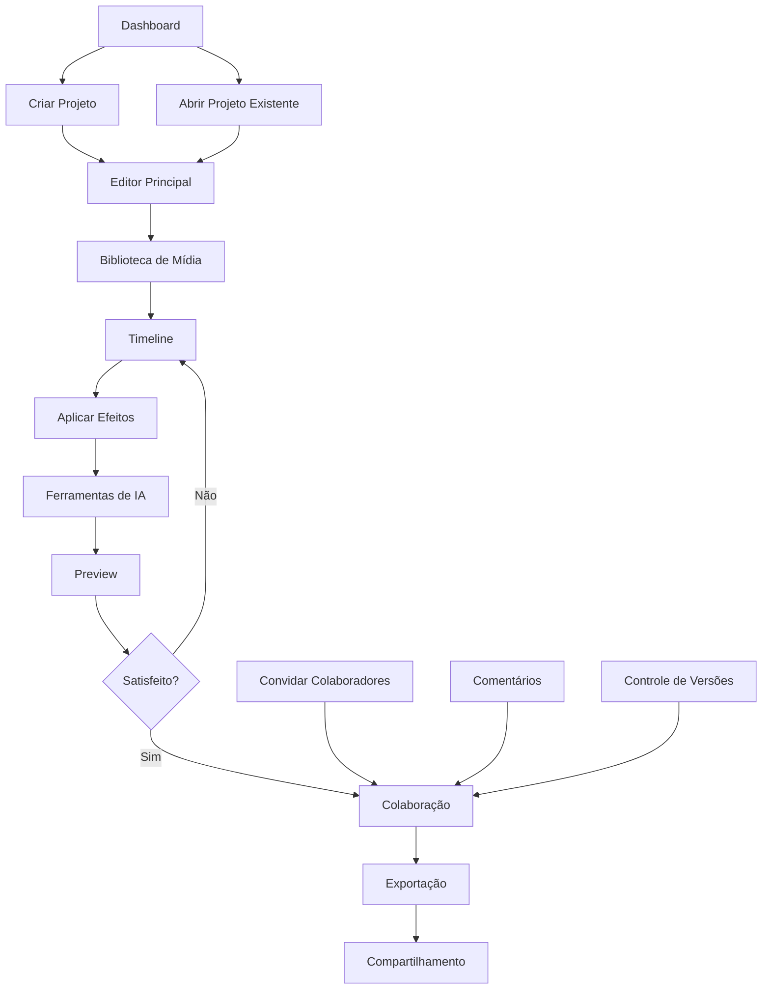

# Documento de Requisitos do Produto - Editor de Vídeo Avançado

## 1. Visão Geral do Produto

O Editor de Vídeo Avançado é uma plataforma web moderna que oferece capacidades profissionais de edição de vídeo diretamente no navegador, utilizando tecnologias de ponta como WebAssembly, IA e colaboração em tempo real. O produto visa democratizar a edição de vídeo profissional, tornando-a acessível para criadores de conteúdo, empresas e profissionais de marketing sem a necessidade de software desktop complexo.

O editor resolve os principais problemas de editores web tradicionais: performance limitada, falta de recursos profissionais e dificuldade de colaboração, oferecendo uma experiência fluida e poderosa que rivaliza com softwares desktop.

## 2. Funcionalidades Principais

### 2.1 Papéis de Usuário

| Papel | Método de Registro | Permissões Principais |
|-------|-------------------|----------------------|
| Usuário Gratuito | Email + senha | Projetos limitados (3), exportação 720p, 5GB storage |
| Usuário Pro | Upgrade via pagamento | Projetos ilimitados, exportação 4K, 100GB storage, IA avançada |
| Usuário Enterprise | Convite corporativo | Todos os recursos Pro + colaboração avançada, SSO, analytics |
| Administrador | Convite do sistema | Gerenciamento de usuários, analytics globais, configurações |

### 2.2 Módulos de Funcionalidades

Nossos requisitos do editor de vídeo consistem nas seguintes páginas principais:

1. **Dashboard**: visão geral de projetos, templates, biblioteca de mídia, analytics pessoais
2. **Editor Principal**: timeline profissional, preview em tempo real, ferramentas de edição, biblioteca de efeitos
3. **Biblioteca de Mídia**: upload de arquivos, organização por pastas, busca inteligente, preview rápido
4. **Ferramentas de IA**: edição automática, correção de cor, detecção de cenas, geração de legendas
5. **Colaboração**: comentários em tempo real, controle de versões, permissões granulares
6. **Exportação**: múltiplos formatos, configurações avançadas, preview antes da exportação
7. **Configurações**: preferências do usuário, configurações de projeto, integrações

### 2.3 Detalhes das Páginas

| Nome da Página | Nome do Módulo | Descrição da Funcionalidade |
|----------------|----------------|-----------------------------|
| Dashboard | Visão Geral de Projetos | Exibir projetos recentes, criar novo projeto, templates pré-definidos, estatísticas de uso |
| Dashboard | Biblioteca Rápida | Acesso rápido a mídia recente, busca global, favoritos |
| Editor Principal | Timeline Profissional | Múltiplas tracks de vídeo/áudio, zoom temporal, marcadores, keyframes |
| Editor Principal | Preview em Tempo Real | Reprodução fluida, controles de playback, fullscreen, picture-in-picture |
| Editor Principal | Ferramentas de Edição | Cortar, dividir, mover, redimensionar, rotacionar, ajustar velocidade |
| Editor Principal | Biblioteca de Efeitos | Filtros, transições, títulos, overlays, efeitos de áudio |
| Editor Principal | Painel de Propriedades | Ajustes de cor, áudio, transformações, animações |
| Biblioteca de Mídia | Upload e Organização | Drag & drop, upload em lote, pastas, tags, metadados |
| Biblioteca de Mídia | Preview e Busca | Thumbnails, preview rápido, busca por nome/tipo/data |
| Ferramentas de IA | Edição Automática | Detectar highlights, cortes automáticos, sincronização de áudio |
| Ferramentas de IA | Correção Automática | Correção de cor, estabilização, redução de ruído |
| Ferramentas de IA | Análise de Conteúdo | Detecção de objetos, reconhecimento facial, análise de sentimento |
| Colaboração | Comentários em Tempo Real | Adicionar comentários, responder, resolver, notificações |
| Colaboração | Controle de Versões | Histórico de mudanças, comparar versões, restaurar |
| Colaboração | Gerenciamento de Permissões | Convidar usuários, definir papéis, controlar acesso |
| Exportação | Configurações de Saída | Resolução, codec, bitrate, formato, otimizações por plataforma |
| Exportação | Preview e Renderização | Preview final, fila de renderização, progresso em tempo real |
| Configurações | Preferências do Usuário | Tema, atalhos, configurações de performance, notificações |
| Configurações | Integrações | YouTube, Vimeo, Google Drive, Dropbox, redes sociais |

## 3. Processo Principal

### Fluxo do Usuário Regular

1. **Início**: Usuário acessa o dashboard e visualiza projetos existentes
2. **Criação**: Cria novo projeto ou seleciona template
3. **Upload**: Faz upload de mídia para a biblioteca
4. **Edição**: Arrasta mídia para timeline e aplica edições
5. **Refinamento**: Usa ferramentas de IA para melhorar automaticamente
6. **Colaboração**: Convida outros usuários para revisar (se necessário)
7. **Exportação**: Configura e exporta o vídeo final
8. **Compartilhamento**: Publica diretamente nas plataformas integradas

### Fluxo de Colaboração

1. **Convite**: Proprietário convida colaboradores
2. **Acesso**: Colaboradores acessam projeto com permissões específicas
3. **Edição Simultânea**: Múltiplos usuários editam em tempo real
4. **Comentários**: Adicionam feedback e sugestões
5. **Aprovação**: Processo de revisão e aprovação
6. **Finalização**: Versão final aprovada e exportada

## 4. Design da Interface do Usuário

### 4.1 Estilo de Design

- **Cores Primárias**: 
  - Azul Principal: #2563EB (interface)
  - Azul Escuro: #1E40AF (elementos ativos)
  - Cinza Escuro: #1F2937 (background principal)
- **Cores Secundárias**:
  - Verde Sucesso: #10B981
  - Vermelho Erro: #EF4444
  - Amarelo Aviso: #F59E0B
  - Roxo IA: #8B5CF6
- **Estilo de Botões**: Rounded corners (8px), gradientes sutis, estados hover/active bem definidos
- **Tipografia**: Inter (primary), JetBrains Mono (código), tamanhos 12px-24px
- **Layout**: Dark theme profissional, sidebar colapsável, painéis redimensionáveis
- **Ícones**: Lucide React (outline style), tamanho 16px-24px, consistência visual

### 4.2 Visão Geral do Design das Páginas

| Nome da Página | Nome do Módulo | Elementos da UI |
|----------------|----------------|----------------|
| Dashboard | Visão Geral | Grid de cards responsivo, sidebar de navegação, header com busca global, cores #1F2937 background |
| Dashboard | Projetos Recentes | Cards com thumbnails, progress bars, badges de status, hover effects suaves |
| Editor Principal | Timeline | Dark theme (#111827), tracks coloridas por tipo, rulers precisos, zoom controls |
| Editor Principal | Preview | Player centralizado, controles customizados, fullscreen toggle, aspect ratio indicators |
| Editor Principal | Ferramentas | Toolbar flutuante, tooltips informativos, atalhos de teclado, ícones intuitivos |
| Editor Principal | Propriedades | Painel lateral direito, sliders responsivos, color pickers, real-time preview |
| Biblioteca de Mídia | Grid de Mídia | Masonry layout, thumbnails 150x150px, overlay com informações, drag indicators |
| Biblioteca de Mídia | Upload Zone | Drag & drop area destacada, progress bars, preview instantâneo, error states |
| Ferramentas de IA | Painel de IA | Cards com ícones distintivos, progress indicators, before/after comparisons |
| Colaboração | Comentários | Thread view, avatars circulares, timestamps relativos, status indicators |
| Colaboração | Usuários Online | Lista de avatares, cursor indicators na timeline, presence awareness |
| Exportação | Configurações | Form bem estruturado, presets populares, preview em tempo real, estimativas |
| Exportação | Progresso | Progress bar detalhada, logs de renderização, cancel/pause options |

### 4.3 Responsividade

O produto é **desktop-first** com adaptações cuidadosas para tablets. A edição de vídeo profissional requer tela grande, mas oferecemos:

- **Desktop (1920px+)**: Experiência completa com todos os painéis
- **Laptop (1366px-1919px)**: Painéis colapsáveis, timeline otimizada
- **Tablet (768px-1365px)**: Interface simplificada, gestos touch otimizados
- **Mobile (< 768px)**: Apenas visualização e comentários, não edição completa

**Otimizações Touch**:
- Botões maiores (44px mínimo) em dispositivos touch
- Gestos de pinch-to-zoom na timeline
- Swipe para navegar entre ferramentas
- Long-press para menu contextual

## 5. Funcionalidades Avançadas

### 5.1 Inteligência Artificial

**Edição Automática**:
- Detecção automática de highlights em vídeos longos
- Cortes inteligentes baseados em análise de áudio
- Sincronização automática de múltiplas câmeras
- Geração automática de thumbnails atraentes

**Correção Automática**:
- Correção de cor baseada em machine learning
- Estabilização de vídeo em tempo real
- Redução de ruído de áudio inteligente
- Upscaling de resolução com IA

**Análise de Conteúdo**:
- Reconhecimento facial para tracking automático
- Detecção de objetos para efeitos contextuais
- Análise de sentimento para música automática
- Geração automática de legendas com alta precisão

### 5.2 Colaboração Avançada

**Tempo Real**:
- Edição simultânea com conflict resolution
- Cursores de usuários visíveis na timeline
- Chat integrado com menções
- Notificações push para mudanças importantes

**Controle de Versões**:
- Snapshots automáticos a cada 5 minutos
- Branching para experimentação
- Merge de mudanças conflitantes
- Histórico visual de mudanças

**Permissões Granulares**:
- View-only, Comment-only, Edit, Admin
- Controle por seção (timeline, effects, export)
- Aprovação obrigatória para mudanças críticas
- Audit log completo de ações

### 5.3 Performance e Otimização

**WebAssembly**:
- FFmpeg.wasm para processamento nativo
- Codecs otimizados para web
- Processamento paralelo com Web Workers
- Memory management eficiente

**Cache Inteligente**:
- Cache de frames para scrubbing fluido
- Preload inteligente baseado em uso
- Compressão adaptativa por qualidade de rede
- Sincronização offline com conflict resolution

**Streaming**:
- Progressive loading de vídeos grandes
- Adaptive bitrate para preview
- WebRTC para colaboração em tempo real
- CDN integration para assets globais

## 6. Integrações e Exportação

### 6.1 Formatos de Exportação

**Vídeo**:
- MP4 (H.264, H.265/HEVC)
- WebM (VP9, AV1)
- MOV (ProRes para profissionais)
- Resoluções: 480p, 720p, 1080p, 4K, 8K

**Áudio**:
- MP3, AAC, FLAC
- Configurações de bitrate personalizáveis
- Normalização automática de volume

**Otimizações por Plataforma**:
- YouTube: Configurações otimizadas para algoritmo
- Instagram: Formatos Stories, Reels, IGTV
- TikTok: Aspect ratio e duração otimizados
- LinkedIn: Configurações profissionais

### 6.2 Integrações de Terceiros

**Armazenamento**:
- Google Drive, Dropbox, OneDrive
- Import/export direto
- Sincronização automática de projetos

**Publicação**:
- YouTube, Vimeo, Wistia
- Upload direto com metadados
- Agendamento de publicação

**Assets**:
- Unsplash, Pexels para imagens
- Freesound, Epidemic Sound para áudio
- Lottie Files para animações

## 7. Métricas de Sucesso

### 7.1 KPIs Principais

**Engajamento**:
- Tempo médio de sessão: > 45 minutos
- Projetos completados por usuário/mês: > 3
- Taxa de retenção 30 dias: > 60%
- NPS (Net Promoter Score): > 50

**Performance**:
- Tempo de carregamento inicial: < 3 segundos
- Latência de colaboração: < 100ms
- Taxa de erro em exportação: < 2%
- Uptime do sistema: > 99.9%

**Conversão**:
- Trial para pago: > 15%
- Upgrade para Pro: > 25%
- Churn mensal: < 5%
- Revenue per user: crescimento 20% trimestral

### 7.2 Métricas de Qualidade

**Usabilidade**:
- Task completion rate: > 90%
- Time to first export: < 10 minutos
- Support tickets per user: < 0.1/mês
- User satisfaction score: > 4.5/5

**Técnicas**:
- Core Web Vitals: todos verdes
- Error rate: < 0.1%
- API response time: < 200ms
- Video processing speed: < 2x real-time

## 8. Roadmap de Funcionalidades

### Versão 1.0 (MVP) - Q1 2024
- [ ] Editor básico com timeline
- [ ] Upload e organização de mídia
- [ ] Efeitos e transições essenciais
- [ ] Exportação em formatos principais
- [ ] Colaboração básica

### Versão 1.5 - Q2 2024
- [ ] Ferramentas de IA básicas
- [ ] Integrações com plataformas principais
- [ ] Performance otimizada
- [ ] Mobile responsiveness

### Versão 2.0 - Q3 2024
- [ ] IA avançada para edição automática
- [ ] Colaboração em tempo real completa
- [ ] Analytics e insights
- [ ] API pública para integrações

### Versão 2.5 - Q4 2024
- [ ] Recursos enterprise
- [ ] White-label solutions
- [ ] Advanced color grading
- [ ] Multi-camera editing

Este documento de requisitos fornece a base completa para desenvolver um editor de vídeo web de classe mundial, competitivo com as melhores soluções do mercado e preparado para o futuro da edição de vídeo colaborativa.