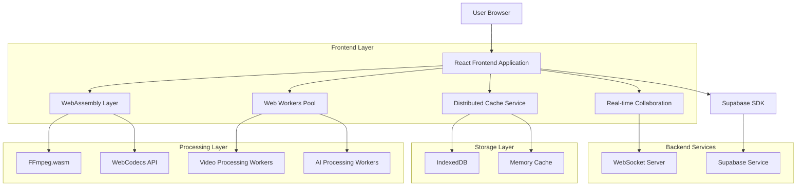
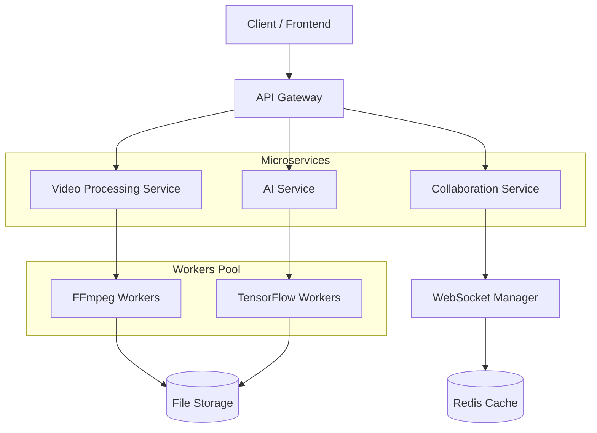
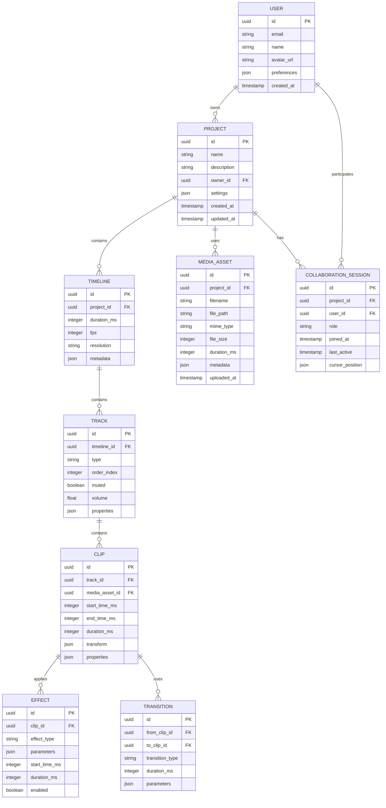

# Arquitetura Técnica - Editor de Vídeo Avançado

## 1. Arquitetura de Design



## 2. Descrição de Tecnologias

- **Frontend**: React@18 + TypeScript + Tailwind CSS + Vite
- **Processamento de Vídeo**: FFmpeg.wasm + WebCodecs API + WebAssembly
- **Workers**: Web Workers para processamento paralelo
- **IA**: TensorFlow.js + MediaPipe para análise automática
- **Colaboração**: WebSocket + Socket.io para tempo real
- **Cache**: IndexedDB + Memory Cache + Distributed Cache Service
- **Backend**: Supabase (PostgreSQL + Auth + Storage)
- **Streaming**: WebRTC + HLS.js para preview em tempo real

## 3. Definições de Rotas

| Rota | Propósito |
|------|----------|
| /editor | Interface principal do editor de vídeo |
| /editor/timeline | Timeline profissional com múltiplas tracks |
| /editor/effects | Biblioteca de efeitos e transições |
| /editor/ai-tools | Ferramentas de IA para edição automática |
| /editor/collaboration | Painel de colaboração em tempo real |
| /editor/export | Interface de exportação e renderização |
| /editor/projects | Gerenciamento de projetos |
| /editor/media-library | Biblioteca de mídia e assets |

## 4. Definições de API

### 4.1 Core API

**Processamento de Vídeo**
```
POST /api/video/process
```

Request:
| Param Name | Param Type | isRequired | Description |
|------------|------------|------------|-------------|
| videoFile | File | true | Arquivo de vídeo para processamento |
| operations | Array<Operation> | true | Lista de operações a serem aplicadas |
| quality | string | false | Qualidade de saída (low, medium, high, 4k) |

Response:
| Param Name | Param Type | Description |
|------------|------------|-------------|
| processId | string | ID único do processo |
| status | string | Status do processamento |
| progress | number | Progresso em porcentagem |

**IA para Edição Automática**
```
POST /api/ai/auto-edit
```

Request:
| Param Name | Param Type | isRequired | Description |
|------------|------------|------------|-------------|
| videoFile | File | true | Vídeo para análise |
| editType | string | true | Tipo de edição (highlights, cuts, color-correction) |
| preferences | Object | false | Preferências do usuário |

**Colaboração em Tempo Real**
```
WebSocket /ws/collaboration/:projectId
```

Events:
- `timeline-update`: Atualização da timeline
- `user-cursor`: Posição do cursor de outros usuários
- `comment-added`: Novo comentário adicionado
- `effect-applied`: Efeito aplicado por outro usuário

## 5. Arquitetura do Servidor



## 6. Modelo de Dados

### 6.1 Definição do Modelo de Dados



### 6.2 Data Definition Language

**Tabela de Projetos**
```sql
-- Criar tabela de projetos
CREATE TABLE projects (
    id UUID PRIMARY KEY DEFAULT gen_random_uuid(),
    name VARCHAR(255) NOT NULL,
    description TEXT,
    owner_id UUID REFERENCES auth.users(id) ON DELETE CASCADE,
    settings JSONB DEFAULT '{}',
    created_at TIMESTAMP WITH TIME ZONE DEFAULT NOW(),
    updated_at TIMESTAMP WITH TIME ZONE DEFAULT NOW()
);

-- Criar índices
CREATE INDEX idx_projects_owner_id ON projects(owner_id);
CREATE INDEX idx_projects_created_at ON projects(created_at DESC);

-- Permissões
GRANT SELECT ON projects TO anon;
GRANT ALL PRIVILEGES ON projects TO authenticated;
```

**Tabela de Timeline**
```sql
CREATE TABLE timelines (
    id UUID PRIMARY KEY DEFAULT gen_random_uuid(),
    project_id UUID REFERENCES projects(id) ON DELETE CASCADE,
    duration_ms INTEGER DEFAULT 0,
    fps INTEGER DEFAULT 30,
    resolution VARCHAR(20) DEFAULT '1920x1080',
    metadata JSONB DEFAULT '{}',
    created_at TIMESTAMP WITH TIME ZONE DEFAULT NOW()
);

CREATE INDEX idx_timelines_project_id ON timelines(project_id);
GRANT ALL PRIVILEGES ON timelines TO authenticated;
```

**Tabela de Tracks**
```sql
CREATE TABLE tracks (
    id UUID PRIMARY KEY DEFAULT gen_random_uuid(),
    timeline_id UUID REFERENCES timelines(id) ON DELETE CASCADE,
    type VARCHAR(50) NOT NULL CHECK (type IN ('video', 'audio', 'text', 'effect')),
    order_index INTEGER NOT NULL,
    muted BOOLEAN DEFAULT FALSE,
    volume FLOAT DEFAULT 1.0,
    properties JSONB DEFAULT '{}',
    created_at TIMESTAMP WITH TIME ZONE DEFAULT NOW()
);

CREATE INDEX idx_tracks_timeline_id ON tracks(timeline_id);
CREATE INDEX idx_tracks_order ON tracks(timeline_id, order_index);
GRANT ALL PRIVILEGES ON tracks TO authenticated;
```

**Tabela de Clipes**
```sql
CREATE TABLE clips (
    id UUID PRIMARY KEY DEFAULT gen_random_uuid(),
    track_id UUID REFERENCES tracks(id) ON DELETE CASCADE,
    media_asset_id UUID REFERENCES media_assets(id) ON DELETE SET NULL,
    start_time_ms INTEGER NOT NULL,
    end_time_ms INTEGER NOT NULL,
    duration_ms INTEGER NOT NULL,
    transform JSONB DEFAULT '{}',
    properties JSONB DEFAULT '{}',
    created_at TIMESTAMP WITH TIME ZONE DEFAULT NOW()
);

CREATE INDEX idx_clips_track_id ON clips(track_id);
CREATE INDEX idx_clips_timeline ON clips(track_id, start_time_ms);
GRANT ALL PRIVILEGES ON clips TO authenticated;
```

**Tabela de Assets de Mídia**
```sql
CREATE TABLE media_assets (
    id UUID PRIMARY KEY DEFAULT gen_random_uuid(),
    project_id UUID REFERENCES projects(id) ON DELETE CASCADE,
    filename VARCHAR(255) NOT NULL,
    file_path TEXT NOT NULL,
    mime_type VARCHAR(100) NOT NULL,
    file_size BIGINT NOT NULL,
    duration_ms INTEGER,
    metadata JSONB DEFAULT '{}',
    uploaded_at TIMESTAMP WITH TIME ZONE DEFAULT NOW()
);

CREATE INDEX idx_media_assets_project_id ON media_assets(project_id);
CREATE INDEX idx_media_assets_type ON media_assets(mime_type);
GRANT ALL PRIVILEGES ON media_assets TO authenticated;
```

**Tabela de Efeitos**
```sql
CREATE TABLE effects (
    id UUID PRIMARY KEY DEFAULT gen_random_uuid(),
    clip_id UUID REFERENCES clips(id) ON DELETE CASCADE,
    effect_type VARCHAR(100) NOT NULL,
    parameters JSONB DEFAULT '{}',
    start_time_ms INTEGER DEFAULT 0,
    duration_ms INTEGER,
    enabled BOOLEAN DEFAULT TRUE,
    created_at TIMESTAMP WITH TIME ZONE DEFAULT NOW()
);

CREATE INDEX idx_effects_clip_id ON effects(clip_id);
GRANT ALL PRIVILEGES ON effects TO authenticated;
```

**Tabela de Transições**
```sql
CREATE TABLE transitions (
    id UUID PRIMARY KEY DEFAULT gen_random_uuid(),
    from_clip_id UUID REFERENCES clips(id) ON DELETE CASCADE,
    to_clip_id UUID REFERENCES clips(id) ON DELETE CASCADE,
    transition_type VARCHAR(100) NOT NULL,
    duration_ms INTEGER NOT NULL,
    parameters JSONB DEFAULT '{}',
    created_at TIMESTAMP WITH TIME ZONE DEFAULT NOW()
);

CREATE INDEX idx_transitions_clips ON transitions(from_clip_id, to_clip_id);
GRANT ALL PRIVILEGES ON transitions TO authenticated;
```

**Tabela de Sessões de Colaboração**
```sql
CREATE TABLE collaboration_sessions (
    id UUID PRIMARY KEY DEFAULT gen_random_uuid(),
    project_id UUID REFERENCES projects(id) ON DELETE CASCADE,
    user_id UUID REFERENCES auth.users(id) ON DELETE CASCADE,
    role VARCHAR(50) DEFAULT 'viewer' CHECK (role IN ('owner', 'editor', 'viewer')),
    joined_at TIMESTAMP WITH TIME ZONE DEFAULT NOW(),
    last_active TIMESTAMP WITH TIME ZONE DEFAULT NOW(),
    cursor_position JSONB DEFAULT '{}'
);

CREATE INDEX idx_collaboration_project_id ON collaboration_sessions(project_id);
CREATE INDEX idx_collaboration_user_id ON collaboration_sessions(user_id);
GRANT ALL PRIVILEGES ON collaboration_sessions TO authenticated;
```

**Dados Iniciais**
```sql
-- Inserir tipos de efeitos padrão
INSERT INTO effect_types (name, category, parameters_schema) VALUES
('fade_in', 'transition', '{"duration": {"type": "number", "default": 1000}}'),
('fade_out', 'transition', '{"duration": {"type": "number", "default": 1000}}'),
('blur', 'filter', '{"intensity": {"type": "number", "default": 5}}'),
('brightness', 'color', '{"value": {"type": "number", "default": 1.0}}'),
('contrast', 'color', '{"value": {"type": "number", "default": 1.0}}'),
('saturation', 'color', '{"value": {"type": "number", "default": 1.0}}');

-- Inserir tipos de transições padrão
INSERT INTO transition_types (name, category, default_duration) VALUES
('cut', 'basic', 0),
('fade', 'basic', 500),
('dissolve', 'basic', 1000),
('slide_left', 'slide', 800),
('slide_right', 'slide', 800),
('zoom_in', 'zoom', 1000),
('zoom_out', 'zoom', 1000);
```

## 7. Especificações Técnicas Avançadas

### 7.1 WebAssembly Integration

```typescript
// FFmpeg.wasm integration
interface VideoProcessor {
  loadFFmpeg(): Promise<void>;
  processVideo(input: File, operations: VideoOperation[]): Promise<Blob>;
  extractFrames(video: File, fps: number): Promise<ImageData[]>;
  generateThumbnails(video: File, count: number): Promise<string[]>;
}

interface VideoOperation {
  type: 'trim' | 'resize' | 'filter' | 'encode';
  parameters: Record<string, any>;
  startTime?: number;
  duration?: number;
}
```

### 7.2 WebCodecs API

```typescript
// WebCodecs for real-time processing
interface WebCodecsProcessor {
  encodeFrame(frame: VideoFrame, config: VideoEncoderConfig): Promise<EncodedVideoChunk>;
  decodeChunk(chunk: EncodedVideoChunk): Promise<VideoFrame>;
  createEncoder(config: VideoEncoderConfig): VideoEncoder;
  createDecoder(config: VideoDecoderConfig): VideoDecoder;
}
```

### 7.3 AI Processing

```typescript
// TensorFlow.js integration for AI features
interface AIProcessor {
  detectScenes(video: File): Promise<SceneDetection[]>;
  autoColorCorrection(frame: ImageData): Promise<ImageData>;
  objectTracking(video: File, object: BoundingBox): Promise<TrackingData[]>;
  generateCaptions(audio: AudioBuffer): Promise<Caption[]>;
  smartCrop(frame: ImageData, aspectRatio: string): Promise<CropData>;
}

interface SceneDetection {
  timestamp: number;
  confidence: number;
  sceneType: 'action' | 'dialogue' | 'landscape' | 'closeup';
}
```

### 7.4 Real-time Collaboration

```typescript
// WebSocket events for collaboration
interface CollaborationEvents {
  'timeline-update': TimelineUpdateEvent;
  'user-cursor': CursorPositionEvent;
  'clip-modified': ClipModificationEvent;
  'effect-applied': EffectApplicationEvent;
  'comment-added': CommentEvent;
  'user-joined': UserJoinedEvent;
  'user-left': UserLeftEvent;
}

interface TimelineUpdateEvent {
  userId: string;
  projectId: string;
  changes: TimelineChange[];
  timestamp: number;
}
```

### 7.5 Performance Optimizations

```typescript
// Web Workers for heavy processing
interface WorkerPool {
  createWorker(type: 'video' | 'audio' | 'ai'): Worker;
  distributeTask(task: ProcessingTask): Promise<ProcessingResult>;
  getAvailableWorkers(): Worker[];
  terminateWorker(workerId: string): void;
}

// Streaming and progressive loading
interface StreamingManager {
  createVideoStream(file: File): ReadableStream<Uint8Array>;
  progressiveLoad(url: string, onProgress: (progress: number) => void): Promise<ArrayBuffer>;
  createPreviewStream(timeline: Timeline): MediaStream;
}
```

## 8. Integração com Serviços Existentes

### 8.1 Distributed Cache Service

```typescript
// Integração com o cache distribuído existente
interface VideoCacheStrategy {
  cacheProcessedVideo(videoId: string, data: Blob): Promise<void>;
  getCachedVideo(videoId: string): Promise<Blob | null>;
  cacheFrames(videoId: string, frames: ImageData[]): Promise<void>;
  getCachedFrames(videoId: string): Promise<ImageData[] | null>;
  invalidateCache(videoId: string): Promise<void>;
}
```

### 8.2 Intelligent Compression

```typescript
// Integração com o serviço de compressão inteligente
interface VideoCompressionService {
  compressForWeb(video: File, quality: 'low' | 'medium' | 'high'): Promise<Blob>;
  adaptiveBitrate(video: File): Promise<AdaptiveBitrateResult>;
  optimizeForPlatform(video: File, platform: 'youtube' | 'instagram' | 'tiktok'): Promise<Blob>;
}
```

## 9. Roadmap de Implementação

### Fase 1 (Semanas 1-4): Fundação
- [ ] Configuração do WebAssembly e FFmpeg.wasm
- [ ] Implementação básica da WebCodecs API
- [ ] Timeline profissional com múltiplas tracks
- [ ] Sistema de cache para vídeos
- [ ] Interface básica do editor

### Fase 2 (Semanas 5-8): Funcionalidades Avançadas
- [ ] Integração com IA para edição automática
- [ ] Sistema de colaboração em tempo real
- [ ] Biblioteca de efeitos e transições
- [ ] Otimizações de performance com Web Workers
- [ ] Sistema de exportação

### Fase 3 (Semanas 9-12): Polimento e Integração
- [ ] Integração completa com serviços existentes
- [ ] Testes de performance e otimização
- [ ] Interface de usuário refinada
- [ ] Documentação e treinamento
- [ ] Deploy e monitoramento

## 10. Métricas de Performance

### 10.1 Benchmarks Esperados
- **Tempo de carregamento inicial**: < 3 segundos
- **Processamento de vídeo 1080p**: < 2x tempo real
- **Latência de colaboração**: < 100ms
- **Uso de memória**: < 2GB para projetos médios
- **Taxa de quadros na timeline**: 60fps

### 10.2 Monitoramento
- Performance de processamento de vídeo
- Latência de rede para colaboração
- Uso de recursos do navegador
- Taxa de erro em operações críticas
- Satisfação do usuário (NPS)

Este documento técnico fornece a base completa para implementar um editor de vídeo avançado e moderno, incorporando as melhores práticas de 2024/2025 e tecnologias de ponta para processamento de vídeo na web.