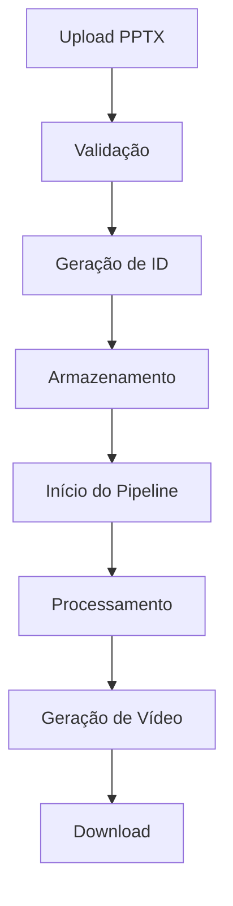

# Documentação Técnica - StudioTreiax Pipeline PPTX → Vídeo

## Visão Geral

O StudioTreiax implementa um pipeline completo para conversão de apresentações PowerPoint (PPTX) em vídeos, com interface moderna, monitoramento em tempo real e tratamento robusto de erros.

## Arquitetura do Sistema

### Backend (API)

#### 1. Rotas de Upload (`/api/routes/upload.ts`)
- **Endpoint**: `/api/upload/pptx`
- **Método**: POST
- **Funcionalidades**:
  - Upload de arquivos PPTX/PPT
  - Validação de tipo de arquivo
  - Geração de ID único para cada upload
  - Armazenamento temporário
  - Retorno de dados simulados de slides

#### 2. Pipeline Routes (`/api/routes/pipeline.ts`)
- **Endpoints**:
  - `POST /api/pipeline/start` - Inicia o pipeline de conversão
  - `GET /api/pipeline/status/:jobId` - Consulta status do job
  - `GET /api/pipeline/jobs` - Lista jobs do usuário

#### 3. Integração no App Principal (`/api/app.ts`)
```typescript
import pipelineRoutes from './routes/pipeline.js';
app.use('/api/pipeline', pipelineRoutes);
```

### Frontend

#### 1. Configuração de API (`/src/lib/api.ts`)
```typescript
pipeline: {
  start: '/api/pipeline/start',
  status: '/api/pipeline/status',
  jobs: '/api/pipeline/jobs'
}
```

#### 2. Serviço de API (`/src/services/pipelineApiService.ts`)
- **Funcionalidades**:
  - `startPipeline()` - Inicia conversão
  - `getJobStatus()` - Consulta status
  - `monitorJob()` - Monitoramento contínuo
  - `getUserJobs()` - Lista histórico

#### 3. Interface Principal (`/src/components/pipeline/CompletePipelineInterface.tsx`)
- **Recursos**:
  - Upload drag-and-drop
  - Monitoramento em tempo real
  - Visualização de progresso
  - Histórico de conversões
  - Estatísticas de uso

## Componentes de Suporte

### 1. Error Boundary (`/src/components/error-boundary/PipelineErrorBoundary.tsx`)
```typescript
interface ErrorBoundaryState {
  hasError: boolean;
  error: Error | null;
  errorInfo: ErrorInfo | null;
  errorId: string;
}
```

**Funcionalidades**:
- Captura de erros React
- Logging detalhado
- Interface de recuperação
- Retry automático
- Relatório de erros

### 2. Performance Monitor (`/src/components/monitoring/PerformanceMonitor.tsx`)
```typescript
interface PerformanceMetrics {
  coreWebVitals: CoreWebVitals;
  runtime: RuntimeMetrics;
  network: NetworkMetrics;
  pipeline: PipelineMetrics;
}
```

**Métricas Monitoradas**:
- Core Web Vitals (LCP, FID, CLS)
- Performance de runtime
- Métricas de rede
- Estatísticas do pipeline

## Fluxo de Dados

### 1. Upload e Processamento


### 2. Estados do Pipeline
```typescript
type PipelineStage = 
  | 'upload'
  | 'processing'
  | 'ai-analysis'
  | 'video-generation'
  | 'completed'
  | 'error';
```

## Interfaces e Tipos

### 1. Pipeline Job
```typescript
interface PipelineJob {
  id: string;
  userId: string;
  fileName: string;
  status: 'pending' | 'processing' | 'completed' | 'error';
  currentStage: PipelineStage;
  progress: number;
  stages: PipelineStage[];
  createdAt: Date;
  updatedAt: Date;
  result?: {
    videoUrl: string;
    duration: number;
    size: number;
  };
  error?: string;
}
```

### 2. Performance Metrics
```typescript
interface CoreWebVitals {
  lcp: number;
  fid: number;
  cls: number;
}

interface PipelineMetrics {
  totalJobs: number;
  completedJobs: number;
  averageProcessingTime: number;
  successRate: number;
}
```

## Configuração e Deploy

### 1. Dependências Backend
```json
{
  "express": "^4.18.0",
  "multer": "^1.4.5",
  "cors": "^2.8.5",
  "uuid": "^9.0.0"
}
```

### 2. Dependências Frontend
```json
{
  "react": "^18.0.0",
  "framer-motion": "^10.0.0",
  "lucide-react": "^0.263.0"
}
```

### 3. Estrutura de Diretórios
```
/api
  /routes
    - upload.ts
    - pipeline.ts
  - app.ts

/src
  /components
    /pipeline
      - CompletePipelineInterface.tsx
    /error-boundary
      - PipelineErrorBoundary.tsx
    /monitoring
      - PerformanceMonitor.tsx
  /services
    - pipelineApiService.ts
  /lib
    - api.ts

/demo-content
  - sample-presentation.pptx
  - README.md
```

## Monitoramento e Logs

### 1. Error Tracking
- Captura automática de erros
- Stack traces detalhados
- Context de erro com timestamp
- Retry automático para falhas temporárias

### 2. Performance Monitoring
- Métricas em tempo real
- Alertas de performance
- Histórico de métricas
- Exportação de dados

### 3. Pipeline Analytics
- Taxa de sucesso
- Tempo médio de processamento
- Distribuição de tipos de arquivo
- Estatísticas de uso

## Segurança

### 1. Validação de Arquivos
- Verificação de extensão
- Validação de MIME type
- Limite de tamanho de arquivo
- Sanitização de nomes

### 2. Rate Limiting
- Limite de uploads por usuário
- Throttling de API calls
- Proteção contra spam

### 3. Error Handling
- Não exposição de stack traces
- Logs seguros
- Sanitização de dados de erro

## Testes

### 1. Conteúdo de Demonstração
- `sample-presentation.pptx` - Arquivo de teste
- Casos de uso documentados
- Cenários de erro simulados

### 2. Testes Automatizados
- Validação de upload
- Testes de API
- Testes de componentes React
- Testes de performance

## Próximos Passos

### 1. Melhorias Planejadas
- [ ] Integração com serviços de IA reais
- [ ] Suporte a mais formatos
- [ ] Cache inteligente
- [ ] Processamento em batch

### 2. Otimizações
- [ ] Compressão de vídeo
- [ ] CDN para assets
- [ ] Database para persistência
- [ ] Queue system para jobs

---

*Documentação atualizada em: ${new Date().toLocaleDateString('pt-BR')}*
*Versão: 1.0.0*